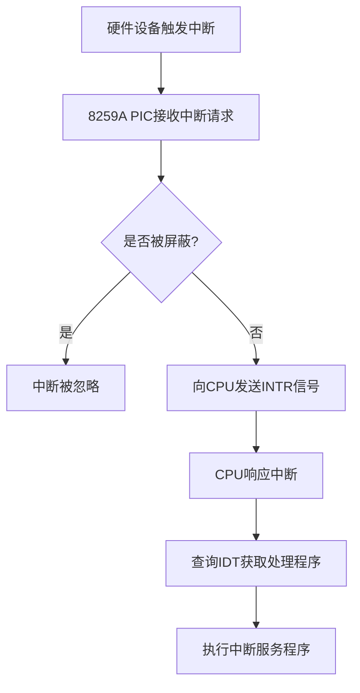

# 中断与异常处理

<cite>
**本文档引用的文件**  
- [system.h](file://include/asm/system.h)
- [traps.c](file://kernel/traps.c)
- [hd.c](file://kernel/hd.c)
- [exit.c](file://kernel/exit.c)
</cite>

## 目录
1. [引言](#引言)
2. [IDT与中断门宏定义](#idt与中断门宏定义)
3. 异常处理初始化
4. 外部中断（IRQ）处理机制
5. 硬件中断处理流程分析
6. 中断屏蔽与原子操作
7. 常见异常处理行为
8. 结论

## 引言
本文档全面解析Linux 0.01内核中的中断与异常处理框架。重点分析中断描述符表（IDT）的定义与初始化机制，阐述异常与外部中断的注册流程，并深入剖析硬件中断从触发到服务程序执行的完整路径。同时，讨论内核如何通过指令控制中断状态以保证关键代码段的原子性，以及对常见异常的默认处理策略。

## IDT与中断门宏定义

在`include/asm/system.h`中，通过宏定义实现了对中断描述符表（IDT）条目的设置。IDT是x86架构中用于管理中断和异常的核心数据结构，每个条目指向一个中断或异常处理程序。

核心宏定义如下：

- `set_intr_gate(n, addr)`：设置中断门，用于外部中断（IRQ），会自动禁用中断（IF=0）。
- `set_trap_gate(n, addr)`：设置陷阱门，用于异常处理，不会自动禁用中断。
- `set_system_gate(n, addr)`：设置系统陷阱门，允许用户态调用（DPL=3），用于系统调用等。

这些宏最终调用`_set_gate`，通过内联汇编构造IDT条目，设置类型、特权级（DPL）、段选择子和处理程序地址。

**Section sources**
- [system.h](file://include/asm/system.h#L32-L37)

## 异常处理初始化

`kernel/traps.c`中的`trap_init()`函数负责初始化IDT中的异常处理程序。该函数在内核启动早期被调用，为各种CPU异常设置对应的处理入口。

具体初始化包括：
- 除零错误（#DE, 向量0）：`divide_error`
- 调试异常（#DB, 向量1）：`debug`
- 断点异常（#BP, 向量3）：`int3`
- 溢出异常（#OF, 向量4）：`overflow`
- 边界检查异常（#BR, 向量5）：`bounds`
- 无效操作码（#UD, 向量6）：`invalid_op`
- 双重错误（#DF, 向量8）：`double_fault`
- 通用保护错误（#GP, 向量13）：`general_protection`
- 页错误（#PF, 向量14）：`page_fault`

对于向量3-5（int3、overflow、bounds），使用`set_system_gate`，允许用户态程序通过`int`指令主动触发，常用于调试和系统调用模拟。

**Section sources**
- [traps.c](file://kernel/traps.c#L169-L197)

## 外部中断（IRQ）处理机制

外部中断通过可编程中断控制器（PIC）引入，Linux 0.01使用`set_trap_gate`将IRQ处理程序注册到IDT的特定向量上。

以硬盘中断为例，在`kernel/hd.c`的`hd_init()`函数中：
```c
set_trap_gate(0x2E, &hd_interrupt);
```
此行将硬盘中断服务程序`hd_interrupt`注册到向量0x2E（即IRQ14）。同时，通过操作端口0x21和0xA1（主从PIC的IMR寄存器）解除对IRQ14和IRQ2的屏蔽，使能硬盘中断。



**Diagram sources**
- [hd.c](file://kernel/hd.c#L400-L413)

**Section sources**
- [hd.c](file://kernel/hd.c#L400-L413)

## 硬件中断处理流程分析

以硬盘IRQ14为例，完整处理流程如下：

1. **中断发生**：硬盘控制器完成I/O操作，向PIC发出中断请求。
2. **CPU响应**：CPU在当前指令执行完毕后，通过`INTA`周期从PIC获取中断向量（0x2E）。
3. **跳转处理**：CPU根据IDT[0x2E]的描述符，跳转到`hd_interrupt`入口。
4. **保存上下文**：在`asm.s`中，通过`pusha`、`pushf`等指令保存通用寄存器和标志寄存器。
5. **执行服务程序**：调用`do_hd()`，实际指向`read_intr`或`write_intr`，处理数据传输。
6. **唤醒等待进程**：完成I/O后，唤醒等待该缓冲区的进程。
7. **中断返回**：执行`iret`指令，恢复现场，返回被中断的程序。

该流程确保了设备I/O的异步处理，提高了系统效率。

**Section sources**
- [hd.c](file://kernel/hd.c#L300-L350)
- [traps.c](file://kernel/traps.c#L169-L197)

## 中断屏蔽与原子操作

内核使用`cli`（Clear Interrupt Flag）和`sti`（Set Interrupt Flag）指令控制中断状态，保证关键代码段的原子性。

在`include/asm/system.h`中定义为：
```c
#define sti() __asm__ ("sti"::)
#define cli() __asm__ ("cli"::)
```

典型应用场景：
- 修改共享数据结构（如缓冲区链表）时，使用`cli()`临时屏蔽中断，防止中断服务程序并发访问。
- 在`scheduling`期间，屏蔽中断以防止调度器被重入。
- 执行不可分割的操作序列，确保操作的完整性。

例如，在`hd.c`的`wait_on_buffer`中：
```c
cli();
while (bh->b_lock)
    sleep_on(&bh->b_wait);
sti();
```
确保了在检查和休眠之间不会被中断，避免竞态条件。

**Section sources**
- [system.h](file://include/asm/system.h#L3-L4)
- [hd.c](file://kernel/hd.c#L150-L155)

## 常见异常处理行为

内核对大多数异常的默认处理行为是调用`die()`函数，打印寄存器状态和堆栈信息，然后终止当前进程。

`die()`函数位于`traps.c`，其行为包括：
- 打印异常类型、EIP、EFLAGS、ESP、FS等寄存器值。
- 输出当前进程的LDT基址和界限。
- 若在用户态，打印用户栈内容。
- 调用`do_exit(11)`终止进程（信号11为SIGSEGV）。

例如，段错误（#GP）由`general_protection`处理，最终调用`do_general_protection`，传入`esp`和`error_code`，再调用`die()`。

这种处理方式确保了异常进程不会破坏系统稳定性，同时为调试提供关键信息。

**Section sources**
- [traps.c](file://kernel/traps.c#L40-L167)
- [exit.c](file://kernel/exit.c#L100-L135)

## 结论
Linux 0.01的中断与异常处理框架体现了早期内核的简洁与高效。通过IDT统一管理所有异常和中断，利用门描述符区分特权级和中断类型。`trap_init()`完成异常初始化，设备驱动通过`set_trap_gate`注册IRQ处理程序。内核通过`cli`/`sti`保障关键区的原子性，对异常采用“打印-终止”策略，确保系统健壮性。这一设计为后续版本的中断子系统奠定了基础。