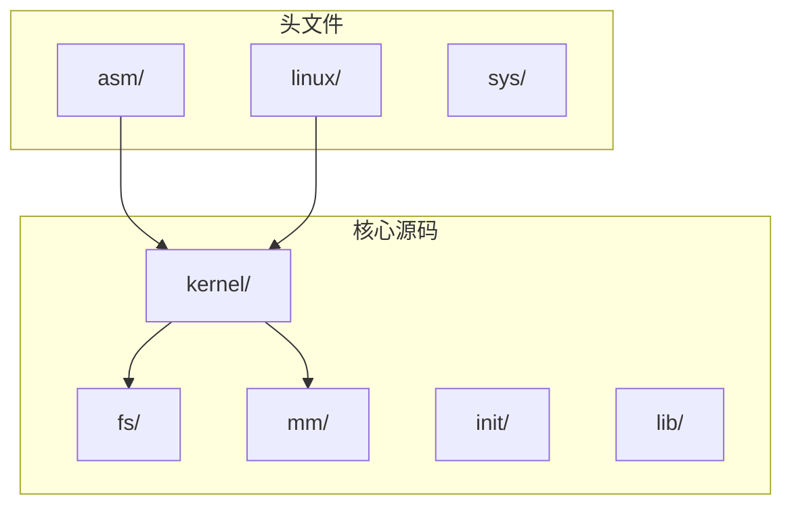
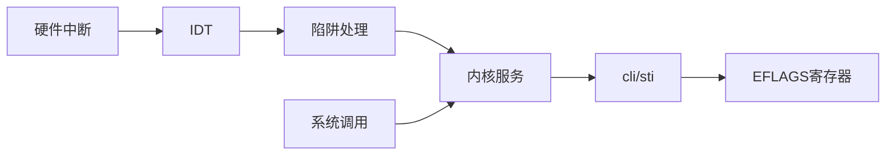
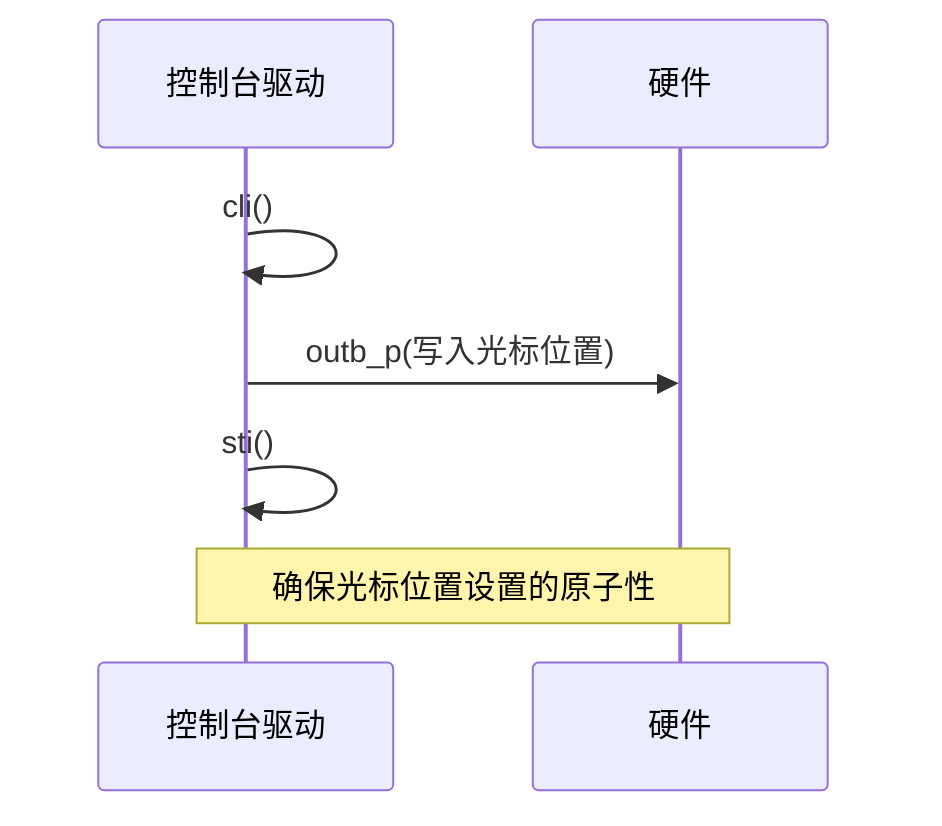
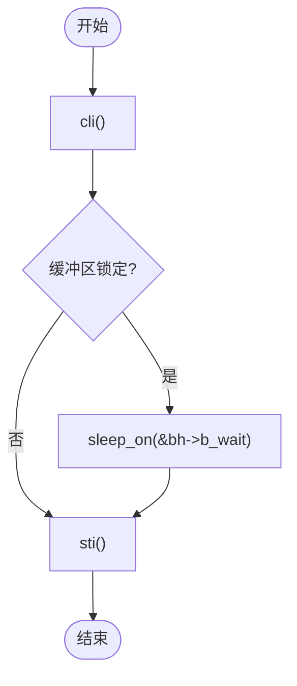
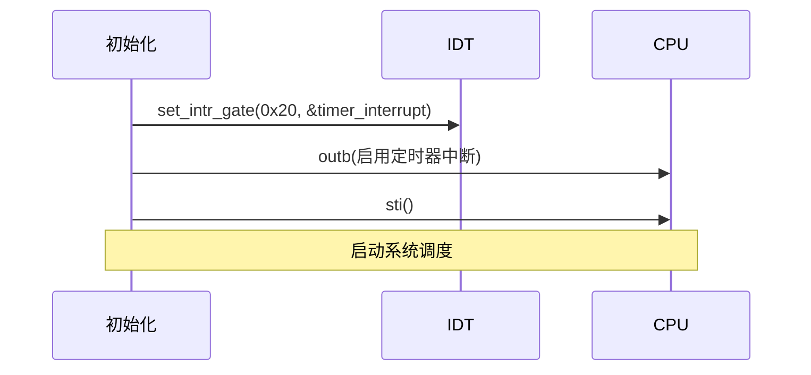
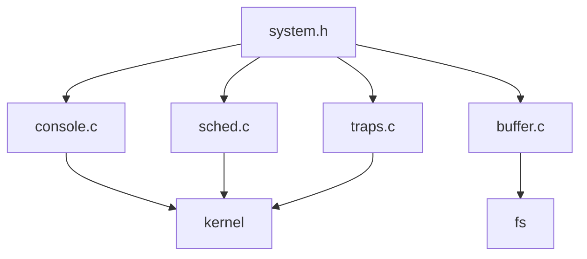

# 中断原子性与临界区保护

<cite>
**本文档引用的文件**
- [system.h](file://include/asm/system.h)
- [traps.c](file://kernel/traps.c)
- [console.c](file://kernel/console.c)
- [sched.c](file://kernel/sched.c)
- [buffer.c](file://fs/buffer.c)
</cite>

## 目录
1. [引言](#引言)
2. [项目结构](#项目结构)
3. [核心组件](#核心组件)
4. [架构概述](#架构概述)
5. [详细组件分析](#详细组件分析)
6. [依赖分析](#依赖分析)
7. [性能考虑](#性能考虑)
8. [故障排除指南](#故障排除指南)
9. [结论](#结论)

## 引言
本文档系统性地文档化 Linux-0.01 内核中的中断禁用与启用机制。重点分析 `cli()` 和 `sti()` 宏的实现原理，阐述其在保护内核关键代码段中的作用，并讨论长时间禁用中断的潜在影响。

## 项目结构
Linux-0.01 是一个精简的早期 Linux 内核版本，其项目结构清晰地划分了功能模块。核心的中断管理机制主要分布在 `include/asm/` 和 `kernel/` 目录下。



**Diagram sources**
- [include/asm/system.h](file://include/asm/system.h)
- [kernel/traps.c](file://kernel/traps.c)

**Section sources**
- [include/asm/system.h](file://include/asm/system.h)
- [kernel/traps.c](file://kernel/traps.c)

## 核心组件
本节分析内核中断管理的核心组件，包括中断开关宏、陷阱处理和调度器。

**Section sources**
- [include/asm/system.h](file://include/asm/system.h#L1-L66)
- [kernel/traps.c](file://kernel/traps.c#L1-L199)
- [kernel/sched.c](file://kernel/sched.c#L1-L254)

## 架构概述
Linux-0.01 的中断处理架构围绕硬件中断、陷阱和系统调用展开。`cli()` 和 `sti()` 宏是实现原子操作和临界区保护的基础。



**Diagram sources**
- [include/asm/system.h](file://include/asm/system.h#L1-L66)
- [kernel/traps.c](file://kernel/traps.c#L164-L197)

## 详细组件分析
本节深入分析 `cli()` 和 `sti()` 的具体实现及其在内核各部分的应用。

### cli/sti 宏的实现
`cli()` 和 `sti()` 宏在 `include/asm/system.h` 中通过内联汇编直接操作处理器的 EFLAGS 寄存器。

```mermaid
classDiagram
class cli_sti {
+cli() : void
+sti() : void
}
note right of cli_sti
cli() : 清除EFLAGS寄存器的IF位，禁用可屏蔽中断
sti() : 设置EFLAGS寄存器的IF位，启用可屏蔽中断
end note
```

**Diagram sources**
- [include/asm/system.h](file://include/asm/system.h#L1-L66)

**Section sources**
- [include/asm/system.h](file://include/asm/system.h#L1-L66)

### 临界区保护的应用
`cli()` 和 `sti()` 被广泛用于保护内核中的共享数据结构，防止竞态条件。

#### 控制台操作中的应用
在 `kernel/console.c` 中，`set_cursor()` 函数使用 `cli/sti` 来保护对视频内存的访问。



**Diagram sources**
- [kernel/console.c](file://kernel/console.c#L239-L244)

#### 缓冲区缓存中的应用
在 `fs/buffer.c` 中，`wait_on_buffer()` 函数使用 `cli/sti` 来保护对缓冲区锁的检查。



**Diagram sources**
- [fs/buffer.c](file://fs/buffer.c#L30-L33)

#### 调度器中的应用
在 `kernel/sched.c` 中，`sched_init()` 函数在设置中断门后启用中断。



**Diagram sources**
- [kernel/sched.c](file://kernel/sched.c#L246-L254)

## 依赖分析
`cli()` 和 `sti()` 宏是内核底层同步机制的基础，被多个核心子系统所依赖。



**Diagram sources**
- [include/asm/system.h](file://include/asm/system.h)
- [kernel/console.c](file://kernel/console.c)
- [fs/buffer.c](file://fs/buffer.c)
- [kernel/sched.c](file://kernel/sched.c)
- [kernel/traps.c](file://kernel/traps.c)

**Section sources**
- [include/asm/system.h](file://include/asm/system.h)
- [kernel/console.c](file://kernel/console.c)
- [fs/buffer.c](file://fs/buffer.c)

## 性能考虑
长时间禁用中断会严重影响系统的响应性，特别是对定时器中断的处理。

- **负面影响**：可能导致定时器滴答丢失，影响进程调度和系统时间的准确性。
- **最佳实践**：应尽量缩短 `cli()` 和 `sti()` 之间的代码执行时间，避免在临界区内执行复杂操作。

## 故障排除指南
当系统出现死锁或响应迟缓时，应检查是否存在长时间禁用中断的情况。

**Section sources**
- [kernel/sched.c](file://kernel/sched.c#L246-L254)
- [fs/buffer.c](file://fs/buffer.c#L30-L33)

## 结论
`cli()` 和 `sti()` 是 Linux-0.01 内核中实现原子操作和临界区保护的关键机制。它们通过直接操作处理器的中断标志位，为内核提供了简单而有效的同步手段。然而，开发者必须谨慎使用，以避免对系统性能造成负面影响。