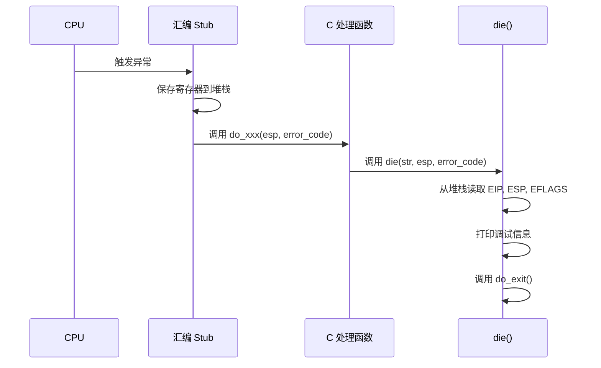
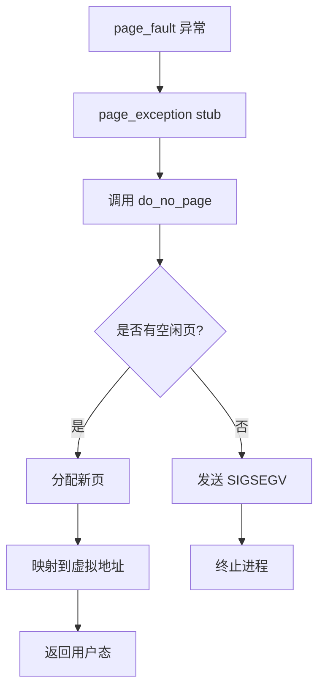

# 异常处理机制

<cite>
**本文档引用的文件**  
- [traps.c](file://kernel/traps.c)
- [memory.c](file://mm/memory.c)
- [asm.s](file://kernel/asm.s)
- [panic.c](file://kernel/panic.c)
</cite>

## 目录
1. [简介](#简介)
2. [异常处理架构](#异常处理架构)
3. [核心异常类型分析](#核心异常类型分析)
4. [异常处理函数调用流程](#异常处理函数调用流程)
5. [页错误处理机制](#页错误处理机制)
6. [特权级与堆栈切换](#特权级与堆栈切换)
7. [调试与错误诊断](#调试与错误诊断)
8. [结论](#结论)

## 简介
本文件全面文档化 Linux 0.01 内核中的 CPU 异常处理机制。重点分析除零错误（#DE）、通用保护错误（#GP）、页错误（#PF）等关键异常的触发条件、内核响应流程以及相关 C 语言和汇编处理函数的实现逻辑。文档还探讨了异常发生时的特权级切换、堆栈管理以及调试信息输出机制。

## 异常处理架构

Linux 0.01 的异常处理由汇编 stub 和 C 语言处理函数共同完成。当 CPU 检测到异常时，会根据中断描述符表（IDT）跳转到对应的汇编处理入口（如 `divide_error`、`general_protection`），这些 stub 负责保存寄存器状态并调用相应的 C 函数（如 `do_divide_error`、`do_general_protection`）。

```mermaid
graph TB
A[CPU 异常] --> B[汇编 Stub]
B --> C[保存寄存器状态]
C --> D[调用 C 处理函数]
D --> E[分析错误码]
E --> F[调用 die() 打印调试信息]
F --> G[终止进程]
```

**Diagram sources**  
- [traps.c](file://kernel/traps.c#L35-L49)
- [asm.s](file://kernel/asm.s#L2)

**Section sources**  
- [traps.c](file://kernel/traps.c#L0-L199)

## 核心异常类型分析

### 除零错误 (#DE)
当执行除法指令时，如果除数为零，CPU 会触发除零异常。该异常的处理流程如下：
1. CPU 跳转到 `divide_error` 汇编 stub
2. 保存当前寄存器状态
3. 调用 `do_divide_error` C 函数
4. 输出调试信息并终止进程

### 通用保护错误 (#GP)
通用保护错误通常由违反保护机制的操作触发，如访问无效段、权限不足等。其处理流程为：
1. CPU 跳转到 `general_protection` 汇编 stub
2. 保存寄存器状态
3. 调用 `do_general_protection` C 函数
4. 输出调试信息并终止进程

### 页错误 (#PF)
页错误在访问无效或未映射的虚拟内存页时发生。其处理机制较为复杂，涉及内存管理子系统：
1. CPU 跳转到 `page_fault` 汇编 stub
2. 保存状态后调用 `page_exception`（由内存管理模块处理）
3. 分析错误码以确定访问类型和权限
4. 执行页分配或写时复制等操作

**Section sources**  
- [traps.c](file://kernel/traps.c#L35-L49)
- [memory.c](file://mm/memory.c#L236-L244)

## 异常处理函数调用流程

所有异常处理函数最终都会调用 `die()` 函数来输出调试信息并终止进程。`die()` 函数接收堆栈指针作为参数，从中提取关键寄存器状态：



**Diagram sources**  
- [traps.c](file://kernel/traps.c#L53-L107)

**Section sources**  
- [traps.c](file://kernel/traps.c#L53-L107)

## 页错误处理机制

页错误处理是内存管理的核心部分，涉及 `page_exception` 汇编 stub 与 `do_page_fault` 的协作：



页错误码包含重要信息：
- 位 0：是否因不存在的页而发生（0=存在，1=不存在）
- 位 1：访问类型（0=读，1=写）
- 位 2：特权级（0=内核，1=用户）

通过分析错误码，内核可以区分缺页、写时复制等情况。

**Diagram sources**  
- [traps.c](file://kernel/traps.c#L33)
- [memory.c](file://mm/memory.c#L236-L244)

**Section sources**  
- [memory.c](file://mm/memory.c#L236-L244)

## 特权级与堆栈切换

当异常发生在用户态时，CPU 会自动从用户堆栈切换到内核堆栈。这一机制确保了内核能够安全地处理异常而不会被用户程序破坏。`die()` 函数通过检查堆栈中的 SS 寄存器值来判断异常发生的特权级：

- 如果 SS == 0x17，则说明异常发生在用户态
- 此时可以安全地访问用户堆栈内容进行调试

这种设计保证了内核的稳定性和安全性，即使用户程序出现严重错误也不会影响内核的正常运行。

**Section sources**  
- [traps.c](file://kernel/traps.c#L53-L58)

## 调试与错误诊断

### 调试信息输出
`die()` 函数会输出以下关键信息：
- 异常类型和错误码
- EIP（指令指针）、ESP（堆栈指针）、EFLAGS（标志寄存器）
- FS 段寄存器值
- 当前进程 PID
- 异常点附近的机器码

### 页错误诊断方法
通过错误码可以判断页错误的性质：
- 错误码 & 1 == 1：访问了不存在的页
- 错误码 & 2 == 2：写操作导致的页错误
- 错误码 & 4 == 4：发生在用户态

结合这些信息，开发者可以快速定位内存访问问题的根源。

**Section sources**  
- [traps.c](file://kernel/traps.c#L53-L65)
- [memory.c](file://mm/memory.c#L236-L244)

## 结论
Linux 0.01 的异常处理机制采用分层设计，通过汇编 stub 与 C 函数的协作实现了高效的错误处理。所有异常最终都通过 `die()` 函数统一处理，确保了调试信息的一致性和进程终止的可靠性。页错误处理与内存管理紧密集成，支持动态内存分配和写时复制等高级特性。该机制在保证系统稳定性的同时，为开发者提供了丰富的调试信息。