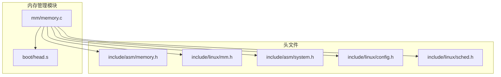
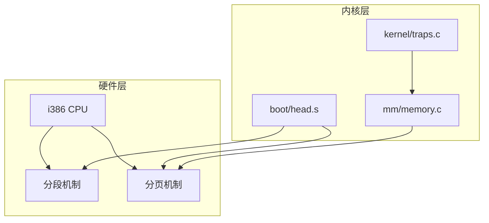
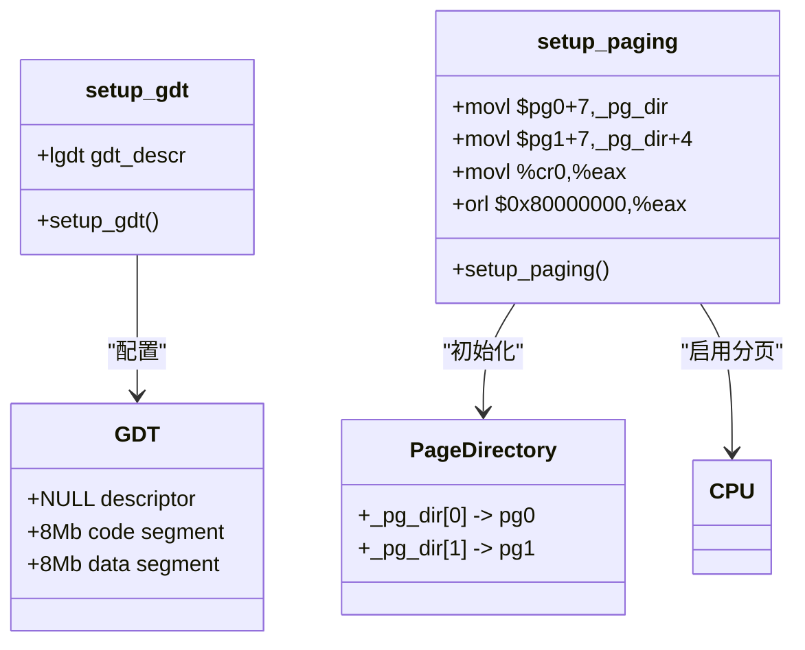
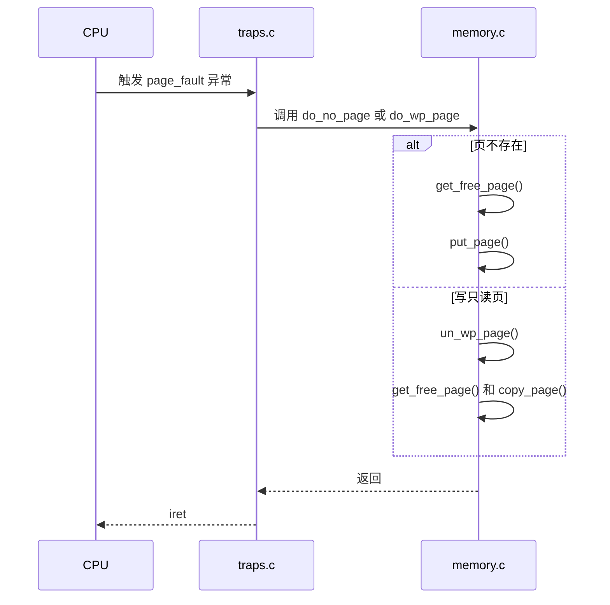
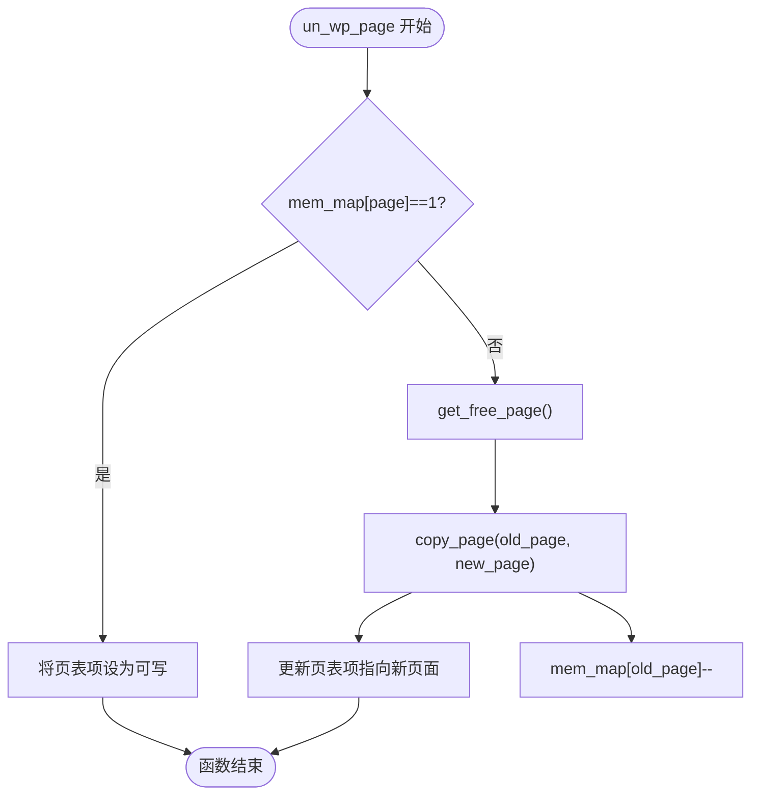
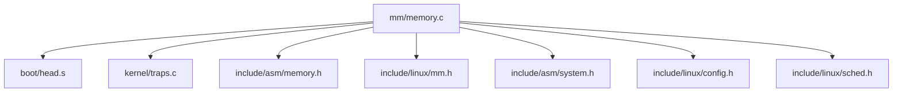

# 内存管理子系统

<cite>
**本文档中引用的文件**   
- [memory.c](file://mm/memory.c)
- [head.s](file://boot/head.s)
- [memory.h](file://include/asm/memory.h)
- [mm.h](file://include/linux/mm.h)
- [traps.c](file://kernel/traps.c)
- [system.h](file://include/asm/system.h)
- [config.h](file://include/linux/config.h)
- [sched.h](file://include/linux/sched.h)
</cite>

## 目录
1. [简介](#简介)
2. [项目结构](#项目结构)
3. [核心组件](#核心组件)
4. [架构概述](#架构概述)
5. [详细组件分析](#详细组件分析)
6. [依赖分析](#依赖分析)
7. [性能考虑](#性能考虑)
8. [故障排除指南](#故障排除指南)
9. [结论](#结论)

## 简介
本文档深入分析 Linux 0.01 内核中的内存管理子系统，重点研究 `mm/memory.c` 文件的实现。文档详细解释了系统如何利用 i386 架构的分段和分页机制进行内存管理。内容涵盖 `boot/head.s` 中设置的段描述符、`memory.c` 中的核心函数（如 `do_page_fault` 和 `do_wp_page`）、页表与页目录的动态管理，以及写时复制（Copy-on-Write, COW）等关键技术的实现原理。

## 项目结构
Linux 0.01 项目的内存管理功能主要集中在 `mm` 目录下，其核心实现位于 `memory.c` 文件中。该模块与 `boot` 目录下的汇编代码紧密协作，共同完成内存初始化和运行时管理。`include` 目录下的头文件为内存管理提供了必要的常量、宏定义和函数声明。

**Diagram sources**
- [memory.c](file://mm/memory.c)
- [head.s](file://boot/head.s)
- [memory.h](file://include/asm/memory.h)
- [mm.h](file://include/linux/mm.h)
- [system.h](file://include/asm/system.h)
- [config.h](file://include/linux/config.h)
- [sched.h](file://include/linux/sched.h)

**Section sources**
- [memory.c](file://mm/memory.c)
- [head.s](file://boot/head.s)

## 核心组件
内存管理子系统的核心组件包括物理内存映射表（`mem_map`）、页错误处理函数（`do_page_fault` 和 `do_wp_page`）、内存分配与释放函数（`get_free_page`, `free_page`, `put_page`）以及页表复制与清理函数（`copy_page_tables`, `free_page_tables`）。这些组件协同工作，实现了进程隔离、虚拟内存和写时复制等关键功能。

**Section sources**
- [memory.c](file://mm/memory.c#L264)

## 架构概述
Linux 0.01 的内存管理架构基于 i386 的分段和分页硬件机制。系统在启动时由 `boot/head.s` 设置全局描述符表（GDT），定义了内核和用户空间的段。随后，通过 `setup_paging` 启用分页机制，建立页目录和页表，将线性地址转换为物理地址。运行时，`memory.c` 中的函数负责处理页错误、分配和释放页面、管理进程的页表。

**Diagram sources**
- [head.s](file://boot/head.s#L175)
- [memory.c](file://mm/memory.c#L264)
- [traps.c](file://kernel/traps.c#L199)

## 详细组件分析

### 分段与分页机制初始化
系统启动时，`boot/head.s` 中的 `setup_gdt` 和 `setup_paging` 函数负责初始化内存管理的硬件基础。`setup_gdt` 设置了全局描述符表（GDT），其中包含内核代码段、内核数据段和用户代码/数据段。`setup_paging` 则初始化页目录和页表，为前 8MB 物理内存建立恒等映射。

**Diagram sources**
- [head.s](file://boot/head.s#L175)

**Section sources**
- [head.s](file://boot/head.s#L175)

### 页错误处理
当发生页错误异常时，CPU 会调用 `page_fault` 处理程序，该程序最终会调用 `memory.c` 中的 `do_no_page` 和 `do_wp_page` 函数。`do_no_page` 处理“页不存在”的情况，而 `do_wp_page` 处理“写只读页”的情况。

#### 页错误处理流程

**Diagram sources**
- [traps.c](file://kernel/traps.c#L199)
- [memory.c](file://mm/memory.c#L264)

#### do_no_page 函数分析
`do_no_page` 函数在访问的页面不存在时被调用。它首先尝试通过 `get_free_page()` 获取一个空闲的物理页面，然后调用 `put_page()` 将该页面映射到发生错误的线性地址上。

**Section sources**
- [memory.c](file://mm/memory.c#L236-L244)

#### do_wp_page 函数分析
`do_wp_page` 函数处理写保护页错误，这是实现写时复制（COW）的关键。它通过 `un_wp_page()` 函数来处理具体的复制逻辑。

**Section sources**
- [memory.c](file://mm/memory.c#L215-L221)

### 写时复制（COW）实现
写时复制是 `fork()` 系统调用的核心机制。当子进程尝试写入与父进程共享的页面时，会触发写保护页错误，从而调用 `do_wp_page`。

#### COW 核心函数 un_wp_page

**Diagram sources**
- [memory.c](file://mm/memory.c#L193-L208)

**Section sources**
- [memory.c](file://mm/memory.c#L193-L208)

### 内存分配与释放
内存管理子系统提供了 `get_free_page` 和 `free_page` 等函数来管理物理内存页面。

#### get_free_page 函数
该函数通过扫描 `mem_map` 数组来查找第一个空闲页面。`mem_map` 是一个位图，用于跟踪每个页面的使用情况。

**Section sources**
- [memory.c](file://mm/memory.c#L36-L56)

#### free_page 函数
该函数将指定的物理页面标记为可用。它首先检查地址的有效性，然后更新 `mem_map` 数组。

**Section sources**
- [memory.c](file://mm/memory.c#L62-L72)

#### put_page 函数
`put_page` 函数将一个物理页面映射到指定的线性地址。它负责查找或创建必要的页表，并更新页表项。

**Section sources**
- [memory.c](file://mm/memory.c#L170-L191)

### 页表管理
`copy_page_tables` 和 `free_page_tables` 函数用于管理进程的页表结构。

#### copy_page_tables 函数
此函数在 `fork()` 时被调用，用于复制父进程的页表给子进程。对于内核空间（`from==0`），它只复制前 640KB，以避免浪费内存。

**Section sources**
- [memory.c](file://mm/memory.c#L108-L158)

#### free_page_tables 函数
此函数在 `exit()` 时被调用，用于释放进程占用的所有页表和页面。

**Section sources**
- [memory.c](file://mm/memory.c#L74-L106)

## 依赖分析
内存管理子系统依赖于多个其他模块和头文件。`boot/head.s` 提供了硬件初始化，`kernel/traps.c` 提供了异常处理框架，而 `include` 目录下的头文件则定义了系统常量和数据结构。

**Diagram sources**
- [memory.c](file://mm/memory.c)
- [head.s](file://boot/head.s)
- [traps.c](file://kernel/traps.c)
- [memory.h](file://include/asm/memory.h)
- [mm.h](file://include/linux/mm.h)
- [system.h](file://include/asm/system.h)
- [config.h](file://include/linux/config.h)
- [sched.h](file://include/linux/sched.h)

**Section sources**
- [memory.c](file://mm/memory.c)
- [head.s](file://boot/head.s)
- [traps.c](file://kernel/traps.c)

## 性能考虑
Linux 0.01 的内存管理系统设计极为简化，这带来了性能和复杂性上的权衡。其优点是代码简洁、易于理解和调试。然而，缺乏虚拟内存交换意味着系统无法将不常用的页面换出到磁盘，从而限制了系统的内存容量和多任务处理能力。此外，`mem_map` 数组的线性扫描在内存较大时效率较低。

## 故障排除指南
常见的内存管理问题包括页错误导致的进程崩溃（SIGSEGV）和内存泄漏。`calc_mem` 函数可用于诊断内存使用情况，打印空闲页面数量和页目录使用情况。`panic` 函数在检测到严重错误（如释放已释放的页面）时会被调用。

**Section sources**
- [memory.c](file://mm/memory.c#L246-L263)

## 结论
Linux 0.01 的内存管理子系统是一个精巧而简洁的设计典范。它充分利用了 i386 硬件的分段和分页功能，实现了进程隔离、虚拟内存和写时复制等现代操作系统的核心特性。尽管其设计因缺乏交换而有所简化，但其清晰的代码结构和高效的实现为后续版本的发展奠定了坚实的基础。对 `memory.c` 的深入分析揭示了操作系统如何在硬件和软件之间架起桥梁，为应用程序提供安全、高效的内存环境。