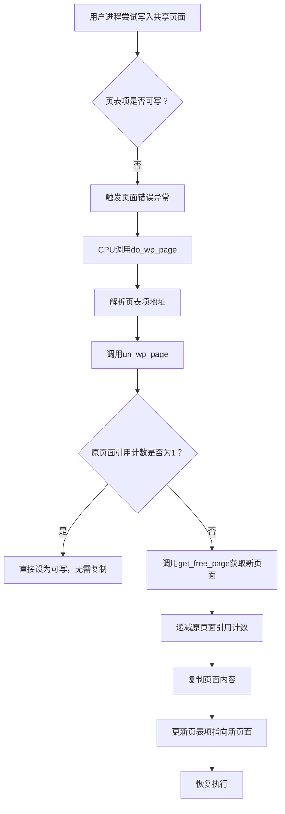

# 写时复制（Copy-on-Write）实现

<cite>
**本文档引用的文件**  
- [memory.c](file://mm/memory.c)
- [fork.c](file://kernel/fork.c)
- [mm.h](file://include/linux/mm.h)
</cite>

## 目录
1. [引言](#引言)  
2. [写时复制的设计目的](#写时复制的设计目的)  
3. [核心数据结构与机制](#核心数据结构与机制)  
4. [COW执行流程分析](#cow执行流程分析)  
5. [关键函数详解](#关键函数详解)  
6. [性能优势与局限性](#性能优势与局限性)  
7. [结论](#结论)

## 引言
写时复制（Copy-on-Write, COW）是一种重要的内存管理优化技术，广泛应用于进程创建（如`fork()`系统调用）中。其核心思想是：在父子进程之间共享物理内存页面，仅当任一进程尝试写入该页面时，才触发实际的页面复制操作。这种延迟复制策略显著提升了系统性能，尤其是在大量`fork()`后立即执行`exec()`的场景中。本文档基于Linux 0.01内核的`mm/memory.c`源码，深入剖析COW机制的实现细节。

**Section sources**  
- [memory.c](file://mm/memory.c#L0-L264)

## 写时复制的设计目的
在`fork()`系统调用发生时，若立即复制父进程的全部地址空间，将带来巨大的时间和内存开销。COW机制通过以下方式优化这一过程：
- **共享内存**：父子进程在`fork()`后共享相同的物理页面。
- **只读映射**：这些共享页面在页表中被标记为只读，任何写操作都会触发页面错误（Page Fault）。
- **按需复制**：当写操作发生时，内核捕获异常，分配新页面并复制内容，随后恢复写权限。

该机制有效减少了不必要的内存复制，尤其适用于`fork()`后立即调用`exec()`的场景，此时父进程的大部分内存无需复制。

**Section sources**  
- [memory.c](file://mm/memory.c#L106-L129)
- [fork.c](file://kernel/fork.c#L0-L53)

## 核心数据结构与机制
### 页面映射数组 `mem_map`
`mem_map`是一个静态数组，用于跟踪每个物理页面的引用计数：
```c
static unsigned short mem_map[PAGING_PAGES] = {0,};
```
- 每个元素对应一个物理页面，值为引用该页面的页表项数量。
- 在COW过程中，当页面被共享时，引用计数递增；当复制发生时，原页面的引用计数递减。

### 页面大小与地址转换
- **页面大小**：由`PAGE_SIZE`定义为4096字节（4KB）。
- **地址转换宏**：
  - `MAP_NR(addr)`：计算物理地址对应的`mem_map`索引。
  - 页目录和页表通过位运算（如`>>20`、`>>12`）进行寻址。

### 页面复制原语
- `copy_page(from, to)`：使用汇编指令`rep movsl`高效复制整个页面（1024个32位字）。

**Section sources**  
- [memory.c](file://mm/memory.c#L30)
- [mm.h](file://include/linux/mm.h#L3-L5)

## COW执行流程分析
从硬件异常到COW完成的完整流程如下：



**Diagram sources**  
- [memory.c](file://mm/memory.c#L193-L221)

**Section sources**  
- [memory.c](file://mm/memory.c#L193-L234)

## 关键函数详解
### `un_wp_page`：COW的核心执行函数
该函数负责处理写保护页面的实际复制逻辑：
- **输入参数**：页表项指针。
- **执行步骤**：
  1. 提取原页面物理地址。
  2. 若引用计数为1，说明无共享，直接设为可写。
  3. 否则，分配新页面，递减原页面引用计数。
  4. 复制内容并更新页表项。

**Section sources**  
- [memory.c](file://mm/memory.c#L193-L208)

### `do_wp_page`：页面错误处理入口
该函数由页面错误异常向量调用，负责解析出错地址对应的页表项，并调用`un_wp_page`：
- 通过地址的高位（>>20）定位页目录项。
- 结合中间位（>>10 & 0xffc）计算页表项地址。

**Section sources**  
- [memory.c](file://mm/memory.c#L215-L221)

### `write_verify`：预写验证
在`fork()`期间调用，确保父进程地址空间的页面在页表中被标记为只读，从而为COW做准备。

**Section sources**  
- [memory.c](file://mm/memory.c#L223-L234)
- [fork.c](file://kernel/fork.c#L45)

## 性能优势与局限性
### 优势
- **延迟复制**：避免了`fork()`时的全量内存复制，显著提升性能。
- **内存节约**：共享页面减少了物理内存占用。
- **高效复制**：使用汇编指令`rep movsl`实现快速页面复制。

### 局限性
- **仅支持4KB页面**：所有操作基于固定大小的页面，缺乏对大页面的支持。
- **引用计数粒度粗**：以页面为单位进行计数，无法处理页面内部分共享。
- **异常处理开销**：每次写操作首次触发异常，带来一定性能损耗。

**Section sources**  
- [memory.c](file://mm/memory.c#L106-L129)
- [memory.c](file://mm/memory.c#L193-L208)

## 结论
Linux 0.01中的写时复制机制通过`mem_map`引用计数、页表权限控制和异常处理的紧密结合，实现了高效的内存共享与按需复制。`un_wp_page`作为核心函数，优雅地处理了页面分离逻辑。尽管受限于4KB页面和简单的数据结构，该实现展示了操作系统内存管理中的经典设计思想，为后续更复杂的COW实现奠定了基础。