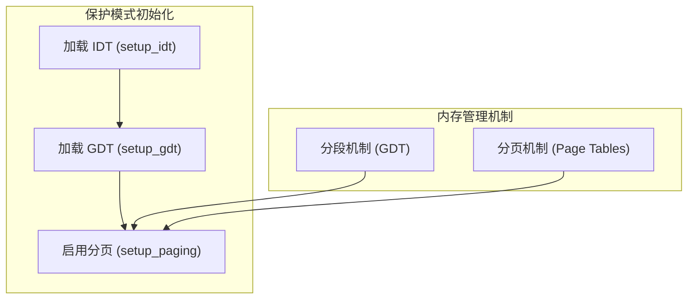
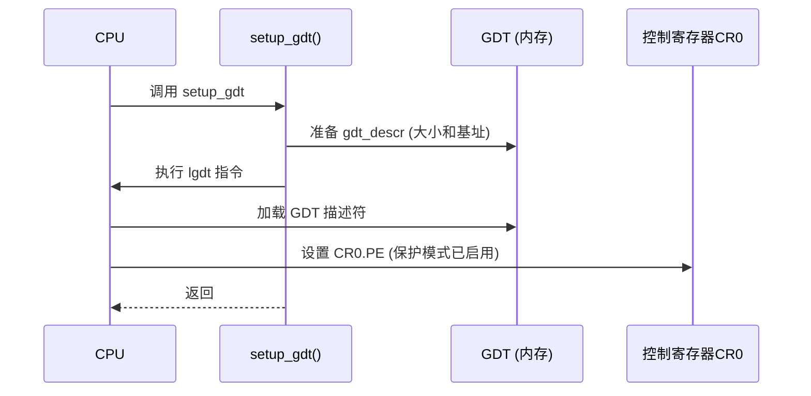
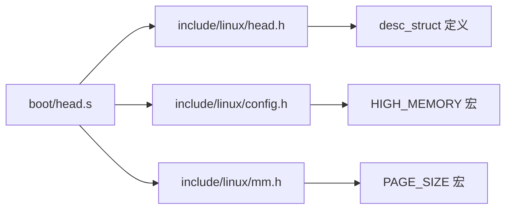

# 分段机制与内存布局

<cite>
**本文档引用的文件**   
- [head.s](file://boot/head.s)
- [mm.h](file://include/linux/mm.h)
- [config.h](file://include/linux/config.h)
- [head.h](file://include/linux/head.h)
</cite>

## 目录
1. [引言](#引言)
2. [项目结构](#项目结构)
3. [核心组件](#核心组件)
4. [架构概述](#架构概述)
5. [详细组件分析](#详细组件分析)
6. [依赖分析](#依赖分析)
7. [性能考虑](#性能考虑)
8. [故障排除指南](#故障排除指南)
9. [结论](#结论)

## 引言
本文档深入分析 Linux-0.01 内核中保护模式下的分段机制，重点聚焦于 `boot/head.s` 文件中的实现。文档详细解释了全局描述符表（GDT）的设置过程，包括内核代码段、数据段以及用户段的定义。同时，结合内存管理头文件中的定义，阐明页面机制与分段机制的协同工作方式。

## 项目结构
Linux-0.01 是一个精简的早期内核版本，其结构清晰，模块分明。核心启动代码位于 `boot/` 目录下，内核核心功能在 `kernel/` 中实现，内存管理位于 `mm/`，文件系统在 `fs/`。头文件统一存放在 `include/` 目录下，其中与分段和内存布局相关的定义主要位于 `include/linux/` 和 `include/asm/` 子目录中。

**Section sources**
- [head.s](file://boot/head.s#L1-L175)
- [config.h](file://include/linux/config.h#L1-L53)

## 核心组件
本节分析与分段机制直接相关的核心组件：GDT 的定义与加载、段描述符的结构、以及内存布局的关键宏定义。

**Section sources**
- [head.s](file://boot/head.s#L1-L175)
- [mm.h](file://include/linux/mm.h#L1-L11)
- [config.h](file://include/linux/config.h#L1-L53)
- [head.h](file://include/linux/head.h#L1-L20)

## 架构概述
Linux-0.01 在进入保护模式后，通过 `head.s` 中的代码建立基本的内存管理框架。该框架结合了分段和分页两种机制。分段机制通过 GDT 提供粗粒度的内存划分，而分页机制则提供细粒度的 4KB 页面管理和虚拟内存支持。两者共同作用，为内核和用户程序提供受保护的地址空间。



**Diagram sources**
- [head.s](file://boot/head.s#L1-L175)

## 详细组件分析

### 全局描述符表（GDT）分析
GDT 是保护模式下内存分段的核心数据结构。在 `boot/head.s` 中，GDT 被静态定义，并通过 `lgdt` 指令加载。

#### GDT 结构与段描述符
GDT 位于符号 `_gdt` 处，其结构如下：
- **NULL 描述符**：索引 0，所有位为 0，不被使用。
- **内核代码段描述符**：索引 1，定义了内核代码段。
- **内核数据段描述符**：索引 2，定义了内核数据段。
- **临时描述符**：索引 3，注释标明为临时，不使用。
- **保留空间**：索引 4-255，为 LDT 和 TSS 预留。

每个段描述符由两个 32 位的双字（`a` 和 `b`）组成，其位域定义了段的基地址、界限和访问权限。

```mermaid
classDiagram
class GDT {
+NULL 描述符 (0x0000000000000000)
+内核代码段 (0x00c09a00000007ff)
+内核数据段 (0x00c09200000007ff)
+临时描述符 (0x0000000000000000)
+保留空间 (252 项)
}
note right of GDT : GDT位于_head.s中，通过lgdt指令加载
```

**Diagram sources**
- [head.s](file://boot/head.s#L150-L175)
- [head.h](file://include/linux/head.h#L1-L20)

#### 段描述符详解
通过分析 `_gdt` 中的 `.quad` 值，可以解析出各段的详细信息：

**内核代码段 (0x00c09a00000007ff)**:
- **基地址 (Base)**: 0x00000000 (由 a 和 b 的低 24 位和高 8 位组合)
- **段界限 (Limit)**: 0x7ff (4KB 的 2047 倍 = 8MB - 4KB)
- **访问权限 (Access)**:
  - P (Present): 1 (存在)
  - DPL (Descriptor Privilege Level): 00 (内核级)
  - S (System): 1 (代码/数据段)
  - Type: 1010 (可执行、非一致、可读)
  - G (Granularity): 1 (粒度为 4KB)
  - D/B (Default Operation Size): 1 (32 位操作)

**内核数据段 (0x00c09200000007ff)**:
- **基地址 (Base)**: 0x00000000
- **段界限 (Limit)**: 0x7ff (同上，8MB - 4KB)
- **访问权限 (Access)**:
  - P: 1, DPL: 00, S: 1
  - Type: 0010 (可读写、可扩展向下)
  - G: 1, D/B: 1

**Section sources**
- [head.s](file://boot/head.s#L150-L175)

### GDT 加载过程分析
GDT 的加载由 `setup_gdt` 函数完成，该过程极其简洁。



**Diagram sources**
- [head.s](file://boot/head.s#L45-L50)

### 内存布局与分页机制分析
尽管 GDT 将前 8MB 内存定义为一个大段，但实际的内存管理是通过分页机制实现的。

#### 8MB 内存划分的原因
在 `head.s` 的注释中明确指出，系统假设物理内存不超过 8MB。GDT 的段界限被设置为 0x7ff（结合 G 位，实际为 8MB），是为了确保整个物理内存都在内核段的覆盖范围内。这是一种简单而有效的保护模式初始化策略，它允许内核在启用分页前，通过平坦的段地址直接访问所有物理内存。

#### 页面大小与段机制的协同
`include/linux/mm.h` 定义了 `PAGE_SIZE` 为 4096 字节（4KB）。分页机制在 `setup_paging` 函数中被启用。分页机制将物理内存划分为 4KB 的页面，并建立页表进行管理。分段机制提供了初始的、粗粒度的地址空间划分（0-8MB），而分页机制则在此基础上提供了细粒度的内存映射、保护和虚拟化能力。两者结合，既满足了保护模式的要求，又实现了高效的内存管理。

```mermaid
flowchart TD
A[物理内存 0x0 - 0x7FFFFF (8MB)] --> B[分段机制]
B --> C["GDT: 基址=0, 限长=8MB"]
A --> D[分页机制]
D --> E["页表: 4KB 页面"]
E --> F["虚拟地址 -> 物理地址"]
C --> G["平坦内存模型 (0x0 - 0x7FFFFF)"]
F --> G
G --> H["内核可直接访问"]
```

**Diagram sources**
- [head.s](file://boot/head.s#L100-L140)
- [mm.h](file://include/linux/mm.h#L1-L3)

### HIGH_MEMORY 与 LOW_MEM 宏分析
`HIGH_MEMORY` 宏定义了系统物理内存的上限。

- **HIGH_MEMORY**: 在 `config.h` 中，根据 `LINUS_HD` 或 `LASU_HD` 的定义，`HIGH_MEMORY` 被设置为 `0x800000` (8MB) 或 `0x400000` (4MB)。这个值直接决定了 GDT 中段界限的计算，确保内核段能够覆盖所有可用物理内存。
- **LOW_MEM**: 虽然在提供的代码片段中未直接出现，但通常 `LOW_MEM` 指的是 1MB 以下的常规内存。`HIGH_MEMORY` 宏的值明确区分了系统支持的总内存大小。

**Section sources**
- [config.h](file://include/linux/config.h#L12-L14)

## 依赖分析
分段机制的实现依赖于多个头文件中的定义和常量。



**Diagram sources**
- [head.s](file://boot/head.s#L1-L175)
- [head.h](file://include/linux/head.h#L1-L20)
- [config.h](file://include/linux/config.h#L1-L53)
- [mm.h](file://include/linux/mm.h#L1-L11)

## 性能考虑
使用 8MB 的大段并结合 4KB 分页是一种性能和复杂性的权衡。大段减少了段检查的开销，并简化了早期启动代码。分页机制则提供了现代操作系统所需的内存管理功能。这种设计在当时硬件条件下是高效且合理的。

## 故障排除指南
若系统在 `setup_gdt` 后崩溃，可能原因包括：
- GDT 描述符 (`gdt_descr`) 的基地址或大小计算错误。
- 汇编代码中 `lgdt` 指令执行时，`gdt_descr` 的地址未正确解析。
- 内存损坏导致 GDT 表内容被破坏。

**Section sources**
- [head.s](file://boot/head.s#L45-L50)

## 结论
Linux-0.01 的分段机制是一个精巧而实用的设计。它通过在 `boot/head.s` 中定义一个覆盖前 8MB 物理内存的 GDT，为内核提供了一个简单、平坦的地址空间。这一设计与 4KB 分页机制无缝衔接，共同构成了内核内存管理的基础。`HIGH_MEMORY` 等宏的使用，使得代码具有一定的可配置性。这一机制充分体现了早期 Linux 内核简洁、高效的设计哲学。