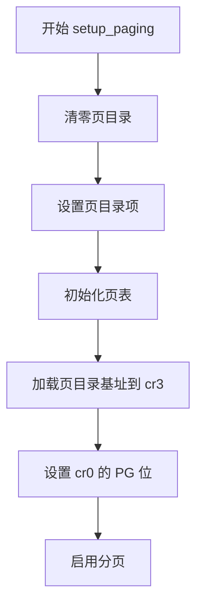
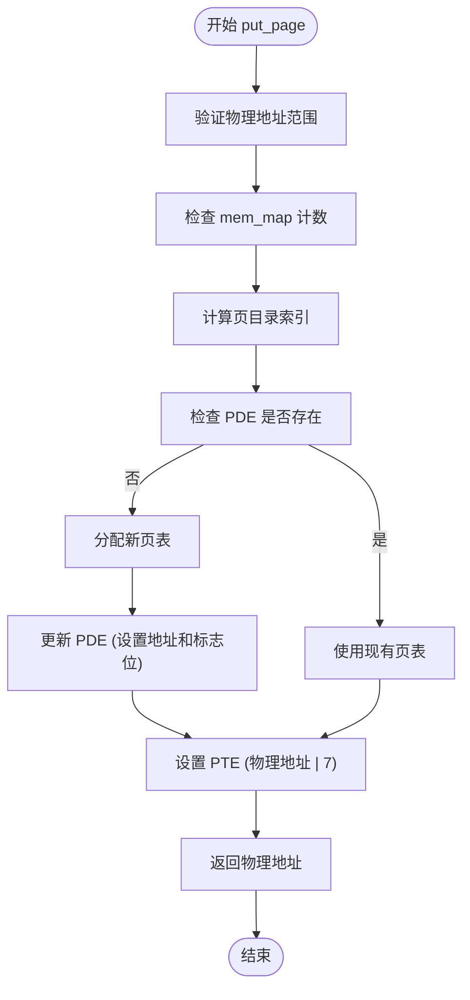
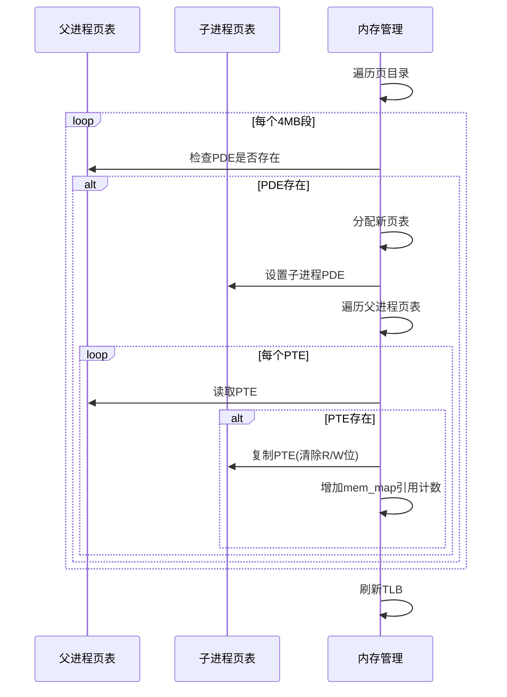
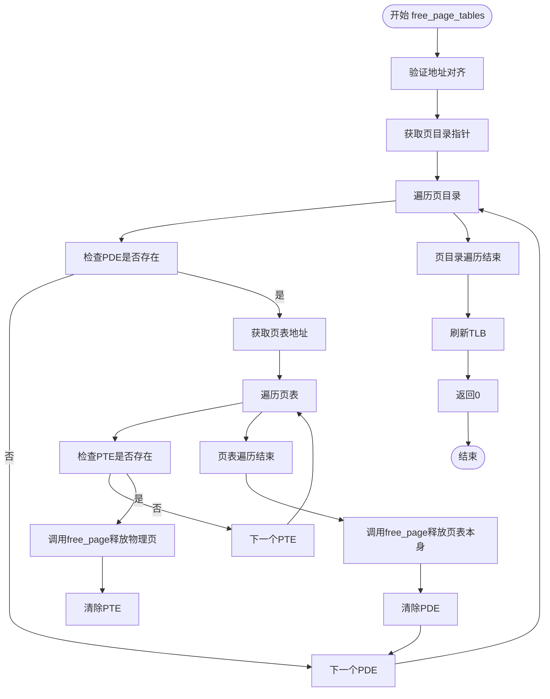

# 分页机制与页表管理

<cite>
**本文档引用的文件**
- [memory.c](file://mm/memory.c)
- [head.s](file://boot/head.s)
- [head.h](file://include/linux/head.h)
- [mm.h](file://include/linux/mm.h)
</cite>

## 目录
1. [引言](#引言)
2. [分页初始化：setup_paging 函数分析](#分页初始化setup_paging-函数分析)
3. [页表项格式与标志位详解](#页表项格式与标志位详解)
4. [物理页面映射：put_page 函数](#物理页面映射put_page-函数)
5. [进程地址空间复制：copy_page_tables 函数](#进程地址空间复制copy_page_tables-函数)
6. [地址空间释放：free_page_tables 函数](#地址空间释放free_page_tables-函数)
7. [页表管理与内存操作](#页表管理与内存操作)
8. [总结](#总结)

## 引言
Linux-0.01 的分页机制是系统内存管理的核心组成部分，通过硬件分页单元（MMU）实现虚拟地址到物理地址的映射。该机制在系统启动初期由 `setup_paging` 函数初始化，建立前 8MB 内存的恒等映射（identity mapping），为后续的进程管理和内存隔离奠定基础。`mm/memory.c` 文件实现了页表的动态管理功能，包括页面分配、映射、复制与释放。本文将深入分析 `boot/head.s` 和 `mm/memory.c` 中的关键实现，详细阐述页目录项（PDE）、页表项（PTE）的二进制格式、标志位设置以及核心函数的工作流程。

## 分页初始化：setup_paging 函数分析
在系统启动过程中，`setup_paging` 函数负责初始化分页机制。该函数位于 `boot/head.s` 文件中，执行时 CPU 已切换至保护模式。其核心任务是构建页目录和页表，实现前 8MB 物理内存的恒等映射，即虚拟地址与物理地址一一对应。

**图示来源**
- [head.s](file://boot/head.s#L145-L175)

**本节来源**
- [head.s](file://boot/head.s#L145-L175)

### 页目录与页表布局
`setup_paging` 函数首先将位于内存地址 0x00000000 的页目录（`_pg_dir`）清零。随后，它将两个页表 `pg0` 和 `pg1` 的物理地址（分别位于 0x1000 和 0x2000）写入页目录的前两个表项，并设置相应的标志位（存在位、用户/超级用户位、读写位）。每个页表包含 1024 个页表项，每个页表项映射 4KB 内存，因此两个页表共同映射 8MB 内存。

### 恒等映射的实现
函数通过一个倒序循环（`std` 指令）高效地填充 `pg1` 页表。循环从 0x7ff007 开始递减，每次减去 0x1000（4KB），并将结果写入页表项。0x7ff007 的二进制格式为 `0111 1111 1111 0000 0000 0111`，其中高 20 位 `0x7ff00` 表示物理页帧号，低 3 位 `0x7` 表示标志位（P=1, R/W=1, U/S=1）。这种设置确保了从虚拟地址 0x400000 到 0x7FFFFF 的内存区域被正确映射。

## 页表项格式与标志位详解
页目录项（PDE）和页表项（PTE）均为 32 位，其格式如下：

| 位域 | 名称 | 描述 |
| :--- | :--- | :--- |
| 0 | P (Present) | 存在位。1 表示页在物理内存中，0 表示页不在内存（可能在交换区） |
| 1 | R/W (Read/Write) | 读写位。1 表示可读写，0 表示只读 |
| 2 | U/S (User/Supervisor) | 用户/超级用户位。1 表示用户和内核均可访问，0 表示仅内核可访问 |
| 3 | PWT (Page Level Write-Through) | 页级写通。控制该页的缓存策略 |
| 4 | PCD (Page Level Cache Disable) | 页级缓存禁用。1 表示禁用缓存 |
| 5 | A (Accessed) | 访问位。当该页被读或写时，CPU 自动置 1 |
| 6 | D (Dirty) | 脏位。当该页被写入时，CPU 自动置 1（仅页表项） |
| 7 | PAT (Page Attribute Table) | 页属性表（仅页目录项） |
| 8-11 | G (Global) | 全局位。当 CR3 寄存器更新时，若此位为 1，则 TLB 中的该项不被刷新 |
| 12-31 | Page Frame Number | 页帧号。物理页的基地址（右移 12 位） |

在 `setup_paging` 中，所有页表项均被设置为 `0x7`（P=1, R/W=1, U/S=1），表示这些页存在于内存中，可读写，并且用户和内核模式均可访问。

## 物理页面映射：put_page 函数
`put_page` 函数负责将一个物理页面映射到指定的线性地址。该函数位于 `mm/memory.c` 文件中，是动态内存管理的基础。

**图示来源**
- [memory.c](file://mm/memory.c#L170-L191)

**本节来源**
- [memory.c](file://mm/memory.c#L170-L191)

### 动态分配逻辑
`put_page` 函数首先通过 `(address>>20) & 0xffc` 定位到页目录项。如果该 PDE 不存在（存在位为 0），则调用 `get_free_page()` 分配一个新页作为页表，并将该页的物理地址与标志位 `7`（P=1, R/W=1, U/S=1）进行或运算后写入 PDE。然后，函数通过 `(address>>12) & 0x3ff` 定位到页表中的具体项，并将目标物理页地址与标志位 `7` 进行或运算后写入 PTE，完成映射。

## 进程地址空间复制：copy_page_tables 函数
`copy_page_tables` 函数在 `fork()` 系统调用中被使用，用于复制父进程的页表结构，从而创建子进程的地址空间。

**图示来源**
- [memory.c](file://mm/memory.c#L123-L162)

**本节来源**
- [memory.c](file://mm/memory.c#L123-L162)

### 复制与写时复制（Copy-on-Write）
该函数以 4MB 为单位进行复制。对于每个存在的页目录项，它会为子进程分配一个新的页表。在复制页表项时，函数会清除 `R/W` 位（`this_page &= ~2`），使得所有页面在子进程中变为只读。同时，它会增加 `mem_map` 数组中对应物理页的引用计数。当父进程或子进程尝试写入一个共享页面时，会触发页错误，`do_wp_page` 函数会调用 `un_wp_page` 为该进程分配一个新的物理页，并复制内容，实现写时复制语义。

## 地址空间释放：free_page_tables 函数
`free_page_tables` 函数用于安全地释放进程的地址空间，通常在 `exit()` 系统调用中被调用。

**图示来源**
- [memory.c](file://mm/memory.c#L78-L104)

**本节来源**
- [memory.c](file://mm/memory.c#L78-L104)

### 释放流程
函数首先检查起始地址是否按 4MB 对齐。然后，它遍历指定范围内的所有页目录项。对于每个存在的 PDE，它会遍历其指向的页表中的所有 PTE。如果 PTE 存在，则调用 `free_page` 函数释放对应的物理页，并将 PTE 清零。在遍历完一个页表的所有 PTE 后，它会调用 `free_page` 释放页表本身，并将 PDE 清零。最后，调用 `invalidate()` 宏刷新 TLB，确保 CPU 不再使用已失效的页表项。

## 页表管理与内存操作
`mm/memory.c` 文件还包含其他重要的内存管理函数：
- `get_free_page()`: 从 `mem_map` 数组中查找并返回一个空闲物理页的地址。
- `free_page()`: 释放一个物理页，将其在 `mem_map` 数组中的计数减一。
- `do_no_page()`: 处理“页不存在”异常，为缺页分配一个新页并建立映射。
- `write_verify()`: 在写操作前检查页的可写性，如果页存在但不可写，则触发写保护处理。

这些函数共同构成了 Linux-0.01 的基本内存管理框架，实现了虚拟内存的核心功能。

## 总结
Linux-0.01 的分页机制通过 `boot/head.s` 中的 `setup_paging` 函数实现了启动阶段的恒等映射，为内核运行提供了基础。`mm/memory.c` 中的 `put_page`、`copy_page_tables` 和 `free_page_tables` 等函数则实现了运行时的动态页表管理。通过对页表项标志位的精确控制，系统实现了内存保护、写时复制和高效的地址空间管理。这些简洁而精巧的设计，体现了早期 Linux 内核的工程智慧。