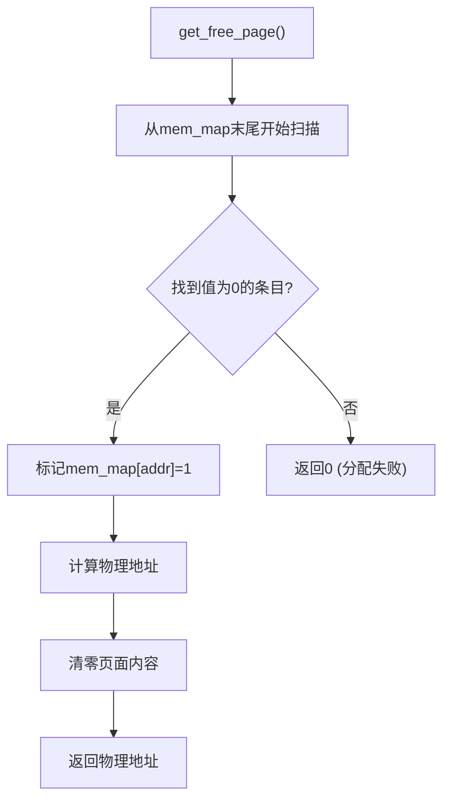
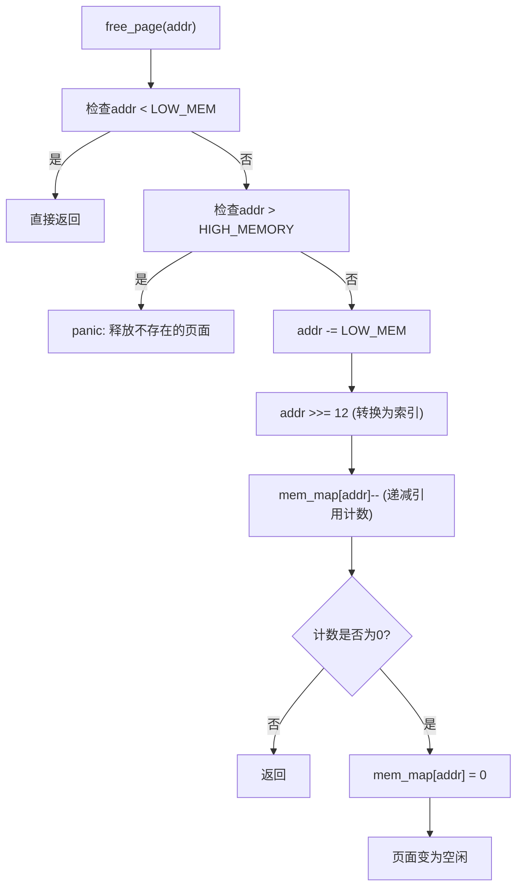
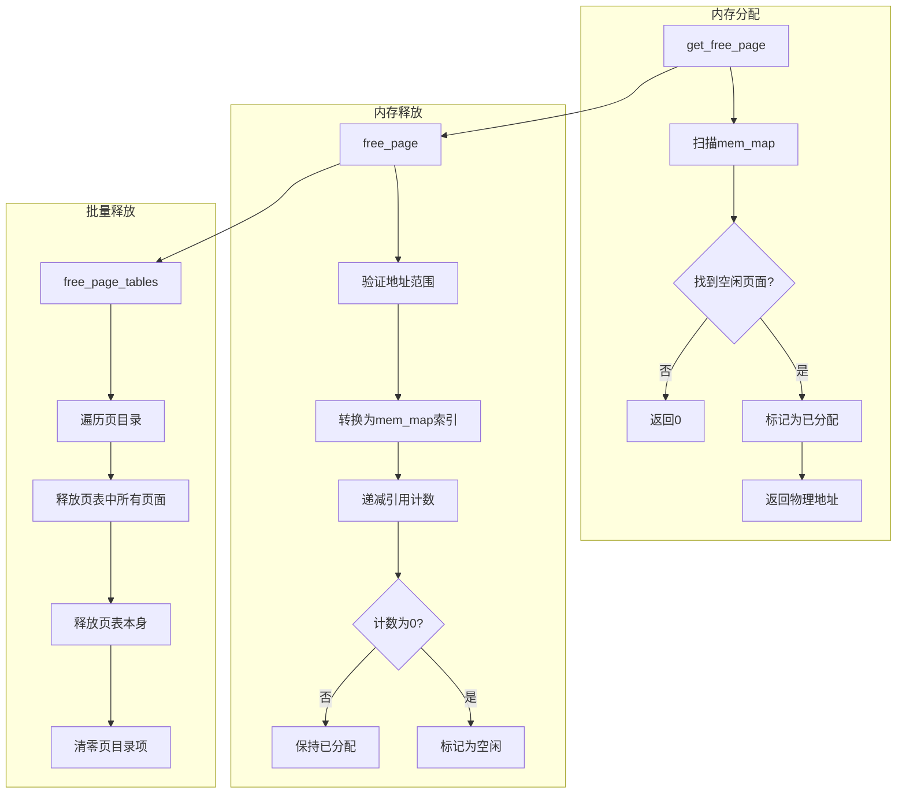

# 物理内存分配与回收

<cite>
**本文档中引用的文件**  
- [mm/memory.c](file://mm/memory.c)
- [include/linux/mm.h](file://include/linux/mm.h)
- [include/linux/config.h](file://include/linux/config.h)
</cite>

## 目录
1. [引言](#引言)
2. [内存管理核心数据结构](#内存管理核心数据结构)
3. [页面分配机制](#页面分配机制)
4. [页面释放机制](#页面释放机制)
5. [页表批量释放](#页表批量释放)
6. [API接口契约与使用场景](#api接口契约与使用场景)
7. [内存管理流程图](#内存管理流程图)
8. [总结](#总结)

## 引言
本文档详细解析Linux 0.01内核中物理内存管理的核心机制，重点分析`mm/memory.c`文件中的`get_free_page`和`free_page`函数。文档阐述了`mem_map`数组作为内存位图的实现原理，描述了页面分配与回收的具体流程，并结合头文件定义说明了相关API的使用契约，为开发者提供清晰的参考。

## 内存管理核心数据结构

`mem_map`数组是Linux 0.01内核中用于跟踪物理内存页面状态的核心数据结构。该数组的每个元素对应一个4KB大小的物理内存页面，记录其分配状态和引用计数。

内存管理的关键宏定义和参数：
- `LOW_MEM`：可用内存的起始地址，由`include/linux/config.h`中的`HIGH_MEMORY`和`BUFFER_END`决定
- `PAGING_MEMORY`：可用于分页的内存总量
- `PAGING_PAGES`：可管理的页面总数
- `MAP_NR(addr)`：将物理地址转换为`mem_map`数组索引的宏

`mem_map`数组被声明为`static unsigned short mem_map[PAGING_PAGES]`，初始化为全0，表示所有页面初始状态为空闲。

**Section sources**
- [mm/memory.c](file://mm/memory.c#L35-L36)
- [include/linux/config.h](file://include/linux/config.h#L40-L52)

## 页面分配机制

`get_free_page`函数负责分配一个空闲的物理内存页面。该函数采用高效的汇编指令实现，从`mem_map`数组的末尾开始向前扫描，查找第一个值为0的空闲页面。

函数执行流程：
1. 使用`repne scasw`指令在`mem_map`数组中搜索值为0的元素
2. 找到空闲页面后，将其`mem_map`条目标记为1（已分配）
3. 计算对应的物理地址（基于`LOW_MEM`偏移）
4. 将新分配的页面内容清零
5. 返回分配页面的物理地址

该函数使用内联汇编优化性能，直接操作寄存器，避免了C函数调用的开销。当没有空闲页面时，函数返回0表示分配失败。



**Diagram sources**
- [mm/memory.c](file://mm/memory.c#L36-L56)

**Section sources**
- [mm/memory.c](file://mm/memory.c#L36-L56)

## 页面释放机制

`free_page`函数负责释放一个已分配的物理内存页面，其核心是安全的引用计数管理机制。

函数执行的安全检查和释放流程：
1. 地址范围验证：确保释放的地址在`LOW_MEM`到`HIGH_MEMORY`的有效范围内
2. 地址转换：将物理地址转换为`mem_map`数组索引
3. 引用计数递减：对`mem_map`条目执行原子递减操作
4. 状态重置：当引用计数归零时，将`mem_map`条目重置为0，表示页面变为空闲
5. 错误检测：如果尝试释放已经空闲的页面，调用`panic`触发系统崩溃

该函数通过引用计数机制支持页面共享，只有当最后一个引用被释放时，页面才真正变为空闲状态。



**Diagram sources**
- [mm/memory.c](file://mm/memory.c#L58-L70)

**Section sources**
- [mm/memory.c](file://mm/memory.c#L58-L70)

## 页表批量释放

`free_page_tables`函数用于释放连续的页表块和关联的页面，主要在进程退出时由`exit()`系统调用触发。

函数执行流程：
1. 对齐检查：确保起始地址按4MB对齐
2. 起始地址验证：禁止释放交换器内存空间
3. 遍历页目录：对指定范围内的每个页目录项
   - 检查页目录项是否有效
   - 遍历对应的页表，释放所有有效页面
   - 释放页表本身占用的页面
   - 清零页目录项
4. 刷新TLB：调用`invalidate()`刷新页表缓存

该函数递归释放整个地址空间的页表结构和物理页面，确保进程退出时彻底回收内存资源。

**Section sources**
- [mm/memory.c](file://mm/memory.c#L78-L104)

## API接口契约与使用场景

根据`include/linux/mm.h`头文件的声明，内存管理提供以下核心API接口：

```c
extern unsigned long get_free_page(void);
extern void free_page(unsigned long addr);
```

### get_free_page 接口契约
- **功能**：分配一个4KB大小的物理内存页面
- **参数**：无
- **返回值**：成功时返回页面的物理地址，失败时返回0
- **使用场景**：
  - 进程创建时分配页表
  - 内核需要动态分配内存
  - 处理缺页异常时分配新页面
- **注意事项**：调用者需确保有足够的空闲内存，否则分配会失败

### free_page 接口契约
- **功能**：释放一个已分配的物理内存页面
- **参数**：页面的物理地址
- **返回值**：无
- **使用场景**：
  - 进程退出时回收内存
  - 页表项无效化时释放关联页面
  - 内存管理子系统内部清理
- **注意事项**：必须确保地址有效且页面确实已分配，否则会触发系统崩溃

**Section sources**
- [include/linux/mm.h](file://include/linux/mm.h#L5-L9)
- [mm/memory.c](file://mm/memory.c#L36-L70)

## 内存管理流程图



**Diagram sources**
- [mm/memory.c](file://mm/memory.c#L36-L104)

## 总结
Linux 0.01的物理内存管理系统通过`mem_map`数组实现了高效的页面级内存管理。`get_free_page`函数使用汇编优化实现快速的空闲页面查找，而`free_page`函数通过引用计数机制确保内存释放的安全性。`free_page_tables`函数则提供了批量释放页表和页面的能力，支持进程生命周期的内存管理需求。这些API构成了内核内存管理的基础，为进程创建、内存分配和系统稳定性提供了关键支持。