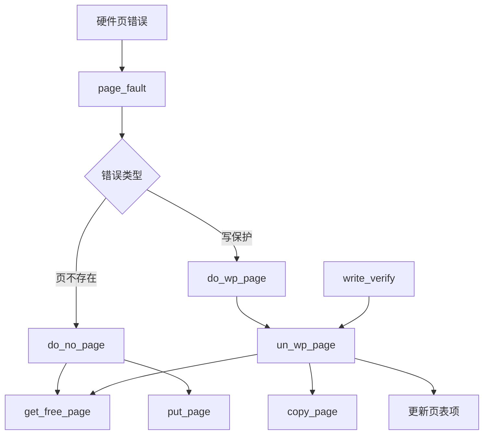

# 页错误异常处理

<cite>
**本文档引用文件**  
- [memory.c](file://mm/memory.c)
- [traps.c](file://kernel/traps.c)
- [mm.h](file://include/linux/mm.h)
- [fork.c](file://kernel/fork.c)
</cite>

## 目录
1. [引言](#引言)
2. [核心机制概述](#核心机制概述)
3. [页不存在异常处理](#页不存在异常处理)
4. [写只读页异常处理](#写只读页异常处理)
5. [写操作预检查机制](#写操作预检查机制)
6. [函数调用链分析](#函数调用链分析)
7. [内存管理影响分析](#内存管理影响分析)
8. [结论](#结论)

## 引言
页错误（Page Fault）是操作系统内存管理中的关键异常处理机制，用于在进程访问非法或未映射内存时进行动态内存分配与权限调整。本技术文档深入解析 Linux 0.01 内核中 `mm/memory.c` 文件的 `do_no_page` 和 `do_wp_page` 函数，揭示其如何实现“按需分页”与“写时复制”（Copy-on-Write, COW）机制，保障进程隔离与内存高效利用。

## 核心机制概述
Linux 0.01 的页错误处理机制由硬件异常触发，经由 `page_fault` 入口函数分发至具体处理例程。核心函数包括：
- `do_no_page`：处理“页不存在”异常，实现按需分配物理页
- `do_wp_page`：处理“写保护”异常，实现写时复制
- `un_wp_page`：执行页面复制与引用计数管理
- `write_verify`：写操作前的权限预检查

这些函数协同工作，确保内存访问的安全性与效率。

**Section sources**
- [memory.c](file://mm/memory.c#L215-L244)

## 页不存在异常处理
当进程访问未映射的虚拟地址时，触发“页不存在”异常，由 `do_no_page` 函数处理。该函数通过调用 `get_free_page()` 获取一个空闲物理页面，并通过 `put_page()` 建立虚拟地址到物理页面的映射。

```mermaid
flowchart TD
A[触发页不存在异常] --> B[调用 do_no_page]
B --> C[调用 get_free_page()]
C --> D{获取成功?}
D --> |是| E[调用 put_page()]
D --> |否| F[调用 do_exit(SIGSEGV)]
E --> G[建立页表映射]
G --> H[返回用户态继续执行]
```

**Diagram sources**
- [memory.c](file://mm/memory.c#L236-L244)

**Section sources**
- [memory.c](file://mm/memory.c#L236-L244)

## 写只读页异常处理
当进程尝试写入一个只读但已存在的页面（通常为共享页面）时，触发“写保护”异常，由 `do_wp_page` 函数处理。该函数调用 `un_wp_page` 执行写时复制逻辑。

`un_wp_page` 首先检查目标页面的引用计数（通过 `mem_map` 数组）。若引用数大于 1，表明页面被多个进程共享，此时分配新页面，复制原页面内容，并更新页表项指向新页面；若引用数为 1，则直接修改页表项权限为可写，避免不必要的复制开销。

```mermaid
flowchart TD
A[触发写保护异常] --> B[调用 do_wp_page]
B --> C[调用 un_wp_page]
C --> D[提取页表项物理地址]
D --> E{引用计数 == 1?}
E --> |是| F[直接设置可写权限]
E --> |否| G[调用 get_free_page()]
G --> H[复制页面内容 copy_page()]
H --> I[更新页表项指向新页]
I --> J[递减原页面引用计数]
F --> K[返回用户态继续执行]
J --> K
```

**Diagram sources**
- [memory.c](file://mm/memory.c#L193-L221)

**Section sources**
- [memory.c](file://mm/memory.c#L193-L221)

## 写操作预检查机制
`write_verify` 函数在进程写操作前进行预检查，主要用于 `fork` 系统调用后对子进程内存的写前验证。该函数检查指定地址的页表项是否为“存在但不可写”状态（标志位为 1），若是，则提前调用 `un_wp_page` 进行写时复制，避免后续写操作再次触发异常。

此机制优化了写时复制的性能，将异常处理从“异常发生时”提前到“可能发生前”，减少了上下文切换开销。

**Section sources**
- [memory.c](file://mm/memory.c#L223-L234)
- [fork.c](file://kernel/fork.c#L30-L32)

## 函数调用链分析
页错误处理涉及多个函数的协同工作，形成清晰的调用链：



**Diagram sources**
- [memory.c](file://mm/memory.c#L193-L244)
- [traps.c](file://kernel/traps.c#L14)

**Section sources**
- [memory.c](file://mm/memory.c#L193-L244)
- [traps.c](file://kernel/traps.c#L14)

## 内存管理影响分析
该页错误处理机制对系统内存管理产生深远影响：

1. **进程隔离**：通过写时复制，确保父子进程在 `fork` 后拥有独立的内存空间，避免相互干扰。
2. **内存效率**：按需分页避免了内存的提前分配与浪费；写时复制延迟了页面复制，仅在真正需要时才分配物理内存。
3. **性能优化**：`write_verify` 的预检查机制减少了异常处理频率，提升了系统整体性能。
4. **资源管理**：`mem_map` 数组精确跟踪每个物理页的引用计数，确保内存的正确释放与复用。

**Section sources**
- [memory.c](file://mm/memory.c#L30)
- [memory.c](file://mm/memory.c#L193-L208)

## 结论
Linux 0.01 的页错误处理机制通过 `do_no_page` 和 `do_wp_page` 等函数，精巧地实现了按需分页与写时复制两大核心功能。该机制不仅保障了进程内存空间的隔离性与安全性，还通过引用计数和预检查等手段极大提升了内存使用效率。这一设计思想深刻影响了后续操作系统的内存管理架构，是现代虚拟内存系统的重要基石。