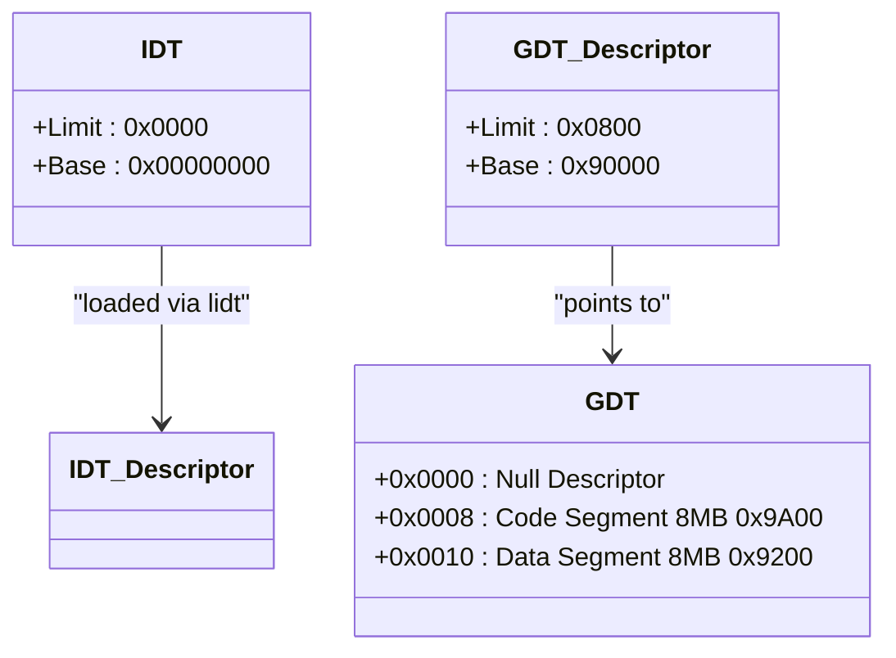
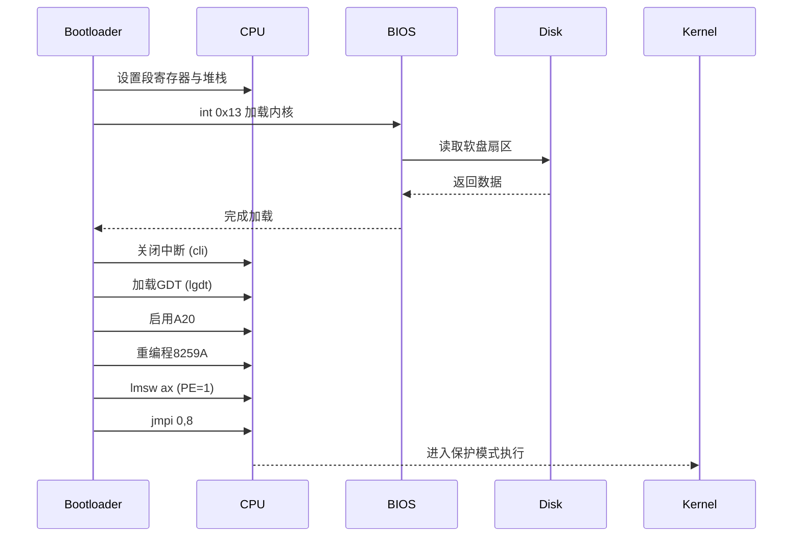

# Bootloader引导过程

<cite>
**本文档中引用的文件**  
- [boot.s](file://boot/boot.s#L1-L330)
- [head.h](file://include/linux/head.h#L1-L20)
- [system.h](file://include/asm/system.h#L1-L66)
- [build.c](file://tools/build.c#L1-L68)
- [console.c](file://kernel/console.c#L532-L549)
</cite>

## 目录
1. [引导流程概述](#引导流程概述)
2. [内存布局与段寄存器设置](#内存布局与段寄存器设置)
3. [内核加载机制](#内核加载机制)
4. [中断控制器重编程](#中断控制器重编程)
5. [GDT与IDT描述符结构](#gdt与idt描述符结构)
6. [A20地址线启用](#a20地址线启用)
7. [保护模式切换](#保护模式切换)
8. [系统限制与设计影响](#系统限制与设计影响)

## 引导流程概述

Linux 0.01的`boot/boot.s`引导程序在BIOS加载至0x7C00后，执行一系列关键操作以准备进入保护模式并加载内核。该过程包括：将自身移动到0x90000高内存段、通过BIOS中断加载内核镜像、关闭中断、设置堆栈、重新映射中断向量表、启用A20地址线、重编程8259A中断控制器、加载全局描述符表（GDT）和中断描述符表（IDT），最终跳转至保护模式执行内核。

此引导程序被设计得极为简洁，限制在512字节以内，并通过`tools/build.c`工具构建最终的磁盘镜像。

**Section sources**
- [boot.s](file://boot/boot.s#L1-L50)
- [build.c](file://tools/build.c#L1-L68)

## 内存布局与段寄存器设置

引导程序初始加载于0x7C00（即段地址0x07C0），为避免与后续系统加载区域冲突，首先将自身复制到0x90000（段地址0x9000）。通过设置`BOOTSEG`和`INITSEG`常量，使用`movw`指令配合`rep`前缀完成256字（512字节）的内存复制。

随后，程序设置数据段（DS）、附加段（ES）和堆栈段（SS）寄存器指向`INITSEG`，并初始化堆栈指针（SP）至0x400，确保后续操作在安全的高内存区域进行。

**Section sources**
- [boot.s](file://boot/boot.s#L40-L60)

## 内核加载机制

内核镜像被加载至物理地址0x10000（段地址0x1000），由`read_it`函数负责通过BIOS中断`int 0x13`实现。该函数采用高效策略，尽可能一次性读取整个磁道的数据，避免跨越64KB边界。

`read_it`函数通过`read_track`调用BIOS服务，传入磁头（head）、磁道（track）和扇区（sread）信息，循环读取直至完成。若发生读取错误，程序会重置磁盘控制器并重试，防止无限循环。

**Section sources**
- [boot.s](file://boot/boot.s#L85-L105)
- [boot.s](file://boot/boot.s#L250-L285)

## 中断控制器重编程

由于IBM PC架构的历史遗留问题，BIOS默认将硬件中断映射至0x08-0x0F，与Intel保留的异常向量冲突。因此，引导程序必须对主从两片8259A中断控制器进行重编程，将中断向量基址移至0x20-0x2F。

通过发送初始化命令字（ICW1-ICW4），设置主控制器（IRQ0-7）起始于0x20，从控制器（IRQ8-15）起始于0x28，并配置为级联模式和8086模式。最后屏蔽所有中断，确保进入保护模式前的稳定性。

**Section sources**
- [boot.s](file://boot/boot.s#L130-L150)

## GDT与IDT描述符结构

全局描述符表（GDT）定义了两个核心段：代码段和数据段，均以0为基地址，限长8MB，粒度为4KB，适用于386保护模式。GDT表位于`gdt`标签处，包含一个空描述符和两个有效描述符。

中断描述符表（IDT）初始为空（`idt_48`中限长为0），将在内核初始化阶段由`setup_idt`函数重新设置。GDT的加载通过`lgdt`指令完成，其描述符`gdt_48`包含限长（0x800）和基址（`gdt`所在段0x90000）。

**Diagram sources**
- [boot.s](file://boot/boot.s#L297-L316)
- [head.h](file://include/linux/head.h#L1-L20)

**Section sources**
- [boot.s](file://boot/boot.s#L124-L125)
- [boot.s](file://boot/boot.s#L297-L316)

## A20地址线启用

为访问1MB以上的内存空间，必须启用A20地址线。程序通过I/O端口0x64和0x60与键盘控制器（8042）通信，发送命令字0xD1，随后输出数据0xDF以开启A20。每次操作前调用`empty_8042`确保输入缓冲区为空，防止控制器阻塞。

此步骤是进入保护模式的前提，否则高地址位将被屏蔽，导致内存访问错误。

**Section sources**
- [boot.s](file://boot/boot.s#L110-L120)

## 保护模式切换

完成所有准备工作后，程序通过设置CR0寄存器的PE（Protection Enable）位进入保护模式。使用`lmsw`指令将CR0的bit 0置1，随后执行远跳转`jmpi 0,8`，其中8为代码段选择子（GDT中索引1 << 3），跳转至0x00000地址，正式进入32位保护模式执行内核代码。

内核需自行重新初始化保护模式环境，包括重新设置GDT、IDT和分页机制。

**Diagram sources**
- [boot.s](file://boot/boot.s#L124-L160)

**Section sources**
- [boot.s](file://boot/boot.s#L155-L160)

## 系统限制与设计影响

引导程序假设内核大小不超过512KB（8 * 65536字节），此限制源于早期设计对内存布局的简化考虑。内核被加载至0x10000并随后移动至0x00000，低640KB内存用于缓存和块设备，而1MB以上内存采用需求分页管理。

尽管后续版本缓存内存也分配在1MB以上，但512KB的内核大小限制仍被保留，体现了Linus对简洁性和可维护性的追求。此设计避免了复杂的内存管理逻辑，使引导过程更加可靠。

**Section sources**
- [boot.s](file://boot/boot.s#L15-L30)
- [config.h](file://include/linux/config.h#L1-L52)