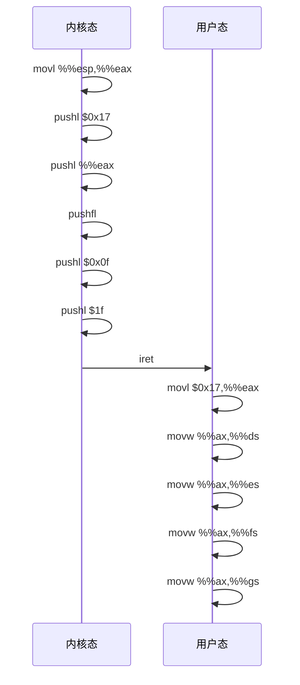

# 内核主初始化流程

<cite>
**本文档引用的文件**
- [main.c](file://init/main.c)
- [traps.c](file://kernel/traps.c)
- [sched.c](file://kernel/sched.c)
- [buffer.c](file://fs/buffer.c)
- [hd.c](file://kernel/hd.c)
- [tty_io.c](file://kernel/tty_io.c)
- [system.h](file://include/asm/system.h)
- [sched.h](file://include/linux/sched.h)
</cite>

## 目录
1. [引言](#引言)
2. [初始化序列分析](#初始化序列分析)
3. [中断与特权级切换](#中断与特权级切换)
4. [进程创建与idle循环](#进程创建与idle循环)
5. [init函数执行流程](#init函数执行流程)
6. [系统启动总结](#系统启动总结)

## 引言
本文件详细解析Linux 0.01内核中`init/main.c`的`main()`函数执行流程。该函数是内核进入C语言环境后的核心起点，负责完成系统关键子系统的初始化，并建立第一个用户进程环境。文档将深入分析从内核启动到shell自动运行的完整过程。

## 初始化序列分析

`main()`函数在中断禁用状态下开始执行，依次调用多个初始化函数，为系统建立基本运行环境。

### 时间子系统初始化
`time_init()`函数通过CMOS实时时钟读取系统启动时间。该函数使用`CMOS_READ`宏直接访问CMOS内存地址，获取BCD编码的秒、分、时、日、月、年信息，经`BCD_TO_BIN`转换为二进制后，调用`kernel_mktime()`计算自1970年1月1日以来的秒数，存储于`startup_time`全局变量中。

**Section sources**
- [main.c](file://init/main.c#L57-L76)

### 终端子系统初始化
`tty_init()`函数初始化终端设备，包括串行端口和控制台。该函数调用`rs_init()`初始化串行通信，调用`con_init()`初始化控制台显示，为后续的用户交互建立基础。

**Section sources**
- [tty_io.c](file://kernel/tty_io.c#L93-L97)

### 异常处理初始化
`trap_init()`函数设置异常向量表，将各种处理器异常与对应的处理函数关联。该函数使用`set_trap_gate()`和`set_system_gate()`宏设置IDT（中断描述符表）条目，注册了从除零错误到页面异常等32个处理器异常的处理程序。

```mermaid
flowchart TD
A[trap_init] --> B[set_trap_gate(0, &divide_error)]
A --> C[set_trap_gate(1, &debug)]
A --> D[set_trap_gate(2, &nmi)]
A --> E[set_system_gate(3, &int3)]
A --> F[set_system_gate(4, &overflow)]
A --> G[set_system_gate(5, &bounds)]
A --> H[set_trap_gate(6, &invalid_op)]
A --> I[set_trap_gate(7, &device_not_available)]
A --> J[set_trap_gate(8, &double_fault)]
A --> K[set_trap_gate(9, &coprocessor_segment_overrun)]
A --> L[set_trap_gate(10, &invalid_TSS)]
A --> M[set_trap_gate(11, &segment_not_present)]
A --> N[set_trap_gate(12, &stack_segment)]
A --> O[set_trap_gate(13, &general_protection)]
A --> P[set_trap_gate(14, &page_fault)]
A --> Q[set_trap_gate(15, &reserved)]
A --> R[set_trap_gate(16, &coprocessor_error)]
A --> S[for i=17 to 31: set_trap_gate(i, &reserved)]
```

**Diagram sources**
- [traps.c](file://kernel/traps.c#L169-L197)

### 调度器初始化
`sched_init()`函数初始化进程调度系统。该函数设置GDT中的TSS和LDT描述符，初始化任务数组，配置8253定时器（设置为模式3，频率为HZ），设置定时器中断处理程序`timer_interrupt`，并启用系统调用门`system_call`。

**Section sources**
- [sched.c](file://kernel/sched.c#L230-L253)

### 缓冲区管理初始化
`buffer_init()`函数初始化缓冲区高速缓存系统。该函数从`start_buffer`开始，为每个缓冲区头结构分配内存，初始化其字段，建立空闲链表，并清空哈希表，为文件系统I/O操作提供缓冲支持。

**Section sources**
- [buffer.c](file://fs/buffer.c#L224-L253)

### 硬盘驱动初始化
`hd_init()`函数初始化硬盘驱动。该函数初始化请求队列，设置硬盘分区信息，注册硬盘中断处理程序`hd_interrupt`，并启用相应的中断线，为块设备访问做好准备。

**Section sources**
- [hd.c](file://kernel/hd.c#L396-L412)

## 中断与特权级切换

### 中断启用
在完成关键子系统初始化后，`main()`函数调用`sti()`指令启用中断。`sti`宏通过内联汇编执行`sti`指令，允许处理器响应外部中断。

### 特权级切换
`move_to_user_mode()`宏实现从内核态到用户态的特权级切换。该宏通过构造一个假的中断返回堆栈，包含用户代码段选择子(0x0f)和用户数据段选择子(0x17)，然后执行`iret`指令，完成从特权级0到特权级3的转换。



**Diagram sources**
- [system.h](file://include/asm/system.h#L1-L15)

## 进程创建与idle循环

### 第一个用户进程创建
`if (!fork()) init();`语句创建第一个用户进程。`fork()`系统调用复制当前进程（任务0），子进程返回0，父进程返回子进程PID。由于`!fork()`在子进程中为真，子进程执行`init()`函数，而父进程（任务0）继续执行后续代码。

### idle进程行为
父进程进入无限循环`for(;;) pause();`，成为idle进程（任务0）。`pause()`系统调用使进程进入可中断睡眠状态，但任务0是特例：当没有其他进程可运行时，调度器总是选择任务0，因此`pause()`在这里仅表示检查是否有其他任务可运行，若无则返回循环。

**Section sources**
- [main.c](file://init/main.c#L77-L88)

## init函数执行流程

`init()`函数执行系统最后的初始化步骤，建立用户环境。

### 文件系统设置
`init()`首先调用`setup()`系统调用读取硬盘分区表，验证其正确性，并挂载根文件系统，为后续文件访问提供基础。

### 后台更新进程
`init()`调用`fork()`创建子进程执行`/bin/update`程序。该程序定期将缓冲区中的脏数据写回磁盘，确保文件系统一致性。

### Shell进程创建
`init()`再次`fork()`创建Shell进程。新进程关闭标准输入、输出、错误文件描述符，重新打开`/dev/tty0`作为标准输入，并使用`dup()`复制文件描述符，建立标准输入输出重定向。最后调用`execve("/bin/sh",argv,envp)`执行Shell程序。

```mermaid
flowchart TD
A[init] --> B[fork]
B --> C{子进程?}
C --> |是| D[execve("/bin/update")]
C --> |否| E[fork]
E --> F{子进程?}
F --> |是| G[close(0,1,2)]
G --> H[open("/dev/tty0")]
H --> I[dup(0), dup(0)]
I --> J[execve("/bin/sh")]
F --> |否| K[wait]
K --> L[sync]
L --> M[_exit(0)]
```

**Diagram sources**
- [main.c](file://init/main.c#L104-L138)

**Section sources**
- [main.c](file://init/main.c#L104-L138)

## 系统启动总结
`main()`函数完整地展示了Linux 0.01内核的启动流程：从硬件初始化到异常处理，从调度系统到设备驱动，最终通过进程创建机制建立用户环境。这一过程体现了微内核设计的精髓，为后续的系统运行奠定了坚实基础。