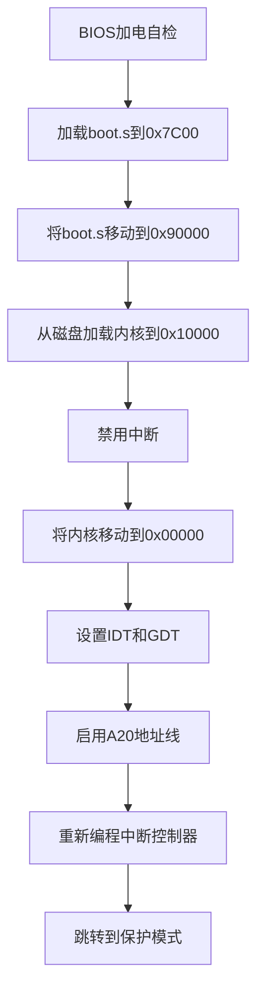
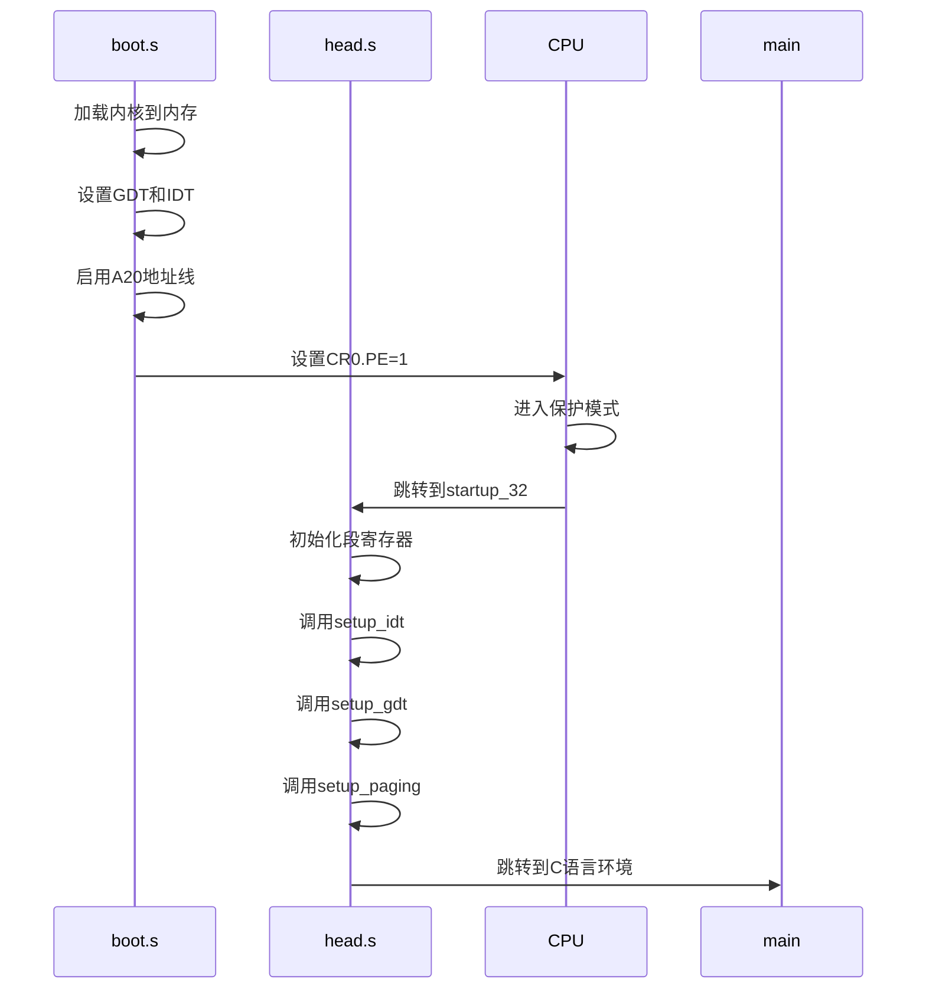
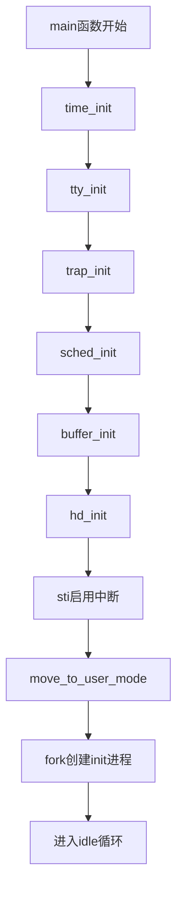
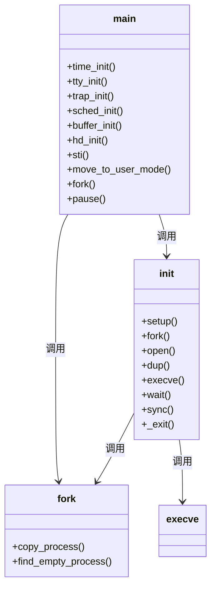

# 内核启动流程

<cite>
**本文档中引用的文件**   
- [boot.s](file://boot/boot.s)
- [head.s](file://boot/head.s)
- [main.c](file://init/main.c)
- [head.h](file://include/linux/head.h)
- [system.h](file://include/asm/system.h)
- [sched.c](file://kernel/sched.c)
- [traps.c](file://kernel/traps.c)
- [tty_io.c](file://kernel/tty_io.c)
</cite>

## 目录
1. [简介](#简介)
2. [实模式引导过程](#实模式引导过程)
3. [保护模式切换与初始化](#保护模式切换与初始化)
4. [内核初始化流程](#内核初始化流程)
5. [进程创建与Shell执行](#进程创建与shell执行)
6. [关键数据结构分析](#关键数据结构分析)
7. [结论](#结论)

## 简介
本文档深入解析Linux-0.01操作系统的完整启动流程，从硬件加电到用户shell执行的全过程。详细阐述了系统在实模式下的引导过程、向32位保护模式的切换机制、内核核心初始化函数的调用顺序，以及第一个用户进程的创建和shell执行过程。

## 实模式引导过程

`boot/boot.s`是系统启动的第一个代码模块，由BIOS加载到内存地址0x7c00处执行。该程序首先将自身移动到0x90000位置，然后从磁盘加载内核到0x10000位置。在加载完成后，程序禁用所有中断，将系统代码从0x10000向下移动到0x00000位置，为进入保护模式做准备。

引导程序通过BIOS中断服务读取磁盘数据，支持不同容量的软盘（1.44MB、1.2MB、720KB），其中1.44MB磁盘每磁道18个扇区。程序在加载过程中会显示"Loading system ..."提示信息，并保存光标位置供后续使用。

在准备进入保护模式前，引导程序重新编程8259A中断控制器，将中断向量从BIOS使用的0x08-0x0f范围重新映射到0x20-0x2f范围，避免与硬件保留中断冲突。同时，程序通过8042键盘控制器启用A20地址线，使处理器能够访问1MB以上的内存空间。



**图示来源**
- [boot.s](file://boot/boot.s#L1-L330)

**本节来源**
- [boot.s](file://boot/boot.s#L1-L330)

## 保护模式切换与初始化

从实模式切换到32位保护模式是系统启动的关键步骤。`boot/boot.s`通过设置CR0寄存器的PE（Protection Enable）位来激活保护模式，然后使用长跳转指令`jmpi 0,8`跳转到保护模式下的代码段。

进入保护模式后，执行流程转移到`boot/head.s`中的`startup_32`标签处。该代码首先设置各个段寄存器（DS、ES、FS、GS）为0x10，指向GDT中的数据段描述符，并设置堆栈指针。随后调用`setup_idt`和`setup_gdt`函数初始化中断描述符表（IDT）和全局描述符表（GDT）。

系统在`setup_paging`函数中启用分页机制，设置页目录和页表，实现前8MB内存的恒等映射。分页启用后，虚拟地址与物理地址在前8MB范围内保持一致，为内核运行提供内存管理基础。



**图示来源**
- [boot.s](file://boot/boot.s#L1-L330)
- [head.s](file://boot/head.s#L1-L176)

**本节来源**
- [boot.s](file://boot/boot.s#L1-L330)
- [head.s](file://boot/head.s#L1-L176)

## 内核初始化流程

内核初始化的核心是`init/main.c`文件中的`main`函数，该函数在系统进入保护模式并建立C语言运行环境后被调用。初始化过程严格按照特定顺序执行一系列关键函数：

首先调用`time_init()`从CMOS实时时钟读取当前时间，并转换为系统时间格式。接着`tty_init()`初始化终端子系统，包括串行端口和控制台。`trap_init()`设置异常处理向量，为系统稳定运行提供保障。

`traps_init()`函数通过调用`set_trap_gate`宏为各种处理器异常设置中断门，包括除零错误、堆栈段错误、通用保护错误等。这些异常处理程序在系统出现异常时会被调用，通常会打印调试信息并终止相关进程。

`sched_init()`是调度系统初始化函数，它完成多项重要任务：设置初始任务的TSS和LDT描述符、初始化8253/8254定时器芯片、设置时钟中断向量（IRQ0）、启用系统调用中断门（int 0x80）。定时器设置为每秒100次中断（HZ=100），为进程调度提供时间基准。

最后调用`buffer_init()`初始化缓冲区管理，`hd_init()`初始化硬盘驱动，然后通过`sti()`指令启用中断，使系统能够响应外部事件。



**图示来源**
- [main.c](file://init/main.c#L1-L148)
- [traps.c](file://kernel/traps.c#L1-L200)
- [sched.c](file://kernel/sched.c#L1-L255)

**本节来源**
- [main.c](file://init/main.c#L1-L148)
- [traps.c](file://kernel/traps.c#L1-L200)
- [sched.c](file://kernel/sched.c#L1-L255)

## 进程创建与Shell执行

系统初始化完成后，通过`move_to_user_mode()`宏切换到用户模式，然后调用`fork()`系统调用创建第一个用户进程。`move_to_user_mode()`使用内联汇编实现模式切换，通过`iret`指令从内核态切换到用户态，修改CS和SS段选择符为用户代码段和数据段。

`fork()`系统调用在`kernel/fork.c`中实现，它复制当前进程（任务0）的几乎所有内容，创建一个新的进程。新进程获得独立的内存空间、文件描述符表和任务结构体，但共享父进程的代码段。`fork()`返回时，在父进程中返回子进程PID，在子进程中返回0。

在`main`函数中，`if (!fork())`条件判断确保只有子进程执行`init()`函数。`init()`函数首先调用`setup()`系统调用（在Linux-0.01中为空函数），然后创建一个后台进程执行`/bin/update`程序（用于定期同步文件系统）。

主`init`进程随后打开`/dev/tty0`作为标准输入、输出和错误输出（通过`dup`系统调用复制文件描述符）。然后再次调用`fork()`创建shell进程。在子进程中，关闭所有文件描述符，创建新会话（`setsid`），重新打开终端设备，最后通过`execve("/bin/sh", argv, envp)`执行shell程序。

父进程调用`wait()`等待shell进程结束，如果shell异常退出则打印错误信息，然后调用`sync()`同步文件系统并退出。由于`init`进程不应正常退出，这里的`_exit(0)`实际上不会被执行。



**图示来源**
- [main.c](file://init/main.c#L1-L148)
- [fork.c](file://kernel/fork.c#L1-L135)

**本节来源**
- [main.c](file://init/main.c#L1-L148)
- [fork.c](file://kernel/fork.c#L1-L135)

## 关键数据结构分析

Linux-0.01内核使用多个关键数据结构来管理系统资源和状态。最重要的包括任务结构体（task_struct）、全局描述符表（GDT）和中断描述符表（IDT）。

`task_struct`定义在`include/linux/sched.h`中，是进程管理的核心数据结构。每个进程都有一个对应的`task_struct`实例，存储进程状态、PID、优先级、信号处理函数、文件描述符表、内存管理信息以及TSS（任务状态段）等。系统最多支持64个任务（NR_TASKS=64）。

GDT和IDT在`include/linux/head.h`中声明为全局变量。GDT包含256个描述符，前几个条目分别为：空描述符（索引0）、代码段描述符（索引1）、数据段描述符（索引2）和临时描述符（索引3）。从索引4开始是TSS和LDT描述符，每个任务占用两个条目（TSS和LDT）。

IDT同样包含256个中断门描述符，通过`setup_idt`函数初始化为指向`ignore_int`处理程序。各个子系统（如`trap_init`）随后设置特定中断向量的处理函数。中断门描述符包含段选择符、偏移量、类型和特权级等信息。

TSS结构体（`tss_struct`）包含处理器所有寄存器的快照，用于任务切换时保存和恢复执行上下文。LDT（局部描述符表）为每个任务提供独立的内存段视图，但在Linux-0.01中基本未使用。

```mermaid
erDiagram
TASK_STRUCT {
long state
long counter
long priority
long signal
fn_ptr sig_restorer
fn_ptr sig_fn[32]
long pid
long father
int tty
struct file * filp[NR_OPEN]
struct desc_struct ldt[3]
struct tss_struct tss
}
TSS_STRUCT {
long esp0
long ss0
long cr3
long eip
long eflags
long eax-edi
long es-gs
long ldt
struct i387_struct i387
}
DESC_STRUCT {
unsigned long a
unsigned long b
}
TASK_STRUCT ||--o{ TSS_STRUCT : "包含"
TASK_STRUCT ||--o{ DESC_STRUCT : "包含ldt"
TASK_STRUCT }|--|| TASK_STRUCT : "通过task数组关联"
```

**图示来源**
- [head.h](file://include/linux/head.h#L1-L21)
- [sched.h](file://include/linux/sched.h#L1-L231)
- [system.h](file://include/asm/system.h#L1-L67)

**本节来源**
- [head.h](file://include/linux/head.h#L1-L21)
- [sched.h](file://include/linux/sched.h#L1-L231)
- [system.h](file://include/asm/system.h#L1-L67)

## 结论

Linux-0.01的启动流程展示了操作系统从硬件加电到用户环境建立的完整过程。系统首先在实模式下由BIOS引导，加载内核到内存；然后通过精心设计的代码切换到32位保护模式，建立分页机制；接着在C语言环境中初始化各个子系统；最后创建第一个用户进程并执行shell，为用户提供交互界面。

这一流程体现了操作系统设计的核心思想：逐步建立抽象层，从硬件细节中抽象出高级服务。通过分析这一经典实现，可以深入理解现代操作系统的启动机制和设计原理。