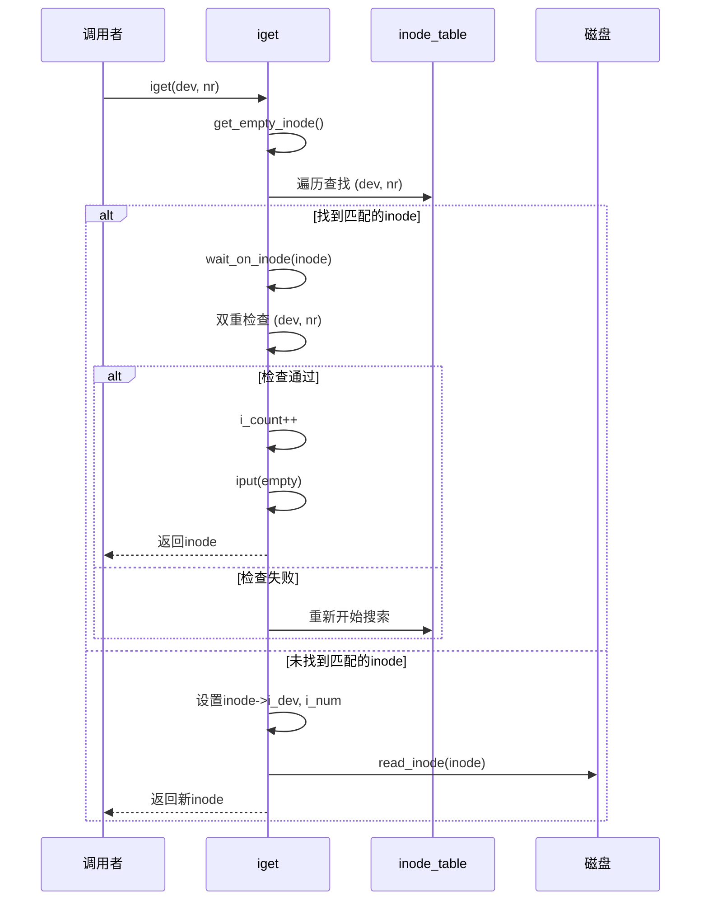
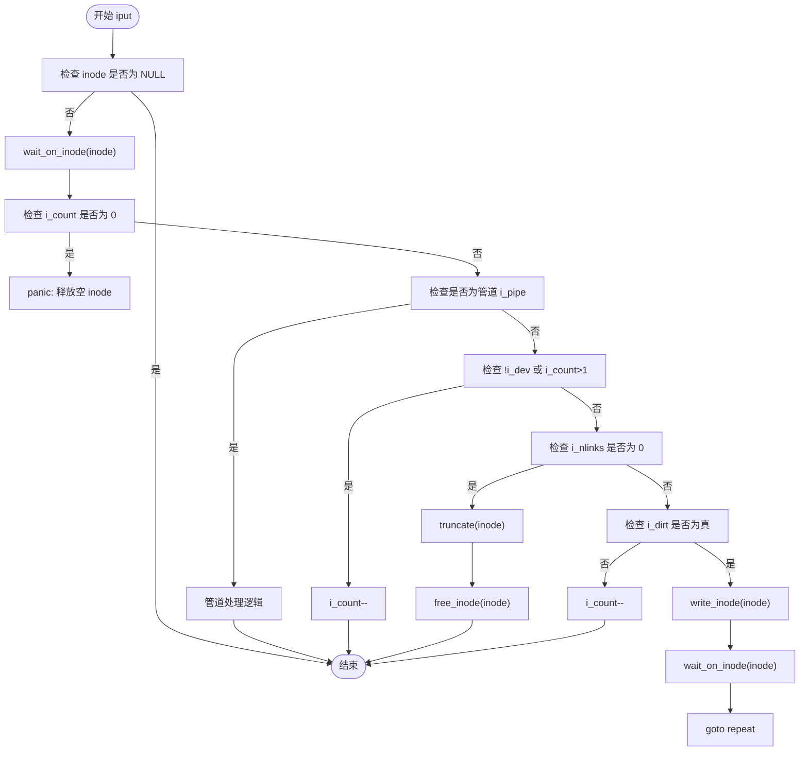

# inode生命周期管理

<cite>
**本文档引用的文件**  
- [inode.c](file://fs/inode.c)
- [fs.h](file://include/linux/fs.h)
- [super.c](file://fs/super.c)
- [namei.c](file://fs/namei.c)
</cite>

## 目录
1. [引言](#引言)
2. [核心数据结构](#核心数据结构)
3. [iget() 的 inode 获取机制](#iget-的-inode-获取机制)
4. [iput() 的引用计数与清理策略](#iput-的引用计数与清理策略)
5. [get_empty_inode() 的空闲 inode 分配逻辑](#get_empty_inode-的空闲-inode-分配逻辑)
6. [路径解析与 inode 定位：namei() 与 open_namei()](#路径解析与-inode-定位namei-与-open_namei)
7. [内存 inode 与磁盘 inode 的同步机制](#内存-inode-与磁盘-inode-的同步机制)
8. [超级块与 inode 的关联](#超级块与-inode-的关联)
9. [错误处理与双重检查模式](#错误处理与双重检查模式)
10. [总结](#总结)

## 引言
在 Linux 0.01 内核中，`inode` 是文件系统的核心数据结构，用于描述文件或目录的元数据。`inode` 的生命周期管理涉及从内存缓存中获取、创建、释放以及与磁盘同步等多个环节。本文档深入分析 `fs/inode.c` 中的 `iget()`、`iput()` 和 `get_empty_inode()` 等关键函数，结合 `include/linux/fs.h` 中的 `m_inode` 结构体定义，全面阐述 `inode` 的生命周期管理机制。

## 核心数据结构

`m_inode` 结构体定义了内存中的 inode 状态，其关键字段包括：

- **i_count**: 引用计数，表示当前有多少进程或文件描述符正在使用该 inode。
- **i_dirt**: 脏标志，指示该 inode 在内存中的元数据已被修改，需要写回磁盘。
- **i_lock**: 锁标志，用于同步对 inode 的访问，防止并发修改。
- **i_dev**: 设备号，标识该 inode 所属的设备。
- **i_num**: inode 编号，与设备号共同唯一标识一个 inode。
- **i_wait**: 等待队列，当 inode 被锁定时，其他进程将在此队列上睡眠。

这些字段共同维护了 inode 的状态，是实现其生命周期管理的基础。

**Section sources**
- [fs.h](file://include/linux/fs.h#L60-L80)

## iget() 的 inode 获取机制

`iget(int dev, int nr)` 函数负责根据设备号 `dev` 和 inode 编号 `nr` 从 `inode_table` 中获取或加载一个 inode。

### 获取流程
1.  **参数校验**: 首先检查 `dev` 是否为 0，若为 0 则触发内核恐慌（panic）。
2.  **预分配空闲 inode**: 调用 `get_empty_inode()` 预先获取一个空闲的 inode 槽位，用于后续可能的加载操作。
3.  **查找现有 inode**: 遍历 `inode_table`，寻找 `i_dev` 和 `i_num` 均匹配的 inode。
4.  **处理竞争条件**: 当找到匹配的 inode 后，会调用 `wait_on_inode(inode)` 等待该 inode 解锁。这是一个关键步骤，因为另一个进程可能正在修改此 inode。
5.  **双重检查（Double-Check）**: 在等待解锁后，必须再次检查 `i_dev` 和 `i_num` 是否仍然匹配。这是因为在等待期间，该 inode 可能已被其他进程释放并重新分配给了其他文件。如果检查失败，则从头开始搜索。
6.  **成功获取**: 如果双重检查通过，则将 `i_count` 加 1，并释放之前预分配的空闲 inode（通过 `iput(empty)`），然后返回该 inode。
7.  **加载新 inode**: 如果遍历完 `inode_table` 都未找到匹配项，则将预分配的空闲 inode 用作新 inode，设置其 `i_dev` 和 `i_num`，并调用 `read_inode(inode)` 从磁盘读取其元数据。

**Diagram sources**
- [inode.c](file://fs/inode.c#L217-L247)

**Section sources**
- [inode.c](file://fs/inode.c#L217-L247)

## iput() 的引用计数与清理策略

`iput(struct m_inode * inode)` 函数负责递减 inode 的引用计数，并在适当时机进行清理。

### 处理逻辑
1.  **空指针检查**: 如果 `inode` 为 `NULL`，则直接返回。
2.  **等待解锁**: 调用 `wait_on_inode(inode)` 确保在操作前 inode 处于解锁状态。
3.  **引用计数检查**: 如果 `i_count` 已经为 0，则触发内核恐慌，因为试图释放一个未被引用的 inode 是严重错误。
4.  **管道 inode 特殊处理**: 如果是管道 inode (`i_pipe` 为真)，则唤醒等待队列，递减 `i_count`。如果 `i_count` 变为 0，则释放其占用的页面，并重置相关字段。
5.  **普通 inode 处理**:
    - 如果 `i_dev` 为 0（表示未关联设备）或 `i_count` 大于 1，则只需将 `i_count` 减 1。
    - 否则，进入清理流程：
        - **无链接检查**: 如果 `i_nlinks` 为 0，表示该文件已被删除，调用 `truncate(inode)` 释放所有数据块，然后调用 `free_inode(inode)` 将其从内存中移除。
        - **脏数据检查**: 如果 `i_dirt` 为真，表示数据已修改但未写回磁盘，调用 `write_inode(inode)` 将其写回，并使用 `goto repeat` 重新检查状态（因为写回操作可能导致睡眠，状态可能已改变）。
        - **正常递减**: 如果以上条件均不满足，则将 `i_count` 减 1，完成释放。

**Diagram sources**
- [inode.c](file://fs/inode.c#L126-L160)

**Section sources**
- [inode.c](file://fs/inode.c#L126-L160)

## get_empty_inode() 的空闲 inode 分配逻辑

`get_empty_inode()` 函数负责从 `inode_table` 中找到一个空闲的 inode 槽位。

### 查找策略
1.  **循环查找**: 使用一个 `while(1)` 循环确保最终能找到一个空闲 inode。
2.  **起始点**: 从 `last_allocated_inode` 记录的位置开始查找，以实现轮询分配，避免每次都从头开始。
3.  **线性扫描**: 从起始点开始，线性扫描 `inode_table`，寻找 `i_count` 为 0 的 inode。
4.  **环形遍历**: 如果到达数组末尾，则从头开始，直到再次回到起始点。如果遍历一圈都未找到，则说明内存中没有空闲 inode，触发内核恐慌。
5.  **状态清理**: 找到候选 inode 后，会等待其解锁 (`wait_on_inode`)，并循环调用 `write_inode` 将其所有脏数据写回磁盘，确保其状态干净。
6.  **最终检查**: 在返回前，再次检查 `i_count` 是否仍为 0，以防在等待期间被其他进程抢占。
7.  **初始化**: 调用 `memset` 将 inode 内存清零，并将 `i_count` 设置为 1，表示已被占用。

此函数是 `iget()` 能够创建新 inode 的基础，它确保了内存中 inode 缓存的可用性。

**Section sources**
- [inode.c](file://fs/inode.c#L164-L199)

## 路径解析与 inode 定位：namei() 与 open_namei()

`namei()` 和 `open_namei()` 是高层函数，它们通过路径名最终定位到目标 inode。

### namei() 流程
`namei(const char * pathname)` 用于获取指定路径名的 inode。
1.  调用 `dir_namei()` 解析路径，获取目标文件所在目录的 inode (`dir`) 和文件名 (`basename`)。
2.  在 `dir` 目录中调用 `find_entry()` 查找名为 `basename` 的目录项。
3.  如果找到，获取其对应的 `inode number (inr)` 和 `device number (dev)`。
4.  调用 `iget(dev, inr)` 获取该 inode 的内存实例。
5.  更新 `i_atime`（访问时间）和 `i_dirt` 标志，然后返回。

### open_namei() 流程
`open_namei()` 是 `open` 系统调用的核心，逻辑更复杂，因为它需要处理文件创建和权限检查。
1.  同样通过 `dir_namei()` 定位父目录。
2.  调用 `find_entry()` 查找文件。
3.  **文件不存在且需创建**: 如果文件不存在且 `O_CREAT` 标志被设置，则调用 `new_inode()` 创建新 inode，设置模式和权限，然后调用 `add_entry()` 在父目录中添加新的目录项。
4.  **文件存在**: 如果文件存在，则调用 `iget(dev, inr)` 获取其 inode。
5.  进行权限检查（读/写/执行）和特殊标志处理（如 `O_EXCL`、`O_TRUNC`）。
6.  最终将 inode 指针通过 `res_inode` 参数返回。

这两个函数都依赖于 `iget()` 来完成最终的 inode 获取，体现了内核文件系统接口的分层设计。

**Section sources**
- [namei.c](file://fs/namei.c#L272-L299)
- [namei.c](file://fs/namei.c#L306-L378)

## 内存 inode 与磁盘 inode 的同步机制

内存中的 `m_inode` 与磁盘上的 `d_inode` 需要保持同步。`fs.h` 中定义了两种结构体：
- `d_inode`: 磁盘上的 inode 结构，仅包含持久化元数据（如 `i_mode`, `i_size`, `i_time`, `i_zone`）。
- `m_inode`: 内存中的 inode 结构，除了包含 `d_inode` 的所有字段外，还增加了运行时状态（如 `i_count`, `i_dirt`, `i_lock`）。

### 同步策略
- **读取同步**: 当 `iget()` 需要从磁盘加载一个新 inode 时，会调用 `read_inode()` 函数。该函数通过 `get_super()` 获取超级块，计算出 inode 在磁盘上的块号，然后用 `bread()` 读取该块，并将 `d_inode` 数据复制到 `m_inode` 中。
- **写入同步**: 当内存中的 inode 被修改后，`i_dirt` 标志会被置位。`write_inode()` 函数负责将 `m_inode` 中的 `d_inode` 部分写回磁盘。`iput()` 在释放 inode 时，如果发现 `i_dirt` 为真，会主动调用 `write_inode()` 进行同步。此外，`sync_inodes()` 函数会遍历整个 `inode_table`，将所有脏的 inode 写回磁盘，用于系统级的同步操作。

这种机制确保了数据的一致性，同时通过延迟写回（lazy write）提高了性能。

**Section sources**
- [inode.c](file://fs/inode.c#L249-L288)
- [fs.h](file://include/linux/fs.h#L40-L80)

## 超级块与 inode 的关联

超级块（`super_block`）是文件系统的控制信息块，包含了文件系统整体的元数据，如 inode 总数、位图块数等。

`get_super(int dev)` 函数是连接 inode 与超级块的关键。它遍历 `super_block` 数组，查找与指定设备号 `dev` 匹配的超级块。`read_inode()` 和 `write_inode()` 在计算 inode 的磁盘块位置时，都依赖于 `get_super()` 返回的超级块信息来确定 inode 位图和数据区的起始位置。

例如，在 `read_inode()` 中，inode 的磁盘块号计算公式为：
`block = 2 + sb->s_imap_blocks + sb->s_zmap_blocks + (inode->i_num-1)/INODES_PER_BLOCK`
其中 `sb` 就是通过 `get_super(inode->i_dev)` 获取的。这表明，没有超级块，就无法定位磁盘上的 inode 数据。

**Section sources**
- [super.c](file://fs/super.c#L95-L102)
- [inode.c](file://fs/inode.c#L249-L288)

## 错误处理与双重检查模式

### iget() 调用失败
`iget()` 可能因以下原因失败：
1.  **设备号无效**: `dev` 为 0，直接触发 `panic`。
2.  **内存耗尽**: `get_empty_inode()` 无法找到空闲槽位，导致 `empty` 为 `NULL`，此时 `iget()` 直接返回 `NULL`。
3.  **磁盘 I/O 错误**: `read_inode()` 内部调用 `bread()` 读取磁盘块失败，会触发 `panic`。

对于调用者而言，必须检查 `iget()` 的返回值。如果返回 `NULL`，应视为错误并进行相应处理（如返回 `-EACCES`）。

### 双重检查模式
在 `iget()` 函数中，双重检查模式是解决并发竞争的关键。
1.  **第一次检查**: 在持有锁之前，快速检查 `i_dev` 和 `i_num`。如果失败，直接跳过，避免不必要的锁操作。
2.  **等待锁**: 调用 `wait_on_inode(inode)`，在此期间，该 inode 可能被其他进程修改或释放。
3.  **第二次检查**: 在获得锁后，必须重新检查 `i_dev` 和 `i_num`。如果检查失败，说明该 inode 已被重新分配，不能使用，必须从头开始搜索。

这种模式确保了在多进程环境下，`iget()` 返回的 inode 始终是调用者真正需要的那个，避免了竞态条件导致的数据错乱。

**Section sources**
- [inode.c](file://fs/inode.c#L217-L247)

## 总结
Linux 0.01 的 inode 生命周期管理是一个精巧的内存缓存与磁盘同步机制。`iget()` 和 `iput()` 构成了引用计数的核心，通过 `i_count` 实现了 inode 的共享和自动回收。`get_empty_inode()` 提供了内存管理的基础设施。`namei()` 和 `open_namei()` 等高层函数利用这些基础服务，实现了路径解析和文件访问。通过 `i_dirt` 和 `i_lock` 等状态标志，内核有效地管理了内存与磁盘之间的数据一致性，并利用双重检查模式等技术解决了并发访问的竞态问题。整个设计简洁而高效，体现了早期 Unix 系统设计的精髓。