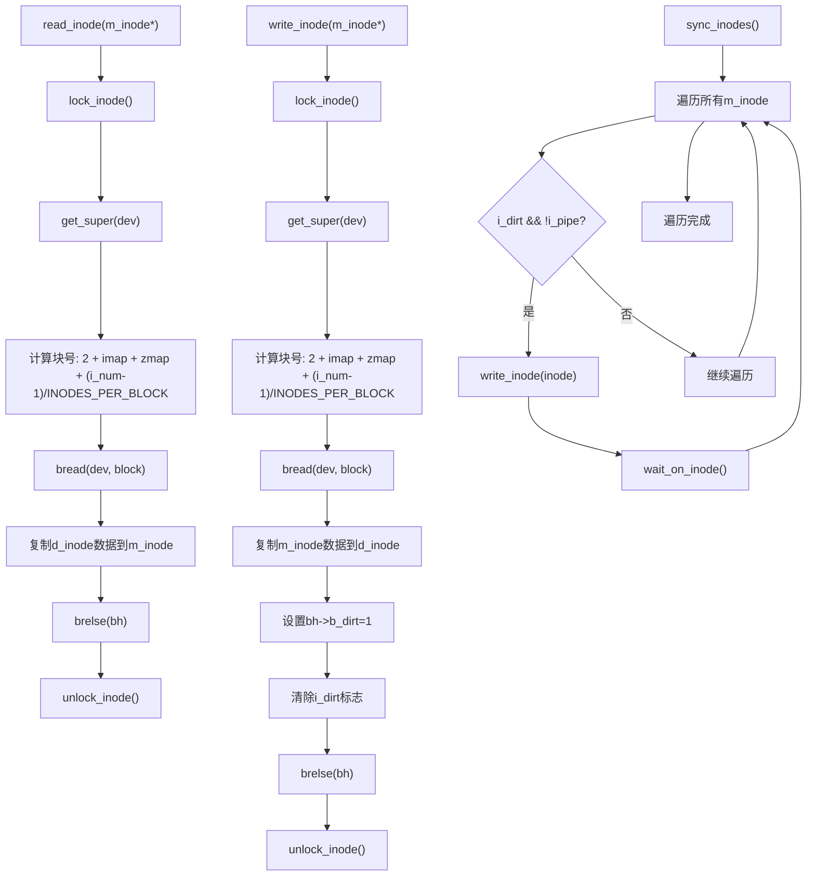

# inode磁盘同步机制

<cite>
**本文档引用的文件**   
- [fs/inode.c](file://fs/inode.c)
- [include/linux/fs.h](file://include/linux/fs.h)
- [fs/super.c](file://fs/super.c)
- [fs/buffer.c](file://fs/buffer.c)
</cite>

## 目录
1. [引言](#引言)
2. [核心数据结构](#核心数据结构)
3. [read_inode()读取流程](#read_inode读取流程)
4. [write_inode()写入流程](#write_inode写入流程)
5. [系统级同步机制](#系统级同步机制)
6. [缓冲区管理机制](#缓冲区管理机制)
7. [同步机制流程图](#同步机制流程图)
8. [总结](#总结)

## 引言
本文档系统化地分析Linux 0.01内核中`read_inode()`和`write_inode()`函数实现的内存inode与磁盘inode之间的同步机制。详细解释了`read_inode()`如何通过`get_super()`获取对应设备的超级块，计算inode所在磁盘块号，并从磁盘读取d_inode结构到内存m_inode的过程。同时对比分析了`write_inode()`的反向写入流程，重点说明其在写入前加锁、设置`bh->b_dirt=1`标记缓冲区为脏、清除`i_dirt`标志的完整事务流程。最后结合`sync_inodes()`函数说明系统级同步策略，即遍历所有inode，将脏且非管道的inode批量写回磁盘，以保障文件系统一致性。

## 核心数据结构

### 内存inode结构(m_inode)
内存中的inode结构体`m_inode`包含了文件的元数据和状态信息，是文件系统操作的核心数据结构。

**Section sources**
- [include/linux/fs.h](file://include/linux/fs.h#L105-L129)

### 磁盘inode结构(d_inode)
磁盘上的inode结构体`d_inode`存储了持久化的文件元数据，与内存inode结构对应但仅包含持久化字段。

**Section sources**
- [include/linux/fs.h](file://include/linux/fs.h#L88-L95)

### 超级块结构(super_block)
超级块结构体`super_block`包含了文件系统的全局信息，如inode位图块数、区域位图块数等，是计算inode位置的关键。

**Section sources**
- [include/linux/fs.h](file://include/linux/fs.h#L131-L150)

### 缓冲区头结构(buffer_head)
缓冲区头结构体`buffer_head`管理着缓冲区缓存，包含数据指针、设备号、块号、脏标志等重要字段。

**Section sources**
- [include/linux/fs.h](file://include/linux/fs.h#L70-L86)

## read_inode读取流程

### 获取超级块
`read_inode()`函数首先调用`get_super()`函数，通过遍历`super_block`数组查找与指定设备号匹配的超级块结构。

**Section sources**
- [fs/inode.c](file://fs/inode.c#L257-L258)
- [include/linux/fs.h](file://include/linux/fs.h#L174-L182)

### 计算磁盘块号
根据超级块中的信息，计算inode所在磁盘块号的公式为：`2 + sb->s_imap_blocks + sb->s_zmap_blocks + (inode->i_num-1)/INODES_PER_BLOCK`。其中：
- `2`：引导块和超级块占用的前两个块
- `sb->s_imap_blocks`：inode位图占用的块数
- `sb->s_zmap_blocks`：区域位图占用的块数
- `(inode->i_num-1)/INODES_PER_BLOCK`：目标inode所在的inode块索引

**Section sources**
- [fs/inode.c](file://fs/inode.c#L259-L260)
- [include/linux/fs.h](file://include/linux/fs.h#L65)

### 读取并复制数据
使用`bread()`函数读取计算出的磁盘块，获取缓冲区头指针，然后将缓冲区数据中的对应d_inode结构复制到内存inode结构中。

**Section sources**
- [fs/inode.c](file://fs/inode.c#L261-L265)

## write_inode写入流程

### 加锁保护
在写入操作开始前，`write_inode()`首先调用`lock_inode()`对目标inode加锁，防止并发访问导致数据不一致。

**Section sources**
- [fs/inode.c](file://fs/inode.c#L271)

### 获取超级块和块号
与`read_inode()`类似，通过`get_super()`获取超级块，并使用相同公式计算inode所在磁盘块号。

**Section sources**
- [fs/inode.c](file://fs/inode.c#L272-L274)

### 读取缓冲区
调用`bread()`读取目标磁盘块，获取缓冲区头指针，为写入操作做准备。

**Section sources**
- [fs/inode.c](file://fs/inode.c#L275-L276)

### 复制数据并标记脏
将内存inode中的d_inode部分复制到缓冲区对应位置，然后设置`bh->b_dirt=1`标记缓冲区为脏，表示需要写回磁盘。

**Section sources**
- [fs/inode.c](file://fs/inode.c#L277-L279)

### 清除脏标志和解锁
清除内存inode的`i_dirt`标志，表示内存中的数据已与磁盘同步，最后调用`unlock_inode()`释放锁。

**Section sources**
- [fs/inode.c](file://fs/inode.c#L280-L282)

## 系统级同步机制

### sync_inodes函数
`sync_inodes()`函数实现了系统级的inode同步策略，遍历所有内存inode，将脏且非管道的inode批量写回磁盘。

**Section sources**
- [fs/inode.c](file://fs/inode.c#L35-L46)

### 遍历inode表
函数遍历`inode_table`数组中的所有`NR_INODE`个inode，对每个inode执行同步操作。

**Section sources**
- [fs/inode.c](file://fs/inode.c#L38-L45)

### 条件判断与写回
对每个inode，先等待其解锁，然后检查`i_dirt`标志是否为真且`i_pipe`标志为假，若条件满足则调用`write_inode()`将其写回磁盘。

**Section sources**
- [fs/inode.c](file://fs/inode.c#L43-L45)

### 文件系统一致性
通过定期调用`sync_inodes()`，系统确保了内存中修改的inode能够及时写回磁盘，维护了文件系统的数据一致性。

**Section sources**
- [fs/inode.c](file://fs/inode.c#L35-L46)

## 缓冲区管理机制

### bread函数
`bread()`函数负责读取指定设备和块号的磁盘块，首先调用`getblk()`获取缓冲区，然后检查数据是否已更新，若未更新则发起读取操作。

**Section sources**
- [fs/buffer.c](file://fs/buffer.c#L209-L222)

### brelse函数
`brelse()`函数释放缓冲区引用，减少引用计数，当引用计数为零时，缓冲区可被回收利用。

**Section sources**
- [fs/buffer.c](file://fs/buffer.c#L195-L203)

### get_super函数
`get_super()`函数通过遍历`super_block`数组，查找与指定设备号匹配的超级块结构，为inode操作提供文件系统元数据。

**Section sources**
- [include/linux/fs.h](file://include/linux/fs.h#L174-L182)

## 同步机制流程图

**Diagram sources**
- [fs/inode.c](file://fs/inode.c#L249-L288)
- [fs/inode.c](file://fs/inode.c#L35-L46)

## 总结
Linux 0.01内核的inode同步机制通过`read_inode()`和`write_inode()`函数实现了内存inode与磁盘inode之间的双向同步。`read_inode()`负责从磁盘读取inode数据到内存，而`write_inode()`则负责将内存中修改的inode写回磁盘。整个机制通过加锁保护、脏标志管理和缓冲区缓存等技术，确保了数据的一致性和完整性。`sync_inodes()`函数提供了系统级的批量同步能力，定期将所有脏inode写回磁盘，是维护文件系统一致性的关键组件。这一精巧的设计体现了早期Linux内核在资源受限环境下对文件系统可靠性的高度重视。