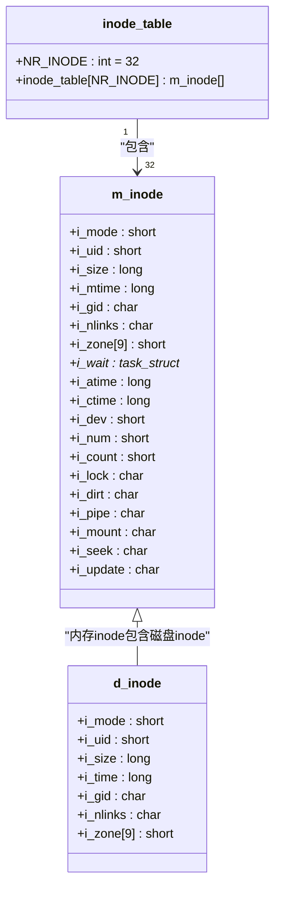
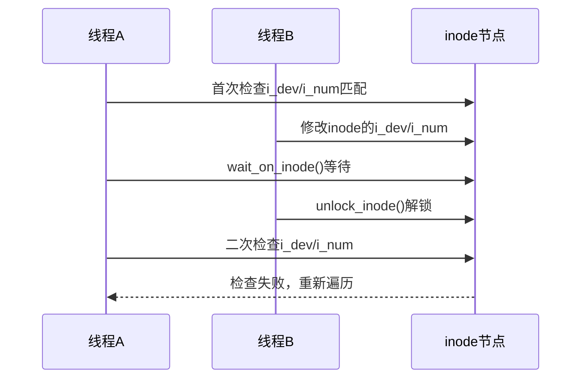
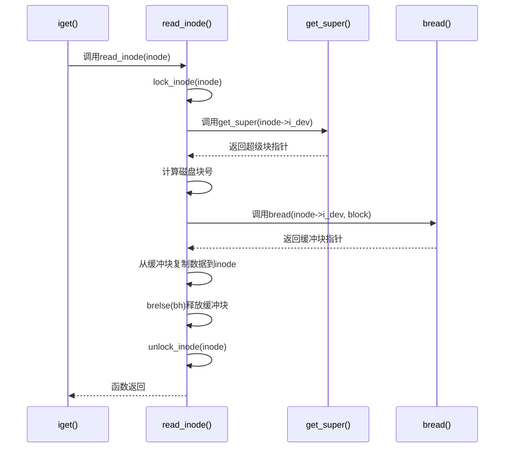
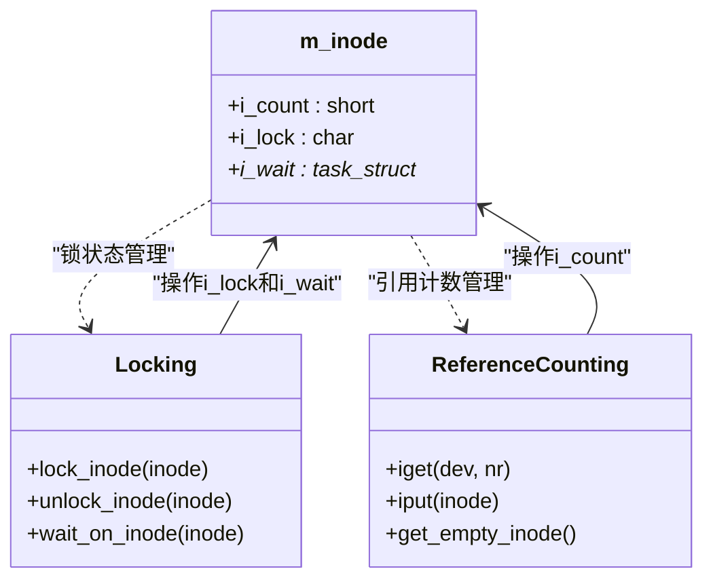
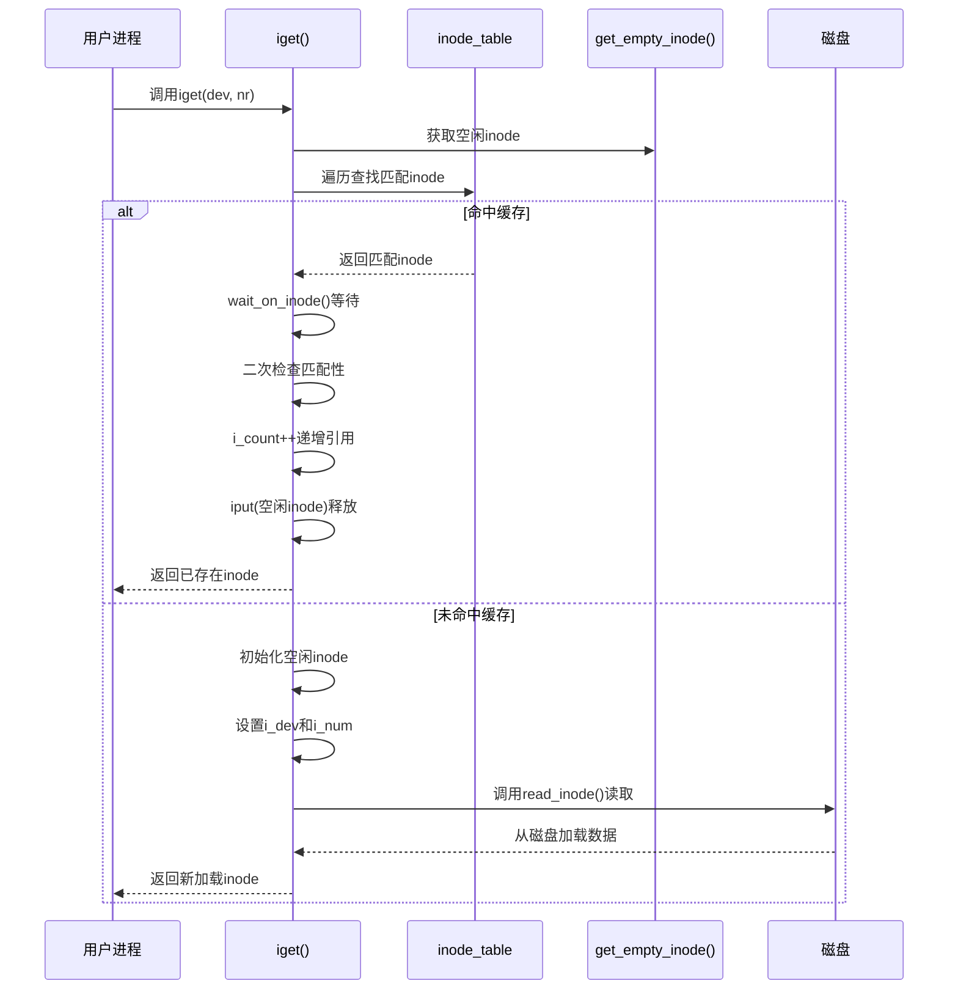

# inode获取与加载机制

<cite>
**Referenced Files in This Document**  
- [inode.c](file://fs/inode.c)
- [fs.h](file://include/linux/fs.h)
</cite>

## 目录
1. [引言](#引言)
2. [核心数据结构](#核心数据结构)
3. `iget()`函数执行流程
4. 双重检查锁定机制
5. 空闲inode分配与初始化
6. 磁盘inode读取机制
7. 锁与引用计数协同管理
8. 完整流程时序图
9. 总结

## 引言

在Linux 0.01内核中，`iget()`函数是文件系统子系统的核心入口之一，负责根据设备号和inode编号从全局`inode_table`中查找或加载inode节点。该机制实现了高效的缓存查找与按需加载策略，同时通过精巧的同步机制避免了多线程环境下的竞争条件。本文档详细分析`iget()`的实现机制，重点解析其双重检查锁定模式、引用计数管理以及与超级块的协作关系。

**Section sources**
- [inode.c](file://fs/inode.c#L200-L248)

## 核心数据结构

### 内存inode结构体（m_inode）

`m_inode`结构体定义了内存中inode的完整表示，包含磁盘inode的所有属性以及内存特有的管理字段。

**Section sources**
- [fs.h](file://include/linux/fs.h#L88-L110)

### 磁盘inode结构体（d_inode）

`d_inode`结构体表示存储在磁盘上的inode数据格式，是`m_inode`的子集，仅包含持久化字段。

**Section sources**
- [fs.h](file://include/linux/fs.h#L76-L84)

### 全局inode表

`inode_table`是一个固定大小的全局数组，用于缓存系统中所有活跃的inode节点，实现inode的快速查找与复用。



**Diagram sources**
- [fs.h](file://include/linux/fs.h#L76-L110)
- [inode.c](file://fs/inode.c#L7-L7)

## `iget()`函数执行流程

`iget()`函数实现了inode的获取与加载逻辑，其核心流程分为缓存查找、同步等待、二次验证和按需加载四个阶段。

```mermaid
flowchart TD
Start([iget(dev, nr)]) --> ValidateInput["验证设备号非零"]
ValidateInput --> AllocateEmpty["调用get_empty_inode()获取空闲项"]
AllocateEmpty --> SearchCache["遍历inode_table查找匹配项"]
SearchCache --> Found{"找到匹配inode?"}
Found --> |是| WaitOnLock["调用wait_on_inode()等待解锁"]
WaitOnLock --> DoubleCheck["二次检查i_dev和i_num"]
DoubleCheck --> Valid{"仍匹配?"}
Valid --> |是| IncrementCount["i_count++"]
Valid --> |否| SearchCache
IncrementCount --> ReleaseEmpty["释放空闲inode"]
ReleaseEmpty --> ReturnExist["返回已存在inode"]
Found --> |否| InitializeNew["初始化空闲inode"]
InitializeNew --> SetDevNum["设置i_dev和i_num"]
SetDevNum --> ReadFromDisk["调用read_inode()从磁盘读取"]
ReadFromDisk --> ReturnNew["返回新加载inode"]
ReturnExist --> End([函数返回])
ReturnNew --> End
```

**Diagram sources**
- [inode.c](file://fs/inode.c#L200-L248)

**Section sources**
- [inode.c](file://fs/inode.c#L200-L248)

## 双重检查锁定机制

`iget()`函数采用双重检查锁定模式来确保在并发环境下的数据一致性。该机制通过两次检查和中间的等待状态，有效防止了竞态条件。

### 执行步骤

1. **首次遍历检查**：在遍历`inode_table`时，检查当前inode的`i_dev`和`i_num`是否与目标匹配
2. **等待解锁**：若匹配，则调用`wait_on_inode()`等待该inode解锁
3. **二次验证**：解锁后重新检查`i_dev`和`i_num`，确认仍与目标匹配
4. **处理不一致**：若二次检查失败，重新开始遍历



**Diagram sources**
- [inode.c](file://fs/inode.c#L200-L248)
- [inode.c](file://fs/inode.c#L12-L18)

**Section sources**
- [inode.c](file://fs/inode.c#L215-L225)

## 空闲inode分配与初始化

当`iget()`未能在缓存中找到匹配的inode时，需要分配一个空闲的inode项用于加载新的inode数据。

### `get_empty_inode()`函数

该函数负责从`inode_table`中找到一个未被使用的inode项，并进行必要的清理和初始化。

```mermaid
flowchart TD
Start([get_empty_inode()]) --> InitSearch["初始化搜索位置last_allocated_inode"]
InitSearch --> FindEmpty["遍历inode_table查找i_count为0的项"]
FindEmpty --> Found{"找到空闲inode?"}
Found --> |否| Panic["panic: No free inodes in mem"]
Found --> |是| UpdateLast["更新last_allocated_inode"]
UpdateLast --> WaitOnInode["调用wait_on_inode()等待"]
WaitOnInode --> CheckDirty["检查i_dirt标志"]
CheckDirty --> Dirty{"i_dirt为真?"}
Dirty --> |是| WriteInode["调用write_inode()写回磁盘"]
WriteInode --> WaitOnInode
Dirty --> |否| CheckCount["再次检查i_count"]
CheckCount --> InUse{"i_count仍为0?"}
InUse --> |否| FindEmpty
InUse --> |是| ClearMemory["memset清零内存"]
ClearMemory --> SetCount["设置i_count=1"]
SetCount --> ReturnInode["返回空闲inode指针"]
ReturnInode --> End([函数返回])
```

**Diagram sources**
- [inode.c](file://fs/inode.c#L164-L199)

**Section sources**
- [inode.c](file://fs/inode.c#L164-L199)

## 磁盘inode读取机制

当需要从磁盘加载新的inode数据时，`read_inode()`函数负责完成这一操作。

### 磁盘块偏移计算

`read_inode()`通过超级块信息计算inode在磁盘上的物理位置：

```
块号 = 2 + s_imap_blocks + s_zmap_blocks + (i_num-1)/INODES_PER_BLOCK
```

其中：
- `2`：引导块和超级块占用的前两个块
- `s_imap_blocks`：inode位图占用的块数
- `s_zmap_blocks`：数据块位图占用的块数
- `(i_num-1)/INODES_PER_BLOCK`：目标inode所在的inode块索引



**Diagram sources**
- [inode.c](file://fs/inode.c#L249-L266)
- [fs.h](file://include/linux/fs.h#L174-L182)

**Section sources**
- [inode.c](file://fs/inode.c#L249-L266)

## 锁与引用计数协同管理

`iget()`机制通过`i_lock`和`i_count`字段的协同工作，实现了对inode节点的安全并发访问。

### 字段作用

- **`i_lock`**：互斥锁标志，1表示锁定，0表示解锁
- **`i_count`**：引用计数，表示当前有多少个进程正在使用该inode

### 协同机制

1. **锁操作**：`lock_inode()`和`unlock_inode()`通过原子操作管理`i_lock`字段
2. **等待队列**：`wait_on_inode()`将等待进程加入`i_wait`队列
3. **引用计数**：`i_count`递增表示新的引用，递减到0时可回收



**Diagram sources**
- [inode.c](file://fs/inode.c#L12-L33)
- [inode.c](file://fs/inode.c#L200-L248)

**Section sources**
- [inode.c](file://fs/inode.c#L12-L33)
- [fs.h](file://include/linux/fs.h#L104-L105)

## 完整流程时序图



**Diagram sources**
- [inode.c](file://fs/inode.c#L200-L248)

## 总结

`iget()`函数在Linux 0.01内核中实现了高效且安全的inode管理机制：

1. **缓存查找优化**：通过全局`inode_table`实现O(n)时间复杂度的inode查找
2. **双重检查锁定**：有效防止并发修改导致的数据不一致问题
3. **按需加载策略**：仅在缓存未命中时才从磁盘读取，提高性能
4. **资源协同管理**：`i_lock`和`i_count`字段协同工作，确保线程安全
5. **磁盘布局感知**：通过超级块信息精确计算inode的磁盘物理位置

该机制体现了早期Linux内核在资源受限环境下对性能与安全性的精巧平衡，为后续版本的虚拟文件系统（VFS）设计奠定了基础。