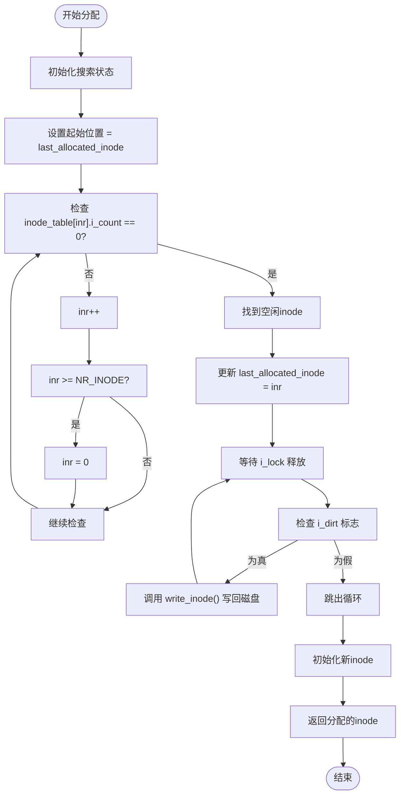
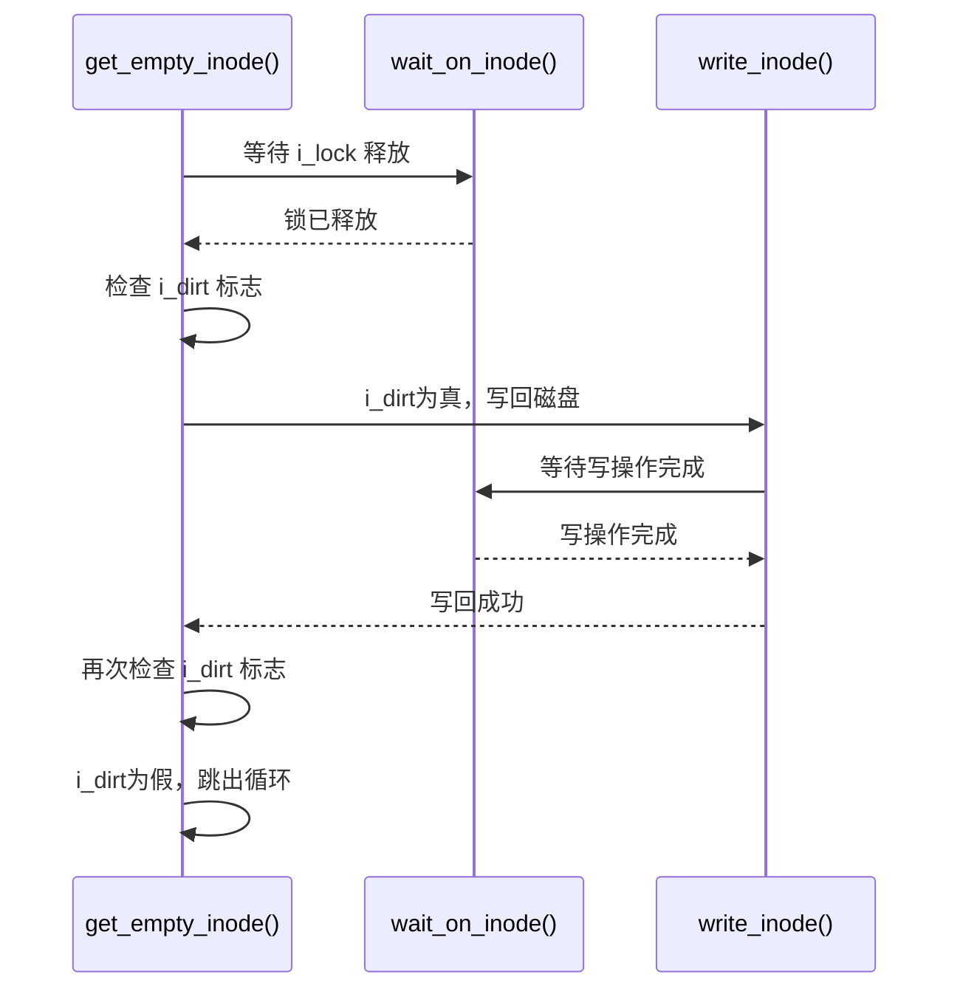
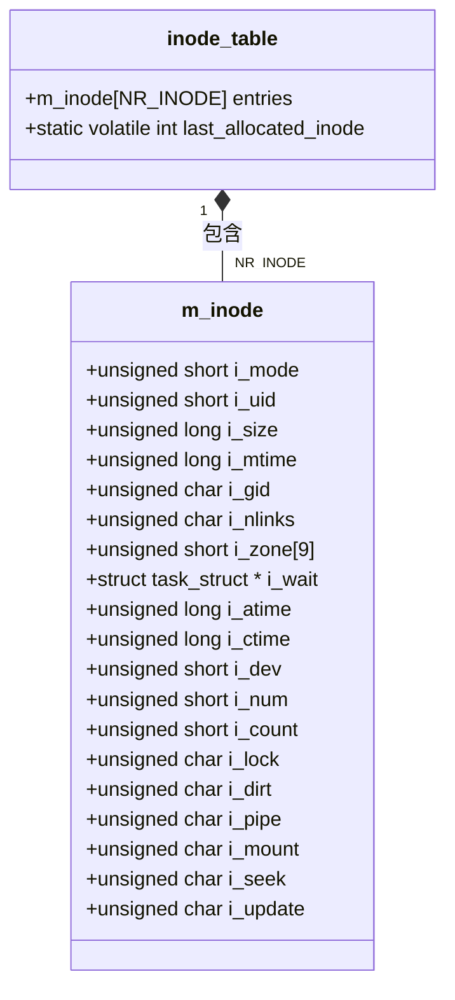

<cite>
**本文档中引用的文件**
- [inode.c](file://fs/inode.c)
- [fs.h](file://include/linux/fs.h)
</cite>

## 目录
1. [空闲inode分配策略](#空闲inode分配策略)
2. [轮询查找机制](#轮询查找机制)
3. [内存一致性保障](#内存一致性保障)
4. [新inode初始化](#新inode初始化)
5. [资源耗尽处理](#资源耗尽处理)
6. [相关组件分析](#相关组件分析)

## 空闲inode分配策略

`get_empty_inode()`函数是Linux 0.01文件系统中用于分配空闲inode的核心机制。该函数通过轮询策略在`inode_table`数组中查找可用的空闲inode项，确保文件系统能够高效地管理文件元数据资源。函数采用`last_allocated_inode`作为起始位置记录器，实现了一种循环分配策略，避免了每次都从数组开头开始搜索的低效问题。

**Section sources**
- [inode.c](file://fs/inode.c#L164-L199)

## 轮询查找机制

`get_empty_inode()`函数采用了高效的轮询查找策略来定位空闲inode。函数从`last_allocated_inode`记录的位置开始遍历`inode_table`数组，寻找`i_count == 0`的条目，这表示该inode当前未被任何进程引用，可以安全分配。

查找过程采用do-while循环结构，从`last_allocated_inode`位置开始，逐个检查每个inode的引用计数。当遍历到数组末尾时，会自动回绕到数组开头，形成一个循环查找。一旦找到`i_count`为0的inode，立即返回该inode的指针，并更新`last_allocated_inode`为当前找到的inode位置，为下一次分配提供优化的起始点。



**Diagram sources**
- [inode.c](file://fs/inode.c#L164-L199)

**Section sources**
- [inode.c](file://fs/inode.c#L164-L199)

## 内存一致性保障

在找到候选inode后，`get_empty_inode()`函数执行严格的清理流程以确保内存一致性。首先，函数调用`wait_on_inode()`等待`i_lock`释放，确保没有其他进程正在访问该inode。

随后，函数检查`i_dirt`标志位，若为真则表示该inode包含未写入磁盘的脏数据。此时，函数会调用`write_inode()`将脏数据写回磁盘，并再次调用`wait_on_inode()`等待写操作完成。这个过程会重复执行，直到`i_dirt`标志被清除，确保分配给新文件的inode不会包含旧文件的残留数据。

这种设计体现了文件系统对数据一致性的高度重视，防止了不同文件之间的数据污染问题。



**Diagram sources**
- [inode.c](file://fs/inode.c#L185-L190)

**Section sources**
- [inode.c](file://fs/inode.c#L185-L190)

## 新inode初始化

当成功获取一个空闲inode并确保其一致性后，`get_empty_inode()`函数会对新分配的inode执行初始化操作。首先，函数使用`memset(inode, 0, sizeof(*inode))`将整个inode结构体清零，确保所有字段都处于已知的初始状态，避免残留数据影响新文件的创建。

随后，函数将新inode的引用计数`i_count`设置为1，表示该inode已被当前进程引用。这个初始值的设计非常关键，它确保了inode在分配后立即处于"被使用"状态，防止其他进程同时分配同一个inode。

这种初始化策略保证了每个新分配的inode都从一个干净、一致的状态开始，为文件系统的稳定运行提供了基础保障。

**Section sources**
- [inode.c](file://fs/inode.c#L197-L198)

## 资源耗尽处理

当系统中没有可用的空闲inode时，`get_empty_inode()`函数会触发一个`panic`异常，这是一种极端情况下的保护机制。在触发panic之前，函数会遍历整个`inode_table`数组，使用`printk`输出每个inode的设备号(`i_dev`)和inode号(`i_num`)，为系统调试提供有价值的信息。

这种设计体现了系统健壮性设计的重要原则：在遇到不可恢复的错误时，与其让系统继续运行在不确定状态，不如立即停止并提供详细的诊断信息。调试输出格式`%04x: %6d\t`确保了设备号以4位十六进制显示，inode号以6位十进制显示，便于快速识别和分析inode的分配情况。

```mermaid
flowchart TD
CheckFree["检查是否有空闲inode"]
CheckFree --> |无空闲inode| PrintInfo["遍历inode_table打印调试信息"]
PrintInfo --> Format["printk(\"%04x: %6d\\t\", i_dev, i_num)"]
Format --> Panic["panic(\"No free inodes in mem\")"]
Panic --> SystemHalt["系统停止运行"]
```

**Diagram sources**
- [inode.c](file://fs/inode.c#L180-L183)

**Section sources**
- [inode.c](file://fs/inode.c#L180-L183)

## 相关组件分析

### inode_table数据结构

`inode_table`是系统中所有内存inode的全局数组，其大小由`NR_INODE`宏定义决定，在Linux 0.01中为32个条目。该数组存储了`m_inode`结构体，包含了文件的元数据信息，如模式、所有者、大小、时间戳以及指向数据块的指针等。



**Diagram sources**
- [fs.h](file://include/linux/fs.h#L100-L120)
- [inode.c](file://fs/inode.c#L21)

**Section sources**
- [fs.h](file://include/linux/fs.h#L100-L120)
- [inode.c](file://fs/inode.c#L21)

### 辅助函数关系

`get_empty_inode()`函数与其他文件系统组件紧密协作，形成了一个完整的inode管理生态系统。它与`write_inode()`、`wait_on_inode()`等函数共同维护inode的状态一致性。

```mermaid
graph TB
get_empty_inode[get_empty_inode()] --> wait_on_inode[wait_on_inode()]
get_empty_inode --> write_inode[write_inode()]
get_empty_inode --> memset[memset()]
write_inode --> wait_on_inode
get_empty_inode -.-> iget[iget()]
get_empty_inode -.-> get_pipe_inode[get_pipe_inode()]
get_empty_inode -.-> new_inode[new_inode()]
style get_empty_inode fill:#f9f,stroke:#333
style wait_on_inode fill:#bbf,stroke:#333,color:#fff
style write_inode fill:#bbf,stroke:#333,color:#fff
```

**Diagram sources**
- [inode.c](file://fs/inode.c#L164-L199)
- [fs.h](file://include/linux/fs.h#L150-L184)

**Section sources**
- [inode.c](file://fs/inode.c#L164-L199)
- [fs.h](file://include/linux/fs.h#L150-L184)