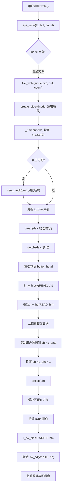

# 文件写入操作

<cite>
**本文档引用的文件**  
- [fs/read_write.c](file://fs/read_write.c)
- [fs/file_dev.c](file://fs/file_dev.c)
- [fs/inode.c](file://fs/inode.c)
- [fs/buffer.c](file://fs/buffer.c)
- [fs/block_dev.c](file://fs/block_dev.c)
- [fs/char_dev.c](file://fs/char_dev.c)
- [fs/pipe.c](file://fs/pipe.c)
- [include/linux/fs.h](file://include/linux/fs.h)
</cite>

## 目录
1. [系统调用入口](#系统调用入口)  
2. [基于inode类型的写入路由](#基于inode类型的写入路由)  
3. [普通文件写入流程](#普通文件写入流程)  
4. [数据块分配与索引管理](#数据块分配与索引管理)  
5. [缓冲区机制与底层写入](#缓冲区机制与底层写入)  
6. [文件位置与大小管理](#文件位置与大小管理)  
7. [写操作使用模式与限制](#写操作使用模式与限制)

## 系统调用入口

`sys_write` 系统调用是用户程序发起写操作的入口点，定义于 `fs/read_write.c` 中。该函数接收文件描述符、用户缓冲区指针和待写入字节数作为参数，首先进行参数合法性校验，包括文件描述符范围、计数非负性以及文件结构的有效性。校验通过后，函数获取对应文件对象的 `m_inode` 节点，并根据节点的类型将写请求路由至不同的处理函数。

**Section sources**  
- [fs/read_write.c](file://fs/read_write.c#L50-L97)

## 基于inode类型的写入路由

`sys_write` 函数的核心逻辑是依据 `inode->i_mode` 字段判断文件类型，并调用相应的写入处理函数。该路由机制确保了不同设备和文件类型能够使用其专用的I/O处理逻辑。

- **管道写入**：若 `inode->i_pipe` 标志被置位，表示该文件为管道。函数检查文件是否以写模式打开，然后调用 `write_pipe()` 处理写入。
- **字符设备写入**：若 `S_ISCHR(inode->i_mode)` 为真，表示为字符设备。函数调用 `rw_char()`，并传入设备号 `inode->i_zone[0]`。
- **块设备写入**：若 `S_ISBLK(inode->i_mode)` 为真，表示为块设备。函数调用 `block_write()`，并传入设备号和文件位置指针。
- **普通文件写入**：若 `S_ISREG(inode->i_mode)` 为真，表示为普通文件。函数调用 `file_write()` 进行处理。

此设计体现了Linux内核的抽象与分层思想，将通用系统调用接口与具体设备的实现解耦。

**Section sources**  
- [fs/read_write.c](file://fs/read_write.c#L70-L97)

## 普通文件写入流程

`file_write` 函数（位于 `fs/file_dev.c`）是处理普通文件写入的核心。其执行流程如下：

1.  **确定起始位置**：根据文件是否设置了 `O_APPEND` 标志，决定写入起始位置是文件末尾 (`inode->i_size`) 还是当前文件指针 (`filp->f_pos`)。
2.  **循环写入**：在 `while` 循环中，逐块处理写请求。
3.  **获取数据块**：调用 `create_block(inode, pos/BLOCK_SIZE)` 获取逻辑块号对应的实际物理块号。如果该逻辑块尚无对应的物理块，此调用会触发新块的分配。
4.  **读取缓冲区**：调用 `bread(inode->i_dev, block)` 从设备读取指定块号的数据到缓冲区。`bread` 内部会调用 `getblk` 获取或创建缓冲区头，并通过 `ll_rw_block` 发起读操作以确保数据是最新的。
5.  **准备写入**：计算本次写入在缓冲区内的偏移量 `c`，并定位到数据写入的起始指针 `p`。将缓冲区头的 `b_dirt` 标志置位，标记该缓冲区为“脏”，表示其内容已被修改，需要回写到磁盘。
6.  **执行写入**：计算本次可写入的字节数（受限于缓冲区剩余空间和剩余待写入字节数），然后通过循环将用户缓冲区的数据逐字节复制到内核缓冲区。
7.  **更新元数据**：如果写入位置超出了当前文件大小，则更新 `inode->i_size` 并将 `inode->i_dirt` 标志置位，标记inode元数据已修改。
8.  **释放缓冲区**：调用 `brelse(bh)` 释放对缓冲区的引用。
9.  **更新文件指针**：循环结束后，如果未使用追加模式，则更新 `filp->f_pos` 到新的位置，并更新 `inode->i_mtime`（修改时间）和 `inode->i_ctime`（状态改变时间）。

**Section sources**  
- [fs/file_dev.c](file://fs/file_dev.c#L41-L83)

## 数据块分配与索引管理

`create_block` 函数（位于 `fs/inode.c`）负责为文件动态分配新的数据块并管理 `i_zone` 索引表。它实际上是 `_bmap` 函数的一个封装，调用时 `create` 参数为1。

`_bmap` 函数实现了Linux 0.01中简单的三级索引结构：
- **直接块**：`i_zone[0]` 到 `i_zone[6]` 直接指向数据块。
- **一级间接块**：`i_zone[7]` 指向一个包含512个块号的索引块。
- **二级间接块**：`i_zone[8]` 指向一个包含512个一级间接块指针的索引块。

当 `create_block` 请求一个尚未分配的逻辑块时：
1.  函数根据逻辑块号确定其在索引结构中的层级。
2.  如果指向索引块的指针（如 `i_zone[7]` 或 `i_zone[8]`）为空，则调用 `new_block(inode->i_dev)` 分配一个新的物理块作为索引块，并更新 `i_zone` 和 `inode->i_dirt`。
3.  在索引块中查找目标逻辑块对应的物理块号。如果为空，则再次调用 `new_block` 分配一个新数据块，并将块号写入索引块，同时将索引块的 `b_dirt` 标志置位。
4.  最终返回新分配的数据块的物理块号。

此机制实现了文件的按需动态扩展。

**Section sources**  
- [fs/inode.c](file://fs/inode.c#L121-L124)
- [fs/inode.c](file://fs/inode.c#L130-L215)

## 缓冲区机制与底层写入

Linux 0.01的缓冲区缓存（Buffer Cache）是连接文件系统与设备驱动的桥梁，其核心数据结构是 `struct buffer_head`，定义于 `include/linux/fs.h`。

- **`getblk`**：此函数（位于 `fs/buffer.c`）用于获取一个指定设备和块号的缓冲区头。它首先在哈希表中查找，若存在则返回；若不存在，则从空闲链表中取出一个缓冲区，更新其 `b_dev` 和 `b_blocknr`，并将其插入哈希表。如果该缓冲区原本是“脏”的，会先将其同步到磁盘。
- **`ll_rw_block`**：此函数（位于 `fs/block_dev.c`）负责将缓冲区的读写请求提交到底层设备。它根据设备号的主设备号（MAJOR）查找 `rd_blk` 函数指针数组，获取对应的设备驱动处理函数（如 `rw_hd` 用于硬盘），然后调用该函数并传入读写标志和缓冲区头指针。驱动函数会将请求加入设备队列，由硬件中断处理程序最终完成物理I/O。

在 `file_write` 流程中，`bread` 调用 `getblk` 获取缓冲区，而 `brelse` 在释放缓冲区时，若 `b_dirt` 为1，则该缓冲区会在后续的 `sync` 操作中被 `ll_rw_block(WRITE, bh)` 提交回磁盘。

**Diagram sources**  
- [fs/read_write.c](file://fs/read_write.c#L70-L97)
- [fs/file_dev.c](file://fs/file_dev.c#L41-L83)
- [fs/inode.c](file://fs/inode.c#L121-L124)
- [fs/buffer.c](file://fs/buffer.c#L180-L254)
- [fs/block_dev.c](file://fs/block_dev.c#L77-L85)

**Section sources**  
- [fs/buffer.c](file://fs/buffer.c#L180-L254)
- [fs/block_dev.c](file://fs/block_dev.c#L77-L85)
- [include/linux/fs.h](file://include/linux/fs.h#L53-L53)

## 文件位置与大小管理

`f_pos`（文件位置）和 `i_size`（文件大小）是管理文件写入的关键字段。
- **`f_pos` 的自动递增**：在 `file_write` 函数中，每次成功写入 `c` 个字节后，`pos` 变量都会增加 `c`。如果文件未以 `O_APPEND` 模式打开，循环结束后会将 `filp->f_pos` 更新为最终的 `pos` 值。这保证了连续的 `write` 调用会从上次结束的位置继续写入，实现顺序写。
- **`f_pos` 与 `i_size` 的关系**：当 `pos` 的值超过当前的 `inode->i_size` 时，代码会立即更新 `inode->i_size = pos`。这意味着文件大小会随着写入位置的推进而动态增长，即使写入的是文件中间的“空洞”区域（虽然本实现中 `create_block` 会分配块，不会真正产生空洞）。

**Section sources**  
- [fs/file_dev.c](file://fs/file_dev.c#L41-L83)

## 写操作使用模式与限制

`write` 系统调用的典型使用模式是顺序写入。例如，一个程序可以打开一个文件，然后在一个循环中反复调用 `write`，数据会自动追加到文件末尾或从当前位置连续写入。

然而，缺乏 `lseek` 系统调用的支持（在提供的代码中 `sys_lseek` 函数存在，但其功能受限于块设备检查，对普通文件可能返回 `-EBADF`）是一个重大限制。这导致：
1.  **无法进行随机写入**：程序无法将 `f_pos` 定位到文件中间的任意位置进行覆盖或修改。
2.  **无法实现文件截断**：无法通过 `lseek` 定位到文件末尾之后再写入来扩展文件，或定位到中间再写入来“截断”文件。
3.  **功能受限**：许多需要随机访问的应用程序（如数据库、编辑器）无法正常工作。

因此，在当前系统状态下，`write` 操作本质上只能进行顺序的、追加式的写入，限制了文件系统的灵活性和实用性。

**Section sources**  
- [fs/read_write.c](file://fs/read_write.c#L1-L48)
- [fs/file_dev.c](file://fs/file_dev.c#L41-L83)