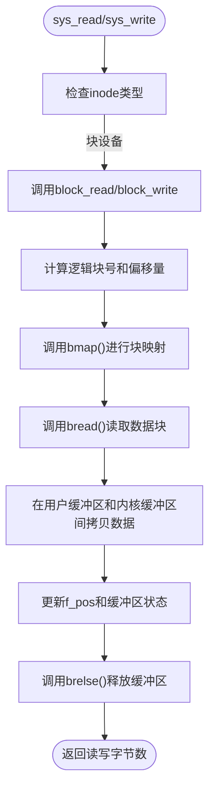

# 文件打开与读写操作

<cite>
**本文档中引用的文件**  
- [fs/open.c](file://fs/open.c)
- [fs/read_write.c](file://fs/read_write.c)
- [fs/block_dev.c](file://fs/block_dev.c)
- [fs/inode.c](file://fs/inode.c)
- [fs/namei.c](file://fs/namei.c)
- [include/linux/fs.h](file://include/linux/fs.h)
</cite>

## 目录
1. [引言](#引言)
2. [文件打开流程分析](#文件打开流程分析)
3. [文件读写核心机制](#文件读写核心机制)
4. [文件结构与资源管理](#文件结构与资源管理)
5. [标准使用序列与局限性](#标准使用序列与局限性)

## 引言
本文档深入解析 Linux 0.01 内核中从 `sys_open()` 到 `sys_read`/`sys_write` 的完整调用链，涵盖路径解析、权限检查、数据块寻址、文件描述符分配与资源回收等核心机制。通过分析关键源码文件，揭示早期 Linux 文件系统的实现原理与设计思想。

## 文件打开流程分析

`sys_open()` 是用户程序发起文件操作的入口系统调用。其核心流程如下：

1.  **权限与模式处理**：首先对传入的 `mode` 参数进行处理，屏蔽掉当前进程的 `umask`，确保文件创建时的权限符合预期。
2.  **文件描述符分配**：遍历当前进程的 `filp` 数组（`task_struct->filp`），寻找第一个空闲项。该数组大小由 `NR_OPEN`（定义为 20）限制。找到后，将该索引 `fd` 作为返回给用户的文件描述符。
3.  **文件表项分配**：在全局 `file_table` 数组中寻找一个 `f_count` 为 0 的空闲 `struct file` 结构体。该数组大小为 `NR_FILE`（定义为 64）。
4.  **路径解析与 inode 获取**：调用 `open_namei()` 函数，这是打开流程的核心。`open_namei()` 会：
    *   调用 `dir_namei()` 进行路径名解析（namei），逐级查找目录，最终定位到目标文件的父目录 `inode`。
    *   在父目录中调用 `find_entry()` 查找文件名对应的目录项（`dir_entry`）。
    *   如果文件不存在且 `O_CREAT` 标志被设置，则调用 `new_inode()` 创建新 `inode`，并调用 `add_entry()` 将其添加到目录中。
    *   如果文件存在，则调用 `iget()` 从磁盘读取 `inode` 信息。
    *   执行权限检查，确保进程对文件有相应的访问权限（读/写/执行）。
    *   如果 `O_TRUNC` 标志被设置，则调用 `truncate()` 清空文件内容。
    *   最终将获取到的 `inode` 指针通过 `res_inode` 参数返回。
5.  **文件结构体初始化**：如果 `open_namei()` 成功，`sys_open()` 会将 `inode`、文件模式、标志、初始偏移量（`f_pos=0`）等信息填充到之前分配的 `file` 结构体中，并增加其引用计数 `f_count`。
6.  **特殊设备处理**：对于终端设备（`S_ISCHR`），会根据主设备号（`MAJOR(inode->i_zone[0])`）进行特殊处理，例如将进程与特定的 tty 关联。

此流程成功后，`sys_open()` 返回文件描述符 `fd`，用户程序即可使用该 `fd` 进行后续的读写操作。

**Section sources**
- [fs/open.c](file://fs/open.c#L120-L164)
- [fs/namei.c](file://fs/namei.c#L306-L378)
- [include/linux/fs.h](file://include/linux/fs.h#L145)

## 文件读写核心机制

文件的读写操作由 `sys_read()` 和 `sys_write()` 系统调用驱动，其核心在于根据 `inode` 类型分发到不同的处理函数。

### 块设备读写流程

对于块设备文件（`S_ISBLK(inode->i_mode)`），读写操作由 `block_read()` 和 `block_write()` 函数处理。

1.  **逻辑块计算**：根据当前文件偏移量 `f_pos`，计算出要访问的数据位于哪个逻辑块（`block = pos / BLOCK_SIZE`）以及块内的偏移量（`offset = pos % BLOCK_SIZE`）。
2.  **块映射**：调用 `bmap()` 函数，将文件的逻辑块号转换为设备上的物理块号。`bmap()` 内部调用 `_bmap()`，它根据 `inode->i_zone` 数组进行间接寻址：
    *   前 7 个 `i_zone` 项为直接块指针。
    *   第 8 个 (`i_zone[7]`) 为一级间接块指针，指向一个包含 512 个块指针的块。
    *   第 9 个 (`i_zone[8]`) 为二级间接块指针，指向一个包含 512 个一级间接块指针的块。
    *   `create_block()` 函数是 `bmap()` 的一个变体，当 `create` 参数为 1 时，会在需要时（如写入新数据）分配新的数据块。
3.  **缓冲区读取**：调用 `bread(dev, block)` 从设备读取指定物理块的数据到缓冲区（`buffer_head`）。`bread()` 会利用缓冲区缓存机制，避免重复的磁盘 I/O。
4.  **数据拷贝**：将缓冲区中的数据（或用户数据）拷贝到用户空间（读）或从用户空间拷贝到缓冲区（写）。此过程使用 `get_fs_byte()` 和 `put_fs_byte()` 宏，以安全地跨越内核空间和用户空间。
5.  **更新状态**：更新文件偏移量 `f_pos`，标记缓冲区为脏（`bh->b_dirt = 1`），以便后续同步到磁盘。
6.  **释放缓冲区**：调用 `brelse(bh)` 释放对缓冲区的引用。



**Diagram sources**
- [fs/read_write.c](file://fs/read_write.c#L45-L97)
- [fs/block_dev.c](file://fs/block_dev.c#L8-L62)
- [fs/inode.c](file://fs/inode.c#L116-L124)

**Section sources**
- [fs/read_write.c](file://fs/read_write.c#L45-L97)
- [fs/block_dev.c](file://fs/block_dev.c#L8-L62)
- [fs/inode.c](file://fs/inode.c#L116-L124)

## 文件结构与资源管理

### 文件表共享机制

`file_table` 是一个全局数组，存储了系统中所有打开文件的 `struct file` 实例。多个进程或同一进程的多次 `open()` 调用可以共享同一个 `file` 结构体，这通常发生在 `fork()` 或 `dup()` 之后。共享通过 `f_count` 引用计数来管理。只有当 `f_count` 减至 0 时，该 `file` 结构体才会被释放。

### 偏移量更新策略

`f_pos` 字段记录了文件的当前读写位置。在每次 `read()` 或 `write()` 操作成功后，`f_pos` 都会根据实际读写的数据量进行递增。这种设计使得连续的读写操作能够自动从上次结束的位置继续，无需显式定位。

### 生命周期与资源回收

文件描述符的生命周期由 `open()` 开始，以 `close()` 结束。`sys_close()` 的主要工作是：
1.  从 `current->filp[fd]` 中移除 `file` 指针。
2.  将 `file` 结构体的引用计数 `f_count` 减 1。
3.  如果 `f_count` 变为 0，则调用 `iput()` 释放关联的 `inode`。

`iput()` 函数负责 `inode` 的回收：
1.  如果 `inode` 是管道，则释放其内存页。
2.  如果 `inode` 的链接数（`i_nlinks`）为 0（即文件已被 `unlink`），则调用 `truncate()` 释放所有数据块，并调用 `free_inode()` 将 `inode` 从内存中移除。
3.  否则，仅减少 `inode` 的引用计数 `i_count`。

```mermaid
classDiagram
class task_struct {
+struct file * filp[NR_OPEN]
+int close_on_exec
}
class file {
+unsigned short f_mode
+unsigned short f_flags
+unsigned short f_count
+struct m_inode * f_inode
+off_t f_pos
}
class m_inode {
+unsigned short i_mode
+unsigned short i_uid
+unsigned long i_size
+unsigned long i_mtime
+unsigned char i_gid
+unsigned char i_nlinks
+unsigned short i_zone[9]
+unsigned short i_dev
+unsigned short i_num
+unsigned short i_count
+unsigned char i_dirt
}
task_struct --> file : "拥有"
file --> m_inode : "指向"
m_inode --> "数据块" : "通过i_zone间接寻址"
```

**Diagram sources**
- [include/linux/fs.h](file://include/linux/fs.h#L103-L116)
- [fs/open.c](file://fs/open.c#L120-L164)
- [fs/inode.c](file://fs/inode.c#L217-L287)

**Section sources**
- [include/linux/fs.h](file://include/linux/fs.h#L103-L148)
- [fs/open.c](file://fs/open.c#L166-L188)
- [fs/inode.c](file://fs/inode.c#L167-L216)

## 标准使用序列与局限性

### 标准使用序列示例

一个典型的文件操作序列如下：
```c
int fd = open("test.txt", O_RDWR | O_CREAT, 0644); // 打开或创建文件
if (fd >= 0) {
    write(fd, "Hello", 5); // 写入数据
    lseek(fd, 0, SEEK_SET); // 移动到文件开头（注意：早期版本可能不支持）
    char buf[6];
    read(fd, buf, 5); // 读取数据
    buf[5] = '\0';
    close(fd); // 关闭文件
}
```

### 缺乏 lseek() 支持的局限性

值得注意的是，在分析的 Linux 0.01 版本中，`fs/read_write.c` 文件包含了 `sys_lseek()` 函数的实现。然而，如果在更早期的版本中该函数不存在，则应用程序将无法改变文件的读写位置。这意味着：
*   **只能顺序访问**：读写操作只能从 `f_pos` 的当前位置开始，并且 `f_pos` 会自动递增。无法实现随机访问。
*   **功能受限**：许多需要随机访问的应用程序（如数据库、编辑器）将无法正常工作。
*   **替代方案**：开发者必须通过反复 `open()` 和 `close()` 文件，或依赖 `read()`/`write()` 的返回值来手动计算位置，这极大地增加了编程复杂性和系统开销。

尽管在当前代码中 `lseek()` 已存在，但理解其缺失所带来的局限性，有助于认识文件系统功能演进的重要性。

**Section sources**
- [fs/read_write.c](file://fs/read_write.c#L1-L43)
- [include/linux/fs.h](file://include/linux/fs.h#L116)