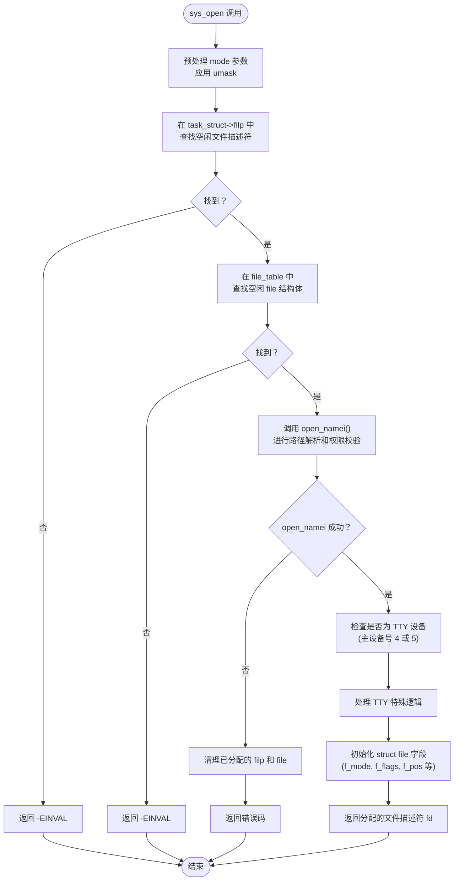
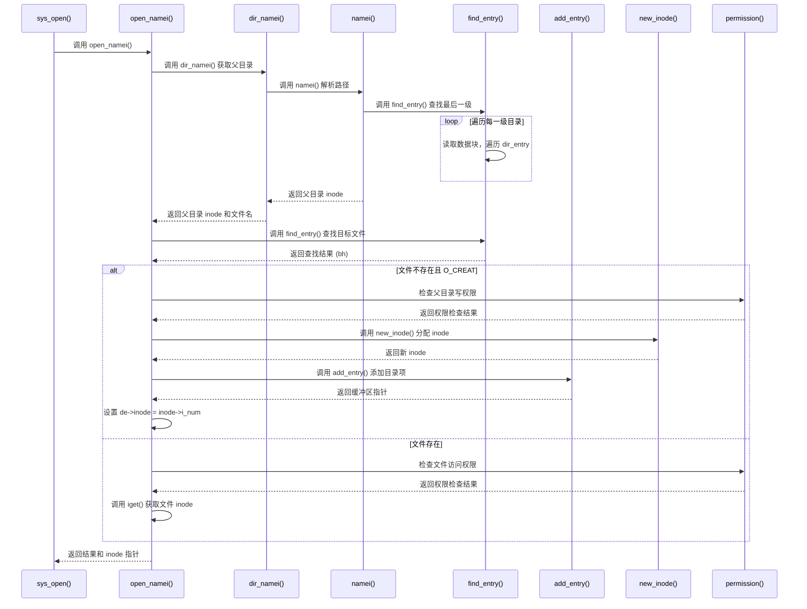
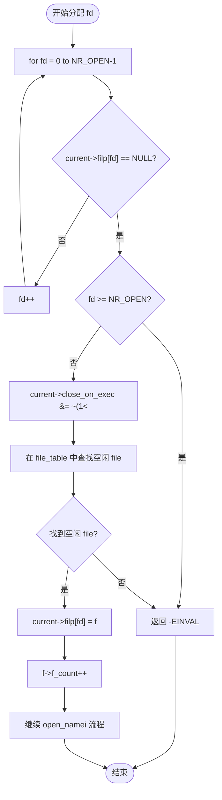

# 文件打开机制

<cite>
**本文档中引用的文件**  
- [open.c](file://fs/open.c)
- [fs.h](file://include/linux/fs.h)
- [namei.c](file://fs/namei.c)
- [inode.c](file://fs/inode.c)
- [sched.h](file://include/linux/sched.h)
</cite>

## 目录
1. [简介](#简介)
2. [核心流程概述](#核心流程概述)
3. [路径解析与权限校验](#路径解析与权限校验)
4. [文件描述符分配机制](#文件描述符分配机制)
5. [文件结构体初始化](#文件结构体初始化)
6. [特殊设备文件处理](#特殊设备文件处理)
7. [使用示例与标志支持](#使用示例与标志支持)
8. [结论](#结论)

## 简介
`sys_open` 是 Linux 0.01 内核中最核心的系统调用之一，负责实现文件的打开、创建和访问控制。该机制贯穿了从用户空间请求到内核路径解析、权限检查、inode 分配、文件表管理以及终端设备特殊处理的完整流程。本文深入解析 `sys_open` 的执行路径，结合关键数据结构和函数调用，全面阐述其内部工作原理。

## 核心流程概述

`sys_open` 系统调用的执行流程可以分为以下几个关键阶段：
1. **参数预处理**：对传入的 `mode` 参数应用进程的 `umask` 掩码。
2. **文件描述符分配**：在当前进程的 `filp` 数组中查找第一个空闲项。
3. **文件表项分配**：在全局 `file_table` 中查找一个空闲的 `struct file` 结构体。
4. **路径名解析与文件操作**：调用 `open_namei` 函数完成路径遍历、权限检查、文件创建或打开。
5. **特殊设备处理**：对主设备号为 4 和 5 的 TTY 设备进行特殊关联。
6. **文件结构体初始化**：填充 `struct file` 的各个字段。
7. **返回文件描述符**：将分配的文件描述符返回给用户空间。



**Diagram sources**
- [open.c](file://fs/open.c#L120-L187)

**Section sources**
- [open.c](file://fs/open.c#L120-L187)

## 路径解析与权限校验

路径解析和权限校验的核心由 `open_namei` 函数实现，该函数位于 `fs/namei.c` 文件中。其主要职责是将一个路径名（如 `/usr/bin/ls`）转换为一个指向内存中 inode 的指针。

### 路径名解析 (`namei`)
`open_namei` 内部调用了 `dir_namei` 和 `find_entry` 等辅助函数，其核心是 `namei` 函数。`namei` 的执行流程如下：
1. **获取根目录或当前目录**：根据路径是否以 `/` 开头，选择从 `current->root` 或 `current->pwd` 开始解析。
2. **逐级遍历**：将路径按 `/` 分割，对每一级目录名，调用 `find_entry` 在当前目录的 inode 中查找对应的目录项（`dir_entry`）。
3. **查找目录项**：`find_entry` 函数会读取目录 inode 的数据块（通过 `i_zone[0]` 指向的第一个数据块），然后在数据块中线性遍历 `dir_entry` 结构体，使用 `match` 函数比较文件名。

### 权限校验 (`permission`)
在解析路径和打开文件的过程中，`permission` 函数负责检查访问权限。其逻辑如下：
1. **特殊检查**：如果文件已被删除（`i_nlinks` 为 0），则拒绝访问。
2. **超级用户特权**：如果进程的有效用户 ID（`euid`）或用户 ID（`uid`）为 0（即 root），则拥有所有权限。
3. **用户匹配**：如果进程的 `uid` 或 `euid` 与文件的 `i_uid` 匹配，则使用权限掩码的高 3 位（owner 权限）。
4. **组匹配**：如果进程的 `gid` 或 `egid` 与文件的 `i_gid` 匹配，则使用权限掩码的中 3 位（group 权限）。
5. **其他用户**：否则，使用权限掩码的低 3 位（other 权限）。
6. **最终判断**：将计算出的权限位与请求的访问模式（`MAY_READ`, `MAY_WRITE`, `MAY_EXEC`）进行与操作，判断是否允许访问。

### 文件创建逻辑
当 `flag` 包含 `O_CREAT` 时，如果 `find_entry` 未能找到文件，则会执行创建流程：
1. **检查写权限**：确保进程对父目录有写权限。
2. **分配新 inode**：调用 `new_inode` 函数为新文件分配一个 inode。
3. **设置文件模式**：将传入的 `mode` 应用 `umask` 后，与 `I_REGULAR` 标志组合，设置到 `inode->i_mode`。
4. **添加目录项**：调用 `add_entry` 函数，在父目录的数据块中添加一个新的 `dir_entry`，并将其 `inode` 字段指向新分配的 inode 编号。



**Diagram sources**
- [namei.c](file://fs/namei.c#L315-L510)
- [namei.c](file://fs/namei.c#L150-L250)

**Section sources**
- [namei.c](file://fs/namei.c#L315-L510)
- [namei.c](file://fs/namei.c#L150-L250)

## 文件描述符分配机制

文件描述符（File Descriptor, fd）是用户空间程序访问文件的整数句柄。Linux 0.01 中，每个进程最多可以拥有 `NR_OPEN`（定义为 20）个文件描述符。

### 分配策略
`sys_open` 使用一种简单的**线性查找**策略来分配文件描述符：
1. **遍历 `filp` 数组**：从 `fd = 0` 开始，遍历 `current->filp` 数组。
2. **查找空项**：找到第一个值为 `NULL` 的元素。
3. **检查上限**：如果遍历到 `fd >= NR_OPEN` 仍未找到空项，则返回 `-EINVAL` 错误。
4. **分配成功**：一旦找到空项，立即使用该索引作为新的文件描述符。

### 关闭时执行 (`close_on_exec`)
在分配文件描述符后，`sys_open` 会清除 `current->close_on_exec` 位图中对应 `fd` 的位。`close_on_exec` 是一个位图，用于标记哪些文件描述符在执行 `exec` 系统调用时应该被自动关闭。清除该位意味着新打开的文件在 `exec` 后仍然保持打开状态。

### 文件表项分配
除了文件描述符，内核还需要一个 `struct file` 结构体来记录文件的打开状态（如读写位置、引用计数等）。`sys_open` 会遍历全局的 `file_table` 数组，查找一个 `f_count` 为 0 的空闲项。找到后，将 `current->filp[fd]` 指向该 `file` 结构体，并将其 `f_count` 增加到 1。



**Diagram sources**
- [open.c](file://fs/open.c#L120-L187)

**Section sources**
- [open.c](file://fs/open.c#L120-L187)
- [sched.h](file://include/linux/sched.h#L106-L143)

## 文件结构体初始化

`struct file` 是内核中表示一个已打开文件的核心数据结构，定义在 `include/linux/fs.h` 中。

### 结构体定义
```c
struct file {
	unsigned short f_mode;      // 文件的访问模式 (读/写)
	unsigned short f_flags;     // 打开文件时的标志 (O_RDONLY, O_APPEND 等)
	unsigned short f_count;     // 引用计数
	struct m_inode * f_inode;   // 指向该文件的 inode
	off_t f_pos;                // 当前文件读写位置
};
```

### 初始化逻辑
在 `sys_open` 成功调用 `open_namei` 获取到 `inode` 后，会对 `struct file` 进行初始化：
- **`f_mode`**: 直接从 `inode->i_mode` 复制。这包含了文件的类型（普通文件、字符设备等）和权限位。
- **`f_flags`**: 直接使用用户传入的 `flag` 参数。这决定了文件的打开方式，如只读、追加写等。
- **`f_count`**: 初始化为 1，表示当前有一个引用（即这个打开操作）。
- **`f_inode`**: 指向由 `open_namei` 返回的 `inode` 指针。
- **`f_pos`**: 初始化为 0，表示文件的读写位置从文件开头开始。

这些初始化确保了文件操作（如 `read`, `write`）能够正确地基于这个 `struct file` 对象进行。

**Section sources**
- [fs.h](file://include/linux/fs.h#L150-L155)
- [open.c](file://fs/open.c#L120-L187)

## 特殊设备文件处理

Linux 0.01 对终端设备（TTY）的处理有特殊逻辑，主要体现在 `sys_open` 函数中对主设备号（major number）的检查。

### TTY 设备主设备号
根据 `include/linux/fs.h` 中的注释：
- **主设备号 4**：对应 `/dev/ttyx`，代表一个具体的终端线路。
- **主设备号 5**：对应 `/dev/tty`，代表进程的控制终端。

### 处理逻辑
在 `sys_open` 的末尾，有如下代码：
```c
if (S_ISCHR(inode->i_mode))
    if (MAJOR(inode->i_zone[0])==4) {
        if (current->leader && current->tty<0) {
            current->tty = MINOR(inode->i_zone[0]);
            tty_table[current->tty].pgrp = current->pgrp;
        }
    } else if (MAJOR(inode->i_zone[0])==5)
        if (current->tty<0) {
            iput(inode);
            current->filp[fd]=NULL;
            f->f_count=0;
            return -EPERM;
        }
```
其逻辑如下：
1. **检查是否为字符设备**：使用 `S_ISCHR` 宏判断 `inode` 是否为字符设备。
2. **主设备号为 4**：
    - 如果当前进程是会话首进程（`current->leader` 为真）且尚未关联终端（`current->tty < 0`）。
    - 则将该进程的 `tty` 字段设置为打开设备的次设备号（`MINOR(inode->i_zone[0])`）。
    - 并将该终端的进程组（pgrp）设置为当前进程的进程组。
    - 这个操作将一个具体的终端设备与一个会话首进程关联起来，使其成为该会话的控制终端。
3. **主设备号为 5**：
    - 如果当前进程尚未关联任何终端（`current->tty < 0`）。
    - 则直接返回 `-EPERM`（操作不被允许）错误。
    - 这是因为 `/dev/tty` 代表的是“当前进程的控制终端”，如果进程还没有控制终端，打开 `/dev/tty` 是没有意义的。

这种设计确保了终端设备的正确关联和访问控制。

**Section sources**
- [open.c](file://fs/open.c#L120-L187)
- [fs.h](file://include/linux/fs.h#L10-L15)

## 使用示例与标志支持

### 标准使用示例
一个典型的 `open` 系统调用使用示例如下：
```c
#include <fcntl.h>

int fd;
fd = open("/etc/passwd", O_RDONLY);
if (fd == -1) {
    // 处理错误
}
// 使用 fd 进行读写操作
// ...
close(fd);
```
在这个例子中，程序以只读模式打开 `/etc/passwd` 文件。`sys_open` 会解析路径，检查用户是否有读取该文件的权限，然后返回一个文件描述符。

### 早期版本标志支持
`sys_open` 支持多种标志，这些标志定义在 `fcntl.h` 中。根据代码分析，早期版本支持以下关键标志：
- **`O_RDONLY`, `O_WRONLY`, `O_RDWR`**: 指定文件的访问模式（只读、只写、读写）。
- **`O_CREAT`**: 如果文件不存在，则创建它。需要提供 `mode` 参数来指定新文件的权限。
- **`O_TRUNC`**: 如果文件存在且为普通文件，则将其长度截断为 0。通常与 `O_WRONLY` 或 `O_RDWR` 一起使用。
- **`O_APPEND`**: 每次写操作前，将文件位置指针移动到文件末尾。
- **`O_EXCL`**: 与 `O_CREAT` 一起使用，如果文件已存在，则 `open` 调用失败。用于确保创建的是一个新文件。

值得注意的是，`sys_creat` 系统调用就是 `sys_open` 的一个封装，它等价于 `sys_open(pathname, O_CREAT | O_TRUNC, mode)`，专门用于创建并截断文件。

**Section sources**
- [open.c](file://fs/open.c#L120-L187)
- [open.c](file://fs/open.c#L178-L180)

## 结论
`sys_open` 系统调用是 Linux 文件系统操作的基石。它通过 `open_namei` 完成复杂的路径名解析和权限校验，利用线性查找策略在进程和全局范围内分配文件描述符和文件表项，并对 `struct file` 进行精确初始化。其对 TTY 设备的特殊处理体现了早期 Unix 系统对终端管理的精巧设计。整个流程清晰、高效，展现了 Linux 0.01 内核简洁而强大的设计哲学。理解这一机制对于深入掌握操作系统原理至关重要。