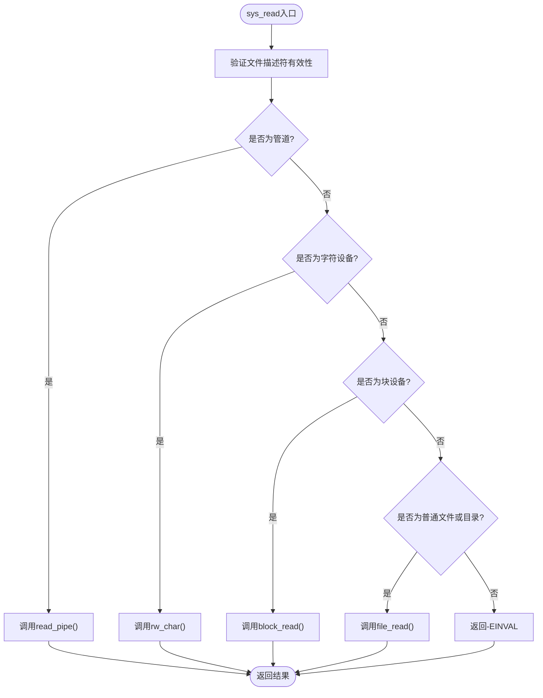
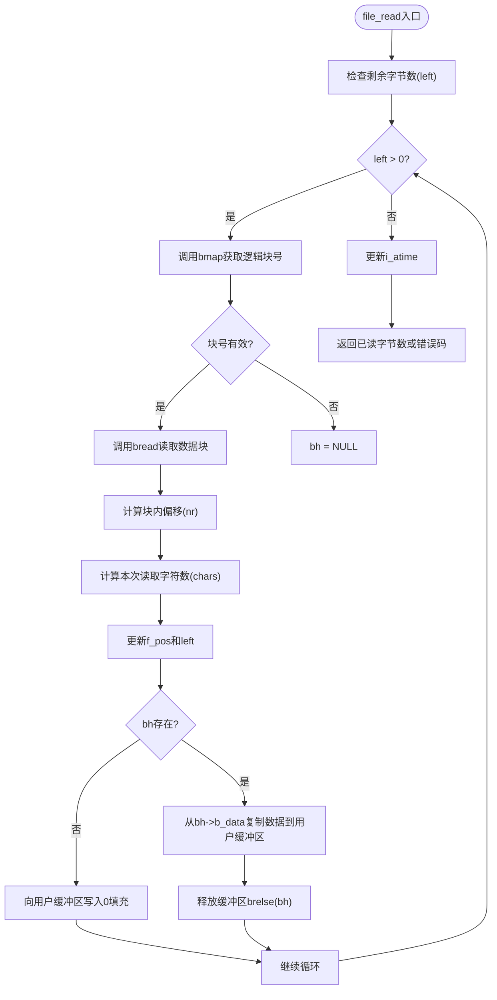
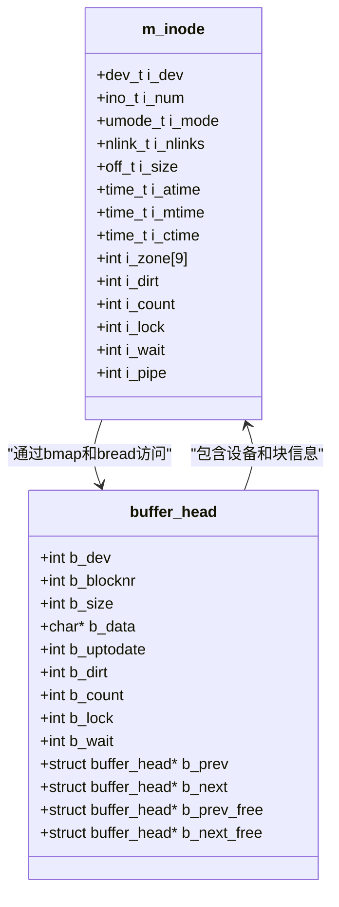
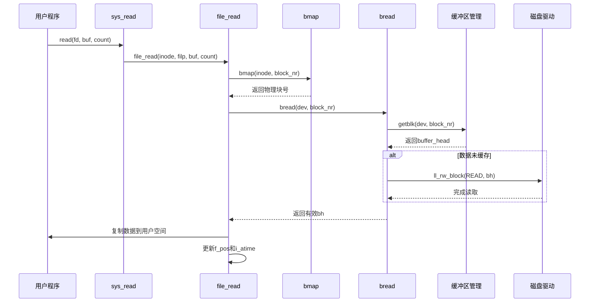
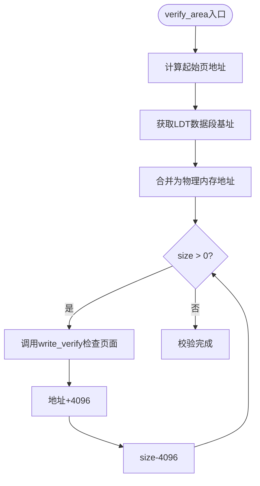

# 文件读取操作

<cite>
**本文档中引用的文件**   
- [read_write.c](file://fs/read_write.c)
- [file_dev.c](file://fs/file_dev.c)
- [buffer.c](file://fs/buffer.c)
- [inode.c](file://fs/inode.c)
- [fork.c](file://kernel/fork.c)
</cite>

## 目录
1. [系统调用分发机制](#系统调用分发机制)  
2. [普通文件读取路径](#普通文件读取路径)  
3. [块设备读取机制](#块设备读取机制)  
4. [缓冲区子系统与数据一致性](#缓冲区子系统与数据一致性)  
5. [用户空间地址校验](#用户空间地址校验)  
6. [标准I/O序列示例](#标准io序列示例)  
7. [lseek不支持的影响](#lseek不支持的影响)

## 系统调用分发机制

`sys_read`系统调用根据文件类型将读取请求分发到不同的处理函数。该机制在`fs/read_write.c`中实现，通过检查inode的模式位来判断文件类型，并调用相应的底层读取函数。



**Diagram sources**  
- [read_write.c](file://fs/read_write.c#L48-L74)

**Section sources**  
- [read_write.c](file://fs/read_write.c#L48-L74)

## 普通文件读取路径

对于普通文件和目录的读取，`sys_read`会调用`file_read`函数。该函数位于`fs/file_dev.c`中，实现了基于块映射的文件数据读取逻辑。

### 偏移边界检查与数据截断

在读取前会进行边界检查：如果请求读取的字节数加上当前文件位置超过了文件大小（`count + file->f_pos > inode->i_size`），则自动将`count`调整为可读的最大字节数（`inode->i_size - file->f_pos`）。若调整后`count <= 0`，则直接返回0，表示已到达文件末尾。



**Diagram sources**  
- [file_dev.c](file://fs/file_dev.c#L10-L39)

**Section sources**  
- [file_dev.c](file://fs/file_dev.c#L10-L39)

## 块设备读取机制

块设备的读取通过`block_read`函数实现。该函数接收设备号和文件位置指针作为参数，利用`bmap`函数将文件的逻辑块号转换为物理块号。

### 寻址机制

`bmap`函数（定义于`fs/inode.c`）根据inode中的i_zone数组进行块映射：
- 直接块：前7个逻辑块直接对应i_zone[0]~i_zone[6]
- 一级间接块：第8~519块通过i_zone[7]指向的间接块表查找
- 二级间接块：第520块及以上通过i_zone[8]指向的二级间接块表查找



**Diagram sources**  
- [inode.c](file://fs/inode.c#L116-L119)
- [buffer.c](file://fs/buffer.c#L22-L22)

**Section sources**  
- [inode.c](file://fs/inode.c#L116-L124)

## 缓冲区子系统与数据一致性

缓冲区子系统由`fs/buffer.c`实现，负责管理磁盘块缓存，提高I/O效率并保证数据一致性。

### bread函数工作流程

`bread(dev, block)`函数用于读取指定设备上的数据块：
1. 调用`getblk`获取或创建对应块的缓冲区头
2. 若缓冲区数据未更新（`!b_uptodate`），则调用`ll_rw_block(READ, bh)`发起实际磁盘读取
3. 等待读取完成并验证数据有效性
4. 返回包含有效数据的缓冲区指针，失败则返回NULL



**Diagram sources**  
- [buffer.c](file://fs/buffer.c#L209-L222)
- [read_write.c](file://fs/read_write.c#L48-L74)

**Section sources**  
- [buffer.c](file://fs/buffer.c#L209-L222)

## 用户空间地址校验

`verify_area`函数（定义于`kernel/fork.c`）确保用户提供的缓冲区地址在当前进程的地址空间内且可写。

### 校验机制

该函数将用户缓冲区按页对齐，遍历每一页并调用`write_verify`检查页表项是否存在且可写。通过`get_base(current->ldt[2])`获取数据段基址，结合线性地址进行合法性验证。



**Diagram sources**  
- [fork.c](file://kernel/fork.c#L17-L30)

**Section sources**  
- [fork.c](file://kernel/fork.c#L17-L30)

## 标准I/O序列示例

以下是从打开文件到读取数据的标准系统调用序列：

```c
#include <fcntl.h>
#include <unistd.h>

int fd = open("/test.txt", O_RDONLY);
if (fd >= 0) {
    char buffer[1024];
    int n = read(fd, buffer, sizeof(buffer));
    // 处理读取的数据
    close(fd);
}
```

此序列涉及：
- `open()`：获取文件描述符，设置filp和inode
- `read()`：执行`sys_read`，根据文件类型分发
- `close()`：释放资源

**Section sources**  
- [read_write.c](file://fs/read_write.c#L48-L74)
- [open.c](file://fs/open.c)

## lseek不支持的影响

当前版本的`sys_lseek`实现存在限制：仅当文件对应块设备时才允许执行`lseek`操作。对于普通文件，该调用将返回`-EBADF`错误。

### 影响分析

这一限制导致：
1. 无法对普通文件进行随机访问读取
2. 所有读取操作只能按顺序从当前位置开始
3. 文件指针只能由`read`和`write`自动推进
4. 应用程序无法实现文件回溯或跳转读取

尽管`file_read`内部会自动更新`f_pos`，但由于缺乏`lseek`支持，应用程序失去了对读取位置的显式控制能力。

**Section sources**  
- [read_write.c](file://fs/read_write.c#L1-L46)