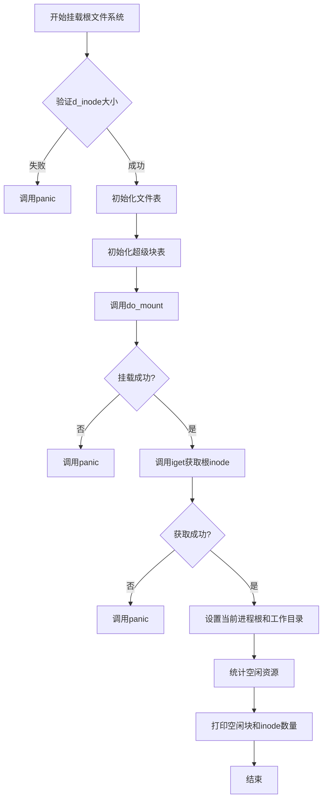
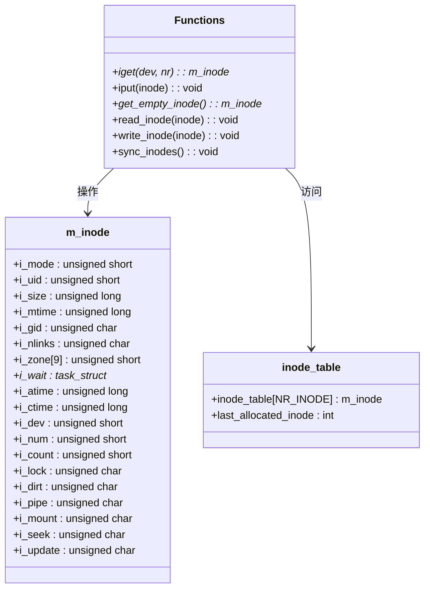
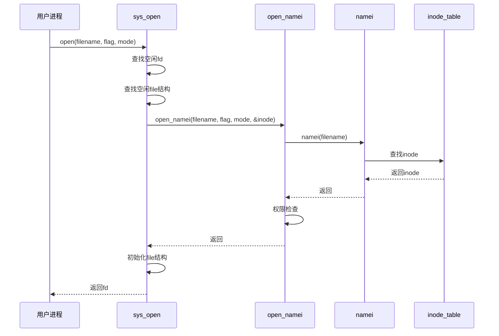

# 文件系统子系统

<cite>
**本文档引用的文件**
- [fs.h](file://include/linux/fs.h#L1-L185)
- [super.c](file://fs/super.c#L1-L102)
- [buffer.c](file://fs/buffer.c#L1-L254)
- [inode.c](file://fs/inode.c#L1-L288)
- [open.c](file://fs/open.c#L1-L188)
- [read_write.c](file://fs/read_write.c#L1-L97)
</cite>

## 目录
1. [引言](#引言)
2. [核心数据结构](#核心数据结构)
3. [超级块管理](#超级块管理)
4. [缓冲区缓存机制](#缓冲区缓存机制)
5. [inode生命周期管理](#inode生命周期管理)
6. [文件打开流程](#文件打开流程)
7. [读写系统调用实现](#读写系统调用实现)
8. [并发与同步设计](#并发与同步设计)
9. [结论](#结论)

## 引言
本文档系统性地分析Linux 0.01内核中的文件系统子系统，重点阐述其与Minix 1.5.10文件系统的兼容性设计。通过深入分析核心数据结构和关键模块的实现机制，揭示该文件系统在早期Linux内核中的架构特点和设计哲学。

## 核心数据结构

文件系统子系统的核心数据结构在`include/linux/fs.h`中定义，主要包括`super_block`、`buffer_head`和`m_inode`等结构体，这些结构体的设计与Minix文件系统保持高度兼容。

### super_block结构
`super_block`结构体用于描述文件系统的超级块信息，包含文件系统元数据如inode数量、数据块数量、位图块数量等。其`s_magic`字段用于验证文件系统类型，值为`SUPER_MAGIC 0x137F`，与Minix文件系统一致。

### buffer_head结构
`buffer_head`是缓冲区缓存的核心数据结构，管理1024字节大小的数据块。该结构包含指向数据的指针、设备号、块号、更新状态、脏标记、使用计数、锁状态等字段，形成双向链表以支持高效的缓冲区查找和管理。

### m_inode结构
`m_inode`结构体表示内存中的inode，包含文件模式、用户ID、大小、时间戳、链接数、数据区指针等字段。其中`i_zone[9]`数组用于索引数据块，支持直接、一次间接和二次间接寻址。该结构与磁盘上的`d_inode`结构保持兼容，确保与Minix文件系统的互操作性。

**Section sources**
- [fs.h](file://include/linux/fs.h#L1-L185)

## 超级块管理

`fs/super.c`模块负责超级块的管理和根文件系统的挂载，实现了文件系统挂载的核心逻辑。

### do_mount函数
`do_mount()`函数负责将指定设备的超级块读入内存。该函数首先在超级块表中查找空闲项，然后通过`bread()`读取设备上第1块（块号从1开始）的数据，验证`s_magic`字段以确认文件系统类型。验证通过后，依次读取inode位图和数据块位图到内存中，并初始化相关字段。

### mount_root函数
`mount_root()`函数完成根文件系统的初始化挂载。该函数首先验证`d_inode`结构体大小是否为32字节，确保与Minix文件系统兼容。然后调用`do_mount()`挂载根设备，通过`iget()`获取根目录的inode（inode号为1），并将其设置为当前进程的根目录和工作目录。最后统计并打印空闲inode和数据块的数量。



**Diagram sources**
- [super.c](file://fs/super.c#L1-L102)

**Section sources**
- [super.c](file://fs/super.c#L1-L102)

## 缓冲区缓存机制

`fs/buffer.c`模块实现了缓冲区缓存机制，通过`getblk()`和`get_hash_table()`等函数提供高效的块设备I/O缓存服务。

### 缓冲区初始化
`buffer_init()`函数在系统启动时初始化缓冲区缓存。该函数从`end`符号后的内存开始，按1024字节对齐分配缓冲区空间，构建自由链表和哈希表。所有缓冲区通过`b_prev_free`和`b_next_free`指针形成循环双向链表，同时通过哈希函数`_hashfn(dev,block)`建立设备-块号到缓冲区的映射。

### getblk函数
`getblk()`是缓冲区分配的核心函数，采用双重检查机制避免竞态条件。函数首先调用`get_hash_table()`检查目标块是否已在缓存中，若存在则直接返回。否则从自由链表中查找未使用的缓冲区，若缓冲区为脏则先同步到磁盘。关键的是，在更新缓冲区设备号和块号后，会再次检查该块是否已被其他进程加入哈希表，若存在则释放当前缓冲区并重试，确保缓存一致性。

### 缓冲区同步
`sys_sync()`和`sync_dev()`函数负责将脏缓冲区写回磁盘。`sys_sync()`同步所有设备的脏块，而`sync_dev()`仅同步指定设备的脏块。这两个函数都通过`ll_rw_block()`发起实际的块设备读写操作。

```mermaid
flowchart TD
A[调用getblk(dev, block)] --> B[调用get_hash_table]
B --> C{缓冲区存在?}
C --> |是| D[返回缓冲区]
C --> |否| E[从自由链表获取缓冲区]
E --> F{获取成功?}
F --> |否| G[睡眠等待]
G --> A
F --> |是| H[等待缓冲区解锁]
H --> I{缓冲区仍空闲?}
I --> |否| E
I --> |是| J[若脏则同步到磁盘]
J --> K[更新设备号和块号]
K --> L[再次检查哈希表]
L --> M{已存在?}
M --> |是| N[释放缓冲区]
N --> A
M --> |否| O[插入哈希表和自由链表]
O --> P[返回缓冲区]
```

**Diagram sources**
- [buffer.c](file://fs/buffer.c#L1-L254)

**Section sources**
- [buffer.c](file://fs/buffer.c#L1-L254)

## inode生命周期管理

`fs/inode.c`模块负责inode的生命周期管理，包括`iget()`获取inode和`iput()`释放inode的核心逻辑。

### iget函数
`iget()`函数用于获取指定设备和inode号的内存inode。该函数首先调用`get_empty_inode()`获取一个空闲inode槽位，然后在inode表中搜索目标inode。若找到则增加其引用计数并返回；若未找到，则将空闲inode初始化为目标inode，并通过`read_inode()`从磁盘读取inode数据。搜索过程中采用双重检查机制，确保在多线程环境下的正确性。

### iput函数
`iput()`函数负责释放inode引用。对于管道inode，当引用计数减至0时释放其内存页；对于普通inode，若链接数为0则调用`truncate()`和`free_inode()`删除文件；若inode为脏则先写回磁盘。该函数通过`wait_on_inode()`确保在操作前inode未被锁定。

### 空闲inode分配
`get_empty_inode()`函数采用循环分配策略查找空闲inode槽位。该函数从`last_allocated_inode`记录的位置开始搜索，避免每次都从头开始。找到空闲inode后，会等待其解锁并确保其未被其他进程占用，然后清零其内容并设置引用计数为1。



**Diagram sources**
- [inode.c](file://fs/inode.c#L1-L288)

**Section sources**
- [inode.c](file://fs/inode.c#L1-L288)

## 文件打开流程

`fs/open.c`模块实现了`sys_open()`系统调用，处理从路径名解析到文件描述符分配的完整流程。

### sys_open实现
`sys_open()`函数首先在进程文件描述符表中查找空闲位置，然后在全局文件表中查找空闲文件结构。接着调用`open_namei()`执行路径名解析和权限检查，获取目标文件的inode。若为终端设备，还需进行特殊处理以设置进程的tty信息。最后初始化文件结构并返回文件描述符。

### 路径名解析
虽然`namei()`和`open_namei()`的实现不在当前分析范围内，但`sys_open()`的调用表明文件系统通过路径名解析获取inode的完整流程：从根目录或当前工作目录开始，逐级解析路径组件，进行权限检查，最终定位到目标inode。



**Diagram sources**
- [open.c](file://fs/open.c#L1-L188)

**Section sources**
- [open.c](file://fs/open.c#L1-L188)

## 读写系统调用实现

`fs/read_write.c`模块实现了`sys_read()`和`sys_write()`系统调用，提供统一的文件读写接口。

### sys_read实现
`sys_read()`根据文件类型分发读取操作：管道文件调用`read_pipe()`，字符设备调用`rw_char()`，块设备调用`block_read()`，普通文件和目录调用`file_read()`。该函数首先验证文件描述符有效性，然后根据inode的模式位确定文件类型，最后调用相应的读取函数。

### sys_write实现
`sys_write()`的实现与`sys_read()`类似，根据文件类型分发写入操作：管道文件调用`write_pipe()`，字符设备调用`rw_char()`，块设备调用`block_write()`，普通文件调用`file_write()`。该函数同样通过inode的模式位判断文件类型。

### 统一I/O接口
文件系统通过`inode->i_op->read/write`的间接调用机制实现统一的I/O接口。虽然在当前代码中该机制通过显式的类型判断实现，但这种设计为未来扩展提供了基础，允许不同文件系统类型注册自己的读写操作函数。

```mermaid
flowchart TD
A[sys_read(fd, buf, count)] --> B{验证参数}
B --> |无效| C[返回-EINVAL]
B --> |有效| D{inode->i_pipe?}
D --> |是| E{可读?}
E --> |是| F[调用read_pipe]
E --> |否| G[返回-1]
D --> |否| H{字符设备?}
H --> |是| I[调用rw_char]
H --> |否| J{块设备?}
J --> |是| K[调用block_read]
J --> |否| L{普通文件/目录?}
L --> |是| M[调用file_read]
L --> |否| N[打印错误]
N --> O[返回-EINVAL]
F --> P[返回读取字节数]
I --> P
K --> P
M --> P
```

**Diagram sources**
- [read_write.c](file://fs/read_write.c#L1-L97)

**Section sources**
- [read_write.c](file://fs/read_write.c#L1-L97)

## 并发与同步设计

文件系统子系统采用独特的双重检查机制而非传统锁机制来处理多线程环境下的竞态条件，体现了早期Linux内核的设计哲学。

### 双重检查机制
在`getblk()`和`iget()`等关键函数中，系统采用双重检查模式：首先进行快速检查，若资源不可用则进行完整搜索，在即将使用资源前再次检查其状态。这种设计避免了长时间持有锁的开销，同时通过`wait_on_buffer()`和`wait_on_inode()`确保在关键操作时资源未被修改。

### 锁机制的替代
与传统操作系统使用互斥锁不同，该文件系统通过`b_lock`和`i_lock`字段配合`sleep_on()`和`wake_up()`实现轻量级同步。当缓冲区或inode被锁定时，其他进程会睡眠等待，而不是忙等待。这种设计在单处理器系统上有效，但在多处理器系统上可能存在性能瓶颈。

### 设计权衡
这种设计权衡了实现复杂性和性能：避免了复杂锁层次结构带来的死锁风险，简化了代码逻辑；但依赖于原子操作和仔细的状态管理，对开发者要求较高。双重检查机制减少了锁竞争，但在高并发场景下可能导致多次重试，影响性能。

**Section sources**
- [buffer.c](file://fs/buffer.c#L1-L254)
- [inode.c](file://fs/inode.c#L1-L288)

## 结论
Linux 0.01的文件系统子系统通过精心设计的核心数据结构和简洁高效的算法，实现了与Minix 1.5.10文件系统的兼容性。系统采用双重检查机制而非传统锁机制来处理并发访问，体现了早期Linux内核追求简洁和实用的设计哲学。尽管在多处理器支持和并发性能方面存在局限，但其模块化设计和清晰的代码结构为后续发展奠定了坚实基础。