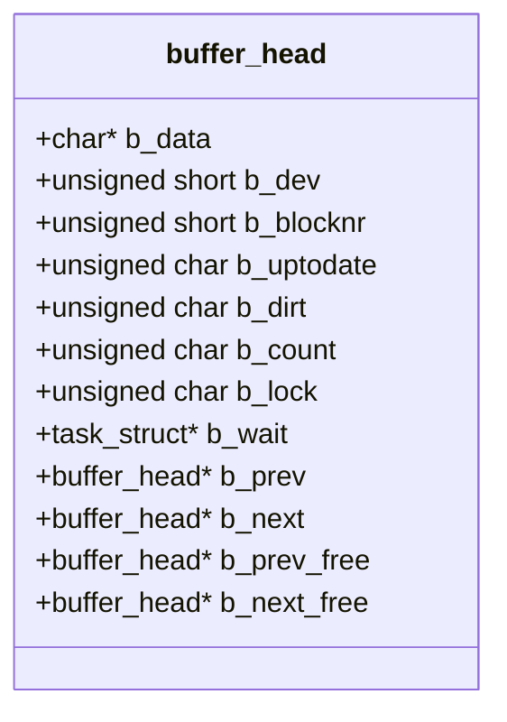
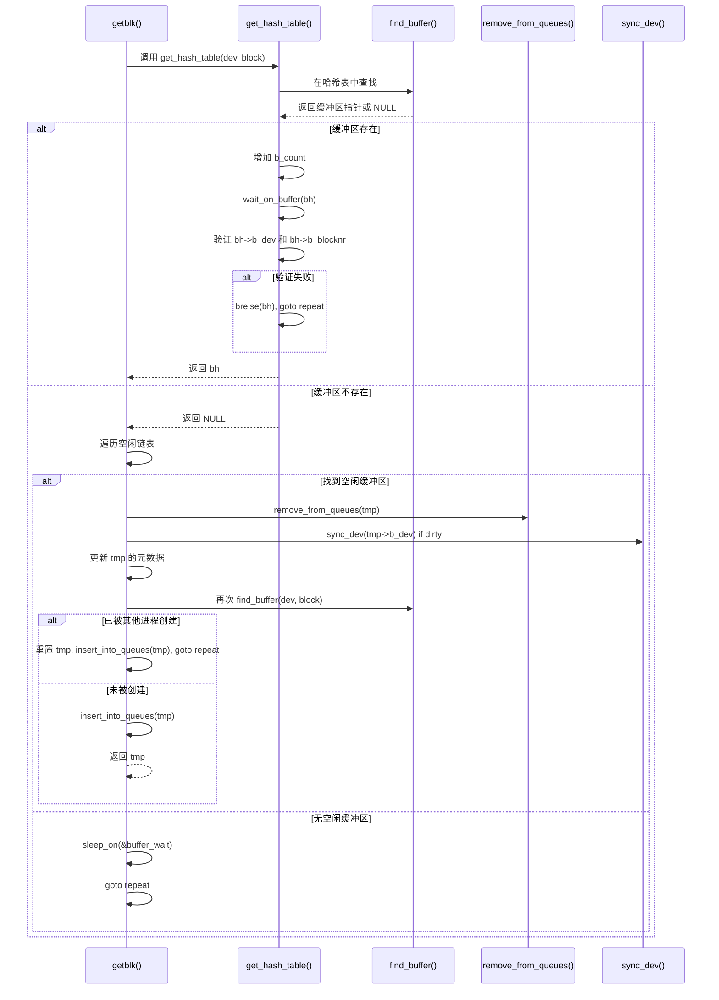

# 缓冲区缓存机制

<cite>
**本文档引用的文件**  
- [fs/buffer.c](file://fs/buffer.c)
- [include/linux/fs.h](file://include/linux/fs.h)
- [include/const.h](file://include/const.h)
- [include/linux/config.h](file://include/linux/config.h)
- [fs/block_dev.c](file://fs/block_dev.c)
</cite>

## 目录
1. [引言](#引言)
2. [缓冲区结构与组织](#缓冲区结构与组织)
3. [缓冲区分配与查找机制](#缓冲区分配与查找机制)
4. [读写操作流程](#读写操作流程)
5. [同步与释放机制](#同步与释放机制)
6. [初始化与系统限制](#初始化与系统限制)
7. [状态变迁与同步设计](#状态变迁与同步设计)
8. [结论](#结论)

## 引言
Linux 0.01内核中的缓冲区缓存机制是文件系统与块设备之间的核心桥梁，负责管理磁盘块在内存中的缓存。该机制通过`struct buffer_head`结构体实现对数据块的统一管理，采用双向链表组织空闲缓冲区，并通过哈希表加速缓存查找。本文档深入解析`fs/buffer.c`中的实现细节，涵盖缓冲区的组织方式、分配策略、读写流程及同步机制。

## 缓冲区结构与组织

`struct buffer_head`是缓冲区缓存的核心数据结构，定义于`include/linux/fs.h`中，包含指向数据块的指针、设备号、块号、状态标志及链表指针等字段。每个缓冲区对应一个固定大小（1024字节）的数据块。

缓冲区在内存中通过两种双向链表进行组织：

1. **哈希队列（Hash Queue）**：用于快速查找特定设备和块号对应的缓冲区。哈希表大小由`NR_HASH`（307）定义，哈希函数为`_hashfn(dev, block) = (dev ^ block) % NR_HASH`。
2. **空闲链表（Free List）**：所有未被使用的缓冲区构成一个循环双向链表，由`free_list`指针指向链表中的任意节点，便于快速分配。

此外，`buffer_head`还包含`b_prev_free`和`b_next_free`指针，专门用于维护空闲链表的连接关系。



**图示来源**  
- [include/linux/fs.h](file://include/linux/fs.h#L55-L68)

**本节来源**  
- [include/linux/fs.h](file://include/linux/fs.h#L55-L68)
- [fs/buffer.c](file://fs/buffer.c#L20-L25)

## 缓冲区分配与查找机制

### `getblk()` 缓冲区获取

`getblk(dev, block)`是缓冲区分配的核心函数，其目标是返回一个与指定设备号和块号关联的缓冲区。其执行流程如下：

1. 首先调用`get_hash_table()`尝试在哈希表中查找已存在的缓冲区。
2. 若未找到，则遍历空闲链表，寻找一个引用计数（`b_count`）为0的缓冲区。
3. 若空闲链表中无可分配缓冲区，则进程将睡眠在`buffer_wait`等待队列上，直到有缓冲区被释放。
4. 找到可用缓冲区后，将其从空闲链表和哈希队列中移除（`remove_from_queues`）。
5. 若该缓冲区是脏的（`b_dirt`），则先将其同步到磁盘（`sync_dev`）。
6. 更新缓冲区的设备号、块号等元数据。
7. **关键检查**：再次调用`find_buffer()`确认在等待期间没有其他进程创建了相同的缓冲区。若有，则放弃当前分配，重新开始。
8. 将缓冲区插入到新的哈希队列位置，并重新加入空闲链表（此时它已被占用）。

该设计通过“先移除再修改”的策略避免了在修改过程中被其他进程访问，从而规避了竞态条件。

### `get_hash_table()` 缓存命中

`get_hash_table(dev, block)`用于查找一个已存在的、干净的缓冲区。其流程为：

1. 调用`find_buffer()`在哈希队列中搜索目标缓冲区。
2. 若找到，增加其引用计数（`b_count++`）。
3. 调用`wait_on_buffer()`等待该缓冲区解锁（`b_lock`为0）。
4. **关键检查**：验证缓冲区的`b_dev`和`b_blocknr`是否仍与请求一致。若不一致（可能在等待期间被重用），则释放引用并重试。

这种“获取-等待-验证”的循环模式确保了即使在无锁设计下，也能安全地访问缓冲区。



**图示来源**  
- [fs/buffer.c](file://fs/buffer.c#L100-L150)

**本节来源**  
- [fs/buffer.c](file://fs/buffer.c#L100-L150)

## 读写操作流程

### `ll_rw_block()` 底层读写触发

`ll_rw_block(rw, bh)`函数负责触发对块设备的底层读写操作。它并不直接执行I/O，而是通过主设备号查找对应的块设备操作函数（`rd_blk[major]`），然后调用该函数。

其流程为：
1. 从`bh->b_dev`中提取主设备号。
2. 检查主设备号是否有效，并获取对应的块设备操作函数指针`blk_addr`。
3. 调用`blk_addr(rw, bh)`，将读写请求和缓冲区指针传递给设备驱动。

该函数是上层缓冲区管理与底层设备驱动之间的关键接口。

### `bread()` 阻塞读取实现

`bread(dev, block)`提供了一个高层的阻塞读取接口，其流程如下：

1. 调用`getblk(dev, block)`获取一个缓冲区。
2. 检查`b_uptodate`标志位。若为1，表示数据已在内存中，直接返回。
3. 若数据未就绪，则调用`ll_rw_block(READ, bh)`发起读取请求。
4. 再次检查`b_uptodate`。若为1，返回缓冲区；否则，释放缓冲区（`brelse`）并返回NULL。

`bread()`的阻塞性能依赖于设备驱动在读取完成后将`b_uptodate`置为1，并唤醒等待在`bh->b_wait`上的进程。

```mermaid
flowchart TD
Start([bread(dev, block)]) --> GetBlk["getblk(dev, block)"]
GetBlk --> CheckUptodate{"b_uptodate?"}
CheckUptodate --> |是| ReturnBH["返回 bh"]
CheckUptodate --> |否| ReadBlock["ll_rw_block(READ, bh)"]
ReadBlock --> CheckAgain{"b_uptodate?"}
CheckAgain --> |是| ReturnBH
CheckAgain --> |否| Brelse["brelse(bh)"]
Brelse --> ReturnNull["返回 NULL"]
ReturnBH --> End([函数退出])
ReturnNull --> End
```

**图示来源**  
- [fs/buffer.c](file://fs/buffer.c#L209-L222)

**本节来源**  
- [fs/buffer.c](file://fs/buffer.c#L209-L222)
- [fs/block_dev.c](file://fs/block_dev.c#L77-L85)

## 同步与释放机制

### `brelse()` 引用计数管理

`brelse(buf)`函数用于释放对缓冲区的引用，是`getblk()`的配对操作。

其流程为：
1. 调用`wait_on_buffer(buf)`确保缓冲区未被锁定。
2. 对`b_count`进行原子递减。
3. 如果`b_count`减为0，说明该缓冲区不再被任何进程使用，将其加入`buffer_wait`等待队列，唤醒一个可能正在等待空闲缓冲区的进程。

`brelse()`的设计确保了只有当所有使用者都释放引用后，缓冲区才能被重新分配。

### 同步机制

系统提供了`sys_sync()`和`sync_dev(dev)`函数用于将脏缓冲区（`b_dirt`为1）写回磁盘。

- `sys_sync()`遍历所有缓冲区，对每个脏缓冲区调用`ll_rw_block(WRITE, bh)`。
- `sync_dev(dev)`则只同步指定设备的脏缓冲区。

在写回前，会通过`wait_on_buffer()`等待缓冲区解锁，确保数据一致性。

**本节来源**  
- [fs/buffer.c](file://fs/buffer.c#L30-L98)
- [fs/buffer.c](file://fs/buffer.c#L224-L254)

## 初始化与系统限制

### `buffer_init()` 初始化

`buffer_init()`在系统启动时被调用，负责初始化整个缓冲区缓存系统。

其流程为：
1. 从`end`符号（内核代码结束处）开始，到`BUFFER_END`（由`config.h`定义，通常为0x200000）结束的内存区域被划分为多个1024字节的块。
2. 为每个块创建一个`buffer_head`结构体，初始化其字段。
3. 将所有`buffer_head`通过`b_prev_free`和`b_next_free`链接成一个循环双向链表，并将`free_list`指向链表头。
4. 初始化哈希表`hash_table`为NULL。

缓冲区总数`NR_BUFFERS`在初始化过程中动态计算。

### 性能权衡

- `BLOCK_SIZE`固定为1024字节，与当时常见的磁盘块大小匹配。
- `NR_HASH`为307（质数），旨在减少哈希冲突。
- `NR_BUFFERS`由可用内存决定（`BUFFER_END - end`），受限于物理内存大小。更多的缓冲区可以提高缓存命中率，但会占用更多内存。

**本节来源**  
- [fs/buffer.c](file://fs/buffer.c#L224-L254)
- [include/const.h](file://include/const.h#L3)
- [include/linux/config.h](file://include/linux/config.h#L20-L23)
- [include/linux/fs.h](file://include/linux/fs.h#L43-L45)

## 状态变迁与同步设计

缓冲区的状态由`b_uptodate`、`b_dirt`、`b_lock`和`b_count`共同描述。一个典型的`bread()`调用流程中的状态变迁如下：

1. **查找/分配**：`getblk()`返回一个`b_count > 0`的缓冲区。
2. **数据就绪检查**：若`b_uptodate`为1，直接使用。
3. **发起读取**：若`b_uptodate`为0，`ll_rw_block(READ)`被调用，设备驱动开始填充`b_data`。
4. **等待完成**：`bread()`在`ll_rw_block`返回后检查`b_uptodate`。若仍为0，说明I/O未完成，但`bread()`本身不等待，而是由设备驱动在完成后唤醒等待者。
5. **释放**：`brelse()`递减`b_count`，当其为0时，缓冲区可被回收。

同步机制的核心是`b_lock`和`b_wait`等待队列。`wait_on_buffer()`宏通过`cli()`和`sti()`禁用中断，确保在检查`b_lock`和进入睡眠之间不会被中断唤醒，从而避免了竞态条件。这种设计在单处理器系统中是有效的。

**本节来源**  
- [fs/buffer.c](file://fs/buffer.c#L25-L28)
- [fs/buffer.c](file://fs/buffer.c#L209-L222)

## 结论

Linux 0.01的缓冲区缓存机制是一个精巧而高效的设计。它通过哈希表和空闲链表的组合实现了快速查找和分配。`getblk()`和`get_hash_table()`中的循环验证逻辑巧妙地解决了无锁环境下的竞态问题。`bread()`和`ll_rw_block()`的分层设计清晰地划分了高层逻辑与底层驱动的职责。尽管受限于当时的硬件条件，但其核心思想——利用内存缓存加速I/O、通过引用计数管理资源、使用等待队列实现同步——至今仍是操作系统设计的基石。