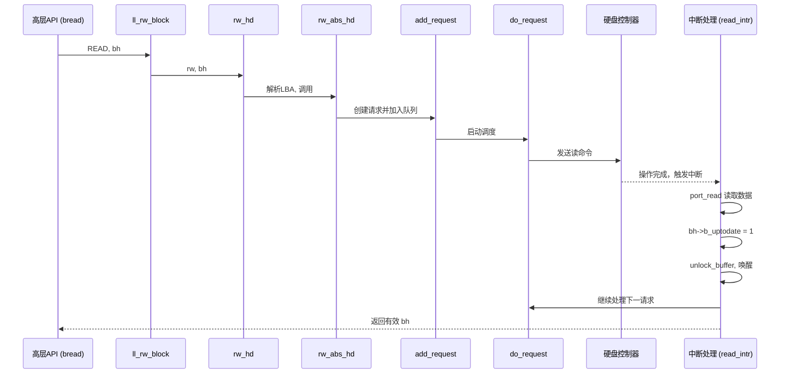

# 块设备处理

<cite>
**本文档引用的文件**  
- [fs/block_dev.c](file://fs/block_dev.c)
- [include/linux/fs.h](file://include/linux/fs.h)
- [fs/buffer.c](file://fs/buffer.c)
- [kernel/hd.c](file://kernel/hd.c)
</cite>

## 目录
1. [引言](#引言)
2. [块设备抽象层实现](#块设备抽象层实现)
3. [blk_fops 与 block_device_operations 的回调机制](#blk_fops-与-block_device_operations-的回调机制)
4. [缓冲区子系统协作机制](#缓冲区子系统协作机制)
5. [设备类型检测与主设备号识别](#设备类型检测与主设备号识别)
6. [硬盘驱动读写流程与中断处理](#硬盘驱动读写流程与中断处理)
7. [同步写入与缓存一致性](#同步写入与缓存一致性)
8. [性能优化建议](#性能优化建议)
9. [结论](#结论)

## 引言
Linux 0.01 内核中的块设备处理机制是文件系统与底层硬件之间的关键桥梁。本文深入分析 `fs/block_dev.c` 中的块设备抽象层，重点阐述其如何通过函数指针表将高层文件操作映射到底层驱动，并结合缓冲区缓存机制提升 I/O 效率。同时，探讨设备节点识别、请求队列调度及中断处理等核心机制。

## 块设备抽象层实现

`fs/block_dev.c` 实现了块设备的通用读写接口 `block_read` 和 `block_write`。这两个函数负责将用户空间的字节流请求转换为基于块（BLOCK_SIZE=1024字节）的操作，并通过缓冲区子系统进行调度。

- `block_read`：从指定设备的偏移位置读取数据，按块调用 `bread()` 获取缓冲区，再拷贝到用户缓冲区。
- `block_write`：向指定设备写入数据，同样以块为单位操作，写入后标记缓冲区为脏（`b_dirt = 1`）。

这些函数构成了高层文件操作与底层块设备驱动之间的中间层，屏蔽了具体设备的差异性。

**Section sources**
- [fs/block_dev.c](file://fs/block_dev.c#L1-L50)

## blk_fops 与 block_device_operations 的回调机制

在 Linux 0.01 中，`block_device_operations` 结构并未以现代形式存在，其功能由静态函数指针数组 `rd_blk` 实现，该数组定义在 `fs/block_dev.c` 中：

```c
static blk_fn rd_blk[]={
	NULL,		/* nodev */
	NULL,		/* dev mem */
	NULL,		/* dev fd */
	rw_hd,		/* dev hd */
	NULL,		/* dev ttyx */
	NULL,		/* dev tty */
	NULL};		/* dev lp */
```

此数组索引对应设备的主设备号（major number），每个条目指向一个处理函数。例如，主设备号为 3 的硬盘设备（`/dev/hd`）对应 `rw_hd` 函数。

`ll_rw_block` 函数是核心调度器，它根据 `buffer_head` 中的设备号查找对应的驱动处理函数并调用：

```c
void ll_rw_block(int rw, struct buffer_head * bh)
{
	blk_fn blk_addr;
	unsigned int major;

	if ((major=MAJOR(bh->b_dev)) >= NR_BLK_DEV || !(blk_addr=rd_blk[major]))
		panic("Trying to read nonexistent block-device");
	blk_addr(rw, bh);
}
```

当高层调用 `bread()` 或执行写操作时，最终会触发 `ll_rw_block`，进而通过 `rd_blk` 查找并调用具体的设备驱动函数（如 `rw_hd`），实现回调机制。

**Section sources**
- [fs/block_dev.c](file://fs/block_dev.c#L77-L85)
- [include/linux/fs.h](file://include/linux/fs.h#L15-L18)

## 缓冲区子系统协作机制

块设备与缓冲区子系统（`fs/buffer.c`）紧密协作，通过缓存机制显著提升 I/O 效率。

### bread() 函数
`bread()` 是块读取的核心接口，定义于 `fs/buffer.c`：
```c
struct buffer_head * bread(int dev,int block)
{
	struct buffer_head * bh;

	if (!(bh=getblk(dev,block)))
		panic("bread: getblk returned NULL\n");
	if (bh->b_uptodate)
		return bh;
	ll_rw_block(READ,bh);
	if (bh->b_uptodate)
		return bh;
	brelse(bh);
	return (NULL);
}
```
其工作流程如下：
1. 调用 `getblk()` 获取指定设备和块号的缓冲区头（`buffer_head`）。
2. 若缓冲区已更新（`b_uptodate` 为真），直接返回，避免实际 I/O。
3. 否则，调用 `ll_rw_block(READ, bh)` 发起读取请求，该请求最终由底层驱动完成。
4. 驱动中断处理完成后，设置 `b_uptodate`，`bread()` 返回有效缓冲区。

### ll_rw_block() 的作用
`ll_rw_block()` 是 I/O 请求的发起点。它不直接执行读写，而是通过 `rd_blk` 数组找到对应设备的驱动函数（如 `rw_hd`），并将 `buffer_head` 作为参数传递，启动实际的硬件操作。

这种设计实现了设备无关性：高层代码只需调用 `bread()`，底层通过 `ll_rw_block` 和函数指针完成具体驱动调用。

```mermaid
flowchart TD
A["bread(dev, block)"] --> B{"缓冲区存在且已更新?"}
B --> |是| C[返回 buffer_head]
B --> |否| D[调用 getblk 获取缓冲区]
D --> E[调用 ll_rw_block(READ, bh)]
E --> F["通过 rd_blk[MAJOR(dev)] 调用驱动函数"]
F --> G["如 rw_hd()"]
G --> H[硬件读取]
H --> I[中断处理]
I --> J[设置 bh->b_uptodate = 1]
J --> K[唤醒等待进程]
K --> C
```

**Diagram sources**
- [fs/buffer.c](file://fs/buffer.c#L209-L222)
- [fs/block_dev.c](file://fs/block_dev.c#L77-L85)

**Section sources**
- [fs/buffer.c](file://fs/buffer.c#L209-L222)

## 设备类型检测与主设备号识别

### S_ISBLK() 宏的使用
`S_ISBLK()` 宏用于判断 inode 的模式（`i_mode`）是否为块设备。其定义位于 `include/sys/stat.h`：
```c
#define S_ISBLK(m)	(((m) & S_IFMT) == S_IFBLK)
```
在文件系统操作中，内核通过此宏区分设备类型，从而决定调用字符设备还是块设备的操作函数。例如，在 `fs/read_write.c` 中，根据 `S_ISBLK(inode->i_mode)` 的结果选择不同的读写路径。

### 主设备号的作用
主设备号（major number）用于标识设备类型。在 `include/linux/fs.h` 中定义：
```
 * 0 - unused (nodev)
 * 1 - /dev/mem
 * 2 - /dev/fd
 * 3 - /dev/hd
 * ...
```
硬盘设备的主设备号为 3。当 `ll_rw_block` 被调用时，通过 `MAJOR(bh->b_dev)` 提取主设备号，并以此作为 `rd_blk` 数组的索引，找到对应的驱动处理函数 `rw_hd`。这使得内核能够根据设备节点的主设备号，准确地将 I/O 请求路由到正确的驱动程序。

**Section sources**
- [include/sys/stat.h](file://include/sys/stat.h#L32-L33)
- [include/linux/fs.h](file://include/linux/fs.h#L15-L18)
- [fs/read_write.c](file://fs/read_write.c#L63)

## 硬盘驱动读写流程与中断处理

`kernel/hd.c` 实现了硬盘驱动的具体逻辑，展示了请求队列与中断处理的完整交互。

### 请求队列管理
- **请求结构**：`hd_request` 结构体定义了请求的各项参数（设备、扇区、磁头、柱面、命令、缓冲区等）。
- **请求队列**：`request[NR_REQUEST]` 数组构成固定大小的请求队列。
- **电梯算法**：`IN_ORDER` 宏定义了请求排序规则（按设备、柱面、磁头、扇区），`add_request` 函数将新请求按此顺序插入队列，减少磁头移动，提高效率。

### 中断处理流程
1. **发起请求**：`rw_abs_hd` 创建 `hd_request` 并调用 `add_request` 加入队列。
2. **调度执行**：`do_request` 从队列头部取出请求，调用 `hd_out` 向硬盘控制器发送命令。
3. **中断响应**：硬盘操作完成后触发中断，执行 `read_intr` 或 `write_intr`。
4. **数据传输**：
   - 读中断：调用 `port_read` 将数据从端口读入 `bh->b_data`。
   - 写中断：调用 `port_write` 将 `bh->b_data` 数据写入端口。
5. **完成处理**：设置 `bh->b_uptodate = 1`，调用 `unlock_buffer` 唤醒等待进程，并继续处理下一个请求。



**Diagram sources**
- [kernel/hd.c](file://kernel/hd.c#L270-L275)
- [kernel/hd.c](file://kernel/hd.c#L350-L400)

**Section sources**
- [kernel/hd.c](file://kernel/hd.c#L270-L413)

## 同步写入与缓存一致性

### 同步写入
- **脏标记**：当缓冲区被修改后（如 `block_write`），`b_dirt` 标志被置为 1。
- **延迟写入**：修改不会立即写回磁盘，而是延迟到系统空闲或内存压力大时。
- **强制同步**：`sys_sync()` 系统调用遍历所有缓冲区，对脏缓冲区调用 `ll_rw_block(WRITE, bh)`，确保数据落盘。

### 缓存一致性
- **更新标志**：`b_uptodate` 标志确保缓冲区数据与磁盘一致。新分配或从磁盘读取后置为 1。
- **锁机制**：`b_lock` 用于同步访问。`wait_on_buffer` 确保在缓冲区被锁定（如正在进行 I/O）时，其他进程等待。
- **哈希队列**：`hash_table` 快速定位特定设备和块号的缓冲区，避免重复缓存，保证一致性。

这些机制共同确保了在多进程访问和异步 I/O 环境下，数据的完整性和一致性。

**Section sources**
- [fs/buffer.c](file://fs/buffer.c#L1-L254)
- [fs/block_dev.c](file://fs/block_dev.c#L1-L86)

## 性能优化建议

1. **优化请求排序**：`IN_ORDER` 的电梯算法已有效减少寻道时间。可考虑更复杂的算法（如 C-LOOK）进一步优化。
2. **调整缓冲区大小**：`NR_BUFFERS` 的大小直接影响缓存命中率。应根据物理内存和工作负载调整，平衡内存占用与性能。
3. **批量提交请求**：在 `do_request` 中，可尝试合并相邻的读写请求，减少 I/O 次数。
4. **预读机制**：在顺序读取场景下，可在读取当前块后，预读后续块到缓冲区，提升吞吐量。
5. **写回策略**：`sys_sync` 全盘扫描效率较低。可实现基于时间的定期写回或基于脏页比例的动态写回策略。

## 结论
Linux 0.01 的块设备子系统通过清晰的分层设计，实现了设备无关的 I/O 接口。`block_dev.c` 提供通用读写，`buffer.c` 实现高效的缓存管理，`hd.c` 完成具体的硬件驱动。`rd_blk` 函数指针表和 `ll_rw_block` 调度器构成了灵活的回调机制，而 `S_ISBLK` 和主设备号则确保了正确的设备路由。整个系统在有限的资源下，通过请求队列、中断处理和缓存一致性机制，为上层文件系统提供了稳定可靠的块设备服务。