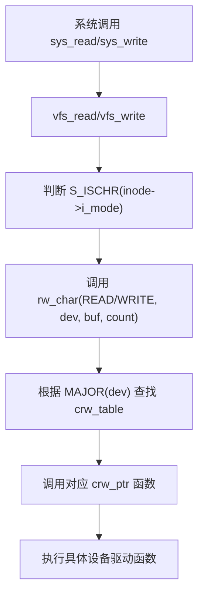
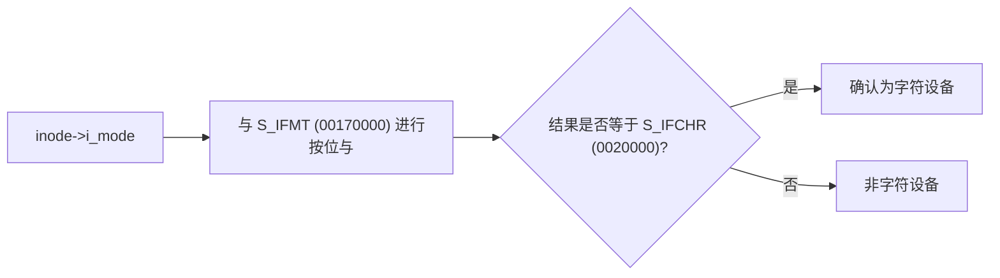
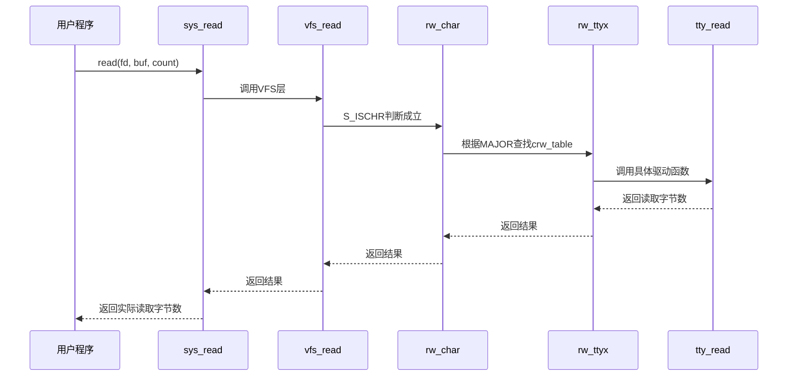

# 字符设备处理

<cite>
**本文档引用的文件**
- [fs/char_dev.c](file://fs/char_dev.c)
- [include/linux/fs.h](file://include/linux/fs.h)
- [fs/read_write.c](file://fs/read_write.c)
- [fs/open.c](file://fs/open.c)
- [include/sys/stat.h](file://include/sys/stat.h)
- [kernel/tty_io.c](file://kernel/tty_io.c)
</cite>

## 目录
1. [引言](#引言)
2. [字符设备抽象接口设计](#字符设备抽象接口设计)
3. [chr_fops函数表的路由机制](#chr_fops函数表的路由机制)
4. [S_ISCHR宏的作用与inode模式判断](#s_ischr宏的作用与inode模式判断)
5. [终端设备主设备号4与5的open_namei路径解析](#终端设备主设备号4与5的open_namei路径解析)
6. [从用户态到驱动的完整调用链](#从用户态到驱动的完整调用链)
7. [cdev结构的注册与分发机制](#cdev结构的注册与分发机制)
8. [中断上下文与用户上下文的协同](#中断上下文与用户上下文的协同)
9. [常见问题排查方法](#常见问题排查方法)
10. [结论](#结论)

## 引言
本文深入分析Linux 0.01内核中字符设备的实现机制，重点解析`fs/char_dev.c`中的核心逻辑。通过研究文件操作函数表如何将系统调用路由到具体驱动函数，揭示字符设备的抽象设计原理。结合`include/linux/fs.h`中的结构体定义和`fs/read_write.c`中的VFS层调用链，展示从用户态系统调用到底层驱动的完整执行路径。同时探讨终端设备在打开过程中的特殊处理逻辑，并提供常见问题的诊断方法。

**Section sources**
- [fs/char_dev.c](file://fs/char_dev.c#L1-L50)
- [include/linux/fs.h](file://include/linux/fs.h#L1-L185)

## 字符设备抽象接口设计
Linux内核通过`file_operations`结构体（在`include/linux/fs.h`中定义）实现了字符设备的统一抽象接口。该结构体封装了对设备的各种操作方法，使得上层系统调用可以透明地访问不同类型的字符设备。每个字符设备驱动只需实现相应的操作函数，并将其注册到全局函数表中，即可被VFS子系统调用。

**Section sources**
- [include/linux/fs.h](file://include/linux/fs.h#L1-L185)

## chr_fops函数表的路由机制
字符设备的文件操作函数表通过一个函数指针数组`crw_table`实现系统调用的路由。该数组索引为主设备号，每个元素指向一个具体的读写处理函数。当执行I/O操作时，内核根据设备号的主设备部分查找对应的处理函数，并将控制权转移至具体设备驱动。



**Diagram sources**
- [fs/char_dev.c](file://fs/char_dev.c#L1-L50)
- [fs/read_write.c](file://fs/read_write.c#L1-L97)

**Section sources**
- [fs/char_dev.c](file://fs/char_dev.c#L1-L50)

## S_ISCHR宏的作用与inode模式判断
`S_ISCHR`宏用于判断inode是否代表字符设备文件。其实现依赖于`include/sys/stat.h`中定义的位掩码操作：



此判断在`fs/read_write.c`的`sys_read`和`sys_write`函数中被使用，以确定是否应调用字符设备专用的`rw_char`函数。

**Diagram sources**
- [include/sys/stat.h](file://include/sys/stat.h#L31-L32)
- [fs/read_write.c](file://fs/read_write.c#L70-L72)

**Section sources**
- [include/sys/stat.h](file://include/sys/stat.h#L1-L58)
- [fs/read_write.c](file://fs/read_write.c#L1-L97)

## 终端设备主设备号4与5的open_namei路径解析
在`fs/open.c`的`sys_open`函数中，对主设备号为4（/dev/ttyx）和5（/dev/tty）的终端设备有特殊处理逻辑：

- **主设备号4**：当进程为会话领导者且尚未分配tty时，将其当前tty设置为所打开设备的次设备号，并更新tty表中的进程组信息。
- **主设备号5**：若进程尚未分配tty，则拒绝打开操作，返回`-EPERM`错误。

这种机制确保了每个会话只能有一个控制终端，体现了终端设备的独占性管理策略。

```mermaid
flowchart TD
A["open(\"/dev/ttyx\")"] --> B["S_ISCHR && MAJOR==4"]
B --> C["current->leader?"]
C --> |是| D["current->tty = MINOR"]
C --> |否| E["不设置tty"]
D --> F["tty_table[current->tty].pgrp = current->pgrp"]
G["open(\"/dev/tty\")"] --> H["S_ISCHR && MAJOR==5"]
H --> I["current->tty < 0?"]
I --> |是| J["返回 -EPERM"]
I --> |否| K["允许打开"]
```

**Diagram sources**
- [fs/open.c](file://fs/open.c#L150-L180)
- [fs/namei.c](file://fs/namei.c#L306-L378)

**Section sources**
- [fs/open.c](file://fs/open.c#L1-L188)
- [fs/namei.c](file://fs/namei.c#L1-L378)

## 从用户态到驱动的完整调用链
从用户态系统调用到字符设备驱动函数的完整执行路径如下：



**Diagram sources**
- [fs/read_write.c](file://fs/read_write.c#L50-L97)
- [fs/char_dev.c](file://fs/char_dev.c#L1-L50)
- [kernel/tty_io.c](file://kernel/tty_io.c#L194-L252)

**Section sources**
- [fs/read_write.c](file://fs/read_write.c#L1-L97)
- [fs/char_dev.c](file://fs/char_dev.c#L1-L50)
- [kernel/tty_io.c](file://kernel/tty_io.c#L1-L290)

## cdev结构的注册与分发机制
尽管Linux 0.01版本尚未引入现代的`cdev`结构，但其字符设备注册机制已初具雏形。通过`crw_table`数组静态注册设备驱动函数，主设备号作为索引，实现设备操作的分发。设备驱动通过`register_chrdev`类似机制（隐式体现在`crw_table`初始化中）将`rw_tty`、`rw_ttyx`等函数注册到系统中。

**Section sources**
- [fs/char_dev.c](file://fs/char_dev.c#L1-L50)

## 中断上下文与用户上下文的协同
字符设备I/O涉及两种上下文的协同工作：
- **用户上下文**：执行`read`、`write`系统调用，可能因等待数据而睡眠
- **中断上下文**：由硬件中断触发，将接收到的数据放入缓冲队列

在`tty_read`函数中，若输入队列为空，进程会调用`sleep_if_empty`进入睡眠状态；当串口接收到数据并触发中断时，中断服务程序将数据存入缓冲区并唤醒等待进程，实现异步I/O的协同。

**Section sources**
- [kernel/tty_io.c](file://kernel/tty_io.c#L194-L290)
- [fs/char_dev.c](file://fs/char_dev.c#L1-L50)

## 常见问题排查方法
### 设备未就绪
- **现象**：`open`返回`-EPERM`（特别是`/dev/tty`）
- **排查**：检查进程是否已分配tty，会话领导者身份
- **工具**：使用`ps`查看进程tty信息

### 权限错误
- **现象**：`open`返回`-EACCES`
- **排查**：
  1. 检查文件权限位（`i_mode`）
  2. 验证用户/组权限匹配
  3. 确认`current->euid`和`current->egid`正确性
- **工具**：`ls -l /dev/tty*` 查看设备权限

### 读写异常
- **现象**：`read`/`write`返回`-1`
- **排查**：
  1. 确认设备号有效性（`MAJOR(dev) < NRDEVS`）
  2. 检查`crw_table[MAJOR(dev)]`是否为NULL
  3. 验证缓冲区地址有效性（`verify_area`）

**Section sources**
- [fs/open.c](file://fs/open.c#L1-L188)
- [fs/char_dev.c](file://fs/char_dev.c#L1-L50)
- [fs/read_write.c](file://fs/read_write.c#L1-L97)

## 结论
Linux 0.01的字符设备实现展现了精巧的分层设计思想：通过`file_operations`抽象接口统一设备操作，利用主设备号索引实现高效的函数路由，结合`S_ISCHR`宏进行类型判断，并在`open_namei`路径中对特殊设备进行定制化处理。从用户态系统调用到驱动函数的完整调用链清晰地展示了VFS层与设备驱动层的协作机制。虽然缺少现代`cdev`结构的动态注册能力，但其静态函数表机制已奠定了字符设备框架的基础。理解这些底层机制对于调试设备驱动和优化系统性能具有重要意义。