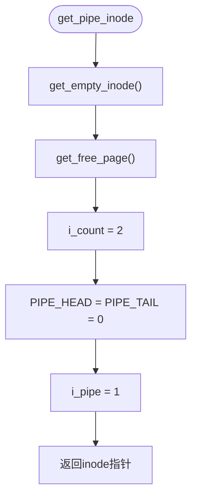
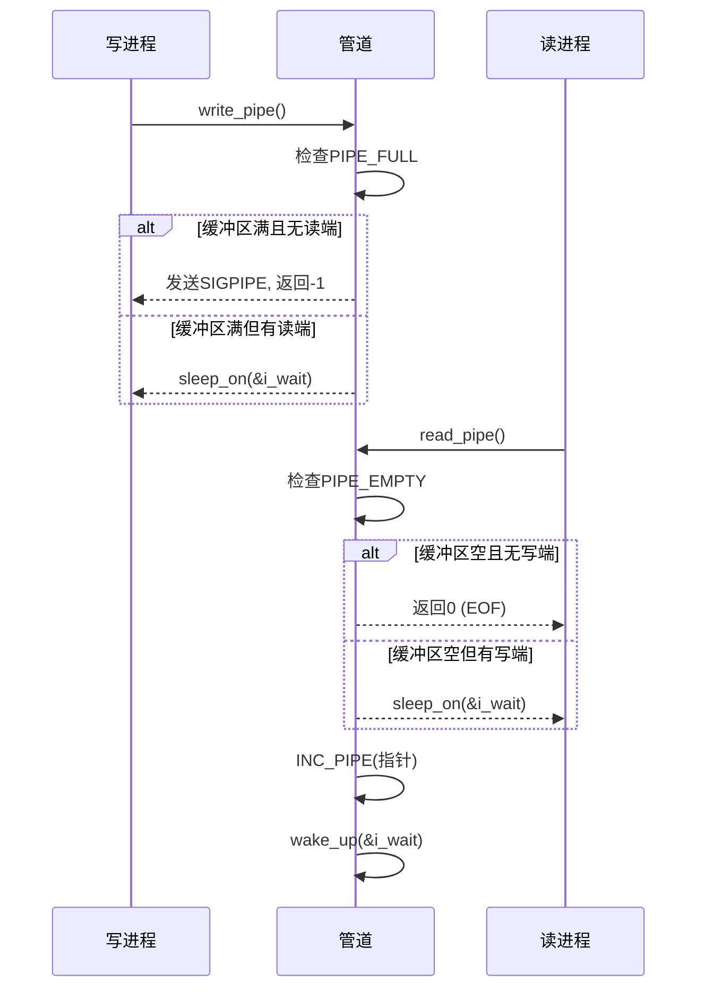
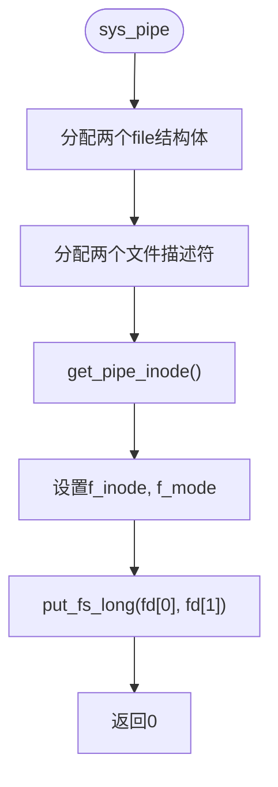

# 管道机制实现

<cite>
**本文档中引用的文件**  
- [fs/pipe.c](file://fs/pipe.c)
- [include/linux/fs.h](file://include/linux/fs.h)
- [fs/inode.c](file://fs/inode.c)
- [fs/open.c](file://fs/open.c)
- [fs/read_write.c](file://fs/read_write.c)
- [kernel/fork.c](file://kernel/fork.c)
- [fs/fcntl.c](file://fs/fcntl.c)
- [lib/dup.c](file://lib/dup.c)
</cite>

## 目录
1. [引言](#引言)
2. [管道inode的创建与初始化](#管道inode的创建与初始化)
3. [环形缓冲区的实现机制](#环形缓冲区的实现机制)
4. [读写操作的无锁同步](#读写操作的无锁同步)
5. [系统调用sys_pipe的实现](#系统调用sys_pipe的实现)
6. [文件描述符的继承与复制](#文件描述符的继承与复制)
7. [阻塞与非阻塞模式](#阻塞与非阻塞模式)
8. [管道容量与使用模式](#管道容量与使用模式)
9. [死锁调试技巧](#死锁调试技巧)
10. [总结](#总结)

## 引言
管道是Linux进程间通信（IPC）的基础机制之一，允许一个进程的输出直接作为另一个进程的输入。本文深入分析Linux 0.01内核中`fs/pipe.c`的实现原理，涵盖从inode创建、环形缓冲区管理到系统调用接口的完整流程。通过结合`fs/inode.c`、`fs/read_write.c`等模块的调用链，揭示管道在`fork`和`dup`操作下的行为特性，并探讨其阻塞/非阻塞模式、容量限制及常见使用场景。

## 管道inode的创建与初始化

管道的实现始于特殊inode的创建。`get_pipe_inode()`函数负责分配并初始化一个专用于管道的内存inode结构。

该函数首先调用`get_empty_inode()`获取一个空闲的inode条目。随后，通过`get_free_page()`分配一个物理内存页（4KB），并将该页的地址存储在`i_size`字段中——这一设计巧妙地复用了原本用于文件大小的字段来指向缓冲区。接着，`i_count`被设置为2，表示管道初始时有一个读端和一个写端。最后，`i_pipe`标志被置位，标识此inode为管道类型，从而在后续的文件操作中触发特定的管道处理逻辑。



**Diagram sources**
- [fs/inode.c](file://fs/inode.c#L201-L215)

**Section sources**
- [fs/inode.c](file://fs/inode.c#L201-L215)

## 环形缓冲区的实现机制

管道的核心是一个基于单页内存的环形缓冲区，其读写指针通过`i_zone[0]`和`i_zone[1]`实现，这两个字段被重新解释为`PIPE_HEAD`和`PIPE_TAIL`。

`include/linux/fs.h`中的宏定义将`i_zone`数组强制转换为`long`类型指针，使得`i_zone[0]`和`i_zone[1]`分别成为头指针和尾指针：
```c
#define PIPE_HEAD(inode) (((long *)((inode).i_zone))[0])
#define PIPE_TAIL(inode) (((long *)((inode).i_zone))[1])
```
缓冲区大小固定为`PAGE_SIZE`（4096字节），利用位运算`&(PAGE_SIZE-1)`实现指针的自动回绕，形成环形结构。`PIPE_SIZE`宏计算当前缓冲区中的数据量，而`PIPE_EMPTY`和`PIPE_FULL`宏则用于判断缓冲区状态。

```mermaid
classDiagram
class m_inode {
+i_mode
+i_uid
+i_size : char* (缓冲区地址)
+i_mtime
+i_gid
+i_nlinks
+i_zone[9] : long[9]
+i_wait
+i_atime
+i_ctime
+i_dev
+i_num
+i_count
+i_lock
+i_dirt
+i_pipe : 1 (管道标志)
+i_mount
+i_seek
+i_update
}
note right of m_inode
i_zone[0] → PIPE_HEAD (写指针)
i_zone[1] → PIPE_TAIL (读指针)
i_size → 指向4KB缓冲区
end note
```

**Diagram sources**
- [include/linux/fs.h](file://include/linux/fs.h#L103-L105)

**Section sources**
- [include/linux/fs.h](file://include/linux/fs.h#L103-L105)

## 读写操作的无锁同步

`pipe_read()`和`pipe_write()`函数实现了无锁的环形缓冲区访问，其原子性由`INC_PIPE`汇编宏保证。

`INC_PIPE`宏包含两条内联汇编指令：`incl`对指针进行原子递增，`andl $4095`通过位与操作实现模4096的回绕。由于x86的`incl`指令本身是原子的，且整个操作在单条指令流中完成，因此无需额外的锁机制即可保证指针更新的原子性。

读操作`read_pipe`首先检查缓冲区是否为空（`PIPE_EMPTY`），若为空且无写端（`i_count != 2`）则返回0表示EOF；否则进入睡眠等待。一旦有数据，便从`PIPE_TAIL`位置读取字节，并调用`INC_PIPE`移动尾指针。写操作`write_pipe`逻辑类似，检查缓冲区满时（`PIPE_FULL`）若无读端则发送`SIGPIPE`信号并返回错误。



**Diagram sources**
- [fs/pipe.c](file://fs/pipe.c#L0-L56)
- [include/linux/fs.h](file://include/linux/fs.h#L108-L110)

**Section sources**
- [fs/pipe.c](file://fs/pipe.c#L0-L56)
- [include/linux/fs.h](file://include/linux/fs.h#L108-L110)

## 系统调用sys_pipe的实现

`sys_pipe()`系统调用负责创建管道并返回两个文件描述符，分别用于读和写。

该函数首先在`file_table`中分配两个空闲的`struct file`结构体，然后在当前进程的`filp`数组中找到两个空闲的文件描述符位置。接着调用`get_pipe_inode()`创建共享的管道inode。两个`file`结构体的`f_inode`均指向该inode，`f_pos`初始化为0，`f_mode`分别设置为只读（1）和只写（2）。最后，通过`put_fs_long`将两个文件描述符写回用户空间的数组。



**Diagram sources**
- [fs/pipe.c](file://fs/pipe.c#L51-L91)

**Section sources**
- [fs/pipe.c](file://fs/pipe.c#L51-L91)

## 文件描述符的继承与复制

管道在`fork`和`dup`操作下表现出特定的行为模式，这由文件表的引用计数机制保证。

当进程调用`fork`时，子进程完全复制父进程的`filp`数组，因此父子进程共享相同的文件描述符和底层`file`结构体。这使得管道可以在父子进程间进行通信。`dup`系统调用（及其变体`dup2`）通过增加`file`结构体的`f_count`计数来创建新的文件描述符，指向同一个`file`实例，从而实现对同一管道端的多次引用。

`fs/fcntl.c`中的`dupfd`函数是`dup`系列调用的核心，它找到新的文件描述符位置，并将源`file`结构体的指针复制过去，同时递增`f_count`。`kernel/fork.c`中的`copy_process`函数在创建子进程时，直接复制整个`filp`数组，确保文件描述符的继承。

```mermaid
graph TB
subgraph "父进程"
F1[filp[3]: read end]
F2[filp[4]: write end]
end
Fork((fork)) --> subgraph "子进程"
F3[filp[3]: read end]
F4[filp[4]: write end]
end
F1 --> |共享| Inode[管道inode]
F2 --> |共享| Inode
F3 --> |共享| Inode
F4 --> |共享| Inode
Dup((dup(3))) --> F5[filp[5]: read end]
F5 --> |共享| Inode
```

**Diagram sources**
- [kernel/fork.c](file://kernel/fork.c#L55-L67)
- [fs/fcntl.c](file://fs/fcntl.c#L0-L68)

**Section sources**
- [kernel/fork.c](file://kernel/fork.c#L55-L67)
- [fs/fcntl.c](file://fs/fcntl.c#L0-L68)

## 阻塞与非阻塞模式

管道默认工作在阻塞模式，但可通过`fcntl`系统调用设置`O_NONBLOCK`标志切换为非阻塞模式。

在阻塞模式下，`read_pipe`在缓冲区为空且仍有写端时会调用`sleep_on(&i_wait)`进入睡眠，直到有数据写入或所有写端关闭。`write_pipe`在缓冲区满且仍有读端时同样会睡眠等待。在非阻塞模式下，这些操作会立即返回`-EAGAIN`错误，而不是睡眠。

`fs/read_write.c`中的`sys_read`和`sys_write`函数在调用`read_pipe`和`write_pipe`前会检查`f_flags`中的`O_NONBLOCK`位，但实际的阻塞逻辑由管道函数内部的`sleep_on`调用实现。`fs/fcntl.c`中的`sys_fcntl`负责处理`F_SETFL`命令来修改`f_flags`。

**Section sources**
- [fs/read_write.c](file://fs/read_write.c#L0-L97)
- [fs/fcntl.c](file://fs/fcntl.c#L0-L68)

## 管道容量与使用模式

Linux 0.01的管道容量为4095字节（`PAGE_SIZE-1`），这是由`PIPE_FULL`宏定义决定的：
```c
#define PIPE_FULL(inode) (PIPE_SIZE(inode)==(PAGE_SIZE-1))
```
保留一个字节的空隙是为了区分缓冲区满和空的状态（当`HEAD == TAIL`时表示空）。

最常见的使用模式是shell中的管道操作符`|`，它通过`fork`创建子进程，父进程关闭写端，子进程关闭读端，然后分别调用`exec`执行命令。另一个模式是`popen`，它封装了`pipe`、`fork`、`exec`和文件描述符管理的复杂性。管道也可用于父子进程间的单向通信，实现简单的同步或数据传递。

**Section sources**
- [include/linux/fs.h](file://include/linux/fs.h#L105-L106)

## 死锁调试技巧

管道死锁通常发生在所有进程都试图从同一端读写时。实用的调试技巧包括：

1. **检查文件描述符泄漏**：确保每个`fork`后，无关的管道端都被`close`。使用`lsof`或`/proc/<pid>/fd`查看进程打开的文件描述符。
2. **避免双向管道的误用**：不要让单个进程同时读写同一个管道，这极易导致死锁。
3. **处理SIGPIPE信号**：写入一个已关闭读端的管道会触发`SIGPIPE`，默认行为是终止进程。可通过`signal`忽略或处理该信号。
4. **使用非阻塞I/O**：在复杂场景中，使用`O_NONBLOCK`避免无限期等待。
5. **利用工具**：`strace`可以跟踪`read`、`write`、`pipe`等系统调用，帮助定位阻塞点。

**Section sources**
- [fs/pipe.c](file://fs/pipe.c#L0-L56)
- [fs/read_write.c](file://fs/read_write.c#L0-L97)

## 总结
Linux 0.01的管道实现是一个精巧而高效的IPC机制。它通过复用`inode`结构的字段，利用单页内存和原子汇编指令，实现了无锁的环形缓冲区。`get_pipe_inode()`创建共享的特殊inode，`PIPE_HEAD`和`PIPE_TAIL`作为读写指针，`INC_PIPE`宏保证了指针更新的原子性。`sys_pipe()`系统调用分配两个文件描述符共享同一inode，而`fork`和`dup`机制则确保了管道在进程间的正确继承和复制。理解其阻塞行为、容量限制和潜在的死锁情况，对于正确使用管道至关重要。