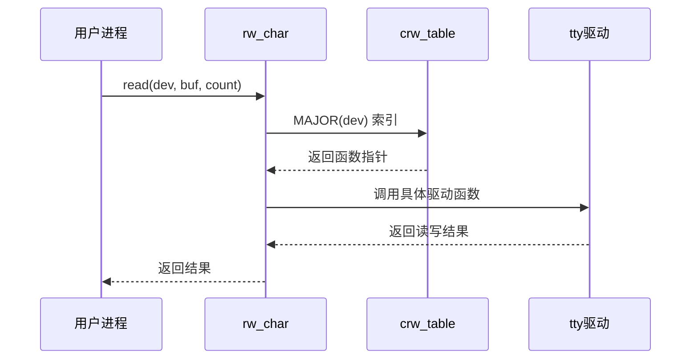
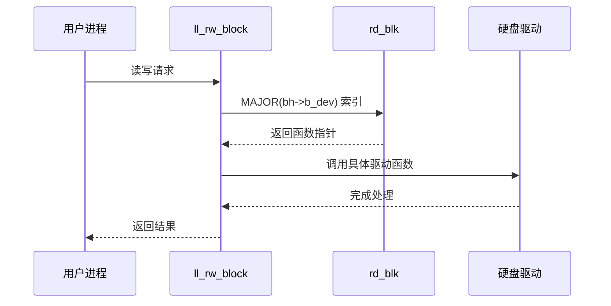
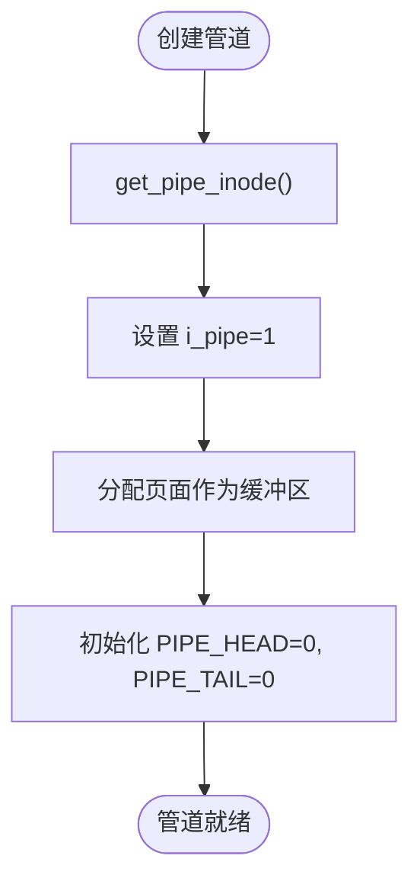
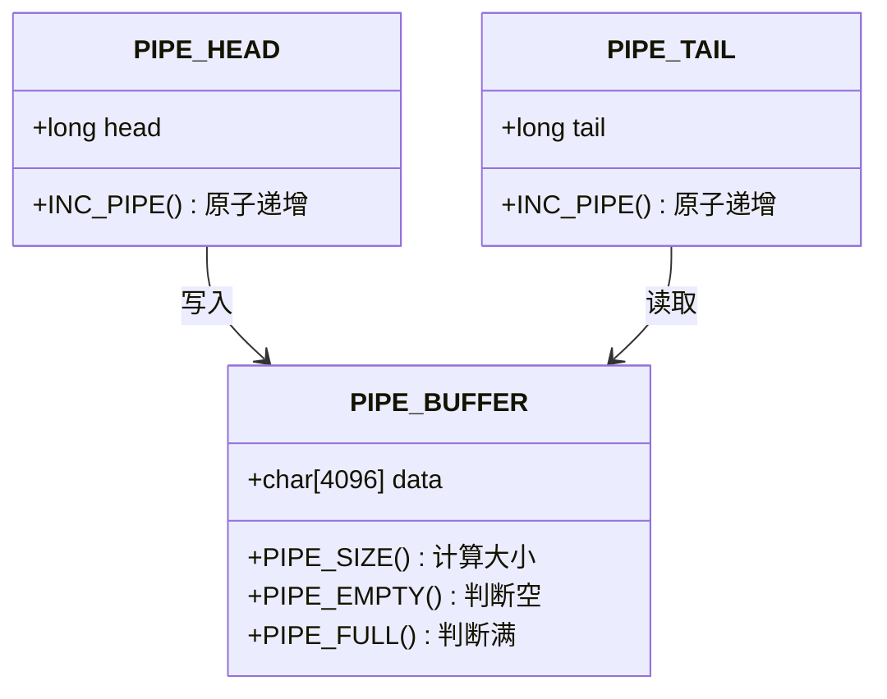
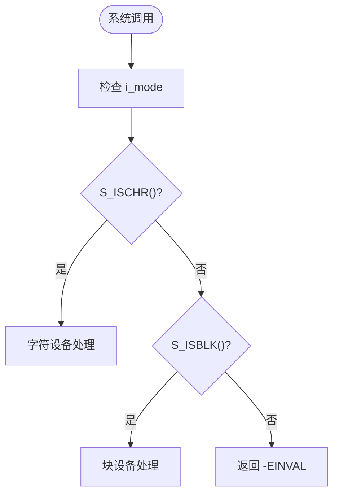
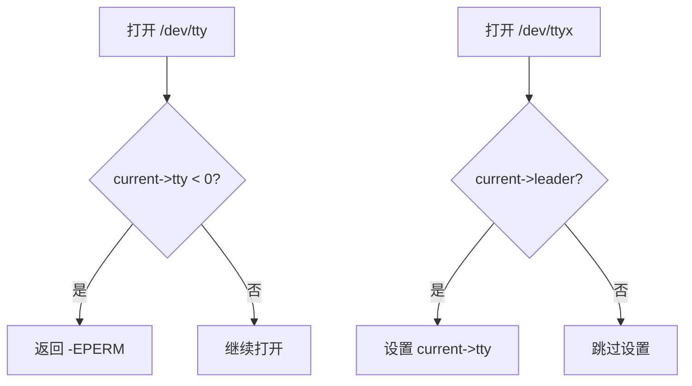

# 设备文件与特殊文件处理

<cite>
**本文档引用的文件**  
- [fs/char_dev.c](file://fs/char_dev.c)
- [fs/block_dev.c](file://fs/block_dev.c)
- [fs/pipe.c](file://fs/pipe.c)
- [include/linux/fs.h](file://include/linux/fs.h)
- [fs/open.c](file://fs/open.c)
- [fs/namei.c](file://fs/namei.c)
- [include/sys/stat.h](file://include/sys/stat.h)
</cite>

## 目录
1. [引言](#引言)
2. [字符设备与块设备的抽象接口](#字符设备与块设备的抽象接口)
3. [chr_fops 与 blk_fops 的函数指针路由机制](#chr_fops-与-blk_fops-的函数指针路由机制)
4. [管道的实现机制](#管道的实现机制)
5. [无锁环形缓冲的原子操作](#无锁环形缓冲的原子操作)
6. [i_mode 判断与设备类型宏](#i_mode-判断与设备类型宏)
7. [特殊设备的主设备号处理](#特殊设备的主设备号处理)
8. [结论](#结论)

## 引言
Linux 0.01 内核通过统一的文件系统接口抽象了设备文件的访问方式。设备文件分为字符设备和块设备，分别通过 `chr_fops` 和 `blk_fops` 函数指针表实现系统调用的路由。管道作为一种特殊文件，采用环形缓冲区实现进程间通信。本文档深入分析这些机制的实现细节，包括 `read()`/`write()` 系统调用如何路由到具体驱动、管道的无锁环形缓冲设计，以及设备类型判断和主设备号处理逻辑。

## 字符设备与块设备的抽象接口

Linux 0.01 通过 `i_mode` 字段区分不同类型的文件，其中字符设备和块设备由主设备号（major number）进一步分类。设备文件的 `i_zone[0]` 字段存储设备号，用于索引驱动函数表。

**Section sources**
- [include/linux/fs.h](file://include/linux/fs.h#L30-L35)
- [fs/char_dev.c](file://fs/char_dev.c#L15-L25)
- [fs/block_dev.c](file://fs/block_dev.c#L60-L65)

## chr_fops 与 blk_fops 的函数指针路由机制

字符设备和块设备分别通过 `crw_table` 和 `rd_blk` 函数指针表实现系统调用的动态路由。当用户调用 `read()` 或 `write()` 时，内核根据设备号的主设备号查找对应的驱动函数。

### 字符设备路由
`rw_char()` 函数是字符设备读写的核心路由函数。它根据 `MAJOR(dev)` 查找 `crw_table` 表项，调用对应的驱动函数（如 `rw_ttyx`）。对于 `/dev/tty`，`rw_tty()` 会进一步检查当前进程的 `tty` 字段，确保权限正确。



**Diagram sources**
- [fs/char_dev.c](file://fs/char_dev.c#L40-L50)

### 块设备路由
块设备通过 `ll_rw_block()` 实现底层读写。`rd_blk` 表存储了块设备驱动函数（如 `rw_hd`），`ll_rw_block()` 根据主设备号调用对应函数处理缓冲区。



**Diagram sources**
- [fs/block_dev.c](file://fs/block_dev.c#L75-L85)

**Section sources**
- [fs/char_dev.c](file://fs/char_dev.c#L40-L50)
- [fs/block_dev.c](file://fs/block_dev.c#L75-L85)

## 管道的实现机制

管道通过 `get_pipe_inode()` 创建特殊 inode，并利用 `i_zone[0]` 和 `i_zone[1]` 作为环形缓冲区的头尾指针。

### 管道 inode 初始化
`sys_pipe()` 系统调用创建管道时，调用 `get_pipe_inode()` 获取一个特殊 inode。该 inode 的 `i_pipe` 标志被置位，`i_size` 指向分配的页面作为缓冲区，`i_zone[0]` 和 `i_zone[1]` 分别初始化为 0，表示缓冲区头尾指针。

### 环形缓冲区操作
`pipe_read()` 和 `pipe_write()` 利用 `PAGE_SIZE` 边界实现环形缓冲。读操作从 `PIPE_TAIL` 位置读取数据，写操作向 `PIPE_HEAD` 位置写入数据。`INC_PIPE` 宏通过原子操作实现指针递增并自动回绕。



**Diagram sources**
- [fs/pipe.c](file://fs/pipe.c#L50-L90)

**Section sources**
- [fs/pipe.c](file://fs/pipe.c#L50-L90)

## 无锁环形缓冲的原子操作

管道的无锁设计依赖于 `INC_PIPE` 宏和 `PAGE_SIZE` 对齐的缓冲区。

### 原子指针更新
`INC_PIPE` 宏使用内联汇编实现原子递增和位掩码操作：
```c
#define INC_PIPE(head) \
__asm__("incl %0\n\tandl $4095,%0"::"m" (head))
```
该操作将指针加 1 后与 `4095`（即 `PAGE_SIZE-1`）进行按位与，实现自动回绕。

### 缓冲区状态判断
`PIPE_EMPTY` 和 `PIPE_FULL` 宏通过头尾指针差值判断缓冲区状态：
- `PIPE_EMPTY`: 头尾指针相等
- `PIPE_FULL`: 缓冲区已满（预留一个位置避免头尾指针重合）



**Diagram sources**
- [include/linux/fs.h](file://include/linux/fs.h#L150-L160)
- [fs/pipe.c](file://fs/pipe.c#L10-L30)

**Section sources**
- [include/linux/fs.h](file://include/linux/fs.h#L150-L160)
- [fs/pipe.c](file://fs/pipe.c#L10-L30)

## i_mode 判断与设备类型宏

`i_mode` 字段的高字节存储文件类型，通过 `S_ISCHR()` 和 `S_ISBLK()` 宏进行判断。

### 类型判断宏
```c
#define S_ISCHR(m) (((m) & S_IFMT) == S_IFCHR)
#define S_ISBLK(m) (((m) & S_IFMT) == S_IFBLK)
```
这些宏通过与 `S_IFMT` 掩码进行按位与操作，提取文件类型字段。

### 应用场景
在 `sys_open()` 和 `sys_ioctl()` 中，首先使用 `S_ISCHR()` 或 `S_ISBLK()` 判断文件是否为设备文件，再进行后续处理。



**Diagram sources**
- [include/sys/stat.h](file://include/sys/stat.h#L31-L32)
- [fs/open.c](file://fs/open.c#L150-L160)

**Section sources**
- [include/sys/stat.h](file://include/sys/stat.h#L31-L32)
- [fs/open.c](file://fs/open.c#L150-L160)

## 特殊设备的主设备号处理

`/dev/tty` 和 `/dev/ttyx` 的主设备号分别为 5 和 4，在 `open_namei()` 和 `sys_open()` 中有特殊处理路径。

### 主设备号定义
```c
/* 4 - /dev/ttyx */
/* 5 - /dev/tty */
```

### 打开处理逻辑
在 `sys_open()` 中，当打开 `/dev/ttyx`（主设备号 4）时，若当前进程是会话首进程且尚未分配 tty，则将其 `tty` 字段设置为设备的次设备号。打开 `/dev/tty`（主设备号 5）时，若进程尚未分配 tty，则返回权限错误。



**Diagram sources**
- [fs/open.c](file://fs/open.c#L160-L180)
- [include/linux/fs.h](file://include/linux/fs.h#L30-L35)

**Section sources**
- [fs/open.c](file://fs/open.c#L160-L180)
- [include/linux/fs.h](file://include/linux/fs.h#L30-L35)

## 结论
Linux 0.01 通过简洁而高效的机制实现了设备文件和管道的抽象。字符设备和块设备通过函数指针表实现系统调用路由，管道利用无锁环形缓冲实现高效的进程间通信。`S_ISCHR()` 和 `S_ISBLK()` 宏提供了统一的设备类型判断接口，而主设备号的特殊处理逻辑确保了终端设备的正确行为。这些设计体现了早期 Linux 内核的精巧与实用性。