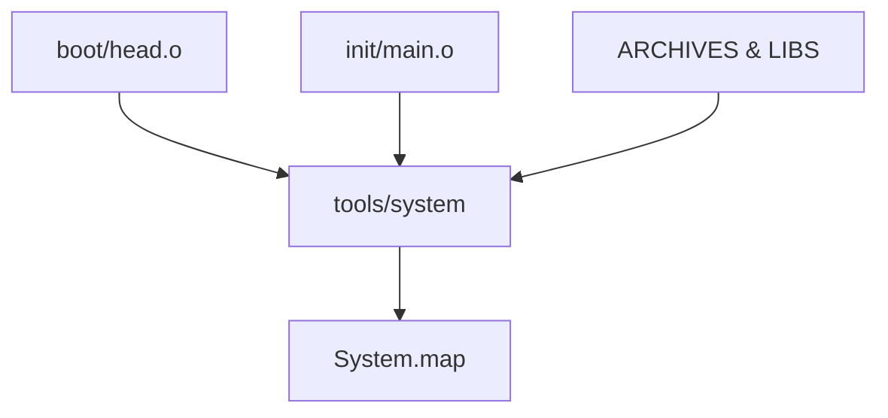
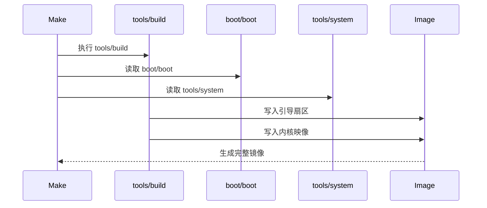

# Makefile构建机制

<cite>
**本文档引用的文件**
- [Makefile](file://Makefile)
- [kernel/Makefile](file://kernel/Makefile)
- [mm/Makefile](file://mm/Makefile)
- [fs/Makefile](file://fs/Makefile)
- [lib/Makefile](file://lib/Makefile)
- [tools/build.c](file://tools/build.c)
- [init/main.c](file://init/main.c)
- [boot/head.s](file://boot/head.s)
- [boot/boot.s](file://boot/boot.s)
</cite>

## 目录
1. [顶层Makefile结构](#顶层makefile结构)
2. [编译工具链配置](#编译工具链配置)
3. [子目录编译机制](#子目录编译机制)
4. [内核镜像链接过程](#内核镜像链接过程)
5. [镜像生成流程](#镜像生成流程)
6. [辅助目标功能](#辅助目标功能)
7. [构建流程总结](#构建流程总结)

## 顶层Makefile结构

linux-0.01项目的顶层Makefile定义了整个内核的构建流程，通过变量和规则协调各个子系统的编译。`ARCHIVES`变量定义了内核主要子系统的归档文件，包括`kernel/kernel.o`、`mm/mm.o`和`fs/fs.o`，这些文件分别代表内核核心、内存管理和文件系统模块。`LIBS`变量指向`lib/lib.a`，包含了内核所需的库函数。这些变量在链接阶段被用于构建最终的内核映像。

**Section sources**
- [Makefile](file://Makefile#L15-L20)

## 编译工具链配置

顶层Makefile配置了完整的编译工具链，包括汇编器、编译器和链接器。`CC`变量指定使用`gcc-4.8`作为C编译器，`AS`和`LD`分别指定`i686-linux-gnu-as`和`i686-linux-gnu-ld`作为汇编器和链接器。`CFLAGS`编译选项针对i386架构进行了优化，包含`-m32`确保生成32位代码，`-fno-stack-protector`禁用栈保护以兼容早期内核设计，`-fno-builtin`禁用内置函数以确保代码的确定性，`-fomit-frame-pointer`优化帧指针使用以节省空间。

**Section sources**
- [Makefile](file://Makefile#L10-L14)

## 子目录编译机制

顶层Makefile通过递归调用子目录的Makefile实现模块化编译。`kernel/kernel.o`、`mm/mm.o`、`fs/fs.o`和`lib/lib.a`等目标通过`(cd directory; make)`命令触发相应目录的构建过程。每个子目录的Makefile定义了该模块的源文件列表和编译规则，例如`kernel/Makefile`中的`OBJS`变量列出了所有需要编译的核心对象文件。这种分层构建机制确保了各模块的独立编译和链接。

**Section sources**
- [Makefile](file://Makefile#L25-L38)
- [kernel/Makefile](file://kernel/Makefile#L20-L27)

## 内核镜像链接过程

`tools/system`目标是内核链接的关键步骤，它将引导代码、主程序和各个模块链接成一个完整的可执行映像。该目标依赖于`boot/head.o`、`init/main.o`以及`ARCHIVES`和`LIBS`中定义的所有模块。链接过程使用`$(LD)`命令，配合`$(LDFLAGS)`中的`-s`（去除符号信息）、`-x`（去除局部符号）和`-M`（输出内存映射）选项，将所有目标文件链接成`tools/system`可执行文件，并同时生成`System.map`符号表文件，便于调试和分析。

**Diagram sources**
- [Makefile](file://Makefile#L40-L47)

**Section sources**
- [Makefile](file://Makefile#L40-L47)
- [boot/head.s](file://boot/head.s)
- [init/main.c](file://init/main.c)

## 镜像生成流程

`Image`目标依赖于`boot/boot`、`tools/system`和`tools/build`三个组件，通过`tools/build`工具将引导扇区和内核映像合并生成最终的磁盘镜像。`tools/build`是一个简单的C程序，它首先验证`boot/boot`的Minix头部，然后将其内容写入输出流，最后将`tools/system`的内容追加到镜像中。`boot/boot`本身是通过`boot/boot.s`和动态生成的大小信息（SYSSIZE）汇编而成，确保引导程序知道内核的大小。

**Diagram sources**
- [Makefile](file://Makefile#L3-L9)
- [tools/build.c](file://tools/build.c#L15-L67)

**Section sources**
- [Makefile](file://Makefile#L3-L9)
- [tools/build.c](file://tools/build.c#L15-L67)

## 辅助目标功能

Makefile提供了多个辅助目标以支持开发和维护。`clean`目标用于清理所有生成的文件，包括`Image`、`System.map`和各个子目录下的对象文件，确保构建环境的干净。`dep`目标用于自动生成源文件的依赖关系，它使用`$(CPP) -M`命令分析每个C文件的头文件依赖，并将结果写入Makefile，确保在头文件更改时能正确触发重新编译。`backup`目标则用于创建项目的压缩备份。

**Section sources**
- [Makefile](file://Makefile#L69-L95)

## 构建流程总结

linux-0.01的Makefile构建机制是一个典型的分层、模块化构建系统。它从顶层协调整个编译流程，通过递归调用子目录Makefile完成模块化编译，利用`ARCHIVES`和`LIBS`变量组织编译产物，最终通过链接和镜像生成工具创建可启动的内核镜像。开发者可以根据实际环境调整工具链路径和编译选项，例如修改`CC`、`AS`和`LD`变量以适应不同的交叉编译环境。