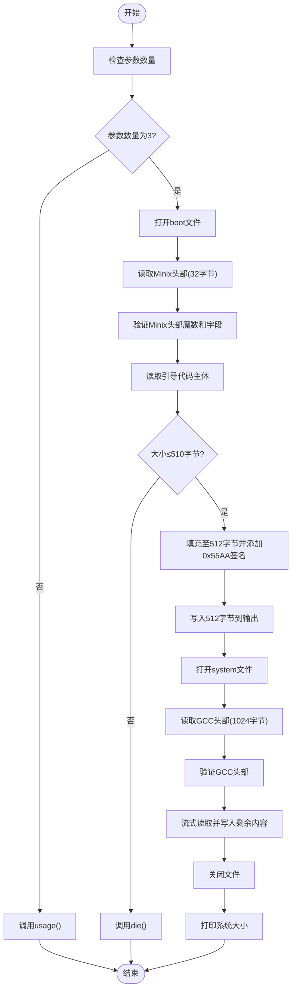
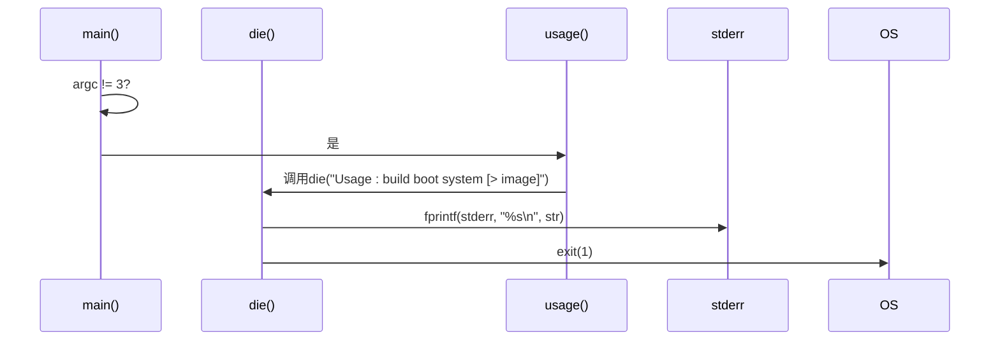
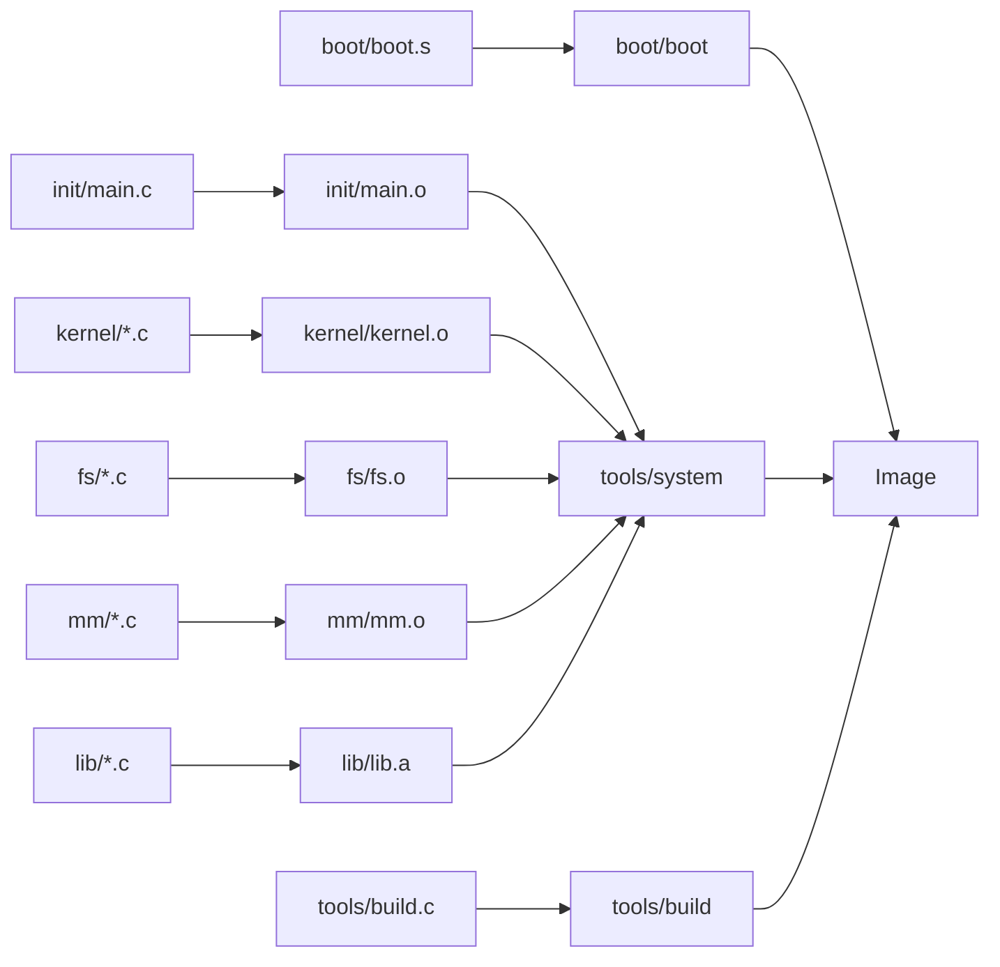

# build工具详解

<cite>
**本文档引用的文件**   
- [build.c](file://tools/build.c)
- [Makefile](file://Makefile)
</cite>

## 目录
1. [简介](#简介)
2. [项目结构](#项目结构)
3. [核心组件](#核心组件)
4. [架构概述](#架构概述)
5. [详细组件分析](#详细组件分析)
6. [依赖分析](#依赖分析)
7. [性能考虑](#性能考虑)
8. [故障排除指南](#故障排除指南)
9. [结论](#结论)

## 简介
`build`工具是Linux 0.01内核构建流程中的关键环节，负责将引导扇区`boot/boot`与内核映像`tools/system`合并为最终的可引导镜像`Image`。该工具通过严格的格式校验、内存布局控制和错误处理机制，确保生成的镜像能够在x86架构上正确加载和启动。本文将深入解析其参数校验逻辑、错误处理机制、对引导扇区和内核映像的处理流程，并说明其在整体构建系统中的作用。

## 项目结构
`build.c`位于`tools/`目录下，是整个系统构建链中的最后一步。它依赖于`boot/boot`（引导代码）和`tools/system`（内核二进制）作为输入，输出最终的磁盘镜像`Image`。该工具由`Makefile`自动编译，并在生成`Image`目标时被调用。

**Section sources**
- [build.c](file://tools/build.c#L1-L68)
- [Makefile](file://Makefile#L30-L32)

## 核心组件
`build.c`的核心功能包括：参数校验、引导扇区处理、内核映像处理和错误处理。其主要函数为`main`、`die`和`usage`。`die`函数用于统一的错误报告和程序终止，`usage`函数提供使用说明，`main`函数则实现了完整的镜像构建逻辑。

**Section sources**
- [build.c](file://tools/build.c#L9-L68)

## 架构概述
`build`工具采用简单的流式处理架构，依次处理两个输入文件并将其内容写入标准输出。首先验证并处理引导扇区，确保其符合Minix可执行格式并填充至512字节，然后验证并处理内核映像，确保其符合GCC的a.out格式，并将剩余内容直接输出。整个流程保证了引导代码位于镜像起始位置，而内核代码紧随其后。

**Diagram sources**
- [build.c](file://tools/build.c#L15-L67)

## 详细组件分析

### 参数校验与错误处理机制
`build`工具在`main`函数开始时检查`argc`参数数量，要求必须为3（程序名、boot文件路径、system文件路径）。若不满足，则调用`usage()`函数，后者通过`die()`函数输出使用说明并终止程序。`die()`函数是核心的错误处理机制，它将错误信息输出到标准错误流（stderr），然后调用`exit(1)`终止程序，确保任何错误都会导致构建失败，防止生成损坏的镜像。

**Diagram sources**
- [build.c](file://tools/build.c#L9-L15)

### 引导扇区处理流程
工具首先打开`boot/boot`文件，读取前32字节的Minix可执行文件头。它通过检查魔数`0x04100301`、头部长度`MINIX_HEADER`（32字节）、数据段、bss段和符号表字段是否为0来验证其合法性。验证通过后，读取引导代码主体，检查其大小不超过510字节，然后在缓冲区的510和511位置写入引导签名`0x55AA`，最后将完整的512字节写入输出。这确保了生成的镜像第一扇区是有效的MBR（主引导记录）。

**Section sources**
- [build.c](file://tools/build.c#L23-L45)

### 内核映像处理流程
工具接着打开`tools/system`文件，读取前1024字节的GCC a.out格式头部。它通过检查头部的特定字段（如`((long *) buf)[5]`）是否为0来验证其为合法的GCC输出。验证通过后，工具进入一个循环，流式读取`system`文件的剩余内容，并直接写入标准输出。由于`system`文件是由链接器生成的，其代码段被链接到高内存地址（如0x10000以上），因此该流程确保了内核代码被正确地放置在镜像中，从而在引导时能被加载到正确的内存位置。

**Section sources**
- [build.c](file://tools/build.c#L47-L67)

## 依赖分析
`build`工具的构建依赖于其源文件`tools/build.c`。在`Makefile`中，`Image`目标明确依赖于`boot/boot`、`tools/system`和`tools/build`。`tools/build`本身由`build.c`编译而成。这形成了一个清晰的依赖链：内核和库文件 -> `tools/system` -> `Image`，而`build`工具是连接`boot`和`system`以生成最终`Image`的关键。

**Diagram sources**
- [Makefile](file://Makefile#L30-L32)

## 性能考虑
`build`工具的性能极高，因为它不进行复杂的计算或转换，仅执行文件读取、验证和写入操作。其使用1024字节的缓冲区进行流式处理，内存占用极小。对于Linux 0.01这样小规模的内核，整个构建过程几乎是瞬时完成的。性能瓶颈主要在于磁盘I/O速度，而非工具本身的算法效率。

## 故障排除指南
当`build`工具失败时，会通过`die()`函数输出具体的错误信息，例如：
- `Usage: build boot system [> image]`：参数数量错误。
- `Unable to open 'boot'`：无法找到或读取`boot/boot`文件。
- `Non-Minix header of 'boot'`：`boot/boot`文件头部格式不正确。
- `Boot block may not exceed 510 bytes`：引导代码过大。
- `Unable to open 'system'`：无法找到或读取`tools/system`文件。
这些信息直接指明了问题所在，便于开发者快速定位和修复。

**Section sources**
- [build.c](file://tools/build.c#L9-L13)

## 结论
`build.c`工具虽然代码简洁，但在Linux 0.01的构建系统中扮演着至关重要的角色。它通过严格的格式校验确保了引导扇区和内核映像的正确性，通过流式处理高效地生成了最终的可引导镜像，并通过清晰的错误处理机制保障了构建过程的可靠性。其设计体现了早期Linux内核开发中简洁、高效和可靠的原则。命令`tools/build boot/boot tools/system > Image`是整个内核编译流程的最终步骤，将分散的组件整合为一个可以在真实硬件或模拟器上启动的完整系统镜像。