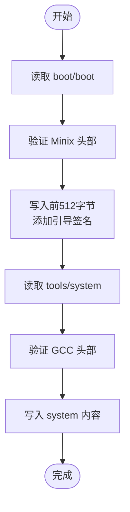

# 构建系统与工具链

<cite>
**本文档引用的文件**  
- [Makefile](file://Makefile)
- [tools/build.c](file://tools/build.c)
- [boot/boot.s](file://boot/boot.s)
- [boot/head.s](file://boot/head.s)
- [lib/Makefile](file://lib/Makefile)
</cite>

## 目录
1. [引言](#引言)
2. [顶层Makefile结构分析](#顶层makefile结构分析)
3. [编译工具链配置](#编译工具链配置)
4. [子目录编译目标组织](#子目录编译目标组织)
5. [可引导镜像生成流程](#可引导镜像生成流程)
6. [build.c工具详解](#buildc工具详解)
7. [内存加载地址控制](#内存加载地址控制)
8. [依赖关系与构建管理](#依赖关系与构建管理)
9. [构建系统扩展指导](#构建系统扩展指导)

## 引言
本文档深入解析Linux 0.01内核的构建系统，涵盖从源码编译到生成可引导镜像的完整流程。重点分析顶层Makefile的结构设计、工具链配置、子系统编译组织方式，以及`tools/build.c`工具在镜像拼接中的关键作用。通过本指南，开发者将全面理解该构建系统的运作机制，并掌握修改和适配构建环境的方法。

## 顶层Makefile结构分析

顶层Makefile定义了整个内核的构建流程，采用模块化方式组织各个子系统的编译。其核心目标是生成名为`Image`的可引导内核镜像。Makefile通过递归调用子目录的Makefile来编译`kernel/`、`fs/`、`mm/`和`lib/`等模块，并最终将它们链接成一个完整的内核映像。

**Section sources**
- [Makefile](file://Makefile#L0-L96)

## 编译工具链配置

Makefile中明确定义了用于16位和32位代码编译的工具链参数：

- **16位工具链**：`AS86`、`CC86`、`LD86`分别用于汇编、编译和链接16位引导代码（如`bootsect.s`和`setup.s`）
- **32位工具链**：`AS`、`CC`、`LD`用于编译内核主体代码
- **编译参数**：`CFLAGS`包含`-m32`确保生成32位代码，`-fno-builtin`禁用内置函数优化，`-nostdinc`强制使用内核自带头文件

这些配置确保了不同阶段代码能被正确编译和链接。

**Section sources**
- [Makefile](file://Makefile#L6-L18)

## 子目录编译目标组织

Makefile通过递归调用机制组织各子系统的编译：

```makefile
kernel/kernel.o:
	(cd kernel; make)

mm/mm.o:
	(cd mm; make)

fs/fs.o:
	(cd fs; make)

lib/lib.a:
	(cd lib; make)
```

每个子目录（如`kernel/`、`fs/`、`mm/`、`lib/`）都有独立的Makefile，负责编译本目录下的源文件并生成目标文件或静态库。顶层Makefile将这些模块统一链接，实现了模块化构建。

**Section sources**
- [Makefile](file://Makefile#L50-L67)
- [lib/Makefile](file://lib/Makefile#L0-L43)

## 可引导镜像生成流程

可引导镜像`Image`的生成遵循以下流程：

1. 首先生成`boot/boot`（16位引导代码）
2. 然后生成`tools/system`（32位内核主体）
3. 最后调用`tools/build`工具将两者拼接

关键规则如下：
```makefile
Image: boot/boot tools/system tools/build
	tools/build boot/boot tools/system > Image
	sync
```

该流程确保了引导代码和内核主体被正确组合成一个完整的可引导镜像。

**Section sources**
- [Makefile](file://Makefile#L22-L26)

## build.c工具详解

`tools/build.c`是构建系统的核心工具，负责将`boot/boot`和`tools/system`拼接成最终的`Image`镜像。其主要功能包括：

- 读取`boot/boot`的Minix头部信息并验证
- 将`boot/boot`写入镜像前512字节，并添加引导签名（0x55, 0xAA）
- 读取`tools/system`的GCC头部信息并验证
- 将`system`的剩余内容追加到镜像中
- 通过标准输出流生成最终镜像

该工具确保了引导扇区的正确性和完整性。



**Diagram sources**
- [tools/build.c](file://tools/build.c#L0-L68)

**Section sources**
- [tools/build.c](file://tools/build.c#L0-L68)

## 内存加载地址控制

构建系统通过多层次机制确保内核被加载到正确的内存地址：

1. **链接阶段**：`boot/boot.s`中定义`SYSSEG = 0x1000`，指示系统应加载到0x10000地址
2. **引导阶段**：`boot.s`代码在加载系统时使用此地址作为目标
3. **保护模式切换**：引导代码在进入保护模式后，将系统从0x10000移动到0x00000
4. **分页初始化**：`head.s`中的`setup_paging`建立页表，实现虚拟地址到物理地址的映射

这种设计确保了内核在启动过程中能正确访问内存。

**Section sources**
- [boot/boot.s](file://boot/boot.s#L0-L330)
- [boot/head.s](file://boot/head.s#L0-L176)

## 依赖关系与构建管理

Makefile提供了完善的依赖管理和构建清理机制：

- **clean目标**：清除所有生成文件，包括`Image`、`System.map`、各模块的目标文件等
- **dep目标**：自动生成源文件依赖关系，确保修改头文件时能正确重新编译
- **递归清理**：`clean`目标会递归调用各子目录的`make clean`

```makefile
clean:
	rm -f Image System.map tmp_make boot/boot core
	rm -f init/*.o boot/*.o tools/system tools/build
	(cd mm;make clean)
	(cd fs;make clean)
	(cd kernel;make clean)
	(cd lib;make clean)
```

**Section sources**
- [Makefile](file://Makefile#L69-L84)

## 构建系统扩展指导

为适应不同构建环境，开发者可进行以下修改：

1. **工具链适配**：修改`CC`、`AS`、`LD`等变量以使用不同的编译器
2. **架构调整**：修改`CFLAGS`中的`-m32`参数以支持其他架构
3. **内存布局**：调整`boot.s`中的`SYSSEG`值以改变加载地址
4. **磁盘参数**：修改`boot.s`中的`sectors`变量以支持不同容量的软盘
5. **优化级别**：调整`CFLAGS`中的`-O`参数控制优化程度

修改时需确保引导代码和内核主体的地址空间规划保持一致。

**Section sources**
- [Makefile](file://Makefile#L0-L96)
- [boot/boot.s](file://boot/boot.s#L0-L330)