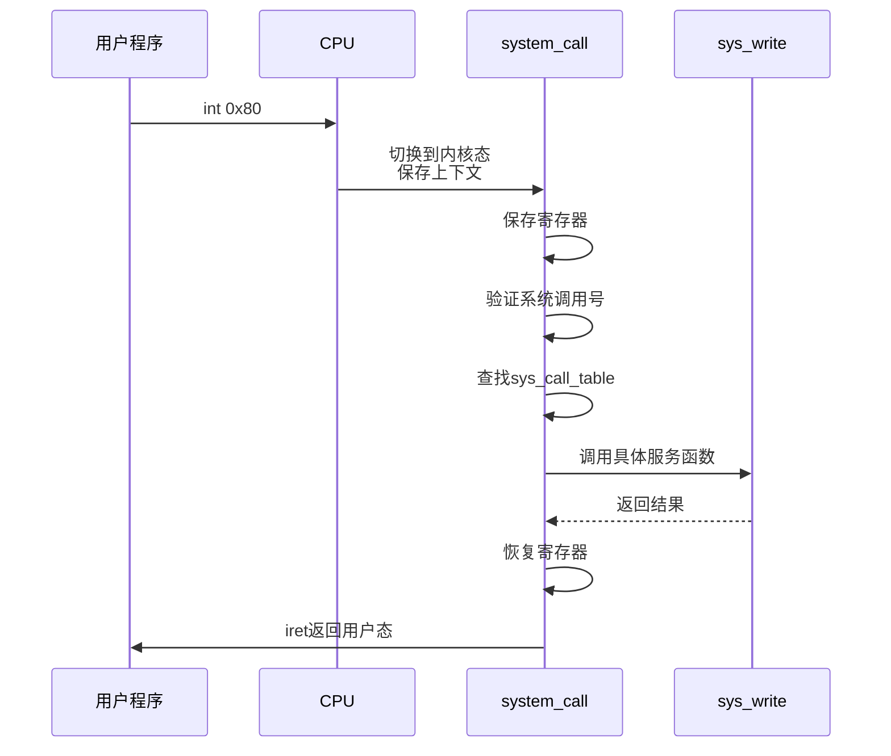

# 系统调用入口与中断处理

<cite>
**本文档引用的文件**  
- [kernel/traps.c](file://kernel/traps.c)
- [kernel/sys.c](file://kernel/sys.c)
- [include/asm/system.h](file://include/asm/system.h)
- [include/linux/sys.h](file://include/linux/sys.h)
- [include/unistd.h](file://include/unistd.h)
- [kernel/system_call.s](file://kernel/system_call.s)
- [lib/write.c](file://lib/write.c)
- [lib/setsid.c](file://lib/setsid.c)
- [lib/execve.c](file://lib/execve.c)
</cite>

## 目录
1. [引言](#引言)
2. [中断门与系统调用入口设置](#中断门与系统调用入口设置)
3. [系统调用汇编级入口机制](#系统调用汇编级入口机制)
4. [系统调用处理流程](#系统调用处理流程)
5. [系统调用号与分发机制](#系统调用号与分发机制)
6. [具体系统调用实现分析](#具体系统调用实现分析)
7. [用户态调用接口](#用户态调用接口)
8. [完整调用链分析](#完整调用链分析)
9. [结论](#结论)

## 引言
本文详细阐述Linux 0.01内核中系统调用的汇编级入口机制。重点分析`trap_init()`函数如何通过中断门设置将`int 0x80`指令映射到内核的系统调用处理流程，描述从用户程序发起系统调用到内核执行具体服务例程的完整过程。

## 中断门与系统调用入口设置

在内核初始化阶段，`trap_init()`函数负责设置各种异常和中断的处理入口。该函数通过`set_system_gate()`宏将特定中断向量配置为系统门，允许用户态程序通过`int`指令触发。

对于系统调用，关键设置位于`trap_init()`函数中：
```c
set_system_gate(3,&int3);	/* int3-5 can be called from all */
```

虽然此处设置的是中断向量3，但实际系统调用使用的是`int 0x80`（即中断向量128）。真正的系统调用入口是在汇编代码中通过链接脚本关联的。

**Section sources**
- [kernel/traps.c](file://kernel/traps.c#L150-L170)

## 系统调用汇编级入口机制

当用户程序执行`int 0x80`指令时，CPU会根据中断描述符表（IDT）跳转到预设的处理程序。尽管`trap_init()`未显式设置向量128，但内核通过汇编代码`kernel/system_call.s`定义了`system_call`入口点，并由链接器将其与中断向量128关联。

在`include/asm/system.h`中定义的宏负责设置中断门：
```c
#define set_system_gate(n,addr) \
	_set_gate(&idt[n],15,3,addr)
```

此宏将指定中断向量的权限级别（DPL）设为3，允许用户态（CPL=3）调用。类型15表示陷阱门（Trap Gate），确保中断发生时CPU自动关闭中断（IF=0）。

**Section sources**
- [include/asm/system.h](file://include/asm/system.h#L58-L60)
- [kernel/system_call.s](file://kernel/system_call.s)

## 系统调用处理流程

当执行`int 0x80`时，CPU完成以下操作：
1. 切换到内核态（CPL=0）
2. 保存当前执行上下文（EFLAGS、CS、EIP）
3. 从IDT获取中断处理程序地址
4. 跳转到`system_call`汇编入口

在`system_call`入口处，内核首先保存通用寄存器状态，然后验证系统调用号的有效性。系统调用号通常通过EAX寄存器传递。

关键的安全检查包括确认调用号小于`NR_syscalls`，防止数组越界访问。随后，内核使用调用号作为索引，在`sys_call_table`中查找对应的服务函数地址。

处理完成后，内核恢复寄存器状态，并通过`iret`指令返回用户态，同时恢复之前的执行上下文。



**Diagram sources**
- [kernel/system_call.s](file://kernel/system_call.s)
- [kernel/sys.c](file://kernel/sys.c)

## 系统调用号与分发机制

系统调用号在`include/unistd.h`中定义为宏：
```c
#define __NR_write	4
```

这些宏在编译时被替换为具体的数值。内核使用`sys_call_table`函数指针数组来分发调用：
```c
fn_ptr sys_call_table[] = { sys_setup, sys_exit, sys_fork, sys_read,
sys_write, ... };
```

数组索引与系统调用号一一对应。例如，`__NR_write`值为4，对应`sys_call_table[4]`指向`sys_write`函数。

系统调用号的最大值由`NR_syscalls`常量限定，确保数组访问的安全性。每次添加新系统调用时，都需要更新此常量。

**Section sources**
- [include/unistd.h](file://include/unistd.h#L59-L125)
- [include/linux/sys.h](file://include/linux/sys.h#L68-L79)

## 具体系统调用实现分析

以`sys_write`为例，该函数在`kernel/sys.c`中实现：
```c
int sys_write(unsigned int fd, char * buf, off_t count)
{
    // 实现细节
}
```

其他系统调用如`sys_setsid`、`sys_execve`等也在此文件中定义。这些函数通常会进行参数验证、权限检查，然后调用底层服务。

例如`sys_setsid`检查调用进程是否有权创建新会话：
```c
int sys_setsid(void)
{
	if (current->uid && current->euid)
		return -EPERM;
	// ...
}
```

**Section sources**
- [kernel/sys.c](file://kernel/sys.c#L0-L216)
- [lib/write.c](file://lib/write.c)
- [lib/setsid.c](file://lib/setsid.c)
- [lib/execve.c](file://lib/execve.c)

## 用户态调用接口

用户程序通过封装好的库函数调用系统调用。这些函数使用`_syscallX`宏生成：
```c
#define _syscall3(type,name,atype,a,btype,b,ctype,c) \
type name(atype a,btype b,ctype c) \
{ \
type __res; \
__asm__ volatile ("int $0x80" \
	: "=a" (__res) \
	: "0" (__NR_##name),"b" (a),"c" (b),"d" (c)); \
// 错误处理
}
```

例如`write()`系统调用：
```c
_syscall3(int,write,int,fd,const char *,buf,off_t,count)
```

此宏展开后生成一个C函数，将系统调用号放入EAX，参数分别放入EBX、ECX、EDX，然后执行`int 0x80`。

**Section sources**
- [include/unistd.h](file://include/unistd.h#L127-L180)

## 完整调用链分析

完整的系统调用调用链如下：
1. 用户程序调用`write(fd, buf, count)`
2. 编译器展开`_syscall3`宏，生成内联汇编
3. 执行`int 0x80`指令，触发中断
4. CPU切换到内核态，跳转到`system_call`入口
5. 保存寄存器上下文
6. 验证EAX中的系统调用号（4）
7. 查找`sys_call_table[4]`得到`sys_write`地址
8. 调用`sys_write(fd, buf, count)`
9. 执行文件写入操作
10. 返回结果到`system_call`
11. 恢复寄存器，执行`iret`返回用户态
12. 用户程序继续执行

这个过程体现了操作系统从用户态到内核态的受控切换机制，确保了系统的安全性和稳定性。

```mermaid
flowchart TD
A[用户程序调用write()] --> B[展开_syscall3宏]
B --> C[设置EAX=__NR_write]
C --> D[设置EBX=fd, ECX=buf, EDX=count]
D --> E[执行int 0x80]
E --> F[CPU切换到内核态]
F --> G[跳转到system_call]
G --> H[保存寄存器]
H --> I[验证系统调用号]
I --> J[查找sys_call_table]
J --> K[调用sys_write]
K --> L[执行写操作]
L --> M[返回结果]
M --> N[恢复寄存器]
N --> O[执行iret]
O --> P[返回用户态]
P --> Q[继续执行]
```

**Diagram sources**
- [include/unistd.h](file://include/unistd.h#L127-L180)
- [kernel/system_call.s](file://kernel/system_call.s)
- [kernel/sys.c](file://kernel/sys.c)

## 结论

Linux 0.01的系统调用机制通过精心设计的中断门和汇编入口，实现了用户态到内核态的安全切换。`trap_init()`函数初始化中断描述符表，`set_system_gate`宏允许用户态调用特定中断。`int 0x80`指令触发系统调用，CPU自动切换到内核态并跳转到`system_call`入口。

内核通过保存上下文、验证调用号、查表分发的方式，将控制权交给具体的系统调用服务函数。`sys_call_table`作为核心分发机制，将系统调用号映射到相应的服务例程。整个过程体现了操作系统内核对硬件资源的集中管理和对用户程序的安全隔离。

该机制虽然简单，但完整地实现了现代操作系统系统调用的核心功能，为后续版本的发展奠定了基础。