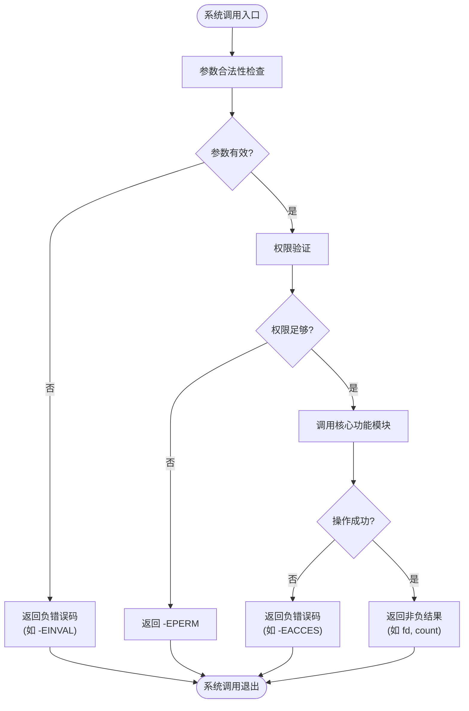
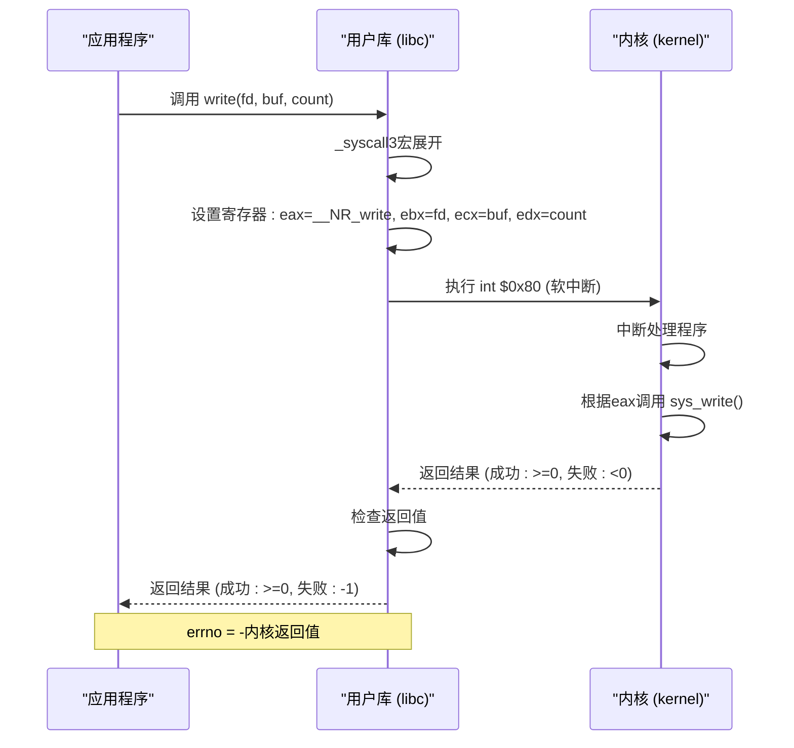

# 系统调用实现模式与封装

<cite>
**本文档引用文件**  
- [kernel/sys.c](file://kernel/sys.c)
- [kernel/hd.c](file://kernel/hd.c)
- [fs/open.c](file://fs/open.c)
- [fs/read_write.c](file://fs/read_write.c)
- [lib/open.c](file://lib/open.c)
- [lib/write.c](file://lib/write.c)
- [include/unistd.h](file://include/unistd.h)
- [include/asm/system.h](file://include/asm/system.h)
</cite>

## 目录
1. [引言](#引言)
2. [内核态系统调用实现结构](#内核态系统调用实现结构)
3. [用户态库函数封装机制](#用户态库函数封装机制)
4. [内核与用户态的错误处理一致性](#内核与用户态的错误处理一致性)
5. [新增系统调用的完整示例](#新增系统调用的完整示例)
6. [总结](#总结)

## 引言
本文档深入剖析 Linux 0.01 内核中系统调用的具体实现模式，重点分析 `sys_setup()`、`sys_open()` 和 `sys_write()` 等函数在内核态的 C 语言实现结构。同时，阐述用户空间标准库函数如何通过 `_syscallN` 宏自动生成封装函数，使得应用程序能够以标准 C 函数形式（如 `open()`、`write()`）调用系统调用。文档还将对比内核态实现与用户态封装的差异，并提供一个从内核到用户库添加新系统调用的完整示例。

**Section sources**
- [kernel/sys.c](file://kernel/sys.c#L0-L216)

## 内核态系统调用实现结构

### 参数合法性检查与权限验证
内核中的系统调用函数首先进行严格的参数合法性检查和权限验证。例如，`sys_open()` 函数会检查文件描述符表是否已满（`fd >= NR_OPEN`），并验证传入的文件名指针是否有效。`sys_write()` 同样检查文件描述符的有效性、计数是否为负以及文件指针是否存在。权限验证方面，`sys_setuid()` 和 `sys_setgid()` 会检查当前进程的有效用户 ID（euid）和有效组 ID（egid），确保只有特权进程或拥有匹配 ID 的进程才能更改其身份。

### 核心功能调用
通过初步检查后，系统调用会调用核心功能模块。`sys_setup()` 负责初始化硬盘分区表，它读取主引导记录（MBR），验证其签名（0x55AA），并解析分区表项，最终调用 `mount_root()` 挂载根文件系统。`sys_open()` 调用 `open_namei()` 函数在文件系统中查找并打开指定文件，根据文件类型（字符设备、块设备、普通文件）进行不同的处理。`sys_write()` 则根据文件的 inode 类型，将写操作分发给不同的底层函数，如 `rw_char()` 用于字符设备，`block_write()` 用于块设备，`file_write()` 用于普通文件。

### 错误码返回机制
内核态系统调用使用负数作为错误码返回。所有错误码定义在 `errno.h` 中，如 `-EINVAL` 表示无效参数，`-EPERM` 表示权限不足。当函数执行成功时，返回非负数（通常是文件描述符或实际写入的字节数）；执行失败时，则返回一个负的错误码。这种设计使得系统调用的返回值可以同时承载成功结果和错误信息。



**Diagram sources**
- [kernel/hd.c](file://kernel/hd.c#L119-L149)
- [fs/open.c](file://fs/open.c#L120-L164)
- [fs/read_write.c](file://fs/read_write.c#L76-L96)

**Section sources**
- [kernel/hd.c](file://kernel/hd.c#L119-L149)
- [fs/open.c](file://fs/open.c#L120-L164)
- [fs/read_write.c](file://fs/read_write.c#L76-L96)

## 用户态库函数封装机制

### `_syscallN` 宏的自动化封装
用户空间的库函数并非直接实现系统调用逻辑，而是通过 `include/unistd.h` 中定义的 `_syscallN` 宏（N 为参数个数）自动生成。这些宏利用内联汇编（`__asm__ volatile`）触发软中断 `int $0x80`，这是用户态进入内核态的唯一途径。宏会将系统调用号（`__NR_name`）和参数（通过寄存器 `eax`, `ebx`, `ecx`, `edx` 传递）准备好，然后执行中断。

### 从标准函数到系统调用的映射
以 `lib/write.c` 中的代码 `_syscall3(int,write,int,fd,const char *,buf,off_t,count)` 为例，该宏会展开为一个名为 `write` 的 C 函数。这个函数接受三个参数：文件描述符 `fd`、缓冲区指针 `buf` 和字节数 `count`。宏展开后，它会将 `__NR_write`（写系统调用的编号）放入 `eax` 寄存器，`fd` 放入 `ebx`，`buf` 放入 `ecx`，`count` 放入 `edx`，然后执行 `int $0x80`。内核的中断处理程序会根据 `eax` 中的编号调用对应的 `sys_write` 函数。



**Diagram sources**
- [lib/write.c](file://lib/write.c#L0-L3)
- [include/unistd.h](file://include/unistd.h#L127-L180)

**Section sources**
- [lib/write.c](file://lib/write.c#L0-L3)
- [include/unistd.h](file://include/unistd.h#L127-L180)

## 内核与用户态的错误处理一致性

### 内核返回负错误码
如前所述，内核中的系统调用函数在出错时直接返回一个负的错误码（例如 `-EPERM`）。这是内核内部的约定。

### 用户库转换为 `errno`
用户态库函数接收到内核的返回值后，会进行转换。如果返回值小于0，库函数会将这个负值取反后赋给全局变量 `errno`，然后函数本身返回 `-1`。例如，在 `_syscall3` 宏的定义中，有 `if (__res<0) errno=-__res , __res = -1; return __res;` 这行代码。这样，应用程序可以通过检查函数返回值是否为 `-1` 来判断调用是否失败，并通过读取 `errno` 变量来获取具体的错误原因，实现了与标准 C 库一致的错误处理接口。

**Section sources**
- [include/unistd.h](file://include/unistd.h#L127-L180)
- [lib/open.c](file://lib/open.c#L0-L19)

## 新增系统调用的完整示例

### 步骤一：在内核中实现系统调用
假设我们要添加一个名为 `sys_hello` 的新系统调用，它打印一条消息并返回一个固定值。

1.  **在 `kernel/sys.c` 中定义函数**：
    ```c
    int sys_hello(void)
    {
        printk("Hello from kernel!\n");
        return 42; // 成功返回42
    }
    ```
    此函数无需参数，执行一个简单的打印操作，并返回一个非负的成功码。

2.  **在系统调用表中注册**：
    需要将 `sys_hello` 的函数指针添加到内核的系统调用表中（通常在 `kernel/system_call.s` 或类似文件中），并为其分配一个唯一的系统调用号（例如 `__NR_hello`）。

### 步骤二：在用户库中创建封装
1.  **在 `lib/` 目录下创建 `hello.c`**：
    ```c
    #define __LIBRARY__
    #include <unistd.h>

    _syscall0(int, hello)
    ```
    这里使用 `_syscall0` 宏，因为它没有参数。宏会自动生成一个名为 `hello` 的函数，该函数触发 `int $0x80` 并将 `__NR_hello` 作为系统调用号。

2.  **编译并链接**：
    将 `hello.c` 编译成目标文件，并将其链接到 C 标准库中。

### 步骤三：应用程序使用
现在，应用程序可以像使用标准库函数一样调用 `hello()`：
```c
#include <stdio.h>
#include <unistd.h>

int main() {
    int result = hello();
    if (result == -1) {
        perror("hello failed");
    } else {
        printf("hello returned: %d\n", result); // 将输出 42
    }
    return 0;
}
```
当 `main` 函数调用 `hello()` 时，控制流会经过用户库的封装，通过软中断进入内核，执行 `sys_hello`，然后将结果返回给应用程序。

**Section sources**
- [kernel/sys.c](file://kernel/sys.c#L0-L216)
- [lib/open.c](file://lib/open.c#L0-L19)
- [include/unistd.h](file://include/unistd.h#L127-L180)

## 总结
Linux 0.01 的系统调用机制清晰地分离了内核功能实现和用户接口。内核态的 `sys_*` 函数负责核心逻辑、安全检查和错误处理，直接返回负错误码。用户态则通过 `_syscallN` 宏实现轻量级的自动化封装，利用软中断 `int $0x80` 实现跨态调用，并将内核的负错误码转换为标准的 `errno` 机制，保证了应用程序接口的简洁性和一致性。这种设计模式是现代操作系统系统调用实现的基础。