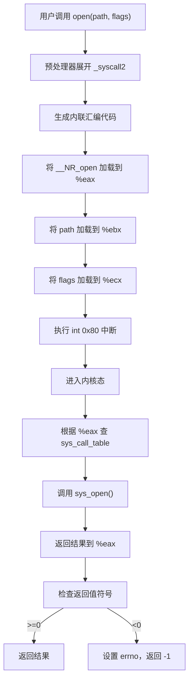
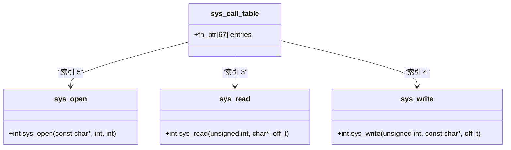

# 系统调用接口定义

<cite>
**本文档引用的文件**  
- [unistd.h](file://include/unistd.h)
- [linux/sys.h](file://include/linux/sys.h)
- [kernel/sys.c](file://kernel/sys.c)
- [fs/open.c](file://fs/open.c)
</cite>

## 目录
1. [引言](#引言)
2. [系统调用号定义机制](#系统调用号定义机制)
3. _syscall 宏的工作原理
4. 系统调用表与内核函数关联
5. 新增系统调用示例流程
6. 结论

## 引言
本文深入解析 Linux 0.01 内核中系统调用的接口定义机制。重点分析用户空间如何通过宏定义发起系统调用，内核如何通过函数指针数组调度具体实现，以及二者之间的衔接机制。文档涵盖 `include/unistd.h` 中的系统调用号与宏封装、`include/linux/sys.h` 中的调用表声明，以及实际内核函数的实现方式。

## 系统调用号定义机制

在 `include/unistd.h` 文件中，系统调用号通过宏 `__NR_` 前缀进行定义，例如 `__NR_open`、`__NR_read` 等。这些宏定义位于 `__LIBRARY__` 条件编译块内，仅在库代码中可见，确保用户程序不会直接访问这些内部编号。

该机制与 POSIX 标准兼容的设计体现在：头文件中提供了符合 POSIX 规范的函数声明（如 `open()`、`read()`），而具体的系统调用编号和底层调用逻辑对用户透明。这种抽象层使得上层应用程序可以使用标准 C 接口编程，而无需关心底层中断机制和寄存器约定。

**Section sources**
- [unistd.h](file://include/unistd.h#L120-L125)

## _syscall 宏的工作原理

`_syscall0` 到 `_syscall3` 宏用于生成封装系统调用的 C 函数。这些宏利用 GCC 的内联汇编功能，通过 `int 0x80` 软中断进入内核态。

### 工作机制详解：
- **系统调用号传递**：通过寄存器 `%eax` 传递，由 `"0" (__NR_##name)` 约束实现，即将调用号先加载到 `%eax`。
- **参数传递**：分别使用 `%ebx`、`%ecx`、`%edx` 寄存器传递最多三个参数，对应宏中的 `a`、`b`、`c` 参数。
- **内联汇编约束**：
  - `"=a" (__res)`：表示输出操作数，结果存入 `%eax` 寄存器并赋值给变量 `__res`。
  - `"b" (a)`、`"c" (b)`、`"d" (c)`：分别将参数绑定到 `%ebx`、`%ecx`、`%edx` 寄存器。
- **错误处理**：若返回值 `__res < 0`，则将其绝对值设置为 `errno`，并返回 `-1`，符合 POSIX 错误处理规范。



**Diagram sources**
- [unistd.h](file://include/unistd.h#L127-L178)

**Section sources**
- [unistd.h](file://include/unistd.h#L127-L178)

## 系统调用表与内核函数关联

`include/linux/sys.h` 文件中定义了 `sys_call_table` 函数指针数组，它是用户调用与内核实现之间的桥梁。

### 关键结构分析：
- **函数指针类型**：`fn_ptr` 类型定义为 `int (*)()`，即指向无特定参数的整型返回函数。
- **数组初始化**：数组按顺序列出所有系统调用的内核实现函数，如 `sys_setup`、`sys_exit`、`sys_fork` 等。
- **索引对应关系**：数组下标与 `__NR_` 宏定义的数值严格对应。例如，`__NR_open` 值为 5，则 `sys_call_table[5]` 指向 `sys_open` 函数。

内核在处理 `int 0x80` 中断时，会从 `%eax` 寄存器读取系统调用号，并以此作为索引在 `sys_call_table` 中查找对应函数指针，然后跳转执行。



**Diagram sources**
- [linux/sys.h](file://include/linux/sys.h#L68-L80)

**Section sources**
- [linux/sys.h](file://include/linux/sys.h#L1-L80)
- [kernel/sys.c](file://kernel/sys.c#L1-L217)
- [fs/open.c](file://fs/open.c#L120-L164)

## 新增系统调用示例流程

要新增一个系统调用，需遵循以下步骤以保持与现有代码风格一致：

### 1. 定义系统调用号
在 `include/unistd.h` 的 `__NR_` 宏列表末尾添加新条目：
```c
#define __NR_mynewcall 67
```

### 2. 扩展系统调用表
在 `include/linux/sys.h` 的 `sys_call_table` 数组末尾添加函数指针：
```c
extern int sys_mynewcall();
...
fn_ptr sys_call_table[] = { 
    ...
    sys_getppid, 
    sys_getpgrp,
    sys_setsid,
    sys_mynewcall  // 新增条目
};
```

### 3. 实现内核函数
在适当源文件（如 `kernel/sys.c` 或功能模块）中实现函数：
```c
int sys_mynewcall(int arg1, int arg2) {
    // 实现逻辑
    return 0;
}
```

### 4. 提供用户接口（可选）
若需在用户空间使用，可在 `unistd.h` 中使用 `_syscall2` 宏生成封装：
```c
#define _syscall2(int, mynewcall, int, arg1, int, arg2)
```

此流程确保了系统调用接口的完整性与一致性，同时遵循了 Linux 0.01 的简洁设计哲学。

**Section sources**
- [unistd.h](file://include/unistd.h#L120-L178)
- [linux/sys.h](file://include/linux/sys.h#L68-L80)
- [kernel/sys.c](file://kernel/sys.c#L1-L217)

## 结论
Linux 0.01 的系统调用机制通过清晰的分层设计实现了用户空间与内核空间的安全隔离与高效通信。`unistd.h` 中的宏定义提供了符合 POSIX 标准的接口抽象，`_syscall` 系列宏利用内联汇编完成底层中断触发与参数传递，而 `sys_call_table` 则作为调度中枢将调用号映射到具体函数实现。整个机制简洁、高效，体现了早期 Linux 内核的精巧设计思想。新增系统调用只需遵循既定模式，即可无缝集成到现有框架中。