# 内核镜像生成

<cite>
**本文档引用的文件**  
- [build.c](file://tools/build.c)
- [Makefile](file://Makefile)
</cite>

## 目录
1. [概述](#概述)
2. [构建工具编译与运行](#构建工具编译与运行)
3. [Image文件生成流程](#image文件生成流程)
4. [build.c源码分析](#buildc源码分析)
5. [Image文件结构布局](#image文件结构布局)
6. [chmem命令的作用](#chmem命令的作用)

## 概述

`build`工具是Linux 0.01内核构建过程中的关键组件，负责将引导扇区代码（`boot/boot`）和内核映像（`tools/system`）组合成最终的可引导`Image`文件。该过程通过`tools/build boot/boot tools/system > Image`命令完成，是内核从源码到可执行镜像的最后一步。

**Section sources**
- [build.c](file://tools/build.c#L1-L67)
- [Makefile](file://Makefile#L1-L97)

## 构建工具编译与运行

`build`工具本身是一个C程序，其编译和运行由主`Makefile`中的规则定义。当执行`make`命令时，系统首先检查`tools/build`是否存在，若不存在或`tools/build.c`已更新，则触发重新编译。

编译过程使用与内核相同的`gcc-4.8`编译器和`CFLAGS`标志，确保工具在正确的32位环境中构建。编译完成后，会立即执行`chmem +65000 tools/build`命令，为`build`程序设置内存上限。

最终，`Image`目标依赖于`boot/boot`、`tools/system`和`tools/build`三个文件。一旦这些依赖项准备就绪，`Makefile`就会执行`tools/build boot/boot tools/system > Image`，将`build`工具的输出重定向到名为`Image`的文件中。

```mermaid
flowchart TD
A["执行 make"] --> B{"检查依赖"}
B --> C["编译 build.c"]
C --> D["执行 chmem +65000 tools/build"]
B --> E["链接生成 tools/system"]
B --> F["汇编生成 boot/boot"]
D --> G["执行 tools/build boot/boot tools/system > Image"]
E --> G
F --> G
G --> H["生成最终的 Image 文件"]
```



**Diagram sources**
- [Makefile](file://Makefile#L1-L97)

**Section sources**
- [Makefile](file://Makefile#L1-L97)

## Image文件生成流程

`Image`文件的生成是一个两阶段的拼接过程，由`build`工具精确控制。

**第一阶段：处理引导扇区 (boot/boot)**
1.  `build`工具首先打开`boot/boot`文件。
2.  读取前32字节的Minix格式头部，并进行一系列验证，确保其合法性。
3.  跳过头部后，读取剩余的引导代码。
4.  检查引导代码长度是否超过510字节（为签名预留空间）。
5.  在引导代码末尾添加标准的引导签名`0x55`和`0xAA`。
6.  将完整的512字节引导扇区写入标准输出。

**第二阶段：追加内核映像 (tools/system)**
1.  `build`工具接着打开`tools/system`文件。
2.  读取并跳过前1024字节的GCC链接器头部。
3.  将`tools/system`文件的剩余部分（即真正的内核代码和数据）逐块读取并写入标准输出。

最终，通过shell重定向`>`，这两个阶段的输出被合并到一个名为`Image`的单一文件中。


**Diagram sources**
- [build.c](file://tools/build.c#L1-L67)

**Section sources**
- [build.c](file://tools/build.c#L1-L67)

## build.c源码分析

`build.c`程序的源码逻辑清晰，主要包含错误处理、参数验证和核心的文件处理逻辑。

**错误处理函数**：`die()`和`usage()`函数用于在发生错误时向标准错误输出信息并终止程序。

**主函数逻辑 (main)**：
1.  **参数检查**：程序要求必须提供两个命令行参数（`boot`和`system`文件路径），否则调用`usage()`报错。
2.  **引导扇区处理**：
    *   打开第一个参数指定的文件（`boot/boot`）。
    *   读取`MINIX_HEADER`（32字节）到缓冲区`buf`。
    *   **验证头部**：通过将`buf`强制转换为`long`数组，检查关键字段：
        *   `buf[0]` 必须等于魔数`0x04100301`，这是Minix可执行文件的标识。
        *   `buf[1]` 必须等于`MINIX_HEADER`（32），表示头部大小。
        *   `buf[3]`和`buf[4]`（数据段和BSS段大小）必须为0，因为引导代码是自包含的。
        *   `buf[5]`和`buf[7]`（代码段大小和符号表大小）也必须为0。
    *   验证通过后，读取剩余的引导代码（不包含头部），并将其长度输出到标准错误。
    *   检查代码长度是否超过510字节。
    *   在`buf[510]`和`buf[511]`处写入引导签名`0x55`和`0xAA`。
    *   将完整的512字节（510字节代码 + 2字节签名）写入标准输出。
3.  **内核映像处理**：
    *   打开第二个参数指定的文件（`tools/system`）。
    *   读取`GCC_HEADER`（1024字节）到缓冲区`buf`。
    *   **验证头部**：检查`buf[5]`是否为0。在GCC生成的a.out格式中，`buf[5]`对应`a_syms`字段（符号表大小），`build`工具期望内核映像没有符号表。
    *   验证通过后，程序进入一个循环，将`tools/system`文件中剩余的所有数据（跳过1024字节头部）读取到`buf`，并立即写入标准输出，直到文件结束。
4.  **完成**：关闭所有文件描述符，输出内核映像的总字节数，并返回0。

**Section sources**
- [build.c](file://tools/build.c#L1-L67)

## Image文件结构布局

最终生成的`Image`文件具有严格的二进制布局，其结构如下：

```mermaid
erDiagram
IMAGE {
bytes 0-511 "引导扇区 (512 bytes)"
bytes 512-end "内核映像 (tools/system 去除头部)"
}
BOOT_SECTOR {
bytes 0-31 "Minix 头部 (32 bytes)"
bytes 32-509 "引导代码"
bytes 510-511 "引导签名 (0x55, 0xAA)"
}
KERNEL_IMAGE {
bytes 0-1023 "GCC 头部 (1024 bytes, 被跳过)"
bytes 1024-end "内核代码与数据段"
}
IMAGE ||--o{ BOOT_SECTOR : "包含"
IMAGE ||--o{ KERNEL_IMAGE : "包含"
```

**Diagram sources**
- [build.c](file://tools/build.c#L1-L67)

**Section sources**
- [build.c](file://tools/build.c#L1-L67)

### 详细布局说明

1.  **引导扇区 (0 - 511 字节)**：
    *   **0 - 31 字节**：Minix可执行文件头部。`build`工具读取并验证此部分，但不会将其写入最终的`Image`文件。它仅用于验证`boot/boot`文件的合法性。
    *   **32 - 509 字节**：真正的引导代码。这是由`boot/boot.s`汇编生成的机器码，负责在计算机启动时加载内核。
    *   **510 - 511 字节**：引导签名。`build`工具在写入引导代码后，手动添加`0x55`和`0xAA`。这是BIOS识别可引导设备的标准。`kernel/hd.c`中的`sys_setup`函数在启动时会验证此签名。

2.  **内核映像 (512 字节 - 结束)**：
    *   **0 - 1023 字节**：GCC链接器头部。当`ld`链接器生成`tools/system`时，会添加一个1024字节的a.out格式头部。`build`工具在读取`tools/system`时，会读取这1024字节并验证其`a_syms`字段，但不会将其写入`Image`文件。
    *   **1024 字节 - 结束**：内核的代码段（`.text`）、数据段（`.data`）和BSS段（`.bss`）。这部分是`init/main.o`、`kernel/*.o`、`mm/*.o`等目标文件链接后的结果，包含了操作系统的核心功能。

## chmem命令的作用

`chmem +65000`命令在`Makefile`中用于修改`tools/build`可执行文件的内存限制。

在早期的Unix-like系统中，`chmem`是一个用于更改程序内存上限的工具。`+65000`参数表示将程序的内存上限设置为65000字节（约63.5KB）。

虽然`build`工具本身非常简单，主要进行文件I/O操作，其内存使用量远低于此限制，但这一设置可能是出于以下原因：
1.  **历史遗留**：可能是从Minix或其他早期系统继承的构建脚本。
2.  **安全预防**：为构建工具设置一个合理的上限，防止潜在的内存泄漏导致系统资源耗尽。
3.  **确保兼容性**：确保`build`工具在目标系统（如Minix）的内存限制下能够正常运行。

**Section sources**
- [Makefile](file://Makefile#L1-L97)