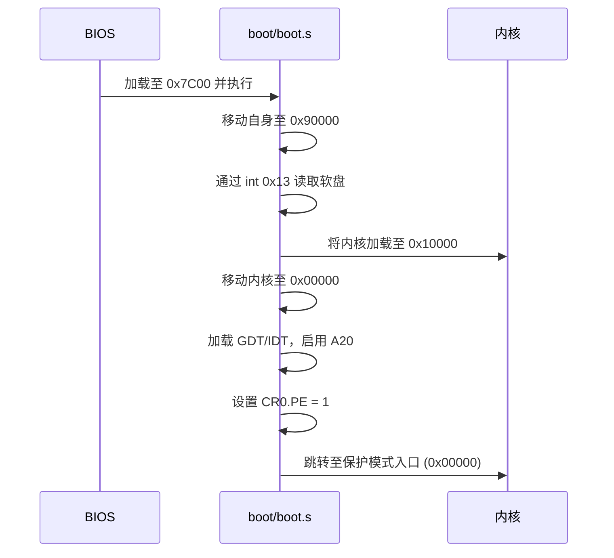
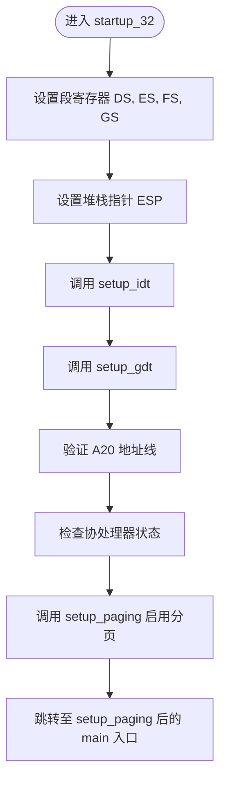
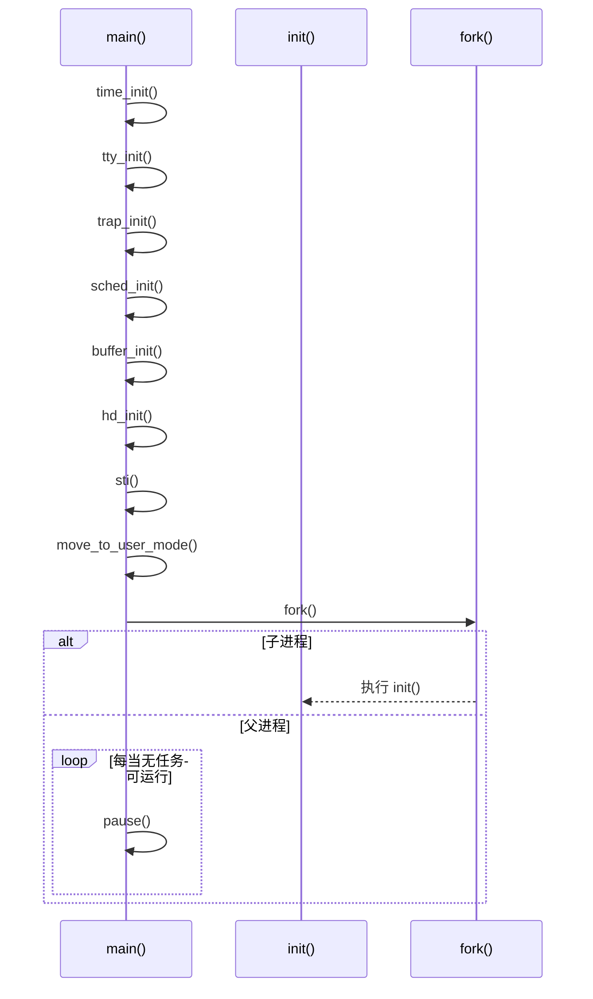
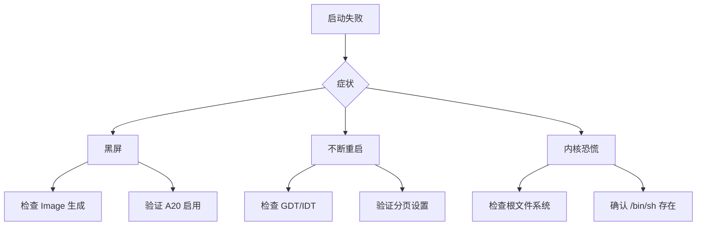

# 系统启动与测试

<cite>
**本文档引用的文件**  
- [boot/boot.s](file://boot/boot.s)
- [boot/head.s](file://boot/head.s)
- [init/main.c](file://init/main.c)
- [tools/build.c](file://tools/build.c)
- [kernel/panic.c](file://kernel/panic.c)
- [kernel/printk.c](file://kernel/printk.c)
- [kernel/traps.c](file://kernel/traps.c)
- [kernel/sched.c](file://kernel/sched.c)
- [fs/exec.c](file://fs/exec.c)
</cite>

## 目录
1. [将内核镜像写入软盘](#将内核镜像写入软盘)
2. [引导流程分析](#引导流程分析)
3. [内核初始化流程](#内核初始化流程)
4. [用户程序与Shell交互](#用户程序与shell交互)
5. [准备Minix根文件系统](#准备minix根文件系统)
6. [在QEMU中测试内核](#在qemu中测试内核)
7. [启动失败的常见症状与排查](#启动失败的常见症状与排查)

## 将内核镜像写入软盘

要将生成的`Image`文件写入软盘，可以使用`cp`或`dd`命令。确保目标设备路径正确（如`/dev/fd0`代表软盘驱动器）。

使用`cp`命令：
```bash
cp Image /dev/fd0
```

使用`dd`命令（更推荐，可控制块大小）：
```bash
dd if=Image of=/dev/fd0 bs=1024
```

写入完成后，将软盘插入目标机器并从软盘启动。BIOS会自动加载软盘的第一个扇区（引导扇区）到内存地址`0x7C00`并执行。

**Section sources**
- [tools/build.c](file://tools/build.c#L0-L68)

## 引导流程分析

引导过程由`boot/boot.s`和`boot/head.s`两个汇编文件共同完成。

### 引导扇区加载（boot/boot.s）

`boot/boot.s`代码被BIOS加载至`0x7C00`，首先将自身移动到`0x90000`处以避免被后续加载操作覆盖。随后通过BIOS中断`int 0x13`将系统内核从软盘加载到内存`0x10000`（即64KB处）。加载完成后，禁用中断，并将整个系统代码从`0x10000`向下移动至`0x00000`，为进入保护模式做准备。

接着，加载全局描述符表（GDT）和中断描述符表（IDT），并启用A20地址线，以允许访问1MB以上的内存空间。最后，通过设置CR0寄存器的PE（Protection Enable）位，跳转至保护模式下的代码入口。



**Diagram sources**
- [boot/boot.s](file://boot/boot.s#L0-L329)

### 保护模式初始化（boot/head.s）

进入保护模式后，控制权转移至`boot/head.s`中的`startup_32`标签。该代码重新设置段寄存器（DS、ES、FS、GS）指向正确的数据段，并初始化堆栈。随后调用`setup_idt`和`setup_gdt`函数，建立默认的中断和全局描述符表。

接着，代码验证A20地址线是否已启用，并检查协处理器（数学芯片）状态。最后，调用`setup_paging`函数启用分页机制，将前8MB内存进行恒等映射（identity mapping），并设置页目录和页表。



**Diagram sources**
- [boot/head.s](file://boot/head.s#L0-L175)

## 内核初始化流程

内核启动后，执行流进入`init/main.c`中的`main()`函数。此时仍处于内核态，中断尚未启用。

### 初始化阶段

`main()`函数依次调用以下初始化函数：
- `time_init()`：从CMOS实时时钟读取系统时间。
- `tty_init()`：初始化终端设备。
- `trap_init()`：设置异常处理向量（如除零、缺页等）。
- `sched_init()`：初始化进程调度器。
- `buffer_init()`：初始化缓冲区管理。
- `hd_init()`：初始化硬盘控制器。

完成初始化后，调用`sti()`启用中断。

### 进入用户模式

通过`move_to_user_mode()`宏切换到用户模式。随后调用`fork()`创建第一个用户进程。子进程执行`init()`函数，父进程（任务0）进入无限循环调用`pause()`，作为空闲任务。



**Diagram sources**
- [init/main.c](file://init/main.c#L0-L147)

**Section sources**
- [init/main.c](file://init/main.c#L0-L147)
- [kernel/traps.c](file://kernel/traps.c)
- [kernel/sched.c](file://kernel/sched.c)

## 用户程序与Shell交互

系统启动后，必须存在`/bin/sh`等用户程序才能进入shell交互界面，否则会因`execve("/bin/sh",argv,envp)`失败而崩溃。

在`init()`函数中，首先调用`setup()`系统调用，该调用会尝试加载硬盘上的根文件系统。随后，通过`fork()`创建子进程，子进程关闭标准输入输出，重新打开`/dev/tty0`作为控制台，并调用`execve("/bin/sh", argv, envp)`启动shell。

如果`/bin/sh`不存在或格式不正确，`execve`将返回错误，子进程调用`_exit()`退出。父进程通过`wait()`回收子进程，并打印错误信息，随后调用`sync()`同步文件系统并退出。

**Section sources**
- [init/main.c](file://init/main.c#L0-L147)
- [fs/exec.c](file://fs/exec.c)

## 准备Minix根文件系统

为了使系统能够正常挂载根文件系统并执行`/bin/sh`，必须准备一个兼容的Minix文件系统镜像。

1. 创建一个空镜像文件（如1.44MB）：
   ```bash
   dd if=/dev/zero of=rootfs.img bs=1024 count=1440
   ```

2. 使用`minix`工具创建文件系统：
   ```bash
   mkfs.minix rootfs.img
   ```

3. 挂载镜像并复制必要的文件：
   ```bash
   mkdir /mnt/rootfs
   sudo mount -o loop rootfs.img /mnt/rootfs
   sudo mkdir /mnt/rootfs/bin
   sudo cp /path/to/shell /mnt/rootfs/bin/sh
   sudo mkdir /mnt/rootfs/dev
   sudo mknod /mnt/rootfs/dev/tty0 c 4 0
   sudo umount /mnt/rootfs
   ```

4. 在编译内核时，确保`setup()`系统调用能正确识别该文件系统。

**Section sources**
- [init/main.c](file://init/main.c#L0-L147)
- [fs/super.c](file://fs/super.c)

## 在QEMU中测试内核

可以使用QEMU模拟器测试内核，无需物理软盘。

编译生成`Image`文件后，使用以下命令启动：
```bash
qemu-system-i386 -fda Image -boot a
```

若使用自定义根文件系统镜像：
```bash
qemu-system-i386 -fda Image -hda rootfs.img -boot a
```

QEMU将模拟一个386机器，从软盘（`-fda`）启动，并可附加一个硬盘（`-hda`）作为根文件系统。

**Section sources**
- [tools/build.c](file://tools/build.c#L0-L68)

## 启动失败的常见症状与排查

### 黑屏
- **可能原因**：引导扇区未正确加载，或`boot/boot.s`中A20未启用。
- **排查方法**：检查`Image`是否正确生成，确认`tools/build`工具是否正常工作。使用调试器单步执行引导代码。

### 不断重启
- **可能原因**：保护模式跳转失败，或分页设置错误导致异常。
- **排查方法**：检查`boot/head.s`中GDT和IDT的设置是否正确，确认`setup_paging`函数中页表地址无误。

### 内核恐慌（Kernel Panic）
- **可能原因**：`setup()`无法挂载根文件系统，或`execve("/bin/sh")`失败。
- **排查方法**：检查根文件系统镜像是否为Minix格式，确认`/bin/sh`存在且为静态链接可执行文件。查看`panic()`函数输出的错误信息。



**Diagram sources**
- [kernel/panic.c](file://kernel/panic.c#L0-L10)
- [kernel/printk.c](file://kernel/printk.c#L0-L32)

**Section sources**
- [kernel/panic.c](file://kernel/panic.c#L0-L10)
- [init/main.c](file://init/main.c#L0-L147)