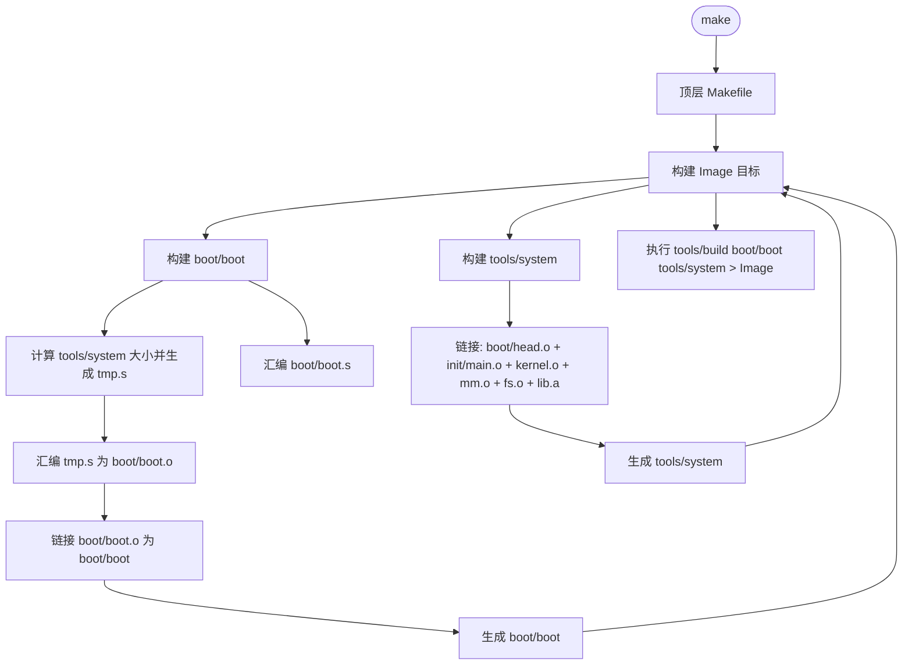
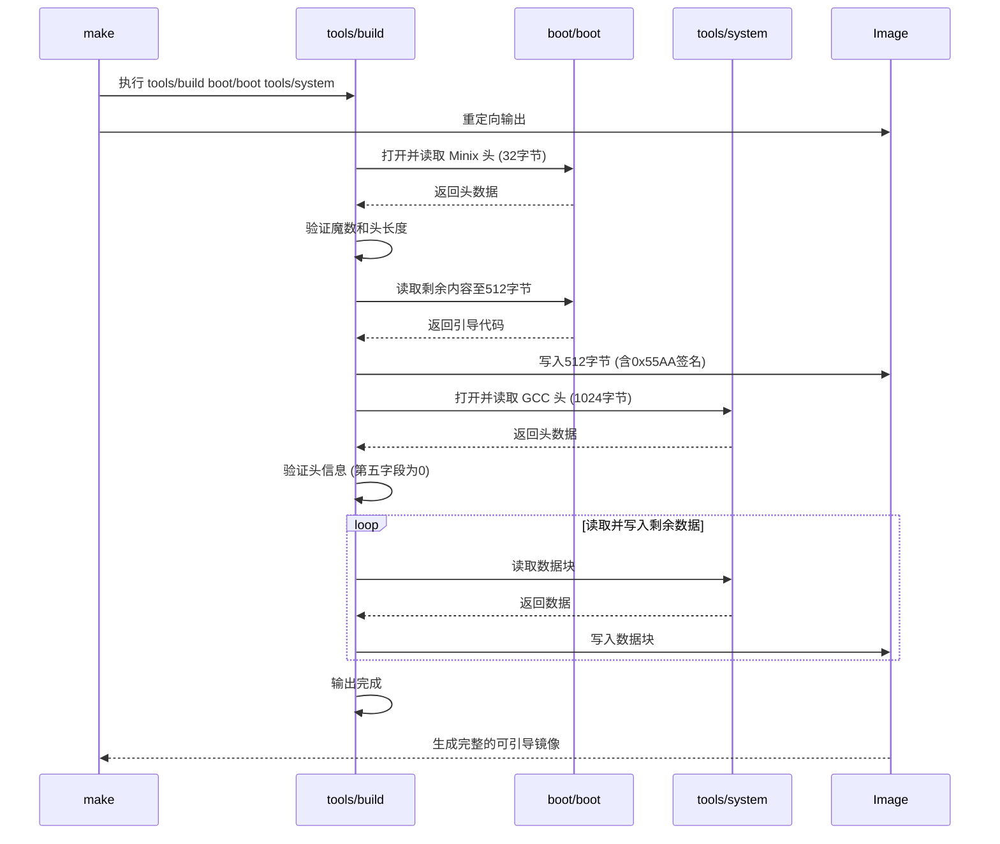

# 编译与运行指南

<cite>
**本文档引用的文件**
- [Makefile](file://Makefile)
- [include/linux/config.h](file://include/linux/config.h)
- [tools/build.c](file://tools/build.c)
- [kernel/Makefile](file://kernel/Makefile)
- [fs/Makefile](file://fs/Makefile)
- [mm/Makefile](file://mm/Makefile)
- [lib/Makefile](file://lib/Makefile)
</cite>

## 目录
1. [构建环境要求](#构建环境要求)
2. [内核配置详解](#内核配置详解)
3. [编译流程分析](#编译流程分析)
4. [镜像生成机制](#镜像生成机制)
5. [系统启动与根文件系统](#系统启动与根文件系统)
6. [常见构建错误排查](#常见构建错误排查)

## 构建环境要求

编译 linux-0.01 内核需要特定的工具链版本，以确保与原始设计兼容。必须使用 GCC 1.40 或功能兼容的早期版本（如本项目中使用的 gcc-4.8 以模拟早期行为），因为现代编译器的优化和代码生成方式可能导致内核无法正确运行。此外，必须安装 GNU Binutils 工具集，包括 `as`（汇编器）、`ld`（链接器）和 `ar`（归档工具），且需确保其为 32 位目标（i686-linux-gnu-as, i686-linux-gnu-ld）以生成正确的 x86 实模式代码。构建过程依赖 Make 工具自动化执行编译和链接任务，因此 GNU Make 也是必需的。

**Section sources**
- [Makefile](file://Makefile#L1-L96)
- [kernel/Makefile](file://kernel/Makefile#L1-L91)
- [fs/Makefile](file://fs/Makefile#L1-L96)
- [mm/Makefile](file://mm/Makefile#L1-L38)
- [lib/Makefile](file://lib/Makefile#L1-L45)

## 内核配置详解

`include/linux/config.h` 是内核的核心配置文件，通过预处理器宏定义来定制内核行为。该文件中的关键宏定义直接影响内存布局、根设备和硬盘参数。

`HIGH_MEMORY` 宏定义了系统可用的物理内存上限。当定义 `LINUS_HD` 时，其值为 `0x800000`（8MB）；若定义 `LASU_HD`，则为 `0x400000`（4MB）。此值必须与引导代码 `boot/head.s` 中的页目录项数量匹配。

`ROOT_DEV` 宏指定了系统启动时挂载根文件系统的设备。对于 `LINUS_HD` 配置，其值为 `0x306`，表示第三个硬盘的第六个分区（主设备号 3，次设备号 6）；对于 `LASU_HD`，其值为 `0x302`，指向第二个分区。

`HD_TYPE` 宏定义了硬盘的物理参数，是一个或多个包含六个元素的结构体。对于 `LINUS_HD`，定义了两个相同的结构 `{ 5,17,980,300,980,0 }`，分别对应主硬盘和从硬盘。这六个参数依次为：磁头数（HEADS）、每磁道扇区数（SECTORS）、柱面数（TRACKS）、写预补偿柱面（WPCOM）、着陆区柱面（LZONE）和控制器类型（CTL）。这些参数对于内核正确驱动硬盘至关重要。

**Section sources**
- [include/linux/config.h](file://include/linux/config.h#L1-L54)

## 编译流程分析

内核的编译由顶层 `Makefile` 协调，采用分层构建策略。执行 `make` 命令时，首先触发 `all` 目标，其依赖于 `Image` 目标。

`Image` 目标的构建依赖于 `boot/boot` 和 `tools/system` 两个文件。`tools/system` 是内核的主体，由 `boot/head.o`、`init/main.o` 以及 `kernel/`、`fs/`、`mm/` 三个子系统的归档文件（`kernel/kernel.o`, `mm/mm.o`, `fs/fs.o`）链接而成。顶层 `Makefile` 通过 `(cd kernel; make)` 等命令递归调用各子目录的 `Makefile`，分别编译生成 `kernel.o`、`mm.o` 和 `fs.o`。

`kernel/Makefile` 负责编译 `kernel/` 目录下的所有 `.c` 文件（如 `sched.c`, `fork.c`, `hd.c` 等）为 `.o` 文件，然后使用 `ld -r` 命令将它们合并成一个可重定位的目标文件 `kernel.o`。`fs/Makefile` 和 `mm/Makefile` 采用相同的模式，分别生成 `fs.o` 和 `mm.o`。`lib/Makefile` 则使用 `ar` 命令将库函数（如 `open.c`, `write.c`）打包成静态库 `lib.a`。

**Section sources**
- [Makefile](file://Makefile#L1-L96)
- [kernel/Makefile](file://kernel/Makefile#L1-L91)
- [fs/Makefile](file://fs/Makefile#L1-L96)
- [mm/Makefile](file://mm/Makefile#L1-L38)
- [lib/Makefile](file://lib/Makefile#L1-L45)

**Diagram sources**
- [Makefile](file://Makefile#L1-L96)

## 镜像生成机制

`tools/build.c` 是一个关键的工具程序，负责将 `boot/boot`（引导扇区）和 `tools/system`（内核主体）组合成最终的可引导镜像 `Image`。该程序首先被顶层 `Makefile` 编译成可执行文件 `tools/build`。

`tools/build` 的执行流程如下：它首先读取 `boot/boot` 文件的前 32 字节（Minix 头），验证其魔数（`0x04100301`）和头长度，确保其为有效的引导块。随后，它将引导块的前 512 字节写入标准输出，并在末尾添加引导签名 `0x55AA`。接着，它打开 `tools/system` 文件，读取其前 1024 字节（GCC 头），并验证第五个长整型字段是否为 0（表示无数据段）。最后，它将 `tools/system` 的剩余内容全部写入标准输出。因此，最终的 `Image` 文件由 512 字节的引导扇区和完整的 `tools/system` 内核映像拼接而成。

**Section sources**
- [tools/build.c](file://tools/build.c#L1-L68)
- [Makefile](file://Makefile#L1-L96)

**Diagram sources**
- [tools/build.c](file://tools/build.c#L1-L68)

## 系统启动与根文件系统

生成 `Image` 文件后，可以将其写入软盘以启动系统。在类 Unix 系统上，如果软盘驱动器设备为 `/dev/PS0`，可以使用命令 `cp Image /dev/PS0` 将镜像写入软盘。然后，通过该软盘启动计算机，BIOS 会加载并执行软盘的第一个扇区（即 `boot/boot`），进而加载并跳转到 `tools/system`，启动 Linux 内核。

内核启动后，会尝试根据 `ROOT_DEV` 宏定义的设备号挂载根文件系统。然而，内核本身不包含任何用户程序。为了系统能够正常工作，必须在根文件系统中提供基本的用户空间程序，其中最关键的是 `/bin/sh`（Bourne shell）。缺少此程序，内核在初始化进程（`init`）时将无法执行 shell，导致系统崩溃或挂起。因此，准备一个包含 `/bin/sh`、基本工具（如 `ls`, `cp`）和必要设备文件（如 `/dev/console`）的根文件系统是成功运行 linux-0.01 的必要条件。

**Section sources**
- [include/linux/config.h](file://include/linux/config.h#L1-L54)
- [init/main.c](file://init/main.c)

## 常见构建错误排查

在构建过程中，可能会遇到多种错误。**汇编指令不兼容**是常见问题，通常源于使用了不兼容的汇编器或目标架构。应确保使用 `i686-linux-gnu-as` 并检查 `boot/head.s` 等汇编文件的语法是否符合 GNU as 的要求。

**链接错误**可能由多种原因引起。例如，`tools/system` 的大小超过 64KB 时，`boot/boot` 的构建步骤会失败，因为引导代码需要将系统大小写入其代码中，而 `boot/boot.s` 可能有大小限制。此时应检查 `System.map` 以定位占用空间过大的函数。符号未定义的链接错误通常表明 `Makefile` 的依赖关系不完整或某个 `.c` 文件未被编译进相应的 `.o` 文件。运行 `make dep` 可以重新生成依赖关系，解决因头文件变更导致的编译遗漏问题。

**编译器错误**，如“unknown register name”，可能是因为使用了现代 GCC 不支持的早期内联汇编语法。应检查 `asm/system.h` 等头文件中的汇编代码，并确保编译器标志（如 `-fno-builtin`）正确设置以避免与内联汇编冲突。

**Section sources**
- [Makefile](file://Makefile#L1-L96)
- [tools/build.c](file://tools/build.c#L1-L68)
- [kernel/Makefile](file://kernel/Makefile#L1-L91)
- [include/asm/system.h](file://include/asm/system.h)