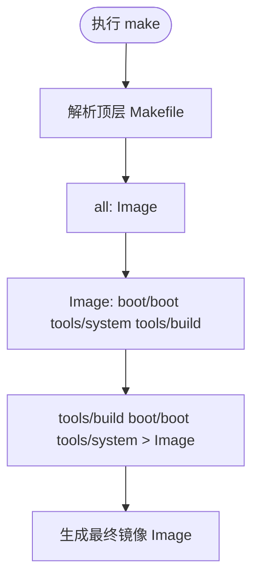
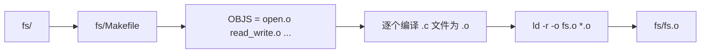
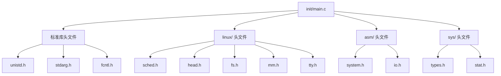
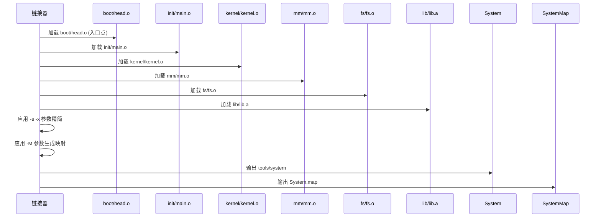
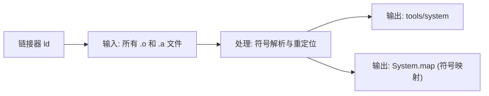

# 编译过程解析

<cite>
**本文档中引用的文件**   
- [Makefile](file://Makefile)
- [kernel/Makefile](file://kernel/Makefile)
- [fs/Makefile](file://fs/Makefile)
- [mm/Makefile](file://mm/Makefile)
- [lib/Makefile](file://lib/Makefile)
- [init/main.c](file://init/main.c)
- [tools/build.c](file://tools/build.c)
- [boot/head.s](file://boot/head.s)
- [boot/boot.s](file://boot/boot.s)
</cite>

## 目录
1. [编译流程概述](#编译流程概述)
2. [顶层Makefile分析](#顶层makefile分析)
3. [子系统归档文件的递归编译](#子系统归档文件的递归编译)
4. [init/main.o的编译与依赖](#initmaino的编译与依赖)
5. [tools/system的链接过程](#toolssystem的链接过程)
6. [System.map符号表生成](#systemmap符号表生成)
7. [常见编译错误及解决方案](#常见编译错误及解决方案)

## 编译流程概述
Linux 0.01内核的编译过程由顶层Makefile驱动，通过递归调用各子目录下的Makefile完成模块化编译。整个流程始于`make`命令，最终生成可引导的内核镜像Image。该过程涉及多个阶段：首先编译核心子系统（kernel、fs、mm、lib）为目标归档文件；然后编译初始化代码和引导程序；最后通过链接器将所有目标文件整合为单一的可执行系统映像，并生成符号表用于调试。

## 顶层Makefile分析
顶层Makefile定义了整个编译系统的规则和依赖关系。其核心目标是生成`Image`文件，该目标依赖于`boot/boot`、`tools/system`和`tools/build`三个组件。Makefile中定义了交叉编译工具链（如`i686-linux-gnu-as`、`gcc-4.8`），并设置了适用于内核编译的C编译器标志（`CFLAGS`），包括优化选项、禁用栈保护和内建函数等。



**Diagram sources**
- [Makefile](file://Makefile#L1-L96)

**Section sources**
- [Makefile](file://Makefile#L1-L96)

## 子系统归档文件的递归编译
顶层Makefile通过递归调用子目录中的Makefile来分别编译各个子系统。`ARCHIVES`变量定义了需要生成的核心归档文件：`kernel/kernel.o`、`mm/mm.o`和`fs/fs.o`。每个子系统的编译规则如下：

```makefile
kernel/kernel.o:
	(cd kernel; make)

mm/mm.o:
	(cd mm; make)

fs/fs.o:
	(cd fs; make)
```

### 内核子系统编译
`kernel/Makefile`负责编译内核核心功能，包括调度器、系统调用、中断处理、设备驱动等。它定义了`OBJS`变量，列出所有需要编译的目标文件。最终通过`$(LD) -r -o kernel.o $(OBJS)`命令将这些目标文件合并为一个可重定位的归档文件`kernel.o`。


**Diagram sources**
- [kernel/Makefile](file://kernel/Makefile#L1-L90)

**Section sources**
- [kernel/Makefile](file://kernel/Makefile#L1-L90)

### 文件系统子系统编译
`fs/Makefile`管理文件系统相关模块的编译，包括inode管理、缓冲区管理、设备文件操作等。与内核类似，它也定义了`OBJS`列表，并使用链接器的`-r`选项将所有目标文件合并为`fs.o`。



**Diagram sources**
- [fs/Makefile](file://fs/Makefile#L1-L95)

**Section sources**
- [fs/Makefile](file://fs/Makefile#L1-L95)

### 内存管理子系统编译
`mm/Makefile`负责内存管理模块的编译，主要包含`memory.c`的编译。其编译过程与其他子系统一致，最终生成`mm/mm.o`归档文件。


**Diagram sources**
- [mm/Makefile](file://mm/Makefile#L1-L37)

**Section sources**
- [mm/Makefile](file://mm/Makefile#L1-L37)

### 库函数子系统编译
`lib/Makefile`编译内核所需的库函数，如字符串操作、文件操作等。与前述子系统不同，库函数以静态库`lib.a`的形式存在，使用`ar`命令进行归档。


**Diagram sources**
- [lib/Makefile](file://lib/Makefile#L1-L44)

**Section sources**
- [lib/Makefile](file://lib/Makefile#L1-L44)

## init/main.o的编译与依赖
`init/main.o`是内核初始化代码的入口点，由`init/main.c`编译而来。其编译规则由顶层Makefile中的隐式规则`.c.o`处理。该文件对头文件有复杂的依赖关系，这些依赖在Makefile的`### Dependencies`部分明确定义。

```makefile
init/main.o : init/main.c include/unistd.h include/sys/stat.h \
  include/sys/types.h include/sys/times.h include/sys/utsname.h \
  include/utime.h include/time.h include/linux/tty.h include/termios.h \
  include/linux/sched.h include/linux/head.h include/linux/fs.h \
  include/linux/mm.h include/asm/system.h include/asm/io.h include/stddef.h \
  include/stdarg.h include/fcntl.h 
```

`main.c`中包含了多个关键头文件，如`linux/sched.h`用于任务调度，`asm/system.h`提供内联汇编宏（如`move_to_user_mode`），`asm/io.h`提供端口I/O操作等。这些依赖确保了编译时能正确解析所有符号和宏定义。



**Diagram sources**
- [Makefile](file://Makefile#L85-L95)
- [init/main.c](file://init/main.c#L1-L147)

**Section sources**
- [Makefile](file://Makefile#L85-L95)
- [init/main.c](file://init/main.c#L1-L147)

## tools/system的链接过程
`tools/system`是内核的最终可执行映像，由链接器将多个目标文件合并而成。其链接规则在顶层Makefile中定义：

```makefile
tools/system:	boot/head.o init/main.o \
		$(ARCHIVES) $(LIBS)
	$(LD) $(LDFLAGS) boot/head.o init/main.o \
	$(ARCHIVES) \
	$(LIBS) \
	-o tools/system > System.map
```

### 链接顺序
链接顺序至关重要，决定了程序的执行起点：
1. `boot/head.o`：32位保护模式启动代码，是程序的入口点。
2. `init/main.o`：内核初始化主函数。
3. `$(ARCHIVES)`：核心子系统归档文件（`kernel.o`、`mm.o`、`fs.o`）。
4. `$(LIBS)`：库函数归档文件（`lib.a`）。

### 链接参数
`LDFLAGS = -s -x -M` 包含以下作用：
- `-s`：清除符号表信息，减小输出文件大小。
- `-x`：删除所有局部符号，进一步精简文件。
- `-M`：输出链接映射（map）信息到标准输出，重定向到`System.map`文件，用于调试。



**Diagram sources**
- [Makefile](file://Makefile#L55-L67)

**Section sources**
- [Makefile](file://Makefile#L55-L67)
- [boot/head.s](file://boot/head.s#L1-L175)

## System.map符号表生成
`System.map`文件在链接`tools/system`时通过`-M`参数生成。它是内核符号地址的映射表，记录了所有全局符号（函数、变量）在最终可执行文件中的内存地址。例如，`_main`、`_sched_init`等符号的地址都会被列出。

该文件在调试内核时至关重要。当内核发生崩溃或产生oops信息时，错误日志中通常包含内存地址。通过查阅`System.map`，可以将这些地址反向解析为具体的函数名和代码位置，从而快速定位问题根源。



**Diagram sources**
- [Makefile](file://Makefile#L62-L67)

**Section sources**
- [Makefile](file://Makefile#L62-L67)

## 常见编译错误及解决方案
在编译过程中可能遇到以下典型错误：

### 依赖缺失
**现象**：编译器报错找不到头文件，如`include/linux/sched.h: No such file or directory`。
**原因**：`CFLAGS`中的`-Iinclude`路径配置错误，或头文件确实缺失。
**解决方案**：确保`include`目录存在且路径正确。检查`CFLAGS`变量是否包含`-Iinclude`。

### 符号未定义
**现象**：链接器报错`undefined reference to 'function_name'`。
**原因**：调用的函数未在任何目标文件中实现，或归档文件未被正确链接。
**解决方案**：
1. 检查函数声明与定义是否匹配。
2. 确认包含该函数的源文件已被编译并加入归档文件（如`OBJS`列表）。
3. 确保归档文件（如`lib.a`）在链接命令中被正确引用。

### 工具链缺失
**现象**：`make`报错`i686-linux-gnu-gcc: command not found`。
**原因**：指定的交叉编译工具链未安装。
**解决方案**：安装`gcc-4.8`和`binutils`的i686版本，或修改Makefile中的`CC`和`AS`变量指向系统已安装的编译器。

### 内存不足
**现象**：编译过程因内存不足而失败。
**解决方案**：关闭其他程序释放内存，或在内存充足的机器上编译。

**Section sources**
- [Makefile](file://Makefile#L1-L96)
- [kernel/Makefile](file://kernel/Makefile#L1-L90)
- [init/main.c](file://init/main.c#L1-L147)