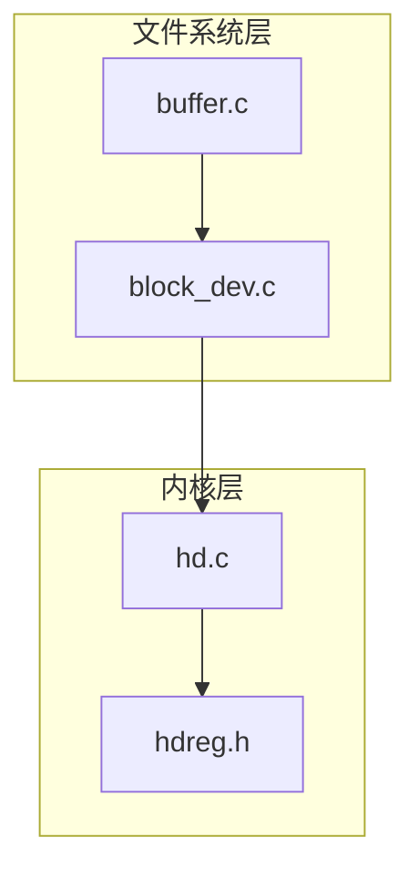
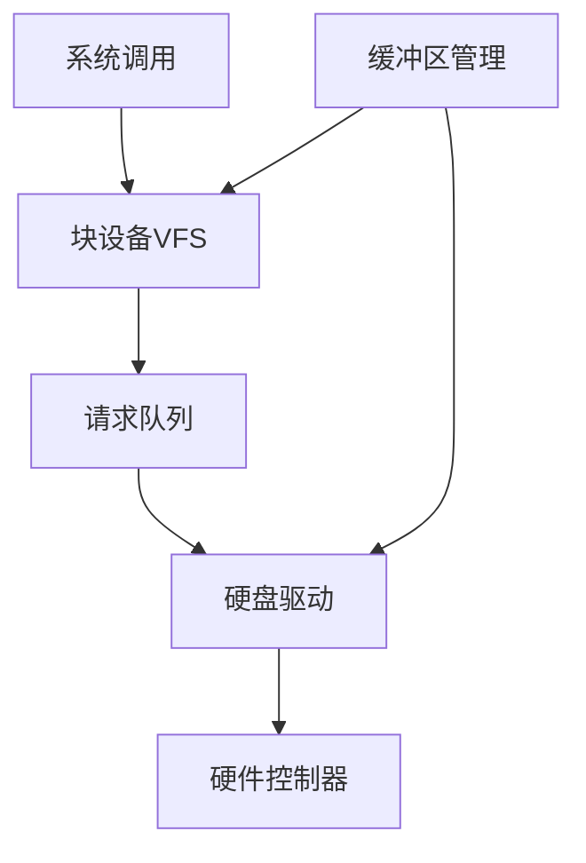
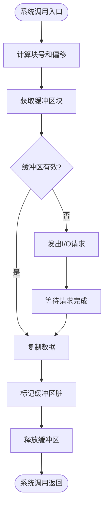
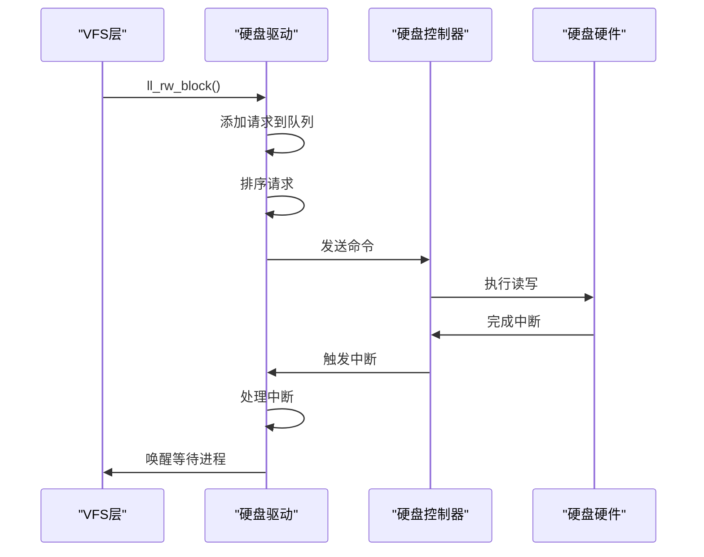
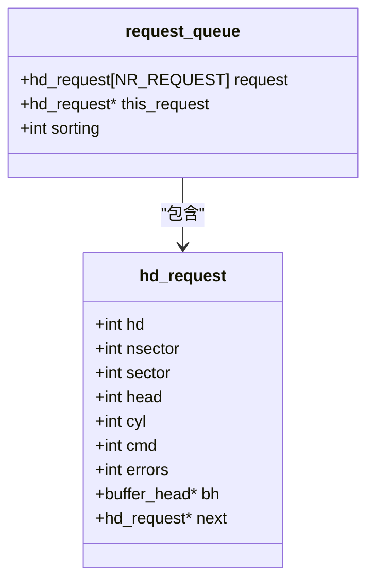
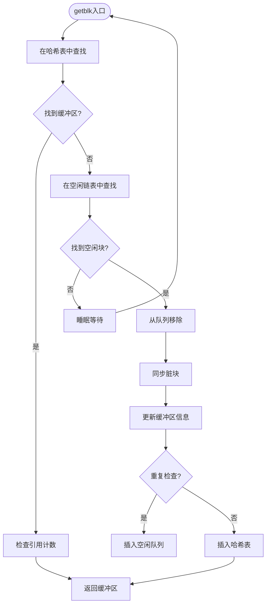
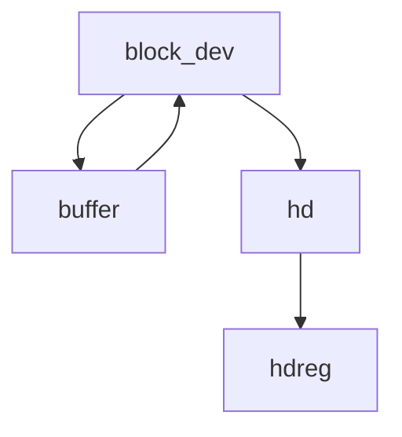

# 块设备驱动

<cite>
**本文档中引用的文件**   
- [block_dev.c](file://fs/block_dev.c)
- [hd.c](file://kernel/hd.c)
- [buffer.c](file://fs/buffer.c)
- [hdreg.h](file://include/linux/hdreg.h)
</cite>

## 目录
1. [引言](#引言)
2. [项目结构](#项目结构)
3. [核心组件](#核心组件)
4. [架构概述](#架构概述)
5. [详细组件分析](#详细组件分析)
6. [依赖分析](#依赖分析)
7. [性能考虑](#性能考虑)
8. [故障排除指南](#故障排除指南)
9. [结论](#结论)

## 引言
本文档深入分析Linux 0.01内核中块设备驱动的实现机制，重点解析块设备VFS抽象层与硬盘驱动的具体实现。文档详细说明了`fs/block_dev.c`中块设备的注册与操作接口，以及`kernel/hd.c`中硬盘驱动的核心逻辑。通过分析请求队列设计、中断处理机制和DMA数据传输，全面阐述了从系统调用到硬件操作的完整调用链。

## 项目结构
Linux 0.01内核的块设备驱动主要分布在`fs`和`kernel`两个目录中。`fs`目录包含文件系统层的块设备抽象和缓冲区管理，而`kernel`目录则包含具体的硬盘驱动实现。这种分层设计体现了操作系统内核中设备驱动的典型架构模式。

**图示来源**
- [block_dev.c](file://fs/block_dev.c#L0-L85)
- [hd.c](file://kernel/hd.c#L0-L413)
- [buffer.c](file://fs/buffer.c#L0-L254)
- [hdreg.h](file://include/linux/hdreg.h#L0-L99)

**本节来源**
- [block_dev.c](file://fs/block_dev.c#L0-L85)
- [hd.c](file://kernel/hd.c#L0-L413)

## 核心组件
块设备驱动系统由三个核心组件构成：块设备VFS抽象层、硬盘驱动实现和缓冲区管理系统。这些组件协同工作，为上层文件系统提供统一的块设备访问接口，同时管理底层硬件的具体操作细节。

**本节来源**
- [block_dev.c](file://fs/block_dev.c#L0-L85)
- [hd.c](file://kernel/hd.c#L0-L413)
- [buffer.c](file://fs/buffer.c#L0-L254)

## 架构概述
块设备驱动采用分层架构设计，从上到下依次为：系统调用接口、块设备VFS抽象、请求队列管理和硬件驱动层。这种设计实现了设备无关性与设备特定实现的分离，提高了代码的可维护性和可扩展性。

**图示来源**
- [block_dev.c](file://fs/block_dev.c#L0-L85)
- [hd.c](file://kernel/hd.c#L0-L413)
- [buffer.c](file://fs/buffer.c#L0-L254)

## 详细组件分析

### 块设备VFS抽象层分析
块设备VFS抽象层提供了统一的块设备访问接口，屏蔽了底层硬件的差异性。`block_read`和`block_write`函数实现了基本的读写操作，通过缓冲区管理系统与底层驱动交互。

#### 块设备操作流程图

**图示来源**
- [block_dev.c](file://fs/block_dev.c#L0-L66)

**本节来源**
- [block_dev.c](file://fs/block_dev.c#L0-L85)

### 硬盘驱动实现分析
硬盘驱动实现了具体的硬件操作逻辑，包括请求队列管理、中断处理和DMA数据传输。驱动采用电梯算法对请求进行排序，提高了磁盘访问效率。

#### 请求处理序列图

**图示来源**
- [hd.c](file://kernel/hd.c#L291-L328)
- [hd.c](file://kernel/hd.c#L233-L293)

#### 请求队列类图

**图示来源**
- [hd.c](file://kernel/hd.c#L57-L116)

**本节来源**
- [hd.c](file://kernel/hd.c#L0-L413)

### 缓冲区管理系统分析
缓冲区管理系统负责内存与磁盘之间的数据缓存，通过哈希表和空闲链表高效管理缓冲区块。系统实现了缓冲区的获取、释放和同步机制，确保数据一致性。

#### 缓冲区管理流程图

**图示来源**
- [buffer.c](file://fs/buffer.c#L147-L203)

**本节来源**
- [buffer.c](file://fs/buffer.c#L0-L254)

## 依赖分析
块设备驱动系统各组件之间存在明确的依赖关系。VFS层依赖于缓冲区管理系统和具体驱动实现，而驱动实现则依赖于硬件寄存器定义和中断处理机制。

**图示来源**
- [block_dev.c](file://fs/block_dev.c#L64-L85)
- [hd.c](file://kernel/hd.c#L57-L116)
- [buffer.c](file://fs/buffer.c#L51-L107)

**本节来源**
- [block_dev.c](file://fs/block_dev.c#L0-L85)
- [hd.c](file://kernel/hd.c#L0-L413)
- [buffer.c](file://fs/buffer.c#L0-L254)

## 性能考虑
块设备驱动通过多种机制优化性能：请求队列的电梯算法减少了磁头移动距离，缓冲区管理系统减少了磁盘I/O次数，而DMA传输则减轻了CPU负担。这些优化共同提高了系统的整体I/O性能。

## 故障排除指南
常见的块设备问题包括"设备忙"和"I/O错误"。"设备忙"通常由请求队列满或缓冲区竞争引起，可通过检查`wait_for_request`等待队列诊断。"I/O错误"则可能源于硬件故障或驱动bug，系统通过`MAX_ERRORS`限制重试次数，避免无限循环。

**本节来源**
- [hd.c](file://kernel/hd.c#L233-L293)
- [hd.c](file://kernel/hd.c#L176-L240)

## 结论
Linux 0.01的块设备驱动实现了完整的设备抽象和硬件操作功能，其分层架构和模块化设计体现了早期Unix系统的工程智慧。尽管代码规模较小，但已包含了现代操作系统块设备驱动的核心概念和设计模式，为理解更复杂的存储子系统提供了良好的基础。