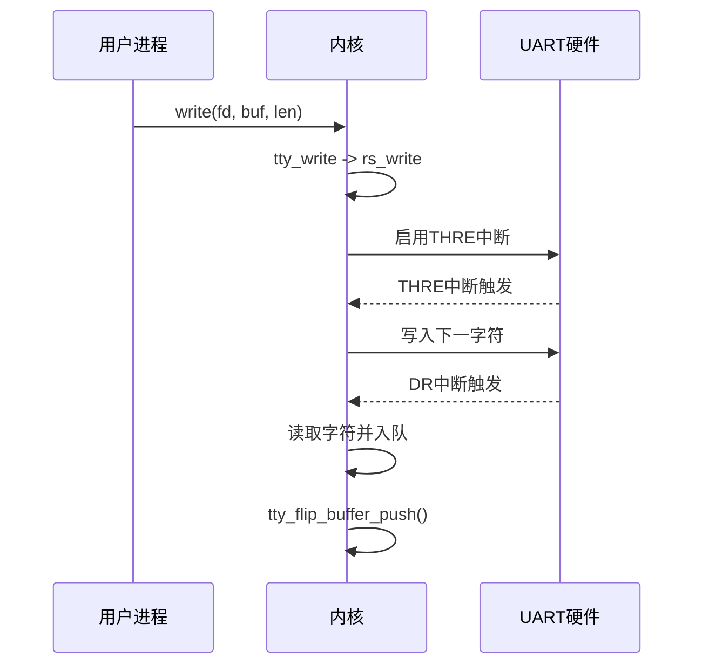
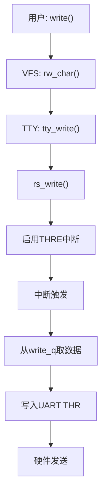

# 字符设备驱动

<cite>
**本文档引用的文件**  
- [char_dev.c](file://fs/char_dev.c)
- [serial.c](file://kernel/serial.c)
- [tty.h](file://include/linux/tty.h)
</cite>

## 目录
1. [引言](#引言)
2. [字符设备在VFS层的抽象模型](#字符设备在vfs层的抽象模型)
3. [串口驱动初始化流程](#串口驱动初始化流程)
4. [中断驱动的数据收发机制](#中断驱动的数据收发机制)
5. [环形缓冲区与TTY层数据传递](#环形缓冲区与tty层数据传递)
6. [用户调用到硬件输出的数据流分析](#用户调用到硬件输出的数据流分析)
7. [常见问题排查指南](#常见问题排查指南)
8. [结论](#结论)

## 引言
本文系统性地阐述Linux 0.01内核中字符设备驱动的架构设计，重点分析串口设备的实现机制。通过解析`fs/char_dev.c`和`kernel/serial.c`中的核心代码，揭示从用户空间`write()`调用到UART硬件输出的完整数据路径，并深入探讨中断处理、波特率配置、寄存器操作等关键技术细节。

## 字符设备在VFS层的抽象模型

Linux内核通过`crw_table`函数指针数组将主设备号与对应的操作函数集进行绑定，实现了字符设备在虚拟文件系统（VFS）层的抽象。当用户发起读写请求时，`rw_char()`函数根据设备号的主设备号索引该表，调用相应的处理函数。

对于TTY设备，`crw_table`注册了`rw_ttyx`和`rw_tty`两个函数，分别处理显式TTY设备和当前进程关联TTY的I/O请求。这些函数最终将读写操作转发至TTY子系统，由具体的TTY驱动（如串口驱动）完成底层硬件交互。

```mermaid
graph TD
A[用户read/write] --> B[rw_char]
B --> C{MAJOR(dev)}
C --> D[crw_table[MAJOR]]
D --> E[rw_ttyx/rw_tty]
E --> F[tty_read/tty_write]
F --> G[具体TTY驱动]
```

**图示来源**  
- [char_dev.c](file://fs/char_dev.c#L1-L50)

**本节来源**  
- [char_dev.c](file://fs/char_dev.c#L1-L50)

## 串口驱动初始化流程

`rs_init()`函数负责初始化串口驱动，其主要步骤包括：

1. **中断门设置**：通过`set_intr_gate`将IRQ3和IRQ4分别绑定到`rs1_interrupt`和`rs2_interrupt`中断服务程序。
2. **端口初始化**：调用`init()`函数配置UART控制器（8250/16450）的LCR、DLL、DLM等寄存器。
3. **波特率设置**：通过设置除数锁存器（DLL/DLM）实现波特率配置，公式为：`BAUD_BASE / baud_rate`。示例代码中设置为2400bps。
4. **控制寄存器配置**：启用DTR、RTS信号，并开启接收数据就绪（DR）和发送保持寄存器空（THRE）中断。
5. **中断控制器配置**：清除8259A中断控制器的屏蔽位，使能串口中断。

上述流程确保串口硬件处于可操作状态，并准备好响应外部事件。

**本节来源**  
- [serial.c](file://kernel/serial.c#L1-L45)

## 中断驱动的数据收发机制

串口驱动采用中断驱动模式实现高效的数据收发。其核心机制如下：

### 发送机制
`rs_write()`函数被调用时，若写队列非空，则通过操作IER（中断使能寄存器）开启THRE（发送保持寄存器空）中断。当UART硬件完成当前字符发送后，会触发中断，驱动在中断服务程序中从环形缓冲区取出下一字符写入发送保持寄存器。

### 接收机制
当UART接收到数据时，触发DR（数据就绪）中断。中断服务程序从接收缓冲寄存器读取字符，并存入TTY读队列。随后通过`tty_flip_buffer_push()`机制将数据提交给TTY层进行后续处理。

该机制避免了轮询带来的CPU资源浪费，实现了事件驱动的高效I/O。



**图示来源**  
- [serial.c](file://kernel/serial.c#L46-L52)
- [tty.h](file://include/linux/tty.h#L1-L74)

**本节来源**  
- [serial.c](file://kernel/serial.c#L46-L52)

## 环形缓冲区与TTY层数据传递

TTY子系统使用环形缓冲区（`struct tty_queue`）管理串口数据流。该结构包含`head`、`tail`指针及固定大小的缓冲区数组，通过位运算实现高效的入队（`PUTCH`）和出队（`GETCH`）操作。

接收中断将数据写入`read_q`，并通过`tty_flip_buffer_push()`通知上层消费。该函数触发软中断或唤醒等待进程，确保数据及时传递至用户空间。写操作则利用`write_q`暂存待发送数据，由中断驱动逐步输出。

缓冲区大小定义为`TTY_BUF_SIZE=1024`，并通过宏`LEFT()`、`CHARS()`等实现边界检查与流量控制。

**本节来源**  
- [tty.h](file://include/linux/tty.h#L1-L74)

## 用户调用到硬件输出的数据流分析

从用户`write()`调用到串口硬件输出的完整数据流如下：

1. 用户调用`write(fd, buf, len)`，系统调用进入内核。
2. VFS层通过`rw_char`分发至`rw_tty`处理函数。
3. TTY子系统调用`tty_write`，将数据写入`write_q`环形缓冲区。
4. `rs_write`被触发，启用THRE中断。
5. 若发送保持寄存器为空，立即写入第一个字符。
6. 每次THRE中断触发后，从`write_q`取字符写入硬件，直至缓冲区为空。
7. 最终字符通过UART线路发送出去。

此过程体现了Linux设备驱动分层设计的精髓：VFS → TTY核心 → 设备驱动 → 硬件。



**图示来源**  
- [char_dev.c](file://fs/char_dev.c#L1-L50)
- [serial.c](file://kernel/serial.c#L46-L52)
- [tty.h](file://include/linux/tty.h#L1-L74)

## 常见问题排查指南

### 波特率配置错误
- **现象**：通信乱码或无法建立连接。
- **排查**：检查`init()`函数中DLL/DLM寄存器设置是否符合`BAUD_BASE / baud_rate`公式。确认`BAUD_BASE`定义值（通常为115200或1843200）与晶振频率匹配。

### 中断冲突
- **现象**：系统死机或串口无响应。
- **排查**：
  - 确认`set_intr_gate`设置的中断向量（0x24/0x23）未与其他设备冲突。
  - 检查8259A中断屏蔽寄存器（0x21端口）是否正确清除屏蔽位。
  - 验证中断服务程序是否及时清除中断源，防止重复触发。

### 数据丢失
- **现象**：接收数据不完整。
- **排查**：
  - 检查环形缓冲区是否溢出（`FULL(read_q)`）。
  - 确保`tty_flip_buffer_push()`被正确调用。
  - 验证中断优先级设置，避免高优先级中断阻塞串口中断。

**本节来源**  
- [serial.c](file://kernel/serial.c#L1-L53)
- [tty.h](file://include/linux/tty.h#L1-L74)

## 结论
Linux 0.01的字符设备驱动架构展现了简洁而高效的分层设计理念。通过`crw_table`实现VFS层的设备分发，结合TTY子系统的环形缓冲区管理与中断驱动机制，成功实现了串口设备的可靠通信。理解这一经典实现，有助于掌握现代Linux驱动开发的核心思想。