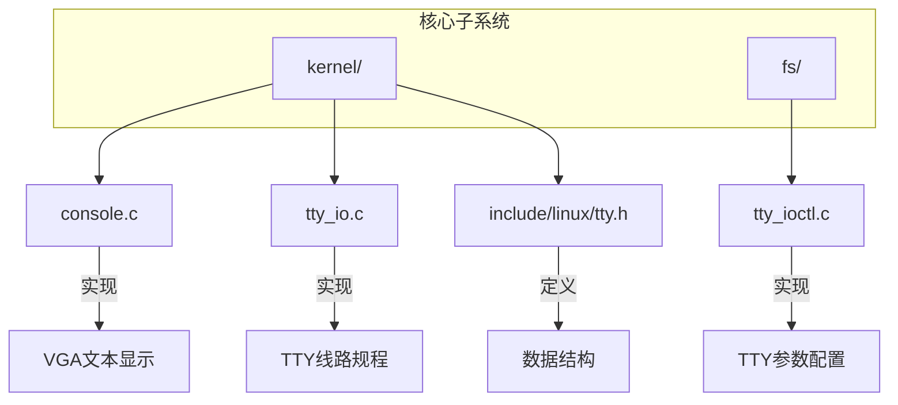
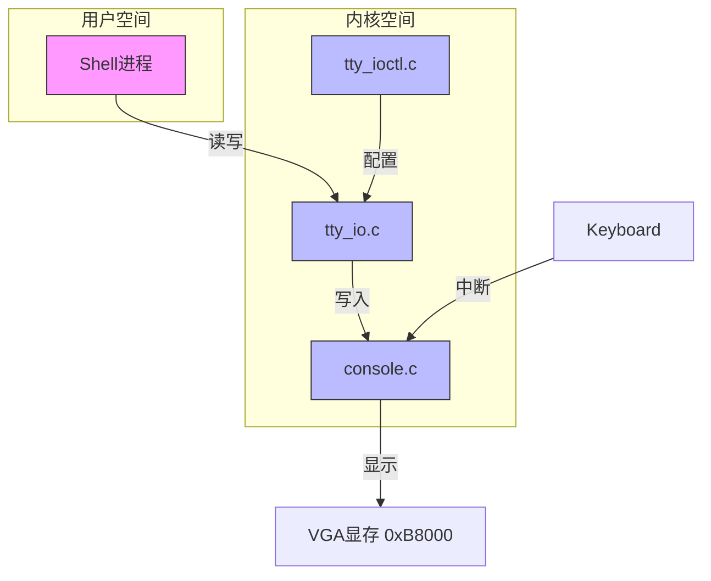
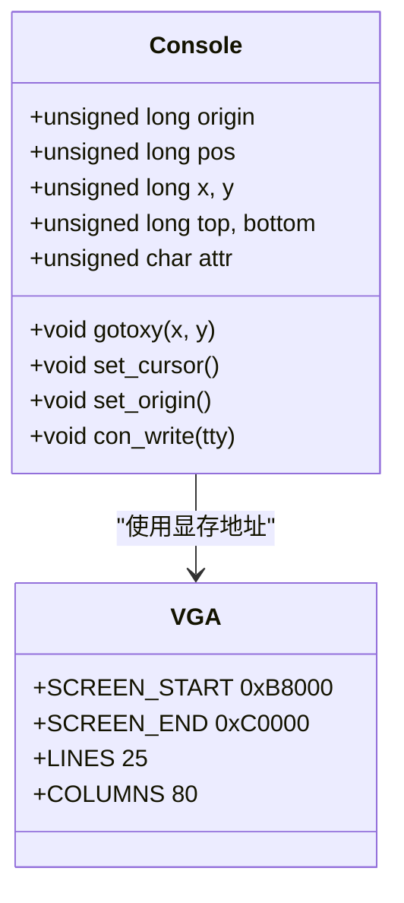
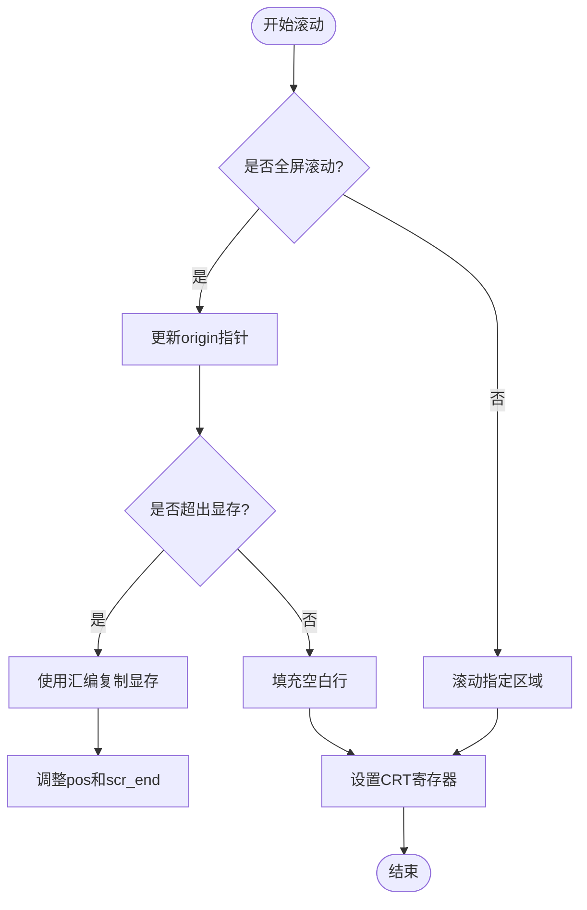
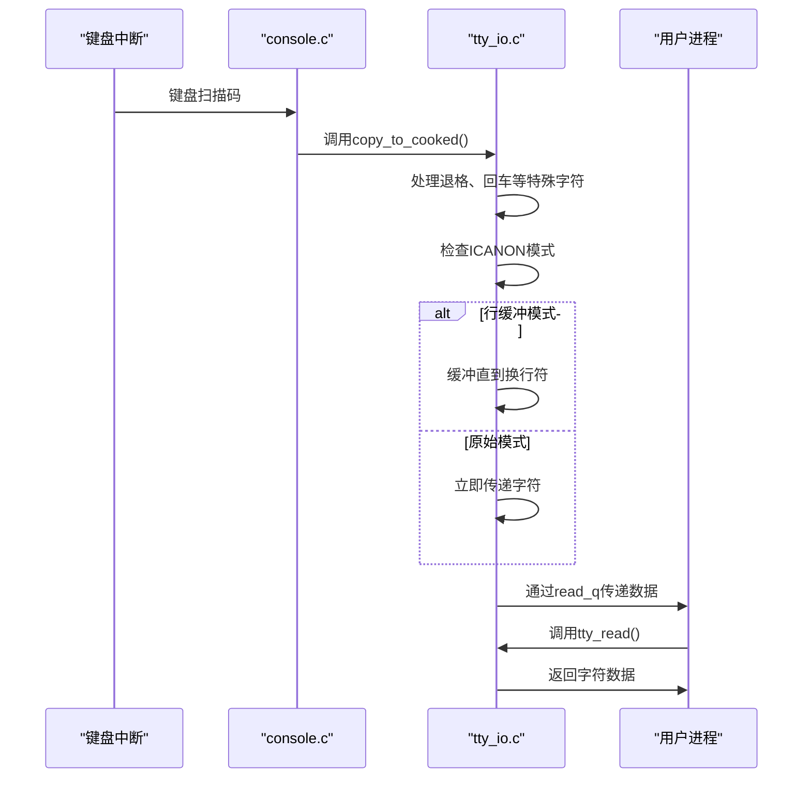
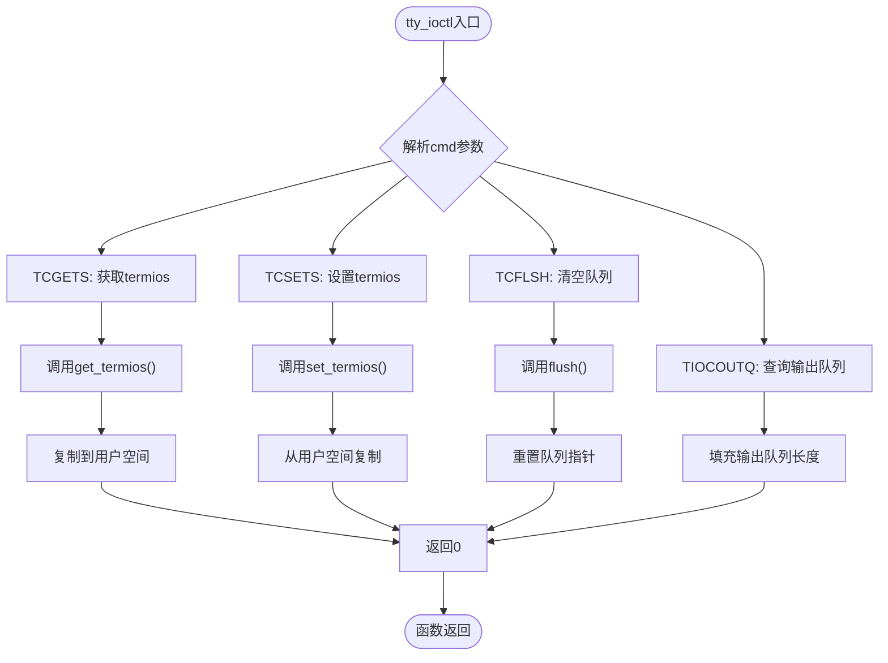
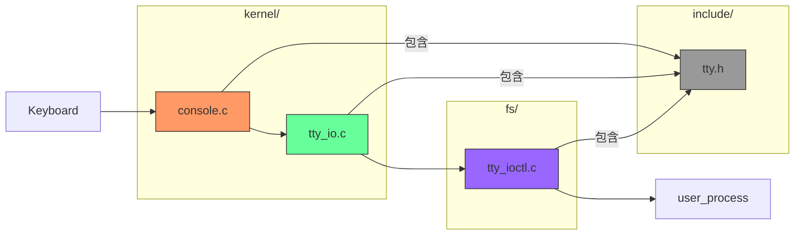

# 控制台与TTY驱动

<cite>
**本文档引用文件**   
- [console.c](file://kernel/console.c)
- [tty_io.c](file://kernel/tty_io.c)
- [tty_ioctl.c](file://fs/tty_ioctl.c)
- [tty.h](file://include/linux/tty.h)
</cite>

## 目录
1. [引言](#引言)
2. [项目结构](#项目结构)
3. [核心组件](#核心组件)
4. [架构概述](#架构概述)
5. [详细组件分析](#详细组件分析)
6. [依赖分析](#依赖分析)
7. [性能考虑](#性能考虑)
8. [故障排除指南](#故障排除指南)
9. [结论](#结论)

## 引言
本文档全面解析Linux 0.01内核中控制台与TTY子系统的协同工作机制。重点分析`kernel/console.c`如何实现VGA文本模式下的字符显示，`kernel/tty_io.c`中的TTY线路规程核心功能，以及`fs/tty_ioctl.c`对TTY参数的配置机制。通过深入分析代码结构与数据流，揭示从键盘输入到用户进程的完整处理流程。

## 项目结构
本项目为Linux 0.01内核源码，包含核心子系统：文件系统（fs）、内核（kernel）、内存管理（mm）等。控制台与TTY相关代码主要分布在`kernel/`和`fs/`目录下。



**Diagram sources**
- [kernel/console.c](file://kernel/console.c#L1-L550)
- [kernel/tty_io.c](file://kernel/tty_io.c#L1-L306)
- [fs/tty_ioctl.c](file://fs/tty_ioctl.c#L1-L166)
- [include/linux/tty.h](file://include/linux/tty.h#L1-L74)

**Section sources**
- [kernel/console.c](file://kernel/console.c#L1-L550)
- [kernel/tty_io.c](file://kernel/tty_io.c#L1-L306)
- [fs/tty_ioctl.c](file://fs/tty_ioctl.c#L1-L166)

## 核心组件
文档的核心组件包括控制台驱动、TTY线路规程和TTY ioctl接口，分别负责字符显示、输入处理和终端参数配置。

**Section sources**
- [kernel/console.c](file://kernel/console.c#L1-L550)
- [kernel/tty_io.c](file://kernel/tty_io.c#L1-L306)
- [fs/tty_ioctl.c](file://fs/tty_ioctl.c#L1-L166)

## 架构概述
控制台与TTY子系统采用分层架构，将硬件控制与终端语义处理分离。控制台驱动直接操作VGA显存，TTY线路规程处理输入输出的特殊字符和模式，ioctl接口提供终端参数配置。



**Diagram sources**
- [kernel/console.c](file://kernel/console.c#L1-L550)
- [kernel/tty_io.c](file://kernel/tty_io.c#L1-L306)
- [fs/tty_ioctl.c](file://fs/tty_ioctl.c#L1-L166)

## 详细组件分析

### 控制台驱动分析
`kernel/console.c`实现了VGA文本模式下的字符显示功能，包括显存操作、光标控制、屏幕滚动和键盘中断处理。

#### 显存与光标控制


**Diagram sources**
- [kernel/console.c](file://kernel/console.c#L1-L550)

#### 屏幕滚动算法


**Diagram sources**
- [kernel/console.c](file://kernel/console.c#L1-L550)

**Section sources**
- [kernel/console.c](file://kernel/console.c#L1-L550)

### TTY线路规程分析
`kernel/tty_io.c`实现了TTY线路规程的核心功能，包括输入处理、行缓冲和数据队列管理。

#### 输入处理流程


**Diagram sources**
- [kernel/tty_io.c](file://kernel/tty_io.c#L1-L306)

#### TTY数据结构
```mermaid
erDiagram
TTY_STRUCT {
struct termios termios
int pgrp
int stopped
void (*write)()
}
TTY_QUEUE {
unsigned long data
unsigned long head
unsigned long tail
char buf[1024]
}
TTY_STRUCT ||--o{ TTY_QUEUE : "包含"
TTY_STRUCT }|--|| TTY_QUEUE : read_q
TTY_STRUCT }|--|| TTY_QUEUE : write_q
TTY_STRUCT }|--|| TTY_QUEUE : secondary
```

**Diagram sources**
- [include/linux/tty.h](file://include/linux/tty.h#L1-L74)

**Section sources**
- [kernel/tty_io.c](file://kernel/tty_io.c#L1-L306)
- [include/linux/tty.h](file://include/linux/tty.h#L1-L74)

### TTY参数配置分析
`fs/tty_ioctl.c`实现了TTY设备的ioctl接口，用于配置终端参数。

#### ioctl命令处理


**Diagram sources**
- [fs/tty_ioctl.c](file://fs/tty_ioctl.c#L1-L166)

**Section sources**
- [fs/tty_ioctl.c](file://fs/tty_ioctl.c#L1-L166)

## 依赖分析
控制台与TTY子系统各组件之间存在明确的依赖关系，形成清晰的数据处理流水线。



**Diagram sources**
- [kernel/console.c](file://kernel/console.c#L1-L550)
- [kernel/tty_io.c](file://kernel/tty_io.c#L1-L306)
- [fs/tty_ioctl.c](file://fs/tty_ioctl.c#L1-L166)
- [include/linux/tty.h](file://include/linux/tty.h#L1-L74)

**Section sources**
- [kernel/console.c](file://kernel/console.c#L1-L550)
- [kernel/tty_io.c](file://kernel/tty_io.c#L1-L306)
- [fs/tty_ioctl.c](file://fs/tty_ioctl.c#L1-L166)

## 性能考虑
控制台与TTY子系统在设计上考虑了性能优化，特别是在显存操作和中断处理方面。

- **显存操作优化**：使用内联汇编直接操作显存，避免函数调用开销
- **中断处理**：键盘中断通过trap门进入，确保原子性操作
- **队列管理**：使用循环缓冲区实现高效的数据存取
- **模式切换**：行缓冲模式减少系统调用次数，提高吞吐量

## 故障排除指南
针对常见的终端问题提供诊断方法。

### 终端无响应
1. 检查`current->signal`是否被设置，可能导致进程休眠
2. 验证`tty->stopped`标志位，确认是否被STOP/START字符控制
3. 检查`read_q`和`write_q`队列是否满或空导致阻塞

### 乱码问题
1. 确认`termios.c_oflag`设置，检查OPOST、ONLCR等标志
2. 验证字符编码转换逻辑，特别是I_UCLC/I_LCUC标志
3. 检查显存写入的属性字节是否正确

**Section sources**
- [kernel/console.c](file://kernel/console.c#L1-L550)
- [kernel/tty_io.c](file://kernel/tty_io.c#L1-L306)
- [fs/tty_ioctl.c](file://fs/tty_ioctl.c#L1-L166)

## 结论
Linux 0.01的控制台与TTY子系统通过清晰的分层设计，实现了从硬件控制到终端语义的完整抽象。`console.c`直接操作VGA硬件，`tty_io.c`实现线路规程，`tty_ioctl.c`提供配置接口，三者协同工作，为用户进程提供统一的终端服务。该设计体现了微内核思想的雏形，为后续终端子系统的发展奠定了基础。