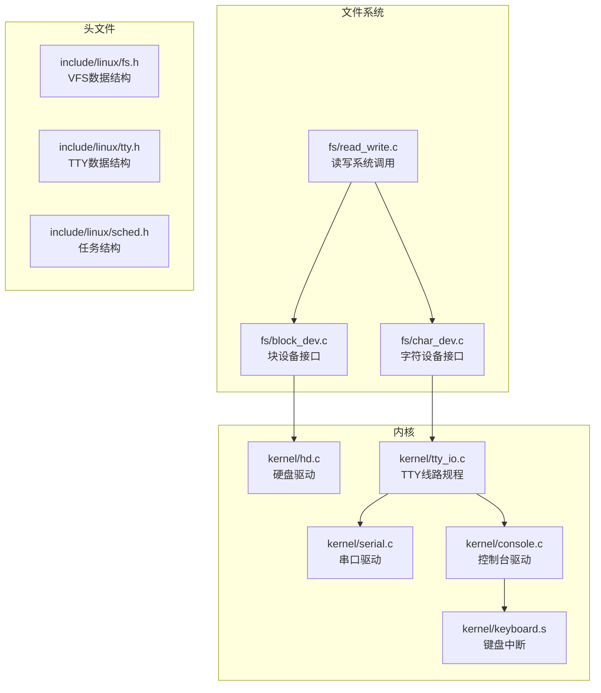
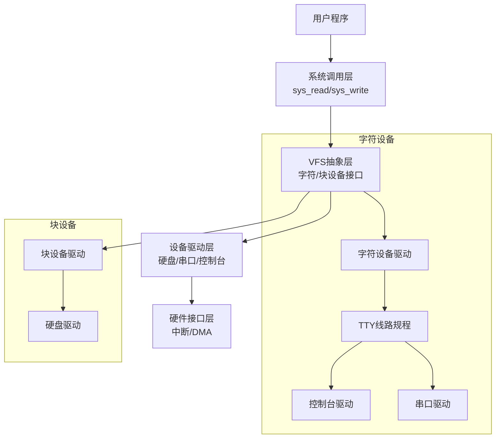
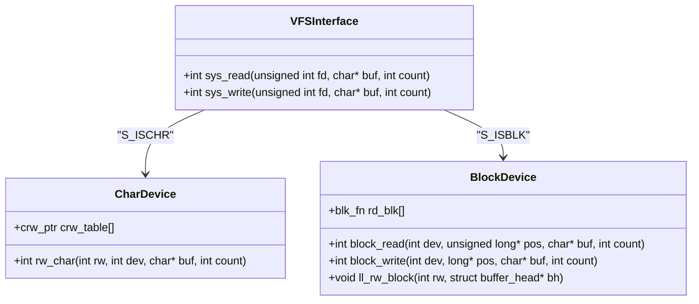
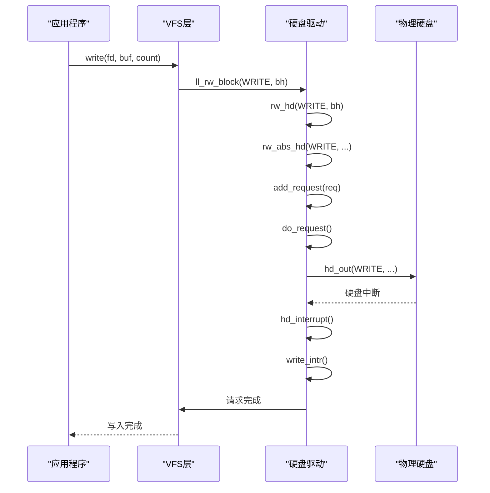
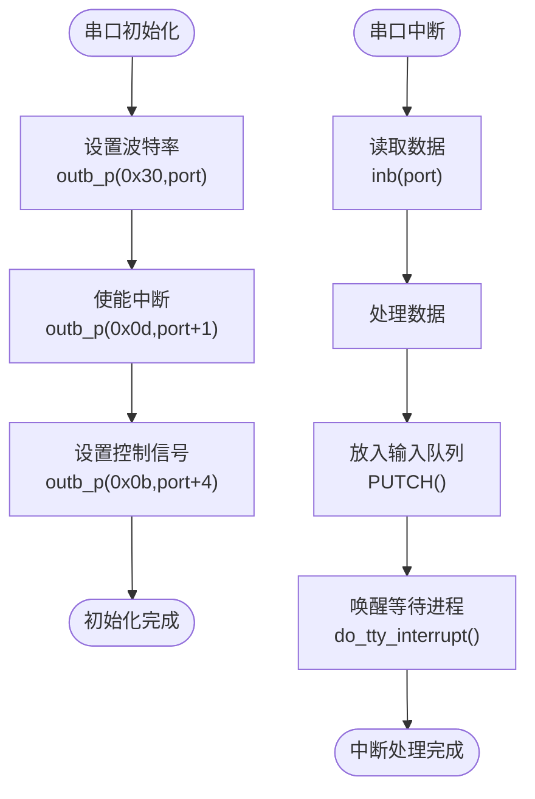
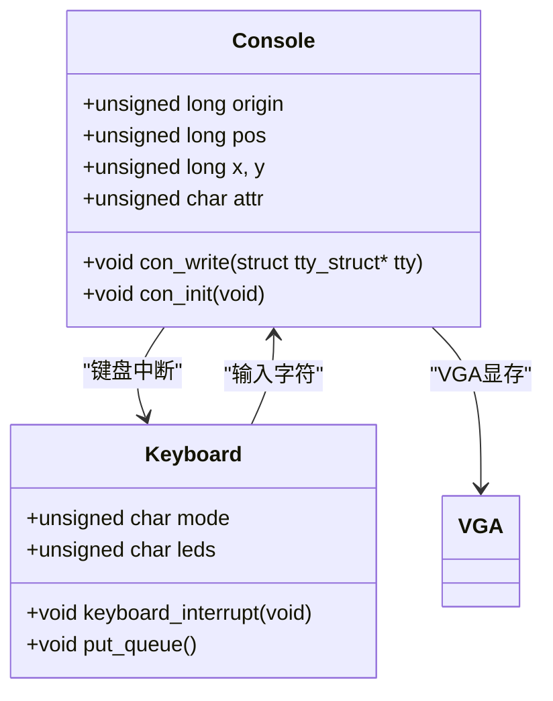
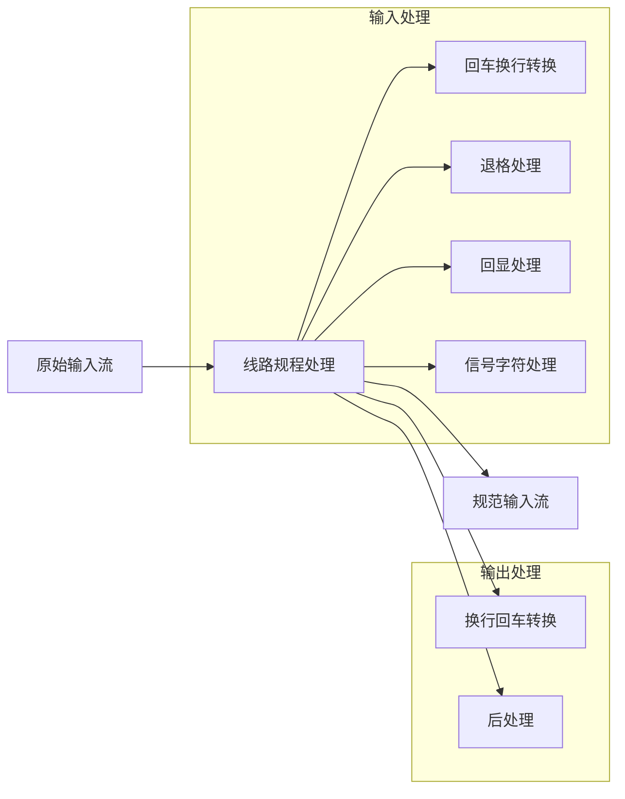
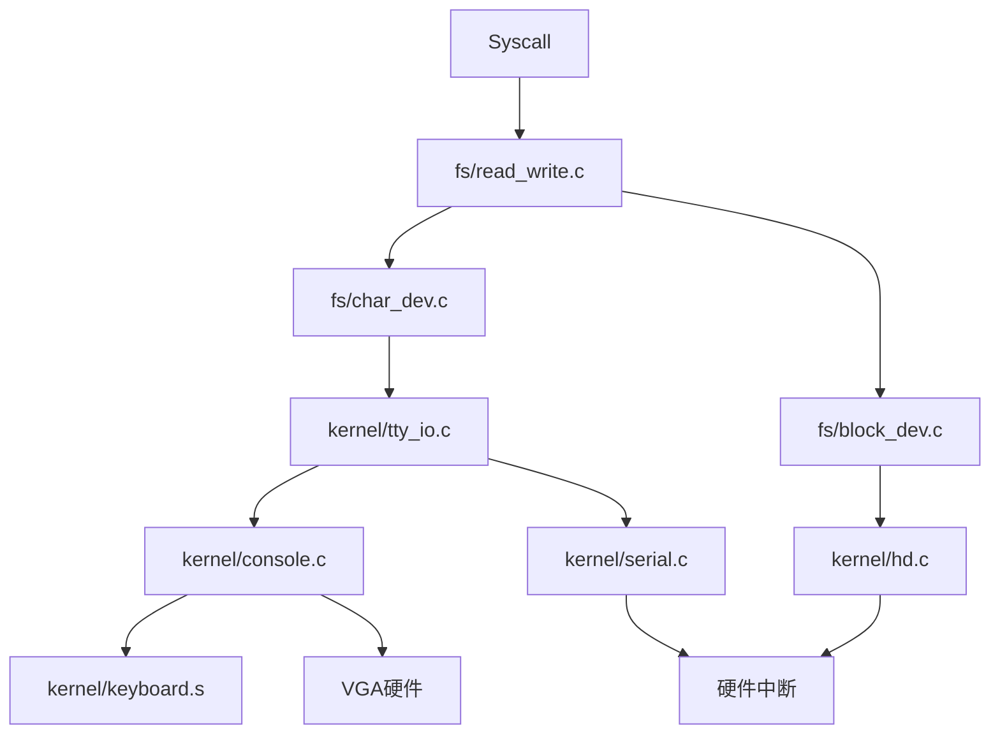

# 设备驱动实现

<cite>
**本文档中引用的文件**
- [char_dev.c](file://fs/char_dev.c)
- [block_dev.c](file://fs/block_dev.c)
- [hd.c](file://kernel/hd.c)
- [serial.c](file://kernel/serial.c)
- [console.c](file://kernel/console.c)
- [tty_io.c](file://kernel/tty_io.c)
- [keyboard.s](file://kernel/keyboard.s)
- [read_write.c](file://fs/read_write.c)
- [sys.c](file://kernel/sys.c)
- [fs.h](file://include/linux/fs.h)
- [sched.h](file://include/linux/sched.h)
- [tty.h](file://include/linux/tty.h)
</cite>

## 目录
1. [简介](#简介)
2. [项目结构](#项目结构)
3. [核心组件](#核心组件)
4. [架构概述](#架构概述)
5. [详细组件分析](#详细组件分析)
6. [依赖分析](#依赖分析)
7. [性能考虑](#性能考虑)
8. [故障排除指南](#故障排除指南)
9. [结论](#结论)

## 简介
本文档详细记录了Linux 0.01内核中关键设备驱动的实现原理与架构。重点分析了字符设备和块设备在VFS层的抽象接口，深入探讨了硬盘驱动、串口驱动、控制台驱动和TTY线路规程的实现机制。通过代码流程分析，展示了从用户`write()`系统调用到硬盘物理写入的完整数据流。

## 项目结构
Linux 0.01内核项目采用模块化结构，主要分为文件系统、内核、库和内存管理等模块。设备驱动主要分布在`fs`和`kernel`目录下，其中`fs`目录包含VFS层抽象，`kernel`目录包含具体硬件驱动实现。

**图示来源**
- [char_dev.c](file://fs/char_dev.c#L1-L50)
- [block_dev.c](file://fs/block_dev.c#L1-L86)
- [hd.c](file://kernel/hd.c#L1-L413)
- [serial.c](file://kernel/serial.c#L1-L53)
- [console.c](file://kernel/console.c#L1-L550)
- [tty_io.c](file://kernel/tty_io.c#L1-L306)
- [keyboard.s](file://kernel/keyboard.s#L1-L409)

**本节来源**
- [fs/char_dev.c](file://fs/char_dev.c#L1-L50)
- [fs/block_dev.c](file://fs/block_dev.c#L1-L86)
- [kernel/hd.c](file://kernel/hd.c#L1-L413)

## 核心组件
本文档的核心组件包括字符设备驱动、块设备驱动、硬盘驱动、串口驱动、控制台驱动和TTY线路规程。这些组件共同构成了Linux 0.01内核的设备驱动框架，实现了从用户空间到硬件设备的完整数据通路。

**本节来源**
- [fs/char_dev.c](file://fs/char_dev.c#L1-L50)
- [fs/block_dev.c](file://fs/block_dev.c#L1-L86)
- [kernel/hd.c](file://kernel/hd.c#L1-L413)

## 架构概述
Linux 0.01设备驱动架构采用分层设计，从上到下分为系统调用层、VFS抽象层、设备驱动层和硬件接口层。这种分层架构实现了设备无关性，使得上层应用可以通过统一的接口访问不同类型的设备。

**图示来源**
- [fs/read_write.c](file://fs/read_write.c#L1-L97)
- [fs/char_dev.c](file://fs/char_dev.c#L1-L50)
- [fs/block_dev.c](file://fs/block_dev.c#L1-L86)
- [kernel/tty_io.c](file://kernel/tty_io.c#L1-L306)
- [kernel/console.c](file://kernel/console.c#L1-L550)
- [kernel/serial.c](file://kernel/serial.c#L1-L53)
- [kernel/hd.c](file://kernel/hd.c#L1-L413)

## 详细组件分析

### 字符与块设备VFS抽象
Linux 0.01通过VFS层为字符设备和块设备提供了统一的抽象接口。字符设备以字节流方式访问，适用于键盘、串口等设备；块设备以固定大小的数据块为单位访问，适用于硬盘、软盘等存储设备。

**图示来源**
- [fs/char_dev.c](file://fs/char_dev.c#L1-L50)
- [fs/block_dev.c](file://fs/block_dev.c#L1-L86)
- [fs/read_write.c](file://fs/read_write.c#L1-L97)

**本节来源**
- [fs/char_dev.c](file://fs/char_dev.c#L1-L50)
- [fs/block_dev.c](file://fs/block_dev.c#L1-L86)

### 硬盘驱动分析
硬盘驱动实现了块设备的具体操作，通过请求队列管理读写请求，并利用中断机制处理DMA完成事件。驱动采用电梯算法对请求进行排序，提高磁盘访问效率。

**图示来源**
- [kernel/hd.c](file://kernel/hd.c#L1-L413)
- [fs/block_dev.c](file://fs/block_dev.c#L1-L86)

**本节来源**
- [kernel/hd.c](file://kernel/hd.c#L1-L413)

### 串口驱动分析
串口驱动负责初始化8250/16450串口控制器，设置波特率，并实现中断驱动的字符收发。驱动通过中断服务程序处理串口事件，确保数据的实时传输。

**图示来源**
- [kernel/serial.c](file://kernel/serial.c#L1-L53)
- [kernel/tty_io.c](file://kernel/tty_io.c#L1-L306)

**本节来源**
- [kernel/serial.c](file://kernel/serial.c#L1-L53)

### 控制台驱动分析
控制台驱动负责将字符输出到VGA显存，并处理键盘中断获取输入。驱动实现了VT102终端的部分功能，支持光标移动、屏幕清除等控制序列。

**图示来源**
- [kernel/console.c](file://kernel/console.c#L1-L550)
- [kernel/keyboard.s](file://kernel/keyboard.s#L1-L409)

**本节来源**
- [kernel/console.c](file://kernel/console.c#L1-L550)

### TTY线路规程分析
TTY线路规程实现了终端输入输出的处理逻辑，包括回车换行转换、退格处理、特殊字符识别等。线路规程位于驱动层和应用层之间，提供标准化的终端行为。

**图示来源**
- [kernel/tty_io.c](file://kernel/tty_io.c#L1-L306)
- [include/linux/tty.h](file://include/linux/tty.h#L1-L74)

**本节来源**
- [kernel/tty_io.c](file://kernel/tty_io.c#L1-L306)

## 依赖分析
设备驱动组件之间存在明确的依赖关系，形成了完整的设备访问链路。VFS层依赖具体的设备驱动实现，而设备驱动又依赖底层的硬件接口和中断机制。

**图示来源**
- [fs/read_write.c](file://fs/read_write.c#L1-L97)
- [fs/char_dev.c](file://fs/char_dev.c#L1-L50)
- [fs/block_dev.c](file://fs/block_dev.c#L1-L86)
- [kernel/tty_io.c](file://kernel/tty_io.c#L1-L306)
- [kernel/hd.c](file://kernel/hd.c#L1-L413)
- [kernel/console.c](file://kernel/console.c#L1-L550)
- [kernel/serial.c](file://kernel/serial.c#L1-L53)
- [kernel/keyboard.s](file://kernel/keyboard.s#L1-L409)

**本节来源**
- [fs/read_write.c](file://fs/read_write.c#L1-L97)
- [fs/char_dev.c](file://fs/char_dev.c#L1-L50)
- [fs/block_dev.c](file://fs/block_dev.c#L1-L86)

## 性能考虑
设备驱动的性能主要受中断处理效率、请求队列管理和DMA传输速度的影响。硬盘驱动采用电梯算法优化磁头移动，减少寻道时间；串口驱动采用中断驱动模式，确保数据实时性；控制台驱动直接操作显存，提高显示效率。

## 故障排除指南
设备驱动常见问题包括中断未正确注册、设备地址错误、缓冲区溢出等。调试时应首先检查中断向量设置，然后验证设备寄存器访问，最后分析数据流是否正确。

**本节来源**
- [kernel/hd.c](file://kernel/hd.c#L1-L413)
- [kernel/serial.c](file://kernel/serial.c#L1-L53)
- [kernel/console.c](file://kernel/console.c#L1-L550)

## 结论
Linux 0.01的设备驱动架构体现了早期Unix系统的简洁设计思想。通过VFS层的抽象，实现了设备无关性；通过分层设计，提高了代码的可维护性；通过中断驱动，保证了系统的响应性。这些设计原则至今仍在现代操作系统中广泛应用。