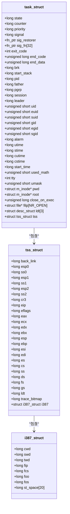
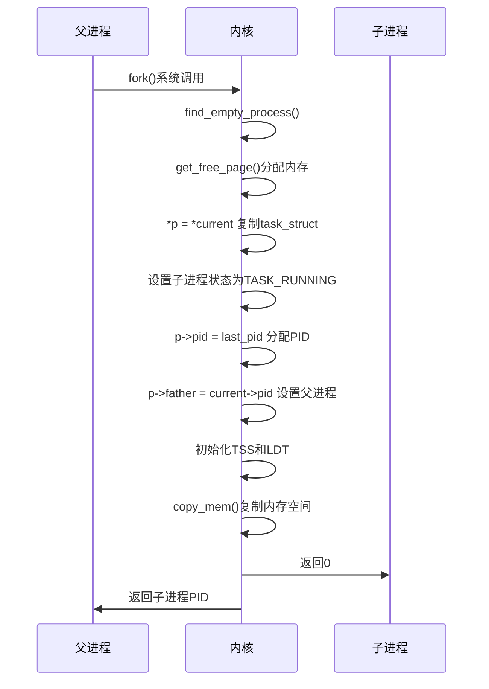
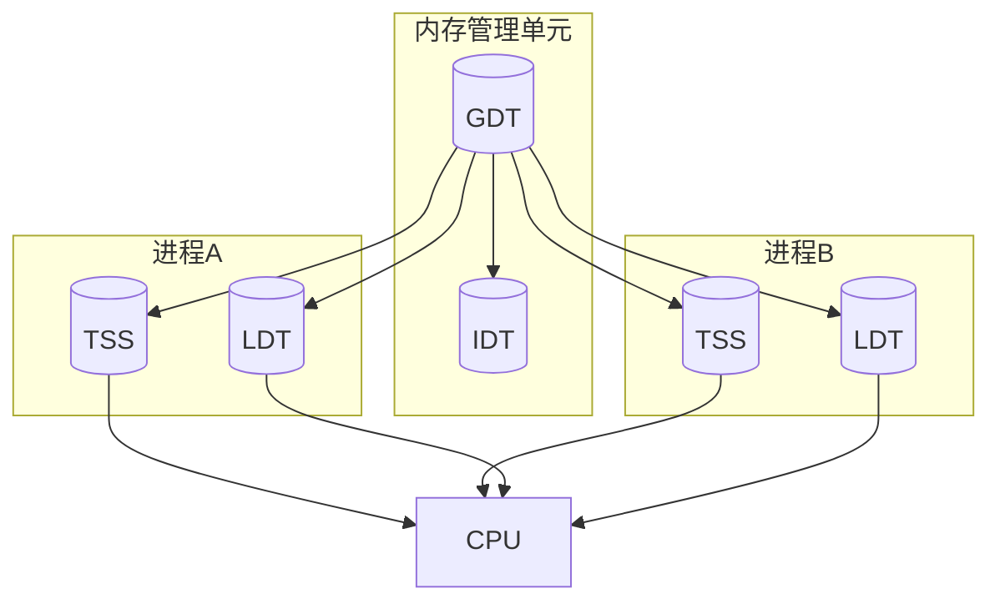
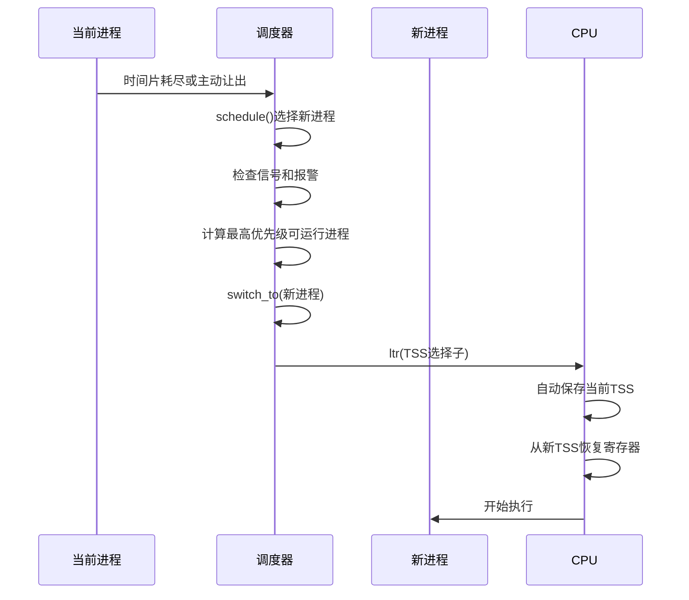

# task_struct结构体详解

<cite>
**本文档引用的文件**  
- [sched.h](file://include/linux/sched.h#L49-L143)
- [sched.c](file://kernel/sched.c#L57-L253)
- [fork.c](file://kernel/fork.c#L55-L135)
- [exit.c](file://kernel/exit.c#L0-L135)
- [head.h](file://include/linux/head.h#L0-L20)
- [mm.h](file://include/linux/mm.h#L0-L10)
</cite>

## 目录
1. [引言](#引言)
2. [task_struct结构体概览](#task_struct结构体概览)
3. [关键字段详解](#关键字段详解)
4. [进程状态与调度机制](#进程状态与调度机制)
5. [进程创建与父子关系](#进程创建与父子关系)
6. [信号处理机制](#信号处理机制)
7. [TSS与LDT硬件支持机制](#tss与ldt硬件支持机制)
8. [上下文切换与调度流程](#上下文切换与调度流程)
9. [进程终止与资源回收](#进程终止与资源回收)
10. [总结](#总结)

## 引言
`task_struct`是Linux 0.01内核中进程管理的核心数据结构，它完整描述了一个进程的所有属性和状态信息。该结构体贯穿进程的整个生命周期，从创建、运行、调度到终止，始终作为内核管理进程的唯一标识。本文将深入解析`task_struct`的各个字段及其设计原理，结合内核调度、进程创建与终止的上下文，阐述其在操作系统中的核心作用。

## task_struct结构体概览

`task_struct`结构体定义在`include/linux/sched.h`中，包含了进程管理所需的所有关键信息。该结构体不仅包含进程的基本标识信息（如PID、父子关系），还包含了调度参数、内存管理、文件系统、信号处理等多个方面的信息。



**图示来源**  
- [sched.h](file://include/linux/sched.h#L49-L104)

**本节来源**  
- [sched.h](file://include/linux/sched.h#L49-L104)

## 关键字段详解

### state（进程状态）
`state`字段表示进程的当前执行状态，其值定义了进程的可运行性。在Linux 0.01中，进程状态包括：
- `TASK_RUNNING` (0): 进程处于可运行状态，可以被调度器选中执行
- `TASK_INTERRUPTIBLE` (1): 进程处于可中断的睡眠状态，等待事件发生
- `TASK_UNINTERRUPTIBLE` (2): 进程处于不可中断的睡眠状态
- `TASK_ZOMBIE` (3): 进程已终止，但父进程尚未回收其资源
- `TASK_STOPPED` (4): 进程被停止，通常由于接收到SIGSTOP信号

### counter（时间片计数）
`counter`字段表示进程剩余的时间片数量。在调度器中，该值用于决定哪个进程应该被优先调度。当进程的时间片耗尽时，调度器会重新分配时间片并选择下一个要运行的进程。

### priority（静态优先级）
`priority`字段表示进程的静态优先级，用于在时间片重新分配时计算新的时间片值。优先级越高，进程获得的时间片越多。

### pid与father（进程标识与父子关系）
`pid`字段是进程的唯一标识符，而`father`字段记录了创建该进程的父进程PID。这两个字段构成了进程的层次结构，使得内核能够维护进程的父子关系树。

### signal（信号位图）
`signal`字段是一个32位的位图，用于表示进程接收到的信号。每一位对应一个信号类型，当进程接收到信号时，相应的位被置位。

### tss（任务状态段）
`tss`字段是`task_struct`中最关键的硬件相关部分，它包含了x86架构下任务切换所需的所有CPU寄存器状态。TSS（Task State Segment）是x86保护模式下的硬件机制，用于支持任务切换。

**本节来源**  
- [sched.h](file://include/linux/sched.h#L49-L104)
- [fork.c](file://kernel/fork.c#L69-L135)

## 进程状态与调度机制

进程状态的转换是操作系统调度的核心。`schedule()`函数是Linux 0.01的调度器实现，它根据进程的状态和时间片来决定下一个要运行的进程。

```mermaid
flowchart TD
A[调度器开始] --> B{检查所有进程}
B --> C[检查定时器报警]
C --> D[检查信号唤醒]
D --> E{查找最高优先级可运行进程}
E --> F[遍历所有进程]
F --> G{进程可运行且时间片>0?}
G --> |是| H[记录最高优先级]
G --> |否| I[继续遍历]
H --> J{找到可运行进程?}
J --> |是| K[切换到该进程]
J --> |否| L[重新分配时间片]
L --> M[时间片= (原时间片>>1) + 优先级]
M --> E
K --> N[调度完成]
```

**图示来源**  
- [sched.c](file://kernel/sched.c#L57-L115)

**本节来源**  
- [sched.c](file://kernel/sched.c#L57-L115)

## 进程创建与父子关系

进程创建通过`fork()`系统调用实现，其核心是`copy_process()`函数。当一个进程调用`fork()`时，内核会创建一个新的`task_struct`，并复制父进程的大部分状态。



**图示来源**  
- [fork.c](file://kernel/fork.c#L55-L135)

**本节来源**  
- [fork.c](file://kernel/fork.c#L55-L135)

## 信号处理机制

信号是进程间通信的一种机制，`task_struct`中的`signal`字段和`sig_fn`数组共同实现了信号处理功能。当进程接收到信号时，`signal`位图中的相应位被置位，然后在适当的时机调用相应的信号处理函数。

```mermaid
flowchart TD
A[进程接收到信号] --> B{信号是否有效?}
B --> |否| C[忽略信号]
B --> |是| D[检查权限]
D --> E{有权限发送?}
E --> |否| F[拒绝信号]
E --> |是| G[设置signal位图]
G --> H[在schedule()中检查]
H --> I{进程可中断且有信号?}
I --> |是| J[唤醒进程]
I --> |否| K[继续睡眠]
J --> L[执行信号处理函数]
```

**图示来源**  
- [sched.c](file://kernel/sched.c#L213-L253)
- [exit.c](file://kernel/exit.c#L0-L135)

**本节来源**  
- [sched.c](file://kernel/sched.c#L213-L253)
- [exit.c](file://kernel/exit.c#L0-L135)

## TSS与LDT硬件支持机制

### TSS（任务状态段）
TSS是x86架构提供的硬件任务切换机制。在`task_struct`中，`tss`字段包含了完整的CPU寄存器状态，包括通用寄存器、段寄存器、控制寄存器等。当发生任务切换时，CPU会自动保存当前任务的寄存器状态到TSS，并从新任务的TSS中恢复寄存器状态。

### LDT（局部描述符表）
每个进程都有自己的LDT，用于定义进程私有的段描述符。在`task_struct`中，`ldt[3]`数组定义了进程的代码段、数据段和堆栈段的描述符。

### 与GDT、IDT的关联
- **GDT**（全局描述符表）：定义了系统级的段描述符，包括内核代码段、数据段以及所有任务的TSS和LDT描述符
- **IDT**（中断描述符表）：定义了中断和异常处理程序的入口



**图示来源**  
- [head.h](file://include/linux/head.h#L0-L20)
- [sched.h](file://include/linux/sched.h#L49-L104)

**本节来源**  
- [head.h](file://include/linux/head.h#L0-L20)
- [sched.h](file://include/linux/sched.h#L49-L104)

## 上下文切换与调度流程

上下文切换是操作系统的核心功能之一，`switch_to`宏实现了从一个进程到另一个进程的切换。该宏通过修改TSS描述符和使用`ltr`指令来完成任务切换。



**图示来源**  
- [sched.c](file://kernel/sched.c#L57-L115)
- [sched.h](file://include/linux/sched.h#L145-L180)

**本节来源**  
- [sched.c](file://kernel/sched.c#L57-L115)
- [sched.h](file://include/linux/sched.h#L145-L180)

## 进程终止与资源回收

进程终止通过`do_exit()`函数实现，该函数负责清理进程占用的所有资源，并通知父进程。

```mermaid
flowchart TD
A[进程调用exit()] --> B[执行do_exit()]
B --> C[释放内存页表]
C --> D[关闭打开的文件]
D --> E[释放文件系统资源]
E --> F{是否有父进程?}
F --> |是| G[设置为ZOMBIE状态]
G --> H[发送SIGCHLD信号]
H --> I[等待父进程回收]
F --> |否| J[直接释放task_struct]
J --> K[调用release()]
I --> L[父进程调用waitpid()]
L --> M[回收子进程资源]
M --> N[释放task_struct]
```

**图示来源**  
- [exit.c](file://kernel/exit.c#L0-L135)

**本节来源**  
- [exit.c](file://kernel/exit.c#L0-L135)

## 总结
`task_struct`结构体是Linux 0.01内核进程管理的基石，它将进程的所有状态信息集中在一个数据结构中。通过分析其各个字段的设计原理和使用方式，我们可以深入理解操作系统如何管理进程的生命周期。从进程创建时的`copy_process()`，到调度时的`schedule()`，再到终止时的`do_exit()`，`task_struct`始终贯穿其中，体现了操作系统设计的精巧与统一。

该结构体不仅包含了进程的软件状态（如PID、优先级、信号等），还集成了硬件相关的状态信息（如TSS、LDT），实现了软件抽象与硬件机制的完美结合。这种设计使得Linux内核能够高效地管理多任务环境下的进程调度和资源分配。