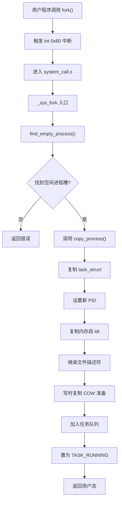
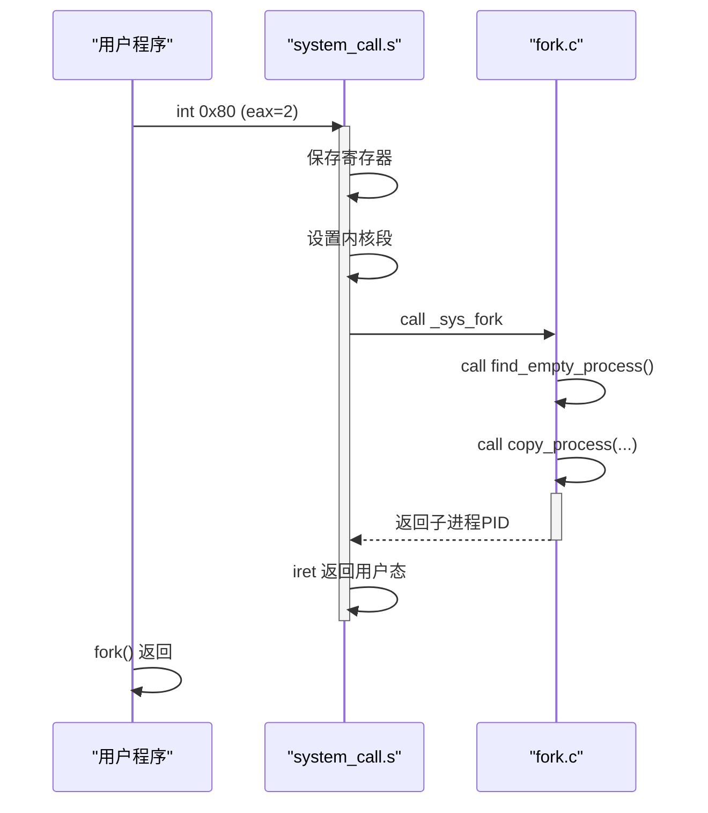

# 进程创建机制（fork）

<cite>
**Referenced Files in This Document**   
- [fork.c](file://kernel/fork.c)
- [sched.h](file://include/linux/sched.h)
- [memory.c](file://mm/memory.c)
- [system_call.s](file://kernel/system_call.s)
</cite>

## 目录
1. [引言](#引言)
2. [核心流程概述](#核心流程概述)
3. [task_struct复制与进程初始化](#task_struct复制与进程初始化)
4. [内存管理与写时复制机制](#内存管理与写时复制机制)
5. [文件描述符与资源继承](#文件描述符与资源继承)
6. [子进程调度与状态管理](#子进程调度与状态管理)
7. [系统调用入口与用户态切换](#系统调用入口与用户态切换)
8. [返回值语义与克隆雏形](#返回值语义与克隆雏形)
9. [功能局限性分析](#功能局限性分析)

## 引言

Linux 0.01版本中的`fork()`系统调用实现了进程创建的核心机制。该机制通过复制父进程的执行上下文来创建子进程，是操作系统多任务能力的基础。本文将深入分析`kernel/fork.c`中`fork()`的实现流程，重点解析其如何通过`copy_process()`函数完成进程复制、内存管理、资源继承等关键操作，并追踪从用户态到内核态的完整调用路径。

**Section sources**
- [fork.c](file://kernel/fork.c#L1-L136)
- [system_call.s](file://kernel/system_call.s#L1-L220)

## 核心流程概述

`fork()`系统调用的执行流程始于用户程序调用`_syscall_fork()`汇编入口，经由中断机制进入内核态后，由`_sys_fork`符号引导至`find_empty_process()`函数查找可用进程槽位。一旦找到空闲位置，系统即调用`copy_process()`函数执行核心复制逻辑。此函数接收父进程的寄存器状态作为参数，完成`task_struct`结构体复制、内存段映射、文件描述符继承等一系列初始化操作。最终，新进程被置为`TASK_RUNNING`状态并插入任务队列，等待调度执行。



**Diagram sources**
- [fork.c](file://kernel/fork.c#L55-L136)
- [system_call.s](file://kernel/system_call.s#L200-L219)

**Section sources**
- [fork.c](file://kernel/fork.c#L55-L136)
- [system_call.s](file://kernel/system_call.s#L200-L219)

## task_struct复制与进程初始化

`copy_process()`函数是进程创建的核心。它首先通过`get_free_page()`分配一页物理内存用于存放新的`task_struct`结构体。随后，通过结构体赋值`*p = *current`完成对父进程控制块的完整复制。这一操作复制了除内核栈外的全部进程信息。

新进程的`task_struct`字段被逐一初始化：`state`被设为`TASK_RUNNING`，表示就绪状态；`pid`被赋予由`last_pid`生成的唯一标识符；`father`字段记录父进程PID；`counter`和`priority`初始化为相同值，体现初始时间片分配；`start_time`记录创建时刻的jiffies计数。

```c
p = (struct task_struct *) get_free_page();
if (!p) return -EAGAIN;
*p = *current;
p->state = TASK_RUNNING;
p->pid = last_pid;
p->father = current->pid;
p->counter = p->priority;
```

**Section sources**
- [fork.c](file://kernel/fork.c#L68-L85)
- [sched.h](file://include/linux/sched.h#L76-L104)

## 内存管理与写时复制机制

内存复制由`copy_mem()`函数协调完成，其核心是`copy_page_tables()`函数。该函数实现了写时复制（Copy-On-Write, COW）的初步设计思想。其机制在于：当复制页表时，新页表项（PTE）的权限位被清除写保护位（即`this_page &= ~2`），但物理页帧保持共享。

具体而言，`copy_page_tables()`遍历源地址空间的页目录和页表，为子进程建立新的页表。对于每一个有效页表项，它保留物理地址但清除写权限位（第2位）。这意味着父子进程的虚拟地址空间映射到同一物理页面，但任何一方尝试写入都会触发页错误（Page Fault），从而在`do_wp_page()`中执行真正的页面复制。

```mermaid
classDiagram
class task_struct {
+long state
+long pid
+long father
+struct desc_struct ldt[3]
+struct tss_struct tss
}
class desc_struct {
+unsigned long a
+unsigned long b
}
class tss_struct {
+long esp0
+long ss0
+long eip
+long eflags
+long cr3
}
task_struct --> desc_struct : "包含"
task_struct --> tss_struct : "包含"
desc_struct --> "页表项 PTE" : "映射"
note right of desc_struct
ldt[1] 代码段基址
ldt[2] 数据段基址
end note
note right of tss_struct
保存CPU寄存器状态
esp0 指向内核栈
end note
```

**Diagram sources**
- [fork.c](file://kernel/fork.c#L30-L53)
- [memory.c](file://mm/memory.c#L150-L200)
- [sched.h](file://include/linux/sched.h#L76-L104)

**Section sources**
- [fork.c](file://kernel/fork.c#L30-L53)
- [memory.c](file://mm/memory.c#L150-L200)

## 文件描述符与资源继承

子进程通过`copy_process()`函数继承父进程的文件资源。该函数遍历父进程的`filp`数组（`struct file * filp[NR_OPEN]`），对每一个非空文件对象指针，递增其引用计数`f_count`。

```c
for (i=0; i<NR_OPEN;i++)
    if (f=p->filp[i])
        f->f_count++;
```

此机制确保了父子进程共享同一组打开文件。对文件描述符的操作（如读写、定位）会影响双方，因为它们指向相同的`struct file`实例。同时，工作目录`pwd`和根目录`root`的`i_count`也被递增，保证了文件系统节点的正确引用计数。

**Section sources**
- [fork.c](file://kernel/fork.c#L109-L115)
- [sched.h](file://include/linux/sched.h#L95-L96)

## 子进程调度与状态管理

新创建的子进程在`copy_process()`中被直接置为`TASK_RUNNING`状态，表示其已准备好被调度执行。进程通过`task[nr] = p`语句被加入全局任务数组，这是其进入调度器视野的关键一步。

值得注意的是，`task[nr] = p`被安排在函数末尾执行，这是一种防御性编程。这样做可以避免在初始化未完成时，调度器意外选中该进程。一旦赋值完成，新进程即成为调度器的合法候选者，其`counter`字段将参与时间片轮转。

**Section sources**
- [fork.c](file://kernel/fork.c#L116-L117)
- [sched.h](file://include/linux/sched.h#L14-L15)

## 系统调用入口与用户态切换

`fork()`的调用路径始于用户程序，经由`_syscall_fork()`汇编宏触发`int 0x80`软中断。控制权转移至`kernel/system_call.s`中的`_system_call`入口点。该汇编代码保存寄存器现场，设置内核数据段，然后根据`%eax`中的系统调用号跳转至`_sys_call_table`。

对于`fork()`，该表项指向`_sys_fork`。此汇编函数首先调用`_find_empty_process`获取进程槽位，若成功则压入当前寄存器状态（`%gs`, `%esi`等），并调用C函数`_copy_process`。`copy_process`的参数正是这些被压入的寄存器值，它们完整地描述了父进程在用户态的执行上下文。



**Diagram sources**
- [system_call.s](file://kernel/system_call.s#L200-L219)
- [fork.c](file://kernel/fork.c#L118-L136)

**Section sources**
- [system_call.s](file://kernel/system_call.s#L200-L219)

## 返回值语义与克隆雏形

`fork()`的返回值设计是其精髓所在。在父进程中，`copy_process()`成功后返回新子进程的PID；在子进程中，由于`eax`寄存器被显式设为0（`p->tss.eax = 0`），其`fork()`调用返回0。

```c
p->tss.eax = 0;
```

这一设计使得父子进程可以通过简单的条件判断`if (pid == 0)`来区分执行路径。这体现了`clone()`语义的雏形——创建一个共享大部分资源但执行流分离的进程。然而，此时的`fork()`是一个“全量复制”操作，缺乏`clone()`系统调用所提供的精细资源控制选项。

**Section sources**
- [fork.c](file://kernel/fork.c#L97-L98)

## 功能局限性分析

当前版本的`fork()`实现存在明显局限：
1. **缺乏`vfork`支持**：没有提供`vfork`系统调用，该调用本应允许子进程在不复制页表的情况下运行，常用于`exec`前的短暂执行，以提升性能。
2. **无`clone`语义**：系统调用接口单一，无法像后来的`clone()`那样通过参数精确控制父子进程间共享的资源（如内存空间、文件描述符、信号处理程序等）。
3. **简单COW实现**：写时复制仅作用于用户空间内存，且实现相对基础，缺乏更高级的内存管理优化。

这些局限反映了Linux 0.01作为早期版本的简化设计，为后续功能的演进留下了空间。

**Section sources**
- [fork.c](file://kernel/fork.c#L1-L136)