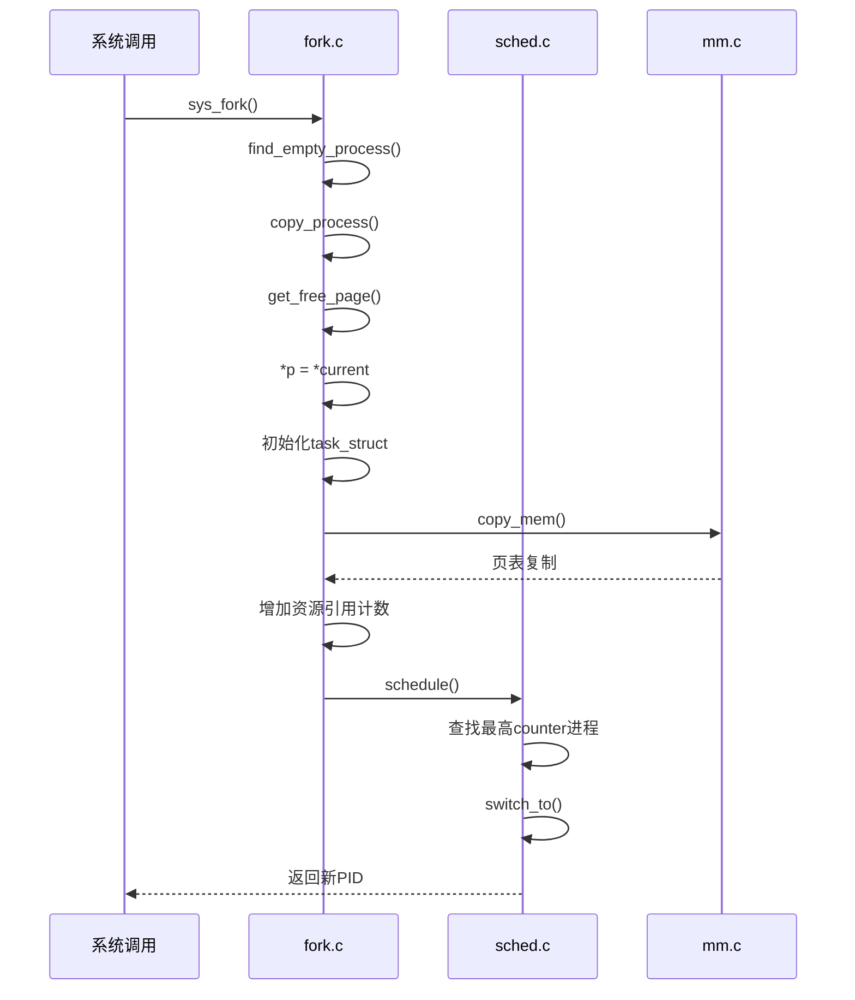

# 进程管理子系统

<cite>
**本文档中引用的文件**  
- [sched.h](file://include/linux/sched.h)
- [fork.c](file://kernel/fork.c)
- [exit.c](file://kernel/exit.c)
- [sched.c](file://kernel/sched.c)
</cite>

## 目录
1. [引言](#引言)
2. [核心数据结构：task_struct](#核心数据结构task_struct)
3. [进程创建：fork系统调用](#进程创建fork系统调用)
4. [进程终止：do_exit清理逻辑](#进程终止do_exit清理逻辑)
5. [调度机制：时间片轮转调度器](#调度机制时间片轮转调度器)
6. [进程同步原语](#进程同步原语)
7. [完整调用链分析：从创建到执行](#完整调用链分析从创建到执行)
8. [结论](#结论)

## 引言
Linux 0.01的进程管理子系统是操作系统的核心组件，负责进程的创建、调度、同步和终止。本系统通过`task_struct`结构体全面描述进程状态，并通过`fork()`、`do_exit()`和`sched()`等关键函数实现完整的生命周期管理。该设计体现了早期Linux简洁而高效的进程管理思想。

## 核心数据结构task_struct
`task_struct`是进程管理的核心数据结构，定义于`include/linux/sched.h`中，完整描述了进程的运行时状态。

### 字段详解
- **state**: 进程状态，取值为`TASK_RUNNING`(0)、`TASK_INTERRUPTIBLE`(1)、`TASK_UNINTERRUPTIBLE`(2)、`TASK_ZOMBIE`(3)或`TASK_STOPPED`(4)，控制调度器行为
- **counter**: 时间片计数器，调度时递减，为0时触发重新调度
- **priority**: 进程优先级，影响时间片分配和调度权重
- **signal**: 信号位图，记录待处理信号
- **pid**: 进程标识符，唯一标识一个进程
- **father**: 父进程PID，用于进程继承和信号传递
- **mm**: 内存管理信息（在代码中通过`ldt`段描述符体现）
- **fs**: 文件系统信息，包含`pwd`（当前工作目录）、`root`（根目录）和`umask`
- **files**: 文件描述符表`filp[NR_OPEN]`，管理进程打开的文件

**Section sources**
- [sched.h](file://include/linux/sched.h#L76-L104)

## 进程创建fork系统调用
`fork()`系统调用的实现位于`kernel/fork.c`中，通过`copy_process()`函数完成核心逻辑。

### 上下文复制
`copy_process()`首先通过`get_free_page()`分配新的`task_struct`，然后执行`*p = *current`进行浅拷贝，复制父进程的大部分状态。

### task_struct初始化
新进程的`task_struct`被重新初始化：
- `state`设为`TASK_RUNNING`
- `pid`设为全局唯一的`last_pid`
- `father`设为父进程PID
- `counter`初始化为`priority`值
- `start_time`记录创建时间`jiffies`

### 写时复制(COW)设计
通过`copy_mem()`函数设置子进程的LDT基地址，调用`copy_page_tables()`复制页表。此时物理内存仍共享，当任一进程写入时触发缺页异常，实现真正的页面复制。

### 资源继承
- 文件描述符：遍历`filp`数组，增加每个打开文件的引用计数
- 文件系统对象：增加当前目录`pwd`和根目录`root`的i节点引用计数

**Section sources**
- [fork.c](file://kernel/fork.c#L60-L121)

## 进程终止do_exit清理逻辑
`do_exit()`函数定义于`kernel/exit.c`中，负责进程终止时的资源回收。

### 资源释放
- **内存**：调用`free_page_tables()`释放代码和数据段的页表
- **文件**：遍历`filp`数组，对每个打开文件调用`sys_close()`
- **文件系统**：释放`pwd`和`root`目录的i节点引用
- **数学协处理器**：如果使用过，则清除`last_task_used_math`指针

### 父子进程通信
- 若存在父进程，将自身状态设为`TASK_ZOMBIE`
- 调用`do_kill()`向父进程发送`SIGCHLD`信号
- 保存退出码`exit_code`
- 若无父进程（即init进程），直接调用`release()`彻底释放

### 子进程关系重置
遍历所有任务，将所有以当前进程为父的子进程的`father`字段设为0。

**Section sources**
- [exit.c](file://kernel/exit.c#L63-L91)

## 调度机制时间片轮转调度器
`sched.c`中的`schedule()`函数实现了时间片轮转调度算法。

### 调度流程
```mermaid
flowchart TD
A[检查定时器和信号] --> B{是否存在可运行进程?}
B --> |是| C[选择counter最大的进程]
B --> |否| D[重置所有进程counter]
D --> E[counter = (counter >> 1) + priority]
E --> B
C --> F[switch_to切换到选中进程]
```

**Diagram sources**
- [sched.c](file://kernel/sched.c#L67-L104)

### counter字段作用
- 每次时钟中断调用`do_timer()`时递减
- 为0时触发`sched()`进行进程切换
- 在调度周期结束时，根据优先级重新计算：`counter = (counter >> 1) + priority`

### 优先级权重计算
采用指数衰减加优先级补偿的策略，既考虑历史CPU使用情况，又保证高优先级进程获得更多CPU时间。

**Section sources**
- [sched.c](file://kernel/sched.c#L67-L104)

## 进程同步原语
`sched.c`实现了基本的进程同步机制。

### sleep_on()与wake_up()
- `sleep_on()`: 将当前进程状态设为`TASK_UNINTERRUPTIBLE`，加入等待队列，然后调度
- `interruptible_sleep_on()`: 类似但状态为`TASK_INTERRUPTIBLE`，可被信号中断
- `wake_up()`: 唤醒等待队列中的进程，将其状态设为`TASK_RUNNING`

### 实现特点
这些原语通过简单的等待队列指针操作实现，`*p = current`将当前进程链接到等待队列，唤醒时通过`(**p).state=0`恢复运行状态。

**Section sources**
- [sched.c](file://kernel/sched.c#L117-L150)

## 完整调用链分析从创建到执行
以下展示进程从创建到调度执行的完整路径：



**Diagram sources**
- [fork.c](file://kernel/fork.c#L60-L121)
- [sched.c](file://kernel/sched.c#L67-L104)

## 结论
Linux 0.01的进程管理子系统通过`task_struct`统一描述进程状态，实现了完整的创建-运行-终止生命周期管理。`fork()`的写时复制设计高效地处理了进程复制，`do_exit()`确保了资源的彻底回收，而基于`counter`的时间片轮转调度器则保证了系统的公平性和响应性。这些机制共同构成了一个简洁而完整的进程管理框架。