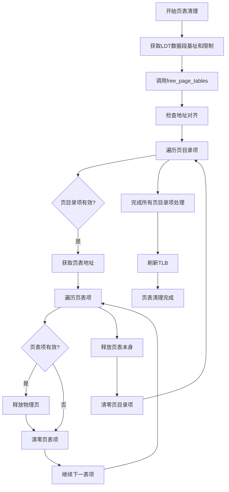
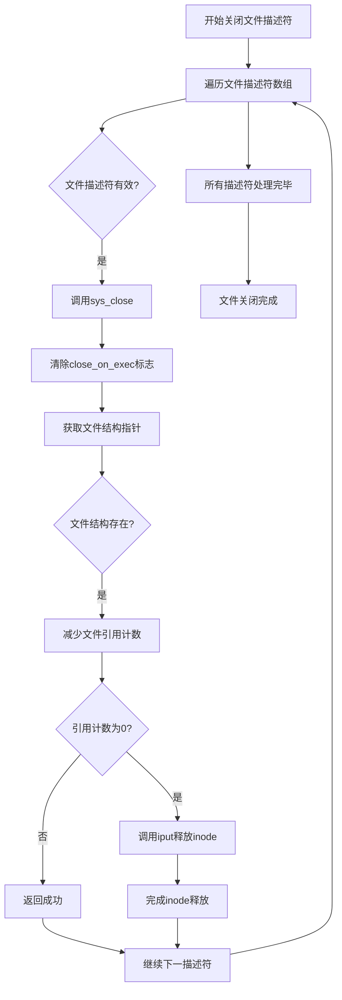
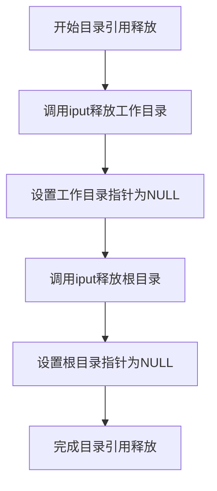
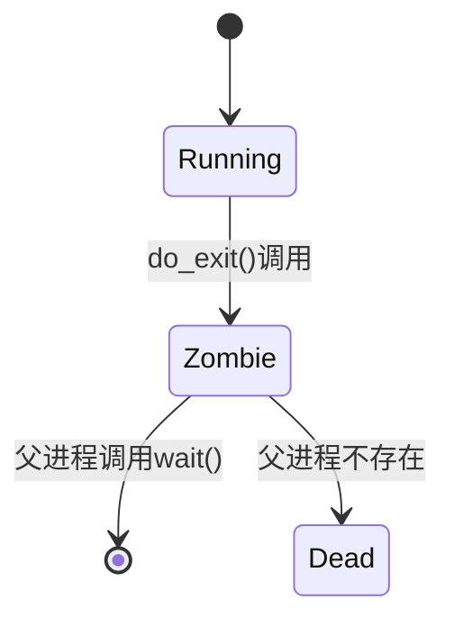
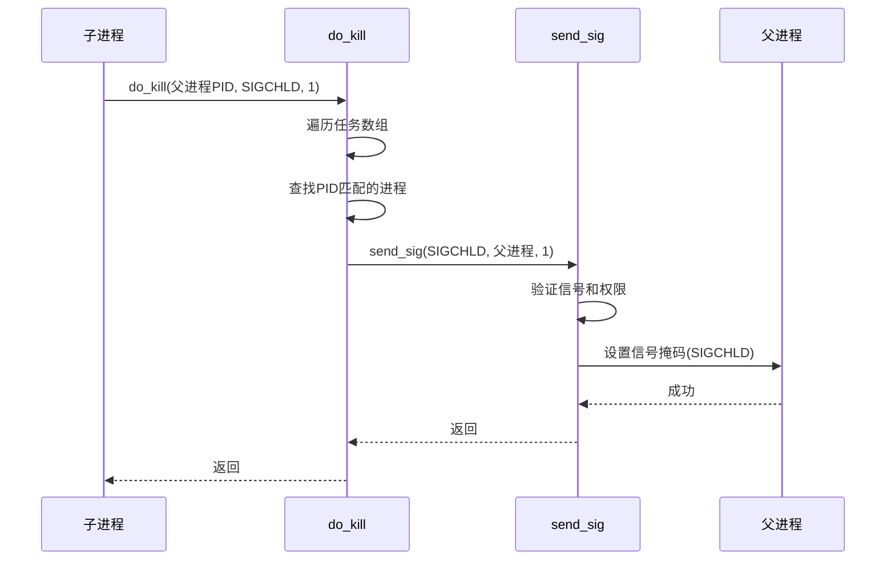

# 进程终止与资源回收

<cite>
**本文档引用的文件**
- [exit.c](file://kernel/exit.c)
- [sched.c](file://kernel/sched.c)
- [memory.c](file://mm/memory.c)
- [open.c](file://fs/open.c)
- [inode.c](file://fs/inode.c)
- [wait.c](file://lib/wait.c)
- [sched.h](file://include/linux/sched.h)
</cite>

## 目录
1. [引言](#引言)
2. [do_exit()函数执行流程](#do_exit函数执行流程)
3. [资源释放顺序分析](#资源释放顺序分析)
4. [TASK_ZOMBIE状态与SIGCHLD信号](#task_zombie状态与sigchld信号)
5. [无父进程时的特殊处理](#无父进程时的特殊处理)
6. [僵尸进程回收机制](#僵尸进程回收机制)
7. [功能局限性分析](#功能局限性分析)

## 引言
本文深入剖析Linux 0.01内核中`kernel/exit.c`文件的`do_exit()`函数，详细分析进程终止时的资源释放流程、状态转换机制以及父进程通知策略。重点探讨进程退出时系统资源的清理顺序、僵尸进程的产生与回收机制，并指出当前实现的功能局限性。

## do_exit函数执行流程
`do_exit()`函数是进程终止的核心入口，负责有序释放进程占用的各种系统资源，并根据父进程的存在情况决定后续处理策略。该函数通过一系列系统调用和内核函数，确保进程终止过程的完整性和系统稳定性。

**Section sources**
- [exit.c](file://kernel/exit.c#L57-L97)

## 资源释放顺序分析
`do_exit()`函数按照严格的顺序释放进程资源，确保系统资源的正确回收和内存安全。

### 页表清理
进程首先通过`free_page_tables()`函数清理其虚拟内存页表。该函数接收进程LDT（局部描述符表）中数据段和堆栈段的基地址与限制，递归释放所有相关的页目录和页表项。



**Diagram sources**
- [exit.c](file://kernel/exit.c#L59-L60)
- [memory.c](file://mm/memory.c#L78-L104)

### 文件描述符关闭
进程终止时，内核遍历其文件描述符表，通过`sys_close()`系统调用逐个关闭打开的文件。



**Diagram sources**
- [exit.c](file://kernel/exit.c#L65-L67)
- [open.c](file://fs/open.c#L171-L187)

### 工作目录与根目录引用释放
进程释放其对工作目录和根目录的引用，通过`iput()`函数减少相应inode的引用计数。



**Diagram sources**
- [exit.c](file://kernel/exit.c#L68-L69)
- [inode.c](file://fs/inode.c#L126-L160)

### 数学协处理器状态清除
如果当前进程使用过数学协处理器，需要清除`last_task_used_math`全局指针，确保后续进程不会错误地继承协处理器状态。

**Section sources**
- [exit.c](file://kernel/exit.c#L73-L74)

## TASK_ZOMBIE状态与SIGCHLD信号
当进程有父进程存在时，`do_exit()`函数将其状态设置为`TASK_ZOMBIE`并发送`SIGCHLD`信号通知父进程。

### TASK_ZOMBIE状态
`TASK_ZOMBIE`状态（值为3）表示进程已终止但尚未被父进程回收。该状态在`sched.h`中定义，允许父进程通过`wait()`系统调用获取子进程的退出状态。



**Diagram sources**
- [exit.c](file://kernel/exit.c#L87)
- [sched.h](file://include/linux/sched.h#L15-L19)

### SIGCHLD信号发送机制
`do_kill()`函数负责向父进程发送`SIGCHLD`信号，通过`send_sig()`函数将信号位设置到父进程的信号掩码中。



**Diagram sources**
- [exit.c](file://kernel/exit.c#L40-L55)
- [exit.c](file://kernel/exit.c#L88)

## 无父进程时的特殊处理
当进程没有父进程时（即父进程已终止且未被回收），`do_exit()`函数直接调用`release()`函数释放任务槽位。

```mermaid
flowchart TD
A[检查父进程] --> B{父进程存在?}
B --> |否| C[直接调用release()]
C --> D[在任务数组中查找进程]
D --> E{找到进程?}
E --> |是| F[从任务数组中移除]
F --> G[释放进程结构内存]
G --> H[调用schedule()重新调度]
E --> |否| I[调用panic()]
I --> J[系统崩溃]
```

**Diagram sources**
- [exit.c](file://kernel/exit.c#L90-L94)
- [exit.c](file://kernel/exit.c#L12-L26)

## 僵尸进程回收机制
父进程通过`wait()`或`waitpid()`系统调用回收僵尸子进程，获取其退出状态并释放任务槽位。

### waitpid系统调用流程
`sys_waitpid()`函数实现僵尸进程的回收逻辑，遍历任务数组查找符合条件的僵尸子进程。

```mermaid
flowchart TD
A[开始waitpid调用] --> B[验证状态地址]
B --> C[遍历任务数组]
C --> D{进程存在且非当前进程?}
D --> |是| E{匹配PID条件?}
E --> |是| F{是当前进程的子进程?}
F --> |是| G{处于TASK_ZOMBIE状态?}
G --> |是| H[复制退出码到用户空间]
H --> I[累加子进程时间]
I --> J[调用release()释放任务]
J --> K[返回子进程PID]
G --> |否| L{已找到匹配进程?}
L --> |是| M{WNOHANG选项?}
M --> |是| N[返回0]
M --> |否| O[调用sys_pause()睡眠]
O --> P{收到SIGCHLD?}
P --> |是| Q[重新遍历]
P --> |否| R[返回-EINTR]
L --> |否| S[继续下一进程]
S --> C
C --> T[遍历完成]
T --> U{找到匹配进程?}
U --> |否| V[返回-ECHILD]
```

**Diagram sources**
- [exit.c](file://kernel/exit.c#L100-L135)

### wait系统调用
`wait()`系统调用通过`lib/wait.c`中的`_syscall3`宏封装`waitpid()`，以简化父进程的调用。

**Section sources**
- [wait.c](file://lib/wait.c#L6-L10)

## 功能局限性分析
当前实现存在以下功能局限性：

1. **缺乏waitpid高级功能**：虽然实现了`waitpid()`系统调用，但功能较为基础，缺少现代系统中更复杂的选项和行为。
2. **无资源统计功能**：系统未提供详细的资源使用统计信息，如内存峰值、I/O操作计数等。
3. **信号处理简单**：信号机制较为基础，缺乏信号排队、实时信号等高级特性。
4. **进程组管理有限**：进程组和会话管理功能较为简单，缺少复杂的作业控制机制。

**Section sources**
- [exit.c](file://kernel/exit.c#L100-L135)
- [wait.c](file://lib/wait.c#L6-L10)