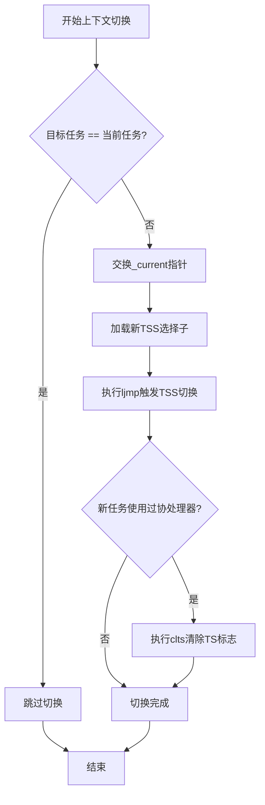

# 进程调度器实现

<cite>
**本文档引用的文件**  
- [sched.c](file://kernel/sched.c)
- [sched.h](file://include/linux/sched.h)
- [system.h](file://include/asm/system.h)
- [traps.c](file://kernel/traps.c)
</cite>

## 目录
1. [引言](#引言)
2. [调度器核心逻辑](#调度器核心逻辑)
3. [任务状态与信号处理](#任务状态与信号处理)
4. [时间片管理与重计算机制](#时间片管理与重计算机制)
5. [上下文切换与TSS交互](#上下文切换与tss交互)
6. [调度触发时机](#调度触发时机)
7. [调度流程图与伪代码](#调度流程图与伪代码)
8. [结论](#结论)

## 引言
Linux 0.01内核中的进程调度器采用基于时间片轮转的调度策略，核心函数`schedule()`负责选择下一个可运行的任务并完成上下文切换。该调度器结合了动态优先级机制，通过`counter`字段实现任务间的公平竞争，并在时间片耗尽后根据静态`priority`重新分配时间片。本文档深入解析`sched.c`中调度器的实现细节。

## 调度器核心逻辑

`sched.c`中的`schedule()`函数是整个调度系统的核心，其主要职责包括：
- 扫描所有任务，检查定时器报警和信号唤醒条件
- 遍历任务数组，依据`counter`值选择最高优先级的可运行进程
- 当所有任务时间片耗尽时，执行重计算逻辑
- 调用`switch_to()`宏完成上下文切换

调度器采用循环扫描方式遍历`task[]`数组，优先选择处于`TASK_RUNNING`状态且`counter`值最大的任务。

**Section sources**
- [sched.c](file://kernel/sched.c#L57-L115)

## 任务状态与信号处理

调度器在每次运行前会检查所有任务的信号状态，特别是对`TASK_INTERRUPTIBLE`状态的任务进行唤醒判断：

```c
for(p = &LAST_TASK ; p > &FIRST_TASK ; --p)
	if (*p) {
		if ((*p)->alarm && (*p)->alarm < jiffies) {
			(*p)->signal |= (1<<(SIGALRM-1));
			(*p)->alarm = 0;
		}
		if ((*p)->signal && (*p)->state==TASK_INTERRUPTIBLE)
			(*p)->state=TASK_RUNNING;
	}
```

上述逻辑表明：
- 若任务设置了`alarm`且已到期，则设置`SIGALRM`信号
- 若任务处于`TASK_INTERRUPTIBLE`状态且有未处理信号，则将其状态改为`TASK_RUNNING`，使其参与调度

这种机制确保了等待事件的任务能在收到信号时及时被唤醒。

**Section sources**
- [sched.c](file://kernel/sched.c#L68-L77)

## 时间片管理与重计算机制

调度器的时间片管理分为两个阶段：

### 1. 时间片选择逻辑
```c
while (1) {
	c = -1;
	next = 0;
	i = NR_TASKS;
	p = &task[NR_TASKS];
	while (--i) {
		if (!*--p) continue;
		if ((*p)->state == TASK_RUNNING && (*p)->counter > c)
			c = (*p)->counter, next = i;
	}
	if (c) break;
	// 重计算逻辑
}
```

此循环遍历所有任务，选择`counter`值最大的可运行任务。若找到`counter > 0`的任务，则跳出循环并切换至该任务。

### 2. 时间片重计算
当所有任务的`counter`均为0时，触发重计算：
```c
for(p = &LAST_TASK ; p > &FIRST_TASK ; --p)
	if (*p)
		(*p)->counter = ((*p)->counter >> 1) + (*p)->priority;
```

重计算公式为：`counter = counter/2 + priority`。由于此时所有`counter`为0，实际效果为`counter = priority`。这一机制赋予高优先级任务更多时间片，体现了优先级调度的思想。

**Section sources**
- [sched.c](file://kernel/sched.c#L90-L113)

## 上下文切换与TSS交互

`switch_to(n)`宏是上下文切换的核心，其实现位于`sched.h`中：

```c
#define switch_to(n) {\
struct {long a,b;} __tmp; \
__asm__("cmpl %%ecx,_current\n\t" \
	"je 1f\n\t" \
	"xchgl %%ecx,_current\n\t" \
	"movw %%dx,%1\n\t" \
	"ljmp %0\n\t" \
	"cmpl %%ecx,%2\n\t" \
	"jne 1f\n\t" \
	"clts\n" \
	"1:" \
	::"m" (*&__tmp.a),"m" (*&__tmp.b), \
	"m" (last_task_used_math),"d" _TSS(n),"c" ((long) task[n])); \
}
```

该宏的作用机制如下：
1. 比较待切换任务是否为当前任务，若是则跳过
2. 使用`xchgl`原子交换`_current`指针，更新当前任务
3. 加载新任务的TSS选择子（通过`_TSS(n)`计算）
4. 执行`ljmp`指令触发TSS切换
5. 若新任务使用过协处理器，则清除CR0中的TS标志（`clts`）

TSS（Task State Segment）结构体定义在`sched.h`中，包含EIP、ESP、段寄存器等完整CPU状态，硬件通过TSS实现任务上下文的自动保存与恢复。

**Diagram sources**
- [sched.h](file://include/linux/sched.h#L167-L181)
- [sched.h](file://include/linux/sched.h#L45-L74)



## 调度触发时机

调度器的触发主要通过时钟中断实现，相关代码位于`sched.c`的`do_timer()`函数：

```c
void do_timer(long cpl)
{
	if (cpl)
		current->utime++;
	else
		current->stime++;
	if ((--current->counter)>0) return;
	current->counter=0;
	if (!cpl) return;
	schedule();
}
```

触发条件分析：
- `jiffies`是全局时钟滴答计数器，每次时钟中断递增
- `do_timer()`在时钟中断处理中被调用
- 用户态进程（cpl=3）递减`utime`，内核态递减`stime`
- 每次递减`current->counter`，若为0则调用`schedule()`
- 内核线程（cpl=0）时间片耗尽不立即调度，避免内核抢占问题

此外，系统调用如`sys_pause()`也会主动调用`schedule()`：

```c
int sys_pause(void)
{
	current->state = TASK_INTERRUPTIBLE;
	schedule();
	return 0;
}
```

**Section sources**
- [sched.c](file://kernel/sched.c#L158-L165)
- [sched.c](file://kernel/sched.c#L116-L119)

## 调度流程图与伪代码

### 调度流程图

```mermaid
flowchart TD
A[开始调度] --> B[检查信号与报警]
B --> C{遍历所有任务}
C --> D[任务存在?]
D --> |否| E[继续下一个]
D --> |是| F[检查alarm是否到期]
F --> G[设置SIGALRM信号]
G --> H{处于TASK_INTERRUPTIBLE?}
H --> |是| I[唤醒为TASK_RUNNING]
H --> |否| J[继续]
I --> J
J --> K[继续遍历]
K --> C
C --> L[信号检查完成]
L --> M[主调度循环]
M --> N[初始化c=-1, next=0]
N --> O{遍历所有任务}
O --> P[任务存在?]
P --> |否| Q[继续]
P --> |是| R{状态为TASK_RUNNING?}
R --> |否| Q
R --> |是| S{counter > c?}
S --> |是| T[c = counter, next = i]
S --> |否| Q
T --> Q
Q --> O
O --> U[遍历完成]
U --> V{c > 0?}
V --> |是| W[跳出循环]
V --> |否| X[重计算所有counter]
X --> Y[counter = counter/2 + priority]
Y --> M
W --> Z[执行switch_to(next)]
Z --> AA[结束]
```

### 调度伪代码

```
函数 schedule():
    // 第一阶段：信号处理
    对于每个任务 p（从 LAST_TASK 到 FIRST_TASK）:
        如果 p 存在:
            如果 p->alarm 存在且已到期:
                设置 p->signal 中的 SIGALRM 位
                清除 p->alarm
            如果 p 有待处理信号且状态为 TASK_INTERRUPTIBLE:
                将状态设为 TASK_RUNNING
    
    // 第二阶段：主调度循环
    循环:
        c = -1
        next = 0
        对于每个任务 i（从 NR_TASKS-1 到 1）:
            p = task[i]
            如果 p 不存在: 跳过
            如果 p->state == TASK_RUNNING 且 p->counter > c:
                c = p->counter
                next = i
        如果 c > 0: 跳出循环
        
        // 时间片重计算
        对于每个任务 p:
            如果 p 存在:
                p->counter = (p->counter >> 1) + p->priority
    
    // 第三阶段：上下文切换
    switch_to(next)
```

**Diagram sources**
- [sched.c](file://kernel/sched.c#L57-L115)

## 结论

Linux 0.01的进程调度器实现了简洁而有效的基于时间片轮转的调度机制。通过`counter`字段动态反映任务优先级，结合`priority`权重实现公平调度。`switch_to()`宏利用x86硬件TSS机制高效完成上下文切换，而`do_timer()`函数确保了定时调度的精确性。尽管该调度器相对简单，但其设计体现了操作系统调度的核心思想，为后续版本的调度器发展奠定了基础。