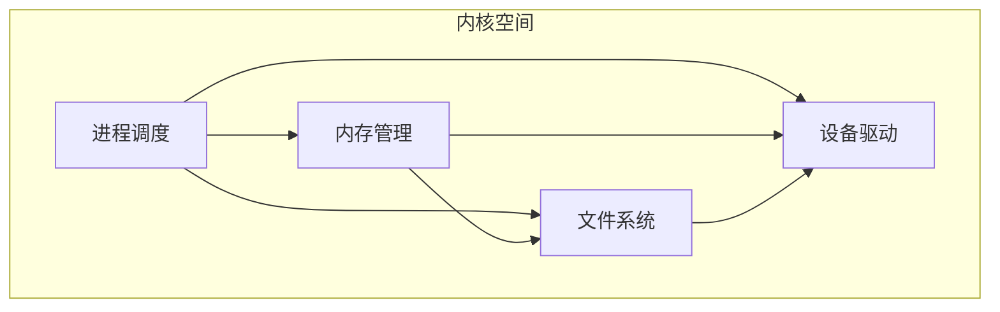

# 项目概述

<cite>
**本文档引用文件**  
- [README](file://README)
- [NOTES.md](file://NOTES.md)
- [include/linux/config.h](file://include/linux/config.h)
- [kernel/hd.c](file://kernel/hd.c)
- [fs/super.c](file://fs/super.c)
- [kernel/sys.c](file://kernel/sys.c)
- [init/main.c](file://init/main.c)
- [include/linux/hdreg.h](file://include/linux/hdreg.h)
</cite>

## 目录
1. [引言](#引言)
2. [历史背景与设计目标](#历史背景与设计目标)
3. [项目定位与技术状态](#项目定位与技术状态)
4. [主要功能范围](#主要功能范围)
5. [开源许可与依赖关系](#开源许可与依赖关系)
6. [核心架构决策](#核心架构决策)
7. [学习路径建议](#学习路径建议)

## 引言

linux-0.01是Linux操作系统的第一个公开发布版本，由林纳斯·托瓦兹（Linus Torvalds）于1991年发布。该项目作为早期Linux内核的原型，不仅具有重要的历史意义，也为理解现代Linux内核的演进提供了宝贵的起点。本概述文档旨在全面介绍linux-0.01项目的核心特性、设计哲学和技术实现，为初学者提供清晰的学习指南。

**Section sources**
- [README](file://README#L0-L254)
- [NOTES.md](file://NOTES.md#L0-L27)

## 历史背景与设计目标

linux-0.01诞生于1991年，当时林纳斯·托瓦兹在赫尔辛基大学学习期间，对Minix操作系统产生了浓厚兴趣。Minix是一个用于教学目的的类Unix操作系统，由安德鲁·塔能鲍姆（Andrew Tanenbaum）开发。然而，托瓦兹认为Minix在性能和功能上存在局限，无法满足他的需求。这促使他决定开发一个全新的、更高效的操作系统内核。

最初，托瓦兹的目标是创建一个与Minix二进制兼容的内核，以便能够直接运行Minix的程序。然而，随着开发的深入，两者之间的差异逐渐增大，这一目标最终被放弃。尽管如此，linux-0.01在整体架构和设计理念上仍然深受Minix的影响，保留了许多类Minix的特性。

该项目的设计目标可以概括为"快速实现功能"。托瓦兹追求的是一个简单但功能强大的内核，能够充分利用Intel 80386处理器的特性，同时保持代码的简洁性和可维护性。这种"先让它工作"的设计哲学贯穿了整个开发过程，使得linux-0.01能够在短时间内成为一个可运行的系统。

**Section sources**
- [README](file://README#L92-L101)
- [README](file://README#L155-L165)

## 项目定位与技术状态

linux-0.01被明确定位为一个类Minix的内核，专为基于Intel 80386（及更高版本）的AT机器设计。它是一个完整的内核，不包含任何Minix或其他来源的代码，完全由托瓦兹独立编写。这种独立性使得linux-0.01能够充分利用386处理器的先进特性，如分页和段式内存管理，从而在性能上超越了为8088处理器设计的Minix。

从技术状态来看，linux-0.01是一个预发布（pre-alpha）版本，版本号0.01明确表明了其不成熟的产品状态。托瓦兹在README中坦承，这个版本"不是成熟的产品"，主要目的是供感兴趣的开发者阅读和研究。尽管如此，它已经能够编译并生成一个可工作的内核，展示了Linux项目的基本框架和潜力。

该项目的预发布状态具有重要的技术意义。它标志着Linux开发的正式开始，为后续的快速迭代和社区协作奠定了基础。通过公开源代码，托瓦兹邀请全球的开发者参与讨论和改进，这种开放的开发模式最终成为Linux成功的关键因素之一。

**Section sources**
- [README](file://README#L38-L45)
- [README](file://README#L46-L52)

## 主要功能范围

### 支持的硬件平台

linux-0.01针对特定的硬件平台进行了优化，主要支持以下配置：
- **处理器**：Intel 80386 AT机器
- **显示设备**：VGA/EGA显卡
- **存储设备**：AT型硬盘控制器（支持IDE）
- **输入设备**：芬兰键盘（硬编码支持，但可通过修改代码适配US键盘）

这些硬件选择反映了当时个人计算机的主流配置，同时也体现了托瓦兹对特定硬件的熟悉程度。例如，芬兰键盘的硬编码支持表明了托瓦兹的个人使用环境，这也成为了早期Linux的一个有趣特点。

### 核心子系统

linux-0.01实现了操作系统内核的几个关键子系统：

**进程调度**：位于`kernel/`目录下，实现了基本的进程创建（fork）、终止（exit）和调度功能。系统采用简单的任务结构，所有任务信息集中在一个数据结构中，简化了管理。

**内存管理**：位于`mm/`目录下，采用分页和分段相结合的方式。内存管理算法相对简单，主要通过`memory.c`和`page.s`两个文件实现，利用386处理器的分页机制处理页面错误。

**文件系统**：位于`fs/`目录下，采用与Minix相同的文件系统格式，确保了与Minix系统的兼容性。文件系统支持基本的文件操作，如打开、读写、关闭等，但缺少一些高级功能。

**设备驱动**：内核直接处理中断，设备驱动程序主要作为中断处理程序实现。例如，硬盘驱动（`kernel/hd.c`）直接与硬件寄存器交互，处理读写请求。

### 功能限制

尽管实现了核心功能，linux-0.01仍存在明显的功能限制：
- **mount/umount未实现**：文件系统挂载和卸载功能尚未实现，系统在启动时直接访问根设备。
- **硬件支持有限**：仅支持特定型号的硬盘控制器和键盘，缺乏对其他外设的支持。
- **系统调用不完整**：许多系统调用返回`-ENOSYS`，表示"功能未实现"。

这些限制反映了预发布版本的特点，也指明了后续开发的方向。

**Section sources**
- [README](file://README#L49-L52)
- [README](file://README#L92-L101)
- [kernel/hd.c](file://kernel/hd.c#L0-L55)
- [fs/super.c](file://fs/super.c#L0-L73)
- [kernel/sys.c](file://kernel/sys.c#L0-L216)

## 开源许可与依赖关系

### 开源许可模式

linux-0.01采用了一种独特的开源许可模式，由林纳斯·托瓦兹个人版权所有。其核心条款包括：
- **源码自由分发**：允许自由分发全部或部分源代码，但必须保证源码的可获得性。
- **版权保留**：必须保留原始的版权通知，如果分发部分代码，可能需要添加新的版权声明。
- **禁止收费**：明确禁止以任何形式（包括"处理费"）对分发收取费用。

这种许可模式体现了早期开源精神的核心理念：知识共享和社区协作。它既保护了作者的版权，又确保了代码的自由流通，为Linux的社区发展奠定了法律基础。

### 与GNU工具链的依赖关系

托瓦兹在README中明确指出："一个内核本身是无用的"。要构建一个完整的操作系统，还需要shell、编译器、库等组件。这些工具大多属于GNU项目，采用GNU Copyleft许可。

linux-0.01的开发严重依赖GNU工具链，特别是GCC编译器（托瓦兹使用1.40版本）。这种依赖关系形成了"Linux内核+GNU工具"的经典组合，后来被称为GNU/Linux系统。尽管内核本身采用不同的许可模式，但它与GNU工具的紧密结合，共同构成了一个功能完整的自由操作系统。

**Section sources**
- [README](file://README#L63-L75)
- [README](file://README#L72-L75)

## 核心架构决策

linux-0.01的架构设计体现了托瓦兹对操作系统本质的深刻理解，其中几个关键决策尤为突出：

### 采用单体内核

与Minix的微内核架构不同，linux-0.01采用了传统的单体内核（monolithic kernel）设计。进程调度、内存管理和文件系统等核心组件被链接到同一个代码堆中，运行在相同的地址空间。这种设计虽然降低了模块化程度，但简化了组件间的通信，提高了性能。

**Diagram sources**
- [README](file://README#L137-L147)

### 放弃消息传递

托瓦兹明确放弃了Minix中使用的消息传递机制，采用了更传统的系统调用方式。系统调用被视为直接的函数调用，而不是消息传递。这一决策带来了双重影响：
- **优点**：避免了消息队列等复杂机制，简化了内核设计。
- **缺点**：失去了消息传递带来的某些优势，如更好的模块化和容错性。

这一选择反映了托瓦兹"实用主义"的设计哲学：优先考虑实现的简洁性和性能，而不是理论上的完美。

### 直接处理中断

与一些认为"中断是丑陋的，应该被隐藏"的观点相反，托瓦兹认为中断是系统的重要组成部分。在linux-0.01中，中断被直接处理，设备驱动程序大多是中断处理程序。例如，硬盘驱动（`kernel/hd.c`）中的`hd_interrupt`函数直接响应硬盘控制器的中断。

这种设计使得驱动程序能够快速响应硬件事件，但也增加了代码的复杂性，因为需要处理底层的汇编代码。托瓦兹承认这是一个"遗憾"，但认为这是实现高效I/O的必要代价。

**Section sources**
- [README](file://README#L102-L136)
- [kernel/hd.c](file://kernel/hd.c#L0-L55)

## 学习路径建议

对于希望学习linux-0.01代码库的初学者，建议遵循以下路径：

### 1. 环境准备
首先，确保开发环境满足要求：
- **操作系统**：Debian 10 (buster) Amd64
- **编译器**：GCC 4.8.4-1
- **工具链**：Binutils 2.31.1-16

这些信息可以在`NOTES.md`文件中找到，为成功编译和运行代码提供了基础。

### 2. 代码阅读顺序
建议按以下顺序阅读代码，以逐步建立对系统架构的理解：
1. **`init/main.c`**：从系统入口开始，理解内核的初始化流程。
2. **`kernel/sched.c`**：学习进程调度的核心机制。
3. **`mm/memory.c`**：理解内存管理的基本算法。
4. **`fs/super.c`**：研究文件系统的初始化和挂载过程。
5. **`kernel/hd.c`**：分析设备驱动的实现，特别是中断处理。

### 3. 关键文件分析
重点关注以下文件，它们包含了系统的核心逻辑：
- **`include/linux/config.h`**：系统配置文件，定义了内存大小、根设备等关键参数。
- **`kernel/hd.c`**：硬盘驱动实现，展示了如何与硬件直接交互。
- **`fs/super.c`**：超级块管理，涉及文件系统的挂载和初始化。

### 4. 实践建议
- **编译尝试**：尝试使用`make`命令编译系统，理解构建过程。
- **调试分析**：使用`printk`等调试函数，跟踪系统运行流程。
- **代码修改**：尝试修改配置参数，观察系统行为的变化。

通过这种循序渐进的学习方法，初学者可以深入理解linux-0.01的设计思想和实现细节，为学习更复杂的现代Linux内核打下坚实基础。

**Section sources**
- [NOTES.md](file://NOTES.md#L0-L27)
- [init/main.c](file://init/main.c#L0-L147)
- [include/linux/config.h](file://include/linux/config.h#L0-L53)
- [kernel/hd.c](file://kernel/hd.c#L0-L413)
- [fs/super.c](file://fs/super.c#L0-L102)